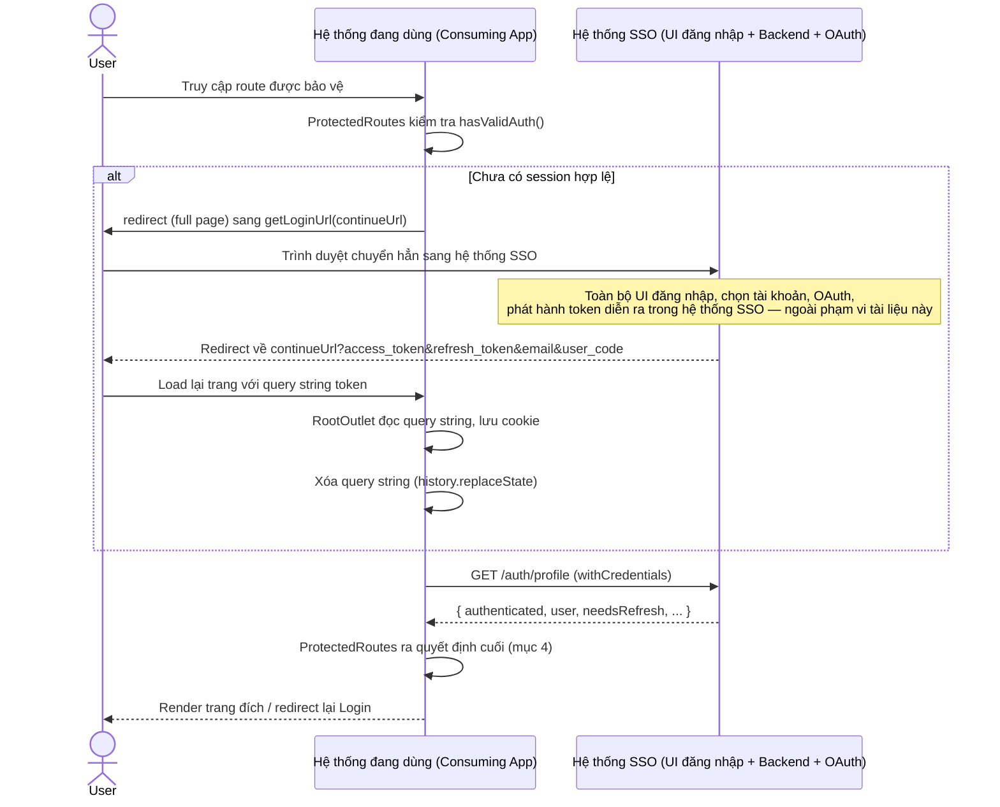
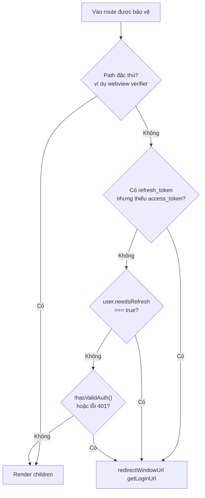

# Tài liệu Luồng Đăng nhập (SSO Redirect-based Login)

> Tài liệu mô tả một mẫu kiến trúc đăng nhập SSO redirect-based dùng cho ứng dụng frontend SPA (React + React Router + React Query). Các đường dẫn file dưới đây là ví dụ tham chiếu từ một implementation thực tế, có thể áp dụng tương tự cho các SPA khác có cùng mô hình.

**Phiên bản:** 1.2 · **Phạm vi:** Cơ chế xác thực SSO, quản lý session, bảo vệ route, xác thực qua header cho client khác domain

---

## 1. Tổng quan

Mô hình này **không** tự triển khai màn hình nhập username/password trong frontend. Việc xác thực được giao toàn bộ cho một dịch vụ SSO (Single Sign-On) bên ngoài (ví dụ đăng nhập bằng tài khoản Microsoft/OAuth). Frontend chỉ đóng vai trò:

- Phát hiện người dùng chưa đăng nhập / hết hạn session và điều hướng (redirect) sang URL SSO.
- Nhận lại `access_token`, `refresh_token`, thông tin user qua query string sau khi SSO xác thực thành công, rồi lưu vào cookie để dùng cho các API tiếp theo.
- Tự refresh `access_token` bằng `refresh_token` khi cần.
- Bảo vệ toàn bộ các route nghiệp vụ (Protected Routes) — chặn truy cập khi chưa có session hợp lệ.

### Các thành phần liên quan

> Trang UI đăng nhập (chọn tài khoản, OAuth) được render bởi **hệ thống SSO riêng**, nằm ngoài phạm vi hệ thống đang sử dụng. Tài liệu này chỉ mô tả các bước setup ở phía hệ thống đang sử dụng (consuming system) — nơi tiếp nhận kết quả đăng nhập từ SSO.

| File | Vai trò |
|---|---|
| `api/account.ts` | Các action gọi API: logout, refresh-token, profile, callback |
| `api/axiosInstance.ts` | Axios instance riêng cho nhóm API `/auth/*` (baseURL = SSO backend URL) |
| `api/auth/auth.type.ts` | Type cho user profile, refresh-token response, staff info |
| `context/AuthContext.tsx` | Provider quản lý state đăng nhập toàn cục: `user`, `isLoading`, `logout`, `refreshToken` |
| `router/ProtectedRoutes.tsx` | Guard kiểm tra điều kiện hợp lệ trước khi render route con |
| `router/index.tsx` | Khai báo route, bọc `AuthProvider` + `ProtectedRoutes` quanh các nhóm route chính |
| `layouts/RootOutlet/index.tsx` | Bắt `access_token`/`refresh_token` trên query string sau khi SSO redirect về, lưu cookie |
| `layouts/CheckZaloInApp/index.tsx` | (Đặc thù webview) chặn truy cập từ trong app webview, yêu cầu mở bằng browser ngoài |
| `hooks/useCookie.ts` | `useAuthCookies()`: get/set/clear `access_token`, `refresh_token`, `user` trong cookie |
| `utils/env.ts` | `getLoginUrl()`, `redirectWindowUrl()`, các biến môi trường |
| `page/AccessDeniedPage/index.tsx` | Trang `/access-denied` (đăng ký route, không còn được `ProtectedRoutes` tự redirect tới — xem mục 10.2) |
| `service/http.service.ts` | HTTP client dùng chung — tự đính Bearer token (cookie > localStorage) vào mọi request |

---

## 2. Kiến trúc xác thực

Có hai nhóm HTTP client tách biệt, phục vụ hai mục đích khác nhau:

| Instance | baseURL | withCredentials | Dùng cho |
|---|---|---|---|
| `axiosInstance` (auth) | SSO backend URL | `true` (cookie) | `/auth/login`, `/auth/logout`, `/auth/refresh-token`, `/auth/profile`, `/auth/callback` |
| `apiService` (nghiệp vụ) | API backend URL | `true` | Toàn bộ API nghiệp vụ — tự đính `Authorization: Bearer <token>` |

`HttpService.getAuthToken()` ưu tiên đọc `access_token` từ **cookie** trước, nếu không có mới fallback sang **localStorage**. Sau khi đăng nhập, token chủ yếu được lưu ở cookie (qua `useAuthCookies`), còn localStorage chỉ được `AuthContext.refreshToken()` cập nhật thêm như một bản sao.

> Hai instance trên dùng cookie (`withCredentials`) — chỉ ổn định khi consuming app và SSO backend cùng domain/subdomain liên quan. Với consuming app ở **domain hoàn toàn khác**, backend SSO còn hỗ trợ thêm cách xác thực qua **header** (`Authorization: Bearer`, `x-refresh-token`) không phụ thuộc cookie — xem chi tiết ở mục 12.

---

## 3. Luồng đăng nhập (Login Flow)

### 3.1. Sơ đồ tổng quan (sequence diagram)



### 3.2. Sơ đồ dạng văn bản (fallback nếu không render được Mermaid)

```
User -> ProtectedRoutes (chưa có session)
  -> redirectWindowUrl(getLoginUrl(currentUrl))
  -> [Hệ thống SSO riêng] toàn bộ UI đăng nhập + OAuth + phát hành token (ngoài phạm vi)
  -> Redirect về continueUrl?access_token=...&refresh_token=...&email=...&user_code=...
  -> RootOutlet đọc query string -> lưu cookie (access_token, refresh_token, user)
  -> AuthContext gọi GET /auth/profile -> profile user
  -> ProtectedRoutes kiểm tra -> render trang đích
```

### 3.3. Từng bước kèm mã nguồn minh họa

**Bước 1 — Người dùng vào trang được bảo vệ**

Khi vào bất kỳ route nằm trong nhóm `AuthProvider` + `ProtectedRoutes`, `ProtectedRoutes` sẽ kiểm tra điều kiện hợp lệ trước khi render children.

---

**Bước 2 — `ProtectedRoutes` phát hiện chưa có session hợp lệ**

Nếu `useAuthCookies().hasValidAuth()` trả về `false`, hoặc API `/auth/profile` trả lỗi 401, `ProtectedRoutes` chuyển hướng toàn trang sang URL SSO, đính kèm `continueUrl` = URL hiện tại (đã encode) để SSO biết redirect về đâu sau khi xong.

```ts
// utils/env.ts
export const getLoginUrl = (continueUrl: string) =>
  `${loginSSOUrl}?continueUrl=${encodeURIComponent(continueUrl)}`;

export const redirectWindowUrl = (url: string) => {
  if (typeof window !== "undefined") {
    window.location.href = url;
  }
};

// router/ProtectedRoutes.tsx
redirectWindowUrl(getLoginUrl(window.location.href));
return null;
```

> Đến đây, trình duyệt chuyển hẳn sang domain của **hệ thống SSO riêng**. Toàn bộ UI đăng nhập, xác thực OAuth, xử lý callback và phát hành `access_token`/`refresh_token` diễn ra bên trong hệ thống SSO — không thuộc phạm vi setup của hệ thống đang sử dụng. Khi xong, SSO redirect trình duyệt quay lại `continueUrl` ban đầu, gắn thêm token trên query string:
>
> ```
> https://<continueUrl>?access_token=xxx&refresh_token=yyy&email=user@domain.com&user_code=NV001
> ```

---

**Bước 3 — `RootOutlet` bắt token và lưu cookie**

`RootOutlet` (bọc toàn bộ router) đọc các query param này trong `useEffect`, lưu vào cookie, hiện toast thành công, rồi xóa query string khỏi URL để tránh lộ token trên address bar / lịch sử trình duyệt.

```ts
// layouts/RootOutlet/index.tsx
const urlParams = new URLSearchParams(location.search);
const accessToken = urlParams.get("access_token");
const refreshToken = urlParams.get("refresh_token");
const email = urlParams.get("email") || "";
const userCode = urlParams.get("user_code") || "";

useEffect(() => {
  if (accessToken && refreshToken) {
    setAccessToken(accessToken);
    setRefreshToken(refreshToken);
    setCookieUser({ email, user_code: userCode });

    toast.success("Đăng nhập thành công!");
    window.history.replaceState({}, "", window.location.pathname);
  }
}, [accessToken, refreshToken, email, userCode]);
```

---

**Bước 4 — `AuthContext` nạp profile người dùng**

`AuthProvider` gọi `useQuery` để lấy profile qua `GET /auth/profile` (qua `axiosInstance`, `withCredentials`). Trong khi đang tải, `AuthProvider` render loading screen, chặn toàn bộ children.

```ts
// api/account.ts
export const getProfileAction = async () => {
  const response = await axiosInstance.get<ConfigProfileUser>("/auth/profile");
  return response.data;
};

// context/AuthContext.tsx
const { data: configProfileUser, isLoading: isLoginLoading, error } = useQuery({
  queryKey: ["user"],
  queryFn: getProfileAction,
  enabled: true,
  retry: false,
});

if (isLoginLoading) {
  return (
    <AuthContext.Provider value={value}>
      <LoadingScreen message="Đang kiểm tra quyền truy cập..." />
    </AuthContext.Provider>
  );
}
```

---

**Bước 5 — `ProtectedRoutes` ra quyết định cuối**

Sau khi có user/error, `ProtectedRoutes` kiểm tra theo đúng thứ tự ưu tiên (xem mục 4) và quyết định: render children, redirect sang Access Denied, hoặc redirect lại sang trang login SSO.

```ts
// router/ProtectedRoutes.tsx
if (isSpecialPath) return props.children;

if (getRefreshToken() && !getAccessToken()) {
  redirectWindowUrl(getLoginUrl(window.location.href));
  return null;
}

if (user && user?.needsRefresh) {
  redirectWindowUrl(getLoginUrl(window.location.href));
  return null;
}

if (!hasValidAuth() || errorResponse?.status === 401) {
  redirectWindowUrl(getLoginUrl(window.location.href));
  return null;
}

return props.children;
```

---

## 4. Quy tắc bảo vệ route (Protected Routes) — thứ tự ưu tiên

### 4.1. Bảng điều kiện

| # | Điều kiện | Hành động |
|---|---|---|
| 1 | Đường dẫn thuộc nhóm path đặc thù (ví dụ webview verifier) | Bỏ qua mọi kiểm tra, render thẳng children |
| 2 | Có `refresh_token` trong cookie nhưng KHÔNG có `access_token` | `redirectWindowUrl(getLoginUrl(...))` — bắt đăng nhập lại |
| 3 | Có user và `needsRefresh === true` | `redirectWindowUrl(getLoginUrl(...))` |
| 4 | `!hasValidAuth()` HOẶC lỗi response status === 401 | `redirectWindowUrl(getLoginUrl(...))` |
| 5 | Không rơi vào điều kiện nào trên | Render children (cho vào trang) |

`hasValidAuth()` yêu cầu đồng thời tồn tại cả 3 cookie: `access_token`, `refresh_token` và `user` — thiếu một trong ba coi như chưa đăng nhập hợp lệ. Code minh họa đầy đủ cho các điều kiện này nằm ở **Bước 5, mục 3.3**.

### 4.2. Sơ đồ quyết định (flowchart)



---

## 5. Luồng Refresh Token

`AuthContext.refreshToken()` được cung cấp cho các component gọi khi cần làm mới access_token:

1. Đọc `refresh_token` từ localStorage.
2. Nếu không có `refresh_token` → gọi `logout()` ngay.
3. Gọi `refreshTokenAction(refresh_token)` → `POST /auth/refresh-token`.
4. Nếu thành công: lưu `accessToken` (và `refreshToken` mới nếu có) vào localStorage, trả về `true`.
5. Nếu thất bại hoặc exception: gọi `logout()` tự động, trả về `false`.

```ts
// context/AuthContext.tsx
const refreshToken = async (): Promise<boolean> => {
  try {
    const storedRefreshToken = localStorage.getItem("refresh_token");
    if (!storedRefreshToken) {
      logout();
      return false;
    }

    const response = await refreshTokenAction(storedRefreshToken);
    if (response.IsSuccess && response.Data) {
      const { accessToken, refreshToken: newRefreshToken } = response.Data;
      localStorage.setItem("access_token", accessToken);
      if (newRefreshToken) localStorage.setItem("refresh_token", newRefreshToken);
      return true;
    }
    logout();
    return false;
  } catch (error) {
    logout();
    return false;
  }
};
```

### ⚠️ Lưu ý: cookie và localStorage không đồng bộ

Luồng login chính (`RootOutlet`) và `HttpService.getAuthToken()` đều đọc/ghi token qua **cookie**. Nhưng `AuthContext.refreshToken()` lại đọc/ghi token qua **localStorage**, không đồng bộ ngược lại vào cookie. Vì `HttpService` ưu tiên cookie trước, access_token mới trong localStorage sẽ **không** được dùng cho request tiếp theo nếu cookie `access_token` cũ vẫn còn tồn tại. Đây là điểm cần kiểm tra nếu gặp lỗi "refresh xong vẫn bị 401".

---

## 6. Luồng Đăng xuất (Logout)

1. UI gọi `logout()` lấy từ `useAuthContext()`.
2. `AuthContext.logout()`: nếu `hasValidAuth()`, gọi `useLogoutSystem().mutateAsync()` → `GET /auth/logout`.
3. `onSuccess`: `clearAuthCookies()` (xóa `access_token`, `refresh_token`, `user` khỏi cookie) rồi `redirectWindowUrl(getLoginUrl(window.location.href))` — đưa người dùng quay lại SSO để đăng nhập lại.

```ts
// context/AuthContext.tsx
const logout = async (): Promise<void> => {
  if (hasValidAuth()) {
    void logoutSystem(undefined, {
      onSuccess: () => {
        clearAuthCookies();
        redirectWindowUrl(getLoginUrl(window.location.href));
      },
    });
  }
};
```

---

## 7. Cookie & Local Storage

| Key | Nơi lưu | Hạn mặc định | Ghi/đọc bởi |
|---|---|---|---|
| `access_token` | Cookie | 1 ngày | `useAuthCookies`, `HttpService.getAuthToken()` |
| `refresh_token` | Cookie | 7 ngày | `useAuthCookies` |
| `user` | Cookie (JSON stringify) | 7 ngày | `useAuthCookies.setUser/getUser` |
| `access_token` | localStorage | — | `AuthContext.refreshToken()` (ghi); `HttpService` fallback (đọc) |
| `refresh_token` | localStorage | — | `AuthContext.refreshToken()` (đọc/ghi) |

Cookie được set với `secure: true` khi chạy https, `sameSite: "lax"`, `path: "/"`. Đây là cookie thường (`document.cookie`), **không** phải HttpOnly — có thể đọc được bằng JavaScript phía client (cần lưu ý rủi ro XSS khi đánh giá bảo mật).

> Bảng trên áp dụng cho cookie phía **frontend** (`document.cookie`, không HttpOnly). Backend SSO còn set thêm cookie HttpOnly riêng (`access_token`, `refresh_token`, `session_id`, `user`, `workspace_session`) với `sameSite: "none"; secure: true` để hỗ trợ gọi cross-site — và chấp nhận thay thế bằng header `Authorization`/`x-refresh-token` khi cookie không gắn được (xem mục 12).

---

## 8. Biến môi trường liên quan

| Biến | Dùng để | Giá trị ví dụ / Fallback |
|---|---|---|
| `VITE_URL_LOGIN_SSO` | URL trang đăng nhập của **hệ thống SSO riêng**, dùng trong `getLoginUrl()` để build URL redirect (`${loginSSOUrl}?continueUrl=...`) | `https://test-login.dainam.edu.vn/` (môi trường test); fallback code: `"/api"` |
| `VITE_BE_URL_WORKSPACE` | baseURL của axios instance cho `/auth/*` (login, logout, refresh-token, profile, callback) | Fallback: dùng lại `VITE_URL_LOGIN_SSO`, rồi `"/api"` |
| `VITE_BASE_URL` | baseURL gốc cho API nghiệp vụ (`apiService`) | Fallback: `"/api"` |

```bash
# .env (ví dụ môi trường test)
VITE_URL_LOGIN_SSO=https://test-login.dainam.edu.vn/
```

```ts
// utils/env.ts
export const loginSSOUrl = import.meta.env.VITE_URL_LOGIN_SSO || "/api";
export const loginSSOBeUrl = import.meta.env.VITE_BE_URL_WORKSPACE || loginSSOUrl || "/api";
```

---

## 9. Type / Interface liên quan

Toàn bộ type cho dữ liệu xác thực được khai báo tại `api/auth/auth.type.ts`.

```ts
// api/auth/auth.type.ts

export interface NewRefreshTokenResponse {
  success: boolean;
  data: {
    access_token: string;
    refresh_token: string;
    user: ConfigUserResponseType;
  };
}

export interface ConfigProfileUser {
  authenticated: boolean;
  user: ConfigUserResponseType;
  layer: 1 | 2 | 3 | null;
  needsRefresh: boolean;
  sessionValid: boolean;
}

export interface ConfigUserResponseType {
  email: string;
  user_code: string;
  loginTime: number;
  lastAccess: number;
  userAgent: string;
  ipAddress: string;
  id: string;
  acc_type: string;
  acc_code: string;
  password_hash: string | null;
  name: string;
  phone: string | null;
  provider: string;
  staff_info: StaffInfo;
}

export interface StaffInfo {
  code: string;
  display_code: string;
  name: string;
  staff_no: string;
  staff_assignments: StaffAssignment[];
}

export interface StaffAssignment {
  org_code: string;
  unit_code: string;
  display_code: string;
  staff_code: string;
  role_code: string;
  assignment_type: string;
  unit_name: string;
}
```

| Type | Dùng ở đâu | Ghi chú |
|---|---|---|
| `ConfigProfileUser` | Response của `GET /auth/profile`, state `configProfileUser`/`user` trong `AuthContext` | `needsRefresh` và `authenticated` quyết định nhánh redirect trong `ProtectedRoutes` (mục 4) |
| `ConfigUserResponseType` | Field `user` bên trong `ConfigProfileUser`, đồng thời là field `user` trong `NewRefreshTokenResponse.data` | `staff_info` chỉ còn dùng để hiển thị (vd `Header.tsx`), **không** còn là điều kiện guard trong `ProtectedRoutes` (xem mục 10.2) |
| `StaffInfo` / `StaffAssignment` | Thông tin nhân sự + danh sách đơn vị/role được gán | Dùng để kiểm tra quyền truy cập nghiệp vụ, không phải quyền đăng nhập |
| `NewRefreshTokenResponse` | Hình dạng kỳ vọng của response `POST /auth/refresh-token` | Lưu ý: code thực tế trong `AuthContext.refreshToken()` đang đọc `response.IsSuccess`/`response.Data` (PascalCase) — khác casing với interface `success`/`data` (camelCase) khai báo ở đây, cần rà soát lại cho khớp với response thật của backend |

---

## 10. Các trường hợp đặc biệt

### 10.1. Truy cập từ trong app webview (ví dụ Zalo)

Một guard bọc ngoài cùng router (trước cả `AuthProvider`) phát hiện User-Agent có dấu hiệu webview của app khác. Nếu đúng, hiển thị màn hình yêu cầu mở bằng Chrome/Safari thay vì cho vào luồng login — vì OAuth thường không hoạt động ổn định trong in-app webview.

### 10.2. Access Denied — đã bỏ guard tự động (không còn áp dụng)

Trước đây `ProtectedRoutes` có điều kiện: user đăng nhập SSO thành công (`authenticated = true`) nhưng thiếu thông tin quyền nghiệp vụ (`staff_info`/`code`) thì tự redirect sang `/access-denied`. **Điều kiện này đã bị bỏ khỏi `ProtectedRoutes`** — user thiếu `staff_info` vẫn được cho vào trang đích như bình thường, miễn `hasValidAuth()` hợp lệ.

Trang `/access-denied` (`page/AccessDeniedPage`) và route tương ứng trong `App.tsx` vẫn còn tồn tại trong codebase nhưng không còn được tự động điều hướng tới từ guard này.

### 10.3. `needsRefresh` từ backend

`needsRefresh` là cờ do backend trả về trong `/auth/profile`. Khi `true`, `ProtectedRoutes` coi như access_token hiện tại không còn dùng được và bắt người dùng quay lại SSO ngay, thay vì tự gọi refresh ngầm.

---

## 11. Ghi chú kỹ thuật & rủi ro cần lưu ý

- **Không đồng bộ access_token mới giữa cookie và localStorage** — xem mục 5.
- **Cookie không phải HttpOnly** — tăng rủi ro nếu có lỗ hổng XSS ở nơi khác trong ứng dụng.
- **Token xuất hiện tạm thời trên URL** khi SSO redirect về (được đọc rồi xóa ngay qua `replaceState`), nhưng trong khoảng thời gian đó token có thể bị ghi vào access log của server/CDN nếu có.
- **Casing không khớp giữa type và code thực tế** (`NewRefreshTokenResponse` vs `response.IsSuccess`/`response.Data`) — xem mục 9.

---

## 12. Xác thực qua Header — dành cho client domain khác (không gắn được cookie)

### 12.1. Vì sao cần cơ chế này

Cơ chế cookie (`withCredentials`, mục 2) chỉ hoạt động ổn định khi consuming app và SSO backend cùng domain/subdomain (cookie set `domain` tương ứng). Với consuming app nằm trên một domain hoàn toàn khác (ví dụ `abc.dnu.edu.vn` gọi `test-login.dainam.edu.vn`), cookie cross-site có thể vẫn bị trình duyệt chặn dù backend đã set `SameSite=None; Secure` và FE đã set `withCredentials: true` — do cơ chế chặn third-party cookie (Safari ITP, Chrome Privacy Sandbox...).

Để không phụ thuộc hoàn toàn vào cookie, `GET /auth/profile` và `GET /auth/logout` ở backend SSO hỗ trợ thêm xác thực qua **header**, dùng song song với cookie (ưu tiên header nếu có, fallback cookie nếu thiếu).

### 12.2. Cách gửi

| Header | Giá trị | Bắt buộc |
|---|---|---|
| `Authorization` | `Bearer <access_token>` | Không — fallback cookie `access_token` nếu thiếu |
| `x-refresh-token` | `<refresh_token>` | Không — fallback cookie `refresh_token` nếu thiếu |

Thứ tự đọc token ở backend: **header → cookie** (`getTokensFromRequest()` trong `authController.ts`).

```ts
// Ví dụ gọi /auth/profile từ consuming app ở domain khác
fetch("https://test-login.dainam.edu.vn/auth/profile", {
  headers: {
    Authorization: `Bearer ${accessToken}`,
    "x-refresh-token": refreshToken,
  },
});
```

### 12.3. Khác biệt hành vi so với luồng cookie

- Khi xác thực qua header, `GET /auth/profile` validate trực tiếp `access_token` qua SSO backend mà **không** bắt buộc phải có session lưu ở Redis (`workspace_session` cookie). Vì vậy các field enrich từ session (`loginTime`, `userAgent`, `ipAddress`...) sẽ **không có** trong response, trừ khi cookie session cũng được gửi kèm.
- `GET /auth/logout` nhận `access_token`/`refresh_token` ưu tiên từ header, fallback về session nếu không có header.
- Luồng cookie ở mục 2–7 (consuming app cùng domain/subdomain) **không thay đổi**, vẫn hoạt động song song không ảnh hưởng lẫn nhau.

### 12.4. Lưu ý bảo mật

- Vì header không bị giới hạn bởi SameSite/third-party cookie, consuming app ở domain khác **tự chịu trách nhiệm** lưu trữ `access_token`/`refresh_token` an toàn ở phía client (rủi ro XSS) — backend không kiểm soát được nơi lưu trữ này.
- `cors({ origin: true, credentials: true })` ở `app.ts` hiện reflect mọi origin gọi tới `/auth/*`; nếu cần siết bảo mật, nên giới hạn lại whitelist domain được phép gọi.

---

## 13. Tổng kết

Mô hình này là một kiến trúc SSO redirect-based: frontend không xử lý credential trực tiếp, mà điều hướng người dùng sang một hệ thống SSO ngoài, nhận lại token qua query string, lưu vào cookie, rồi dùng Auth Context + Protected Routes để kiểm soát quyền truy cập theo từng route. Việc nắm rõ thứ tự kiểm tra trong guard (mục 4) là quan trọng nhất khi debug các vấn đề liên quan tới đăng nhập/đăng xuất.
