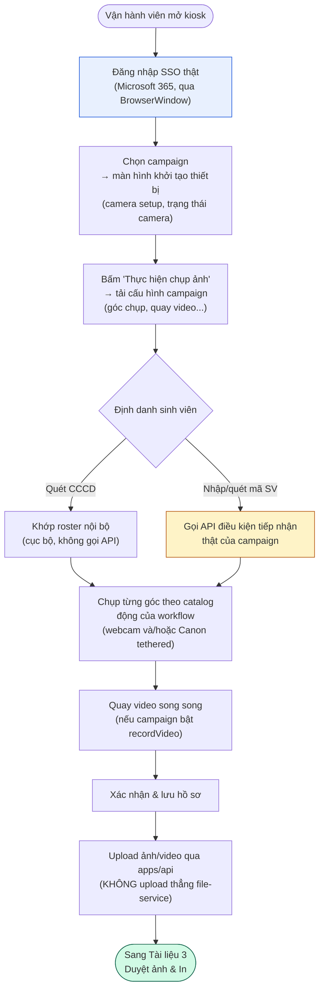
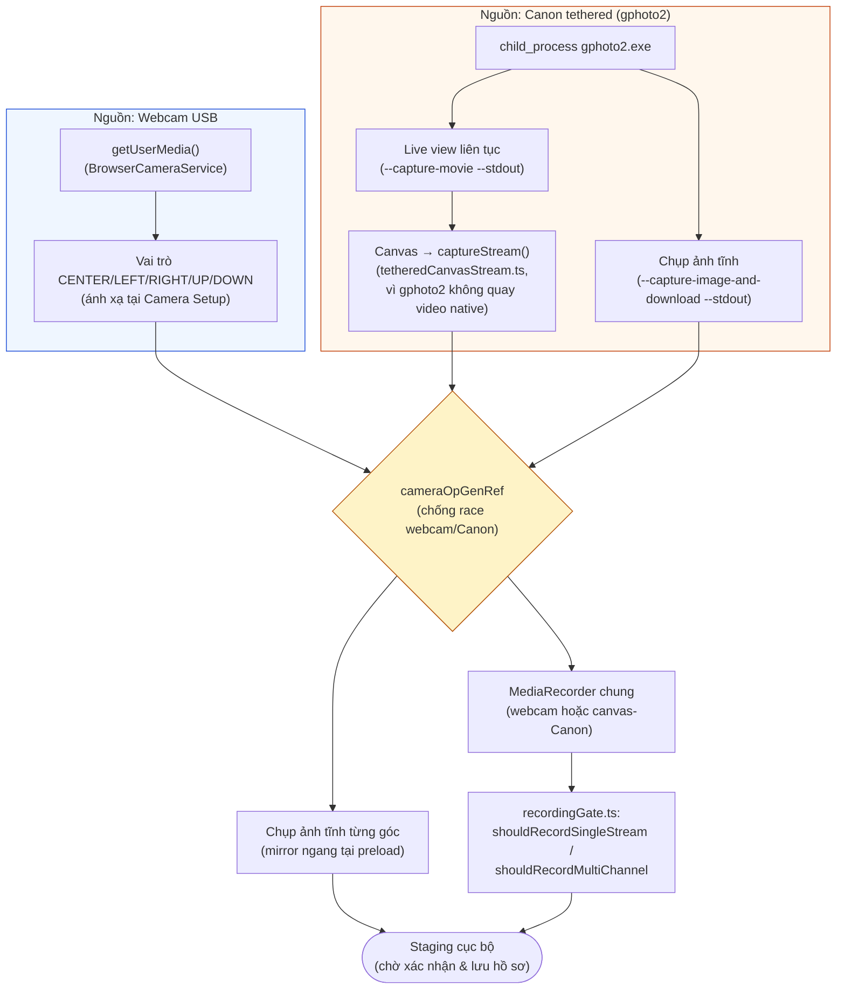
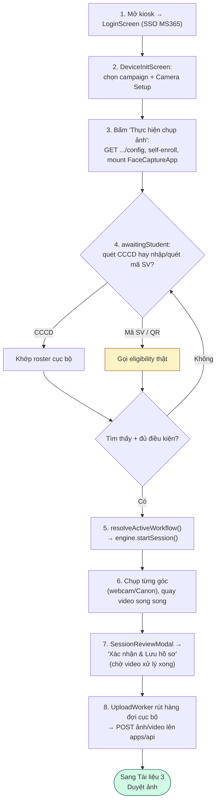

# Tài liệu 2/3 — Client chụp ảnh (Kiosk Capture — Electron)

> Phạm vi: `apps/desktop` (ứng dụng kiosk Electron), `packages/ui` (màn
> hình chụp dùng chung), `apps/api/src/modules/capture` +
> `device-management` (phần API kiosk gọi), `apps/api/src/modules/file-storage`.
> Ngày khảo sát: 2026-09-28. Đường dẫn tương đối so với
> `D:\Work\camera_server\Looka` trừ khi ghi rõ khác.
> Phương pháp: đọc trực tiếp source code, không suy đoán từ tên file.

---

## 0. Mục đích, phạm vi & đối tượng đọc

**Mục đích**: mô tả luồng nghiệp vụ và kỹ thuật của ứng dụng kiosk
(client chụp ảnh) trong hệ thống Looka — nơi vận hành viên đăng nhập, chọn
chiến dịch, định danh sinh viên và chụp ảnh/quay video làm thẻ.

**Phạm vi**: từ lúc mở ứng dụng kiosk, đăng nhập, chọn campaign, định danh
sinh viên, chụp ảnh (webcam và/hoặc Canon tethered), tới lúc ảnh/video được
upload lên server. **Không bao gồm**: cấu hình phía admin tạo ra dữ liệu
kiosk dùng (→ Tài liệu 1), duyệt/in ảnh sau khi đã chụp (→ Tài liệu 3).

**Đối tượng đọc**: BA, PM, QA, dev tiếp nhận module, vận hành kiosk.

**Từ viết tắt**: CCCD = Căn cước công dân; SSO = đăng nhập một lần; IPC =
Inter-Process Communication (giao tiếp giữa main process và renderer trong
Electron); HID = Human Interface Device (máy quét mã vạch/QR giả lập bàn
phím).

## 1. Sơ đồ khối tổng quan luồng

---

## 2. Kiến trúc ứng dụng Electron (`apps/desktop`)

### 2.1 Main process (`apps/desktop/src/main/`)

| File | Vai trò |
|---|---|
| `index.ts` (1446 dòng) | Khởi tạo app, tạo `BrowserWindow`, **toàn bộ IPC handler** |
| `tetheredCamera.ts` (1019 dòng) | Bọc tiến trình con gphoto2 — detect/capture/live-view Canon |
| `tetheredCameraWatcher.ts` (153 dòng) | Vòng lặp nền theo dõi kết nối/ngắt kết nối Canon |
| `streams.ts` (169 dòng) | Lưu trữ video quay được cục bộ (bảng `capture_streams`) |
| `uploads.ts` (1173 dòng) | Hàng đợi outbox cục bộ, worker upload, định tuyến upload sang `apps/api` |
| `deviceApi.ts` (515 dòng) | HTTP client gọi các route có device-credential của `apps/api` |
| `cccdRoster.ts` / `cccdRosterWatcher.ts` | Đọc/theo dõi file roster CCCD ngoài |
| `secrets.ts` | Device credential, ánh xạ vai trò camera, cài đặt cục bộ kiosk (lưu qua OS keychain) |
| `cameraSetupWindow.ts`, `recentStudentsWindow.ts`, `cbHelpWindow.ts` | Các cửa sổ Electron phụ |
| `ssoLogin.ts` | Đăng nhập SSO Microsoft 365 thật, qua `BrowserWindow` intercept |
| `attendance.ts`, `embeddingEnroll.ts`, `aiService.ts` | Kết nối sidecar nhận diện/điểm danh (Pillar B, ngoài phạm vi tài liệu này) |
| `statsEvents.ts` | Hàng đợi sự kiện thống kê cục bộ, đẩy lên `POST /v1/devices/events` |

`createWindow()` tạo **một** `BrowserWindow`, `contextIsolation: true,
nodeIntegration: false, sandbox: true`, preload qua `preload/index.js`. Cờ
`disable-features: MediaFoundationD3D11VideoCapture` ép Chromium dùng
đường xử lý webcam bằng phần mềm (workaround cho lỗi driver/GPU Windows đã
gặp thật trong thực tế).

**Không có native Node addon nào cho camera.** Truy cập Canon hoàn toàn qua
`child_process.spawn('gphoto2.exe', ...)`. Việc soi gương ảnh (mirror) cho
Canon được làm ở **preload script** bằng `<canvas>` — vì preload chạy trong
DOM của trang ngay cả khi đã sandbox.

Mọi kênh IPC đều được khai tên tường minh (`ipcMain.handle('channel', ...)`)
— không có kiểu "invoke bất kỳ channel nào", nên renderer (không tin cậy,
đã sandbox) không thể chạm tới bề mặt main-process tuỳ ý.

### 2.2 Preload (`apps/desktop/src/preload/index.ts`, 989 dòng)

Expose duy nhất một global `window.faceAPI` — interface `FaceAPIBridge` lớn
bao phủ: trạng thái hệ thống, hàng đợi/duyệt chụp, xem/tải ảnh, trạng thái
truy cập thiết bị/tự đăng ký, tra cứu CCCD/campaign-subject, cửa sổ CB-Help,
ánh xạ vai trò camera/góc vật lý, điều khiển tethered camera, chế độ/trình
tự chụp, đăng nhập SSO, sinh viên gần đây, sự kiện thống kê, credential
file-service.

`captureTetheredPhoto`/`getTetheredLiveViewFrame` **soi gương ngang mọi
khung hình Canon** (cả preview lẫn ảnh chụp thật) ngay tại preload qua
`<canvas>` ẩn, để đồng nhất hướng ảnh với webcam (đã soi gương sẵn). Đường
chụp ảnh tĩnh còn thu nhỏ về tối đa 3000px chiều dài để luôn dưới giới hạn
12 MiB của server, bất kể độ phân giải cảm biến thật của Canon (R6 Mark II
là 6000×4000).

### 2.3 Renderer

`App.tsx` mount `CampaignGate.tsx` (740 dòng), bọc màn hình chụp dùng chung
`FaceCaptureApp` từ package `packages/ui`. File renderer riêng của desktop:
`CameraSetupScreen.tsx`, `TetheredCameraPanel.tsx`, `RecentStudentsScreen.tsx`,
`CbHelpFrames.tsx`, `ssoAuthClient.ts`.

**Màn hình chụp thật KHÔNG nằm trong `apps/desktop`** — nằm ở package dùng
chung `packages/ui/src/components/screens/FaceCaptureApp.tsx` (**5808
dòng**), được cả desktop (và tiềm năng cả bản web) import. Đây là file lớn
nhất, được ghi chú kỹ nhất trong toàn bộ codebase, và là bộ điều phối thật
sự của cả phiên chụp (state machine, luồng camera, quay video, publish
CB-Help, xử lý trigger chụp).

`CampaignGate.tsx` hiện thực chuỗi màn hình:
**Đăng nhập → Chọn campaign → Màn hình khởi tạo thiết bị → (chỉ mount
`FaceCaptureApp` khi bấm "Thực hiện chụp ảnh")**. Đăng nhập là SSO thật
(`SsoAuthClient`, mở `ssoLogin.ts`'s `BrowserWindow`). Sau khi chọn campaign,
`handleStartCapture()` gọi `GET /v1/campaigns/:id/config`, rồi truyền
`CampaignWorkflowConfig` (góc chụp + quay video) vào `FaceCaptureApp` qua
prop `campaignConfig`.

---

## 3. Nguồn camera

### 3.1 Webcam USB (`getUserMedia`) & khái niệm đa camera trái/phải/trên/dưới

Dùng `navigator.mediaDevices.getUserMedia` chuẩn, bọc bởi
`BrowserCameraService` (package `@face/camera`). Kiosk hỗ trợ tới **5 vai
trò camera logic**: `CENTER | LEFT | RIGHT | UP | DOWN`. Vận hành viên gán
webcam vật lý vào từng vai trò qua màn hình Camera Setup (phím tắt
`Ctrl/Cmd+Shift+K`), lưu qua `secrets.ts`.

`packages/ui/src/lib/multiFrame.ts`:
- `framesForWorkflow()` — dựng một ô (tile) cho mỗi bước trong workflow,
  gắn với một `CameraRole`.
- `checkFramesReadiness()` — kiểm tra sẵn sàng trước phiên: gắn cờ vai trò
  chưa gán/chưa kết nối camera (`missing`) và vai trò trùng nhau trên cùng
  một thiết bị vật lý (`duplicates`) — phiên chụp **bị chặn khởi động** nếu
  một trong hai danh sách này không rỗng.
- `planCaptureRounds` — lập kế hoạch chụp nhiều vòng để "phủ" N ảnh bằng K
  camera ở chế độ chụp đồng thời.

Hai chế độ chụp, cả hai đều là **cài đặt cục bộ của kiosk, KHÔNG phải cài
đặt của campaign** (xác nhận hiện tại vẫn đúng — comment trong code ghi rõ
đây là kết quả của việc chuyển khỏi `CampaignConfigDao` phía server trong
lần đổi hướng sản phẩm ngày 2026-09-08):

- **Tuần tự (Sequential)** — một camera hoạt động tại một thời điểm, các
  bước trong workflow chạy lần lượt.
- **Đồng thời (Simultaneous)** — mọi camera đã gán bấm một lần là chụp cả
  loạt; `runSimultaneousCaptureGate()` mở tất cả stream theo vai trò và
  chạy `planCaptureRounds`.

Lưu ý: đường **legacy theo device-secret** (không đăng nhập campaign) vẫn
đọc `captureMode`/`autoHoldMs`/`simultaneousCapture` từ config campaign —
đây chỉ là tương thích ngược với bản trước khi đổi hướng, không phải kiến
trúc hiện hành.

### 3.2 Chụp tethered qua Canon (gphoto2)

`apps/desktop/src/main/tetheredCamera.ts` — toàn bộ tích hợp là
`child_process.spawn()` một binary `gphoto2.exe` đóng gói sẵn (không có
native addon).

- **Phát hiện**: `gphoto2 --auto-detect`, lọc bỏ thiết bị PTP là điện thoại
  (phòng trường hợp điện thoại đang ở chế độ sạc PTP cũng hiện trong danh
  sách).
- **Chụp ảnh tĩnh**: `captureTetheredPhoto()` → `--capture-image-and-download`
  **qua `--stdout`, không phải `--filename`** — comment trong code ghi rõ
  `--filename` bị lỗi thật trên Windows (gphoto2 đặt sai tiền tố đường dẫn
  tuyệt đối kiểu Windows). Có thêm một lỗi Windows riêng được sửa:
  `fixWindowsStdoutTextModeCorruption()` — loại bỏ byte `0x0D` thừa mà bản
  build gphoto2 Windows/MinGW chèn trước mỗi `0x0A` trong luồng nhị phân
  JPEG (do chế độ text-mode của stdout) — thiếu bước này thì mọi ảnh chụp
  thật đều hỏng dữ liệu.
- **Live view**: KHÔNG phải poll từng khung `--capture-preview` (thiết kế
  ban đầu) mà là **một tiến trình `gphoto2 --capture-movie --stdout` chạy
  liên tục**, giữ dạng singleton dùng chung, giải mã từng khung JPEG một
  (đo được ~25fps so với ~1-3fps của cách cũ). `getTetheredLiveViewFrame()`
  chỉ trả về khung mới nhất đã giải mã; stream tự dừng sau 5 giây không ai
  gọi.
- **Tuần tự hoá**: `withCameraLock()` — gphoto2 chỉ chạy được một thao tác
  trên một phiên PTP vật lý tại một thời điểm, nên mọi hàm export
  (detect/capture/đọc-ghi config) đều xếp hàng qua một chuỗi promise; mỗi
  lệnh xếp hàng sẽ dừng movie stream trước.
- **Nhiệt độ/pin**: tính năng chỉ để khám phá, tắt theo biến môi trường mặc
  định — vì đường dẫn config gphoto2 chính xác của R6 Mark II chưa được xác
  nhận thật.

### 3.3 Quay video (kể cả từ Canon)

Kênh webcam thật quay bằng `MediaRecorder(mediaStream)` bình thường. Canon
**không có chế độ quay native** trong gphoto2 (`--capture-movie` chỉ cho
luồng JPEG live-view, không mux ra container video nào), nên:

`packages/ui/src/lib/tetheredCanvasStream.ts` (210 dòng) —
`createTetheredCanvasStream(...)`:
- Vẽ mỗi khung JPEG live-view lấy được (mặc định poll ~150ms/~6.7fps) lên
  một `<canvas>` ẩn, rồi đưa `canvas.captureStream(frameRate)` vào cùng
  pipeline `MediaRecorder` như mọi kênh webcam.
- `redrawLastGood()` — vẽ lại khung tốt gần nhất ở mỗi tick dù lần lấy hiện
  tại có thất bại hay không — giữ cho bộ mã hoá luôn có dữ liệu trong lúc
  chụp ảnh tĩnh (`withCameraLock`) tạm dừng live-view vài giây.
- Chờ khung hình đầu tiên thật với timeout 8 giây trước khi trả handle
  (sửa ngày 2026-09-24; trước đó một Canon "chết" âm thầm tạo ra một kênh
  quay canvas trống).
- **Khoảng trống còn tồn tại, xác nhận trong code hiện tại**: *"một Canon
  ngắt kết nối hoặc kẹt máy hẳn giữa lúc đang quay vẫn chỉ tạo ra video BỊ
  ĐÓNG BĂNG, không phải video báo lỗi/không có dữ liệu... để phát hiện đúng
  cần thêm bộ đếm lỗi liên tiếp ở đây"* — ghi rõ là **chưa sửa**.

`packages/ui/src/lib/recordingGate.ts` (105 dòng) — logic thuần quyết định
có quay hay không:
- `shouldRecordSingleStream()` — bộ ghi dự phòng, chỉ khi <2 camera vật lý
  đã gán.
- `shouldRecordMultiChannel()` — bộ ghi đa kênh thật, hoạt động khi ≥2
  camera đã gán, hoặc đúng 1 thiết bị nếu đó là Canon tethered.
- Giới hạn cứng `MAX_RECORDING_DURATION_MS = 10 phút` — sửa cho lỗi thật
  ngày 2026-09-05: một phiên bị bỏ dở khiến bộ ghi (khoá theo một boolean)
  không bao giờ dừng, tạo ra file 234 MB, trong khi phiên **kế tiếp** lại
  không có bộ ghi nào. Cách sửa: khoá effect theo **id phiên của engine**,
  không phải một boolean.

### 3.4 Theo dõi kết nối / tự phát hiện / chống race-condition

`tetheredCameraWatcher.ts` — poll `detectTetheredCamera()` theo lịch (mất
kết nối: backoff luỹ tiến 3s→30s; đã kết nối: cố định 15s), có 3 cờ độc
lập. **Sửa ngày 2026-09-25**: bỏ qua lần auto-detect gây gián đoạn bất cứ
khi nào stream live-view đã khoẻ (`isMovieStreamHealthy()`) — bản trước đó
chính là nguyên nhân gốc gây "live view giật/lag", vì poll `--auto-detect`
buộc `withCameraLock` giết stream live-view mỗi 15 giây.

**Các cơ chế chống race-condition dùng bộ đếm thế hệ (generation counter),
xác nhận còn tồn tại trong code hiện tại:**
- `cameraOpGenRef` — bộ đếm tăng dần trước mỗi lần `start()` webcam; một
  `getUserMedia()` đang chờ mà resolve sau khi đã có lần chuyển sang Canon
  hoặc đổi ánh xạ camera mới hơn sẽ tự kiểm tra lại thế hệ của mình và giải
  phóng stream thay vì publish nó — sửa lỗi race "webcam thắng Canon" ngày
  2026-09-24.
- `tetheredCaptureInFlight` — khử trùng lặp/tuần tự hoá các lệnh
  `captureTetheredFrame()` đang chạy song song, khoá theo `{sessionId,
  stepId}` — một lệnh của phiên/bước khác sẽ chờ lệnh đang chạy xong thay
  vì nhận luôn kết quả của nó (tránh ảnh cũ của phiên đã huỷ lọt vào phiên
  mới).
- `MovieStream.intentionalStop` — phân biệt một stream **bị mình chủ động
  dừng** (chuẩn bị chụp thật) với việc camera **thật sự biến mất** — để
  việc nhả nút chụp ngay sau khi vừa khởi động lại live-view không kích
  hoạt backoff "không có camera".
- `recordingFinalizeRef` — `onAccept` giờ **chờ** promise hoàn tất video
  đang xử lý dở trước khi duyệt — sửa lỗi thật "mất video khi duyệt nhanh".

Tất cả các mục trên đều xác nhận còn tồn tại trong code hiện tại, khớp với
tổng kết audit 2026-09-24 trong ghi nhớ dự án trước đây.

**Sơ đồ khối: kiến trúc 2 nguồn camera hội tụ vào một pipeline chụp/quay**

---

## 4. Luồng định danh & phiên chụp

### 4.1 Ba phương thức định danh tại kiosk

Tất cả hội tụ về cùng `handleLookupResult()` trong `FaceCaptureApp.tsx`:

1. **Quét CCCD** — màn `CccdScanWaitingScreen.tsx`. **Đính chính quan
   trọng**: dù nơi khác trong code gọi đây là "OCR", đây **KHÔNG phải OCR
   ảnh/thị giác máy tính** — đây là **máy quét mã vạch/QR USB hoặc Bluetooth
   giả lập bàn phím**, đọc mã QR in trên chip CCCD.
   `extractCitizenIdFromQrPayload()` tách trường số CCCD từ chuỗi QR phân
   tách bằng dấu `|`. Kết quả được đối chiếu **cục bộ** với roster cache
   của desktop (`faceAPI.lookupCccdByIdentityNumber` → IPC →
   `cccdRosterWatcher.ts`), khớp với cache trong bộ nhớ của
   `D:\Work\camera_server\response.json` (một mảng JSON phẳng, được một hệ
   thống ngoài cập nhật định kỳ). Bước này **không phân biệt campaign** —
   khớp trên toàn bộ roster (đã là một điều chỉnh kiến trúc có chủ đích
   ngày 2026-09-09) — và **không bao giờ gọi API**.
2. **Nhập mã sinh viên thủ công** — ô "nhập mã sinh viên" trong
   `CccdScanWaitingScreen.tsx` (đường campaign+login) →
   `handleStudentSubmit()` → `lookupStudent()`.
3. **Quét QR "trần" (không phải CCCD)** — cùng máy quét HID đọc ví dụ QR
   trên thẻ sinh viên thường (không có dấu phân tách) — đi qua cùng đường
   `handleStudentSubmit` như phương thức 2 (bổ sung ngày 2026-09-18).

**Phương thức 2 và 3 gọi API điều kiện tiếp nhận THẬT, có phạm vi theo
campaign** (`studentLookup.ts` → `faceAPI.lookupCampaignSubject` →
`deviceApi.ts`) — cụ thể là:

`GET /v1/campaigns/:id/subjects/lookup?key=` (chỉ cần
`DeviceCredentialsGuard`) — kiểm tra `req.device.campaignId === campaignId`
trước khi giao cho `CampaignSubjectService.lookupSubject()`.

### 4.2 Kiểm tra điều kiện tiếp nhận (eligibility)

**Có — desktop app thật sự gọi endpoint điều kiện tiếp nhận thật trước khi
cho chụp**, đối với đường thủ công/QR (đường CCCD-quét chỉ dùng roster cục
bộ, không gọi endpoint này). `CampaignSubjectService.lookupSubject()`
nhánh theo `campaign.eligibilityConfig.mode`:

- `NONE` (mặc định) — luôn hợp lệ, không tra cứu.
- `ROSTER` — phải khớp một dòng `campaign_subjects` có `status: 'VALID'`,
  sau đó đánh giá `eligibility.rules[]`.
- `EXTERNAL_API`/`ROSTER_AND_API` — gọi API sinh viên ngoài thật
  (`DainamStudentInfoClient`); `ROSTER_AND_API` yêu cầu khớp roster trước.

`eligible: false` trong response là kết quả "không đủ điều kiện" — một khớp
roster/quy tắc thất bại vẫn trả về `subject` có dữ liệu nhưng
`eligible: false`, và **không được phép** bắt đầu phiên chụp trong trường
hợp này.

### 4.3 Góc chụp / catalog động

Hai lớp:

1. **Bộ chuyển đổi 5-góc đơn giản** — `apps/cms/src/captureAngles.ts`'s
   `CAPTURE_STEP_DEFS`: FRONT/LEFT/RIGHT/UP/DOWN, mỗi góc có tư thế mục
   tiêu cố định + vai trò camera mặc định. Đây là những gì editor đơn giản
   của CMS dùng để dựng `captureAngles` của một campaign.
2. **Catalog góc chụp động thật sự** — `CaptureAnglePresetController`
   (chỉ admin, route `capture-angle-presets`) nuôi vào cấu hình
   `workflow_versions` (validate bằng zod, tham chiếu `validateCaptureAngles()`
   của `captureAngleSteps.ts`); `captureAngles`/`cardSpec` của một campaign
   được ghi đè (override-merge) từ workflow version đã ghim.

Giao tới kiosk: `CampaignConfigDao` mang `captureAngles?: CaptureStep[] |
null`, phục vụ qua **`GET /v1/campaigns/:id/config`** (đường campaign+login,
`CampaignGate.tsx` dùng) hoặc `GET /v1/devices/config` (đường device-secret
cũ).

Ghép ở client: `resolveActiveWorkflow()` trong `FaceCaptureApp.tsx` — nếu
`captureAngles` là mảng không rỗng, nó **thay thế** hoàn toàn
`defaultWorkflow.steps`; nếu không, dùng lại `defaultWorkflow` hardcode
(5 bước).

### 4.4 Chế độ chụp/bấm (click mode)

`CaptureTriggerMode = 'AUTO' | 'MANUAL' | 'OFF'` — **cài đặt cục bộ của
kiosk** (không phải campaign, giống mục 3.1), có thể ghi đè theo từng bước
bằng nút chụp tay (`handleShutterCapture`, cũng xử lý luôn đường trigger
chụp của Canon tethered). `handleCaptureModeChange` bị vô hiệu hoá (tuyến
phòng vệ thứ hai) khi campaign ép buộc chế độ (chỉ ở đường legacy).

### 4.5 Luồng vận hành đầu-cuối (xác nhận từ code)

1. Vận hành viên mở kiosk → `CampaignGate` hiện `LoginScreen` (SSO MS365
   thật) cho tới khi có `identity`.
2. → `DeviceInitScreen` (chọn campaign + trạng thái camera ở footer + nút
   "Thực hiện chụp ảnh"). Camera Setup (`Ctrl+Shift+K`) gán webcam vật lý
   / Canon vào các vai trò CENTER/LEFT/RIGHT/UP/DOWN.
3. Bấm "Thực hiện chụp ảnh" → `handleStartCapture()` gọi
   `GET /v1/campaigns/:id/config`, tự đăng ký thiết bị
   (`POST /v1/devices/self-enroll`) cho pipeline thống kê, mount
   `FaceCaptureApp`.
4. Màn hình `awaitingStudent`: quét CCCD (roster cục bộ) *hoặc* nhập/quét
   QR mã sinh viên (gọi eligibility thật) → `handleLookupResult()`.
5. Tìm thấy + đủ điều kiện → chào 800ms → `handleStartWorkflow(true)` →
   `resolveActiveWorkflow()` xác định workflow/góc chụp/chế độ trigger/chế
   độ đồng thời/quay video, mở stream camera theo vai trò nếu chụp đồng
   thời, `engine.startSession()`.
6. Vận hành viên chụp từng góc (webcam tự động/tay, hoặc nhả nút Canon),
   có thể quay video song song.
7. `SessionReviewModal` → "Xác nhận & Lưu hồ sơ" → `onAccept` chờ mọi video
   đang xử lý dở xong → `RunScopedCaptureSession.approve()` →
   `ElectronCaptureSink.approveUpload()` → IPC → main process
   `approveSessionUpload()` giải phóng các ảnh đã staging + đưa video hoàn
   tất vào hàng đợi upload, dựng và đẩy sự kiện thống kê `SESSION_REPORT`.
8. `UploadWorker` (desktop, chạy nền) rút dần hàng đợi cục bộ, POST từng
   ảnh/video lên `apps/api`.

**Sơ đồ khối tương ứng (8 bước trên):**

---

## 5. Module capture phía backend

### 5.1 Entity/vòng đời phiên (session)

Bảng `sessions` — `status`: `IN_PROGRESS | COMPLETED | CANCELLED` (mặc
định `IN_PROGRESS`). Trường xác nhận: `identificationMethod`,
`identifiedAt`, `finishedAt` (thêm 2026-09-14, đều tuỳ chọn/tương thích
ngược), `source: WEB | KIOSK`, `deviceId`, `campaignId`, `operatorUserId`,
`approvedAt`, `citizenIdEnc`/`citizenIdHash`/`citizenIdLast4` (CCCD mã hoá,
vẫn ghi song song plaintext ở `metadata.identityNumber`).

### 5.2 Danh sách endpoint kiosk gọi

| Method & Path | Chức năng |
|---|---|
| `GET /v1/devices/config` | Config campaign cho kiosk device-secret cũ (fail-closed) |
| `GET /v1/campaigns/:id/config` | Config campaign cho kiosk campaign+login (SSO + `CampaignMemberGuard`) |
| `POST /v1/devices/self-enroll` | Tự đăng ký thiết bị theo user SSO |
| `POST /v1/devices/events` | Sự kiện thống kê theo lô |
| `POST /v1/devices/photos` | **Upload ảnh từ kiosk** → `PhotoService.addDevicePhoto` |
| `POST /v1/devices/videos` | **Upload video từ kiosk** → `SessionVideoService.addDeviceVideo` |
| `GET /v1/devices/recent-captures` | Phiên gần đây trong cả campaign khi online |
| `GET /v1/campaigns/:id/subjects/lookup?key=` | Kiểm tra điều kiện tiếp nhận |
| `POST /v1/sessions`, `:id/photos`, `:id/complete` | Đường chụp web (không phải kiosk desktop) |

### 5.3 Lỗ hổng chiếm quyền phiên theo thiết bị — ĐÃ XÁC NHẬN SỬA

Xác nhận trong code hiện tại ở cả `PhotoService.addDevicePhoto()` và
`SessionVideoService.addDeviceVideo()`: trước mọi lần ghi, cả hai hàm
`SELECT device_id, campaign_id FROM sessions WHERE id = $1` và ném lỗi
`SESSION_DEVICE_MISMATCH` (403) nếu một phiên đã tồn tại thuộc về
`device_id`/`campaign_id` khác với thiết bị đang gọi. Comment trong code mô
tả rõ lỗ hổng trước khi sửa: `GET /v1/devices/recent-captures` đưa cho mọi
kiosk trong campaign id phiên thật của các kiosk **khác**, và nếu không có
kiểm tra này, một thiết bị thứ hai có thể âm thầm ghi đè byte ảnh của sinh
viên khác trong khi metadata DB và nội dung file đã upload vĩnh viễn lệch
nhau. Sửa ngày 2026-09-24, khớp ghi nhớ dự án.

---

## 6. Upload file (`apps/api/src/modules/file-storage`)

### 6.1 Ai thực sự upload lên đâu

**Desktop KHÔNG BAO GIỜ gọi thẳng file-service (fs-core) cho một phiên
bình thường.** `ApiPhotoUploadClient` trong `apps/desktop/src/main/uploads.ts`
— dù thay thế được cho `FsClient` — cả `uploadRaw`/`upload` đều đi qua
`routeUpload()`, POST thẳng tới **`POST /v1/devices/photos` /
`POST /v1/devices/videos` của apps/api** (qua `DeviceApiClient`), **không
bao giờ** tới fs-core. Lý do (ghi trong comment): mỗi kiosk tự cấp phát
tenant key riêng của fs-core lúc khởi động, apps/api không bao giờ thấy key
đó, và endpoint cấp phát của fs-core chỉ trả key **một lần duy nhất** — nên
nếu kiosk upload thẳng lên fs-core thì CMS sẽ không thể xem/truy cập được.
Định tuyến mọi thứ qua apps/api nghĩa là chỉ có `FsClient` mặc định duy
nhất của apps/api mới thực sự nói chuyện với fs-core.

**apps/api → fs-core** được thực hiện bởi một cron chạy nền,
`UploadWorkerService` (rút dần bảng `upload_outbox`).
`FileStorageService.onModuleInit()` dựng một `FsClient` từ **API key
trần** (config `fileService.apiKey`, hoặc tự cấp phát qua `FsClient.provision()`
nếu chưa có) — xác nhận cơ chế xác thực bằng API key trần.

### 6.2 Visibility

**Xác nhận `'public'`**, không phải `'private'`, cho mọi ảnh/video chụp
(`PhotoService.addPhoto`, `addDevicePhoto`; `SessionVideoService.addDeviceVideo`).
Comment dài trong code giải thích lý do: ACL đọc theo owner của fs-core từ
chối mọi lần đọc không phải chủ sở hữu với file `private`, và `FsClient`
của Looka không bao giờ gửi `X-Owner-User-Id` (xác thực thuần bằng API key
→ `owner_user_id` phía server luôn null) — nên một file `private` sẽ
**không bao giờ đọc lại được** qua `issueViewLink`. Ranh giới truy cập thật
sự là các guard `@RequirePermission` của Looka trên endpoint phát view-link,
không phải cờ visibility của fs-core.

Phía desktop, `queueCapture` vẫn tính và truyền một giá trị
`visibility: 'private'` xuyên suốt tới `ApiPhotoUploadClient.routeUpload`
— nhưng **đây là code chết**: `routeUpload` không bao giờ chuyển tiếp giá
trị này tới `POST /v1/devices/photos` (DTO không có trường này), và
`PhotoService.addDevicePhoto` hardcode `'public'` phía server bất kể giá
trị gửi lên. Đoạn plumbing phía desktop được giữ lại chỉ vì nó vẫn có ý
nghĩa nếu sau này có một `FsClient` con upload thẳng tới fs-core.

### 6.3 Bền vững ưu tiên cục bộ + fallback xem ảnh

Cả `PhotoService`/`SessionVideoService` đều ghi byte vào
`upload_outbox.content` (bền vững trong Postgres của apps/api) **ngay lúc
chụp**, trước khi fs-core từng thấy dữ liệu đó. `resolveViewSource()` ưu
tiên link fs-core từ xa một khi `fs_file_id` đã có và khoẻ, nhưng
**fallback về link cục bộ ký HMAC** bất cứ khi nào ảnh chưa kịp lên
fs-core, hoặc fs-core đã âm thầm xoá nó sau khi quét async (`fs_status IN
('FAILED','QUARANTINED')`) — một kiểu lỗi có thật đã từng quan sát được ở
triển khai fs-core.

---

## 7. Tổng hợp các điểm còn thiếu / hạn chế xác nhận trong code

1. **Video "đóng băng" thay vì báo lỗi khi Canon ngắt kết nối giữa lúc
   quay** — `tetheredCanvasStream.ts`, xác nhận chưa sửa.
2. `PhotoService.resolveViewContext` là code chết — đã bị thay thế bởi
   `resolveViewSource` nhưng vẫn còn trong codebase; vô hại nhưng không
   dùng ở đường thật.
3. Plumbing `visibility: 'private'` phía desktop là code chết — server
   luôn hardcode `'public'` (mục 6.2).
4. Đường legacy device-secret vẫn đọc `captureMode`/`simultaneousCapture`
   từ config campaign — không nhất quán với mô hình campaign+login hiện
   hành (cài đặt cục bộ kiosk), chỉ giữ lại để tương thích ngược với bản
   build trước khi đổi hướng.

---

*Tài liệu này là 2/3 trong bộ tài liệu khảo sát toàn bộ luồng chụp ảnh thẻ.
Xem [Tài liệu 1 — Phân quyền & Cấu hình campaign](./luong-phan-quyen-campaign-2026-09-28.md)
và Tài liệu 3 — Client in ấn & duyệt (đang biên soạn).*
