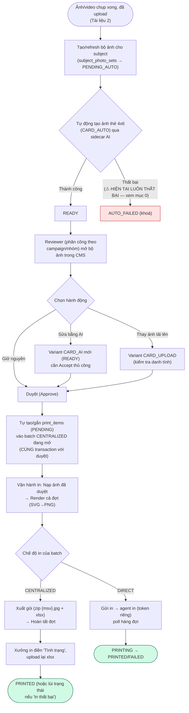
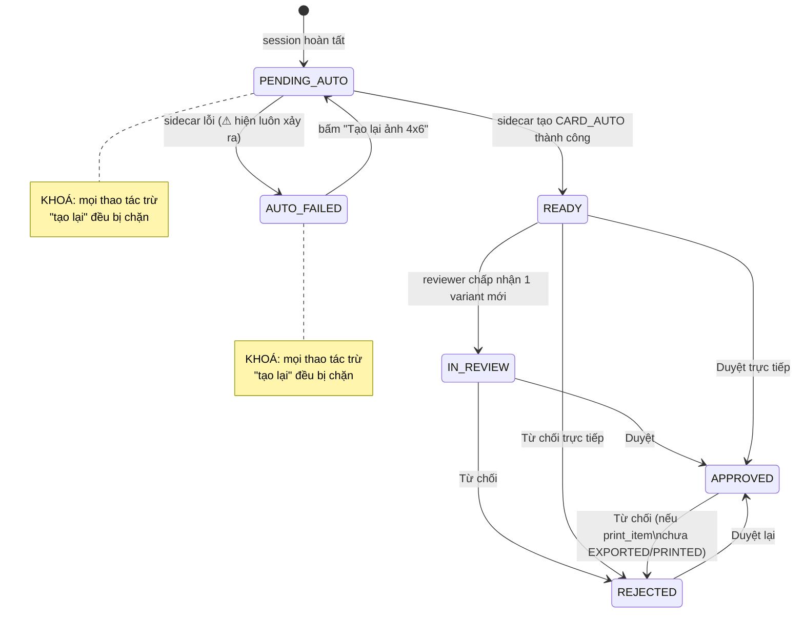
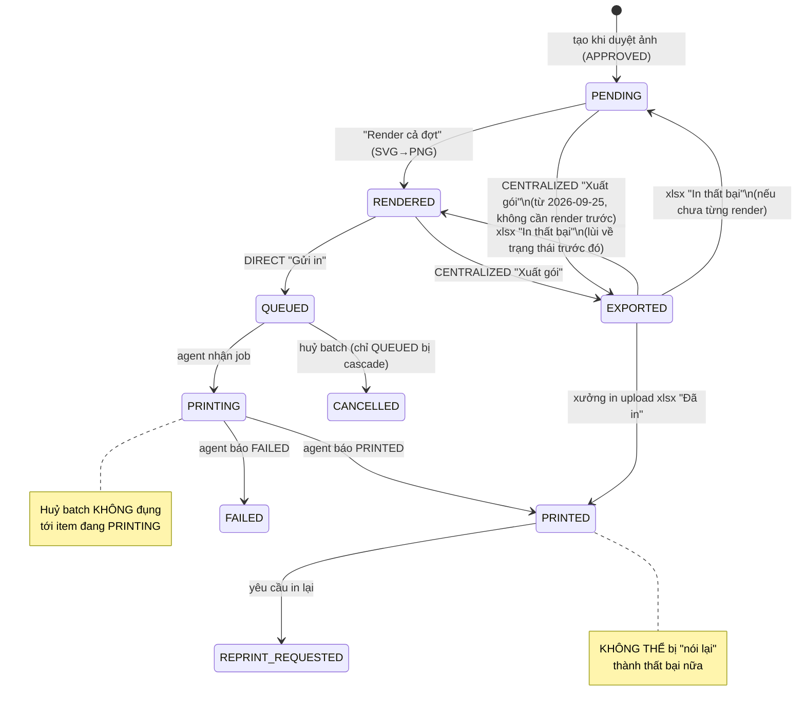
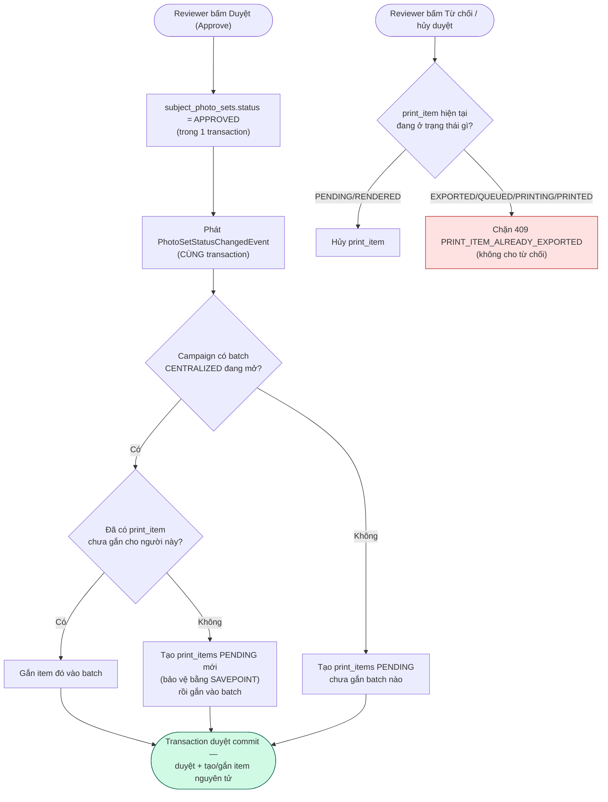
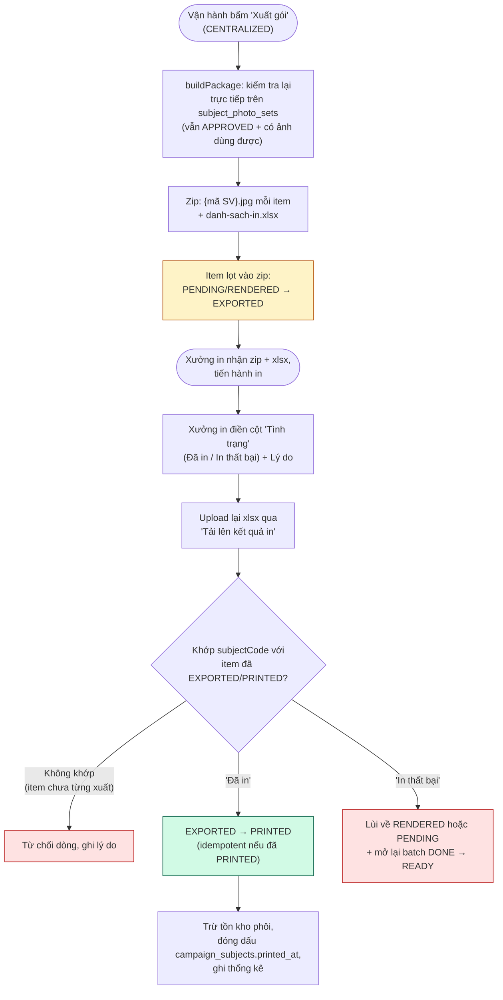

# Tài liệu 3/3 — Client thực hiện tác vụ in ấn & duyệt ảnh

> Phạm vi: `apps/api/src/modules/photo-review`, `apps/api/src/modules/card-template`,
> `apps/api/src/modules/print`, phần liên quan của `apps/api/src/modules/stats`,
> và các màn hình CMS tương ứng (`apps/cms/src/photo-review`, `apps/cms/src/print`,
> `apps/cms/src/card-templates`).
> Ngày khảo sát: 2026-09-28. Đường dẫn tương đối so với
> `D:\Work\camera_server\Looka` trừ khi ghi rõ khác.
> Phương pháp: đọc trực tiếp source code, không suy đoán từ tên file.

---

## 0. CẢNH BÁO KHẨN — sự cố đang xảy ra ngay tại thời điểm khảo sát (2026-09-28)

**Luồng tự động tạo ảnh thẻ 4x6 đang hỏng hoàn toàn theo đúng thiết kế hiện
tại**, vì một quyết định dọn dẹp cùng ngày: `photo-review-sidecar.service.ts`
gọi tới sidecar AI Python (`services/python-ai`, mặc định
`http://127.0.0.1:8321`) — **service này đã bị xoá đúng ngày 2026-09-28**
("`/embed`/`/liveness` của nó chỉ là mock dựa trên hash, không ai gọi thật").

**Hệ quả cụ thể:**
- Mọi phiên chụp mới, bước "tự động tạo ảnh thẻ chuẩn" (`CARD_AUTO`
  baseline) sẽ **luôn thất bại**, bộ ảnh (`subject_photo_sets`) rơi vào
  trạng thái `AUTO_FAILED` (bị khoá, không sửa/duyệt được cho tới khi có
  người bấm "Tạo lại ảnh 4x6" — mà thao tác này cũng sẽ thất bại tương tự).
- Chấm điểm độ giống danh tính (identity-similarity) bị vô hiệu hoá âm
  thầm ở mọi nơi dùng nó (không làm sập request, chỉ log lỗi).
- Comment trong code tự nhận đây là **"lỗ hổng đã biết, được chấp nhận,
  chờ giải pháp thay thế trong một tác vụ tiếp theo — không phải hồi quy
  âm thầm"** — tức đội phát triển biết và chấp nhận tạm thời, nhưng tại
  thời điểm khảo sát này, **toàn bộ dây chuyền từ chụp ảnh tới có ảnh thẻ
  sẵn sàng duyệt đang tắc nghẽn ở bước AUTO**.

**Lưu ý phân biệt quan trọng**: đây là một service **khác** với service
đứng sau nút "Sửa bằng AI" (`AiImageEditClient`, gọi một model sinh ảnh
khác lưu trữ ngoài tại `http://10.20.15.25:8000`, không bị ảnh hưởng bởi
việc xoá sidecar). Vậy: **"Sửa bằng AI" vẫn hoạt động bình thường**; chỉ
**"Tạo lại ảnh 4x6" (tự động) và điểm độ giống danh tính là đang hỏng**.

Quan sát thêm (nêu như một điều đã quan sát, không khẳng định là chủ ý):
chỉ **đường kiosk** tự động gọi "tạo lại ảnh 4x6" ngay khi bộ ảnh chuyển
sang `PENDING_AUTO`. **Đường web** (nếu có dùng) chỉ tạo/reset bộ ảnh về
`PENDING_AUTO` mà không tự gọi bước tạo ảnh — nên một phiên chụp qua web có
vẻ sẽ đứng yên ở `PENDING_AUTO` (khoá) cho tới khi có ai đó bấm tạo lại thủ
công.

---

## 0.1. Mục đích, phạm vi & đối tượng đọc

**Mục đích**: mô tả luồng nghiệp vụ duyệt ảnh thẻ và in thẻ trong hệ thống
Looka, từ khi ảnh được chụp xong tới khi thẻ được in và xác nhận.

**Phạm vi**: duyệt ảnh (tự động tạo ảnh thẻ, sửa bằng AI, thay ảnh tải lên,
duyệt/từ chối), render ảnh thẻ theo template, và in ấn (2 chế độ
CENTRALIZED/DIRECT, xuất/nhập kết quả in). **Không bao gồm**: cấu hình
phía admin (→ Tài liệu 1), chụp ảnh (→ Tài liệu 2).

**Đối tượng đọc**: BA, PM, QA, dev tiếp nhận module, CTSV/reviewer, vận
hành in.

## 1. Sơ đồ khối tổng quan luồng (giả định sidecar hoạt động bình thường)

---

## 2. Duyệt ảnh (Photo Review)

### 2.1 Mô hình dữ liệu

- **`subject_photo_sets`** — mỗi dòng ứng với (campaign, mã sinh viên, loại
  ảnh), unique. Có `sourceSessionId` (không FK, thuộc module capture),
  `status`, `currentCardVariantId` (không FK cứng, ràng buộc ở tầng
  application), các trường roster denormalize (`className`/`major`/
  `faculty`/`citizenId`, làm mới lúc tạo bộ ảnh), `dueAt = sessions.completed_at
  + campaigns.processing_sla_hours` (null nếu campaign không có SLA — nghĩa
  là "không bao giờ áp dụng", không phải "đã quá hạn").
- **Trạng thái bộ ảnh**: `PENDING_AUTO → READY|AUTO_FAILED → IN_REVIEW →
  APPROVED|REJECTED`. Trạng thái **bị khoá**: `PENDING_AUTO`, `AUTO_FAILED`
  — mọi thao tác trừ "tạo lại" đều bị từ chối khi đang khoá.
- **`photo_variants`** — mỗi dòng là một phiên bản ảnh thẻ: `kind` ∈
  `CARD_AUTO|CARD_AI|CARD_UPLOAD`, `status` ∈ `PROCESSING|READY|FAILED|
  DISCARDED` (gần như không bao giờ xoá cứng, trừ một ngoại lệ hẹp — xem
  2.2), kèm `identitySimilarity`, `qualityReport`, liên kết file-service,
  metadata prompt/vùng/model/seed cho các bản sửa AI.
- **`photo_review_events`** — audit trail đầy đủ, một dòng mỗi hành động
  (`AUTO_GENERATED, AUTO_FAILED, REPROCESS, AI_REQUESTED, AI_ACCEPTED,
  AI_DISCARDED, UPLOAD_REPLACED, SET_CURRENT, APPROVED, REJECTED,
  VIEWED_ORIGINAL`).
- **`review_assignments`** — phân công reviewer **theo từng campaign**
  (chuyển đổi từ mô hình toàn cục đúng ngày 2026-09-28). Một lượt cấp là
  `(userId, campaignId, groupField?, groupValue?)`; `groupField` ∈
  `className|faculty|major`; cả hai null = toàn bộ campaign. **Cổng chặn
  duy nhất**: user thường không có dòng nào cho một campaign thì không thấy
  gì trong campaign đó. `users.is_admin` luôn bỏ qua kiểm tra này. Vai trò
  `REVIEWER` (trong `users.roles`) là một khái niệm khác, kiểm tra bởi
  `ReviewerRoleGuard` — cổng thô hơn, "người này có được vào màn hình duyệt
  hay không".
- **`variant_upload_outbox`** — lưu byte cục bộ cho một variant đang chờ
  đẩy lên file-service (cùng mẫu outbox với module capture).

**Sơ đồ khối: vòng đời trạng thái `subject_photo_sets`**

### 2.2 Quy tắc khoá & cơ chế "ảnh hiện tại"

Bị khoá khi `status ∈ {PENDING_AUTO, AUTO_FAILED}` HOẶC
`currentCardVariantId IS NULL`. Khi chấp nhận một variant `CARD_AI` mới,
variant hiện tại **trước đó** bị xoá cứng — **nhưng chỉ khi variant trước
đó cũng là `CARD_AI`** (không bao giờ xoá `CARD_AUTO`/`CARD_UPLOAD`) — một
ngoại lệ hẹp, có chủ đích, cho quy tắc chung "không bao giờ xoá cứng
variant". Một bộ ảnh `READY` chuyển sang `IN_REVIEW` ngay khi có hành động
chấp nhận.

### 2.3 "Sửa bằng AI" — nút này thực sự làm gì

`POST /v1/review/sets/:id/ai-edit`:

1. Lọc từ khoá cấm trong prompt (so khớp không phân biệt hoa/thường:
   cười/mở mắt/bỏ kính/gầy/trẻ hóa/đẹp/đổi mắt-mũi-miệng) → 422 nếu dính.
2. Chọn nguồn: một variant sẵn có (mặc định là ảnh thẻ hiện tại) hoặc một
   ảnh gốc đã chụp (`sourceKind: 'ORIGINAL_PHOTO'`).
3. Tạo một dòng variant `CARD_AI` trạng thái `PROCESSING`, gọi
   **`AiImageEditClient.edit()`** (POST multipart tới model sinh ảnh ngoài,
   mặc định `http://10.20.15.25:8000/edit`, tự retry khi 503/504) kèm ảnh
   gốc + prompt tự do. `region` (OUTSIDE_FACE/GLASSES/HAIR/FULL) chỉ là
   metadata mô tả — **không** được gửi cho service ngoài (không có khái
   niệm này trong hợp đồng của service đó).
4. Chấm điểm độ giống danh tính qua sidecar (**hiện đang hỏng, xem mục 0**)
   — best-effort, lỗi bị bắt và log, không làm hỏng cả thao tác sửa.
5. Ghi kết quả bằng **UPDATE có điều kiện `WHERE status = 'PROCESSING'`**,
   không ghi đè mù — chống race với việc huỷ (`discardVariant()`) xảy ra
   song song trong lúc gọi AI (có thể mất thời gian).
6. **Không bao giờ tự động áp dụng.** Variant nằm ở trạng thái `READY`;
   reviewer phải chủ động gọi `POST /v1/review/variants/:id/accept`.

`acceptVariant` cũng áp ngưỡng cứng `IDENTITY_SIMILARITY_REJECT_THRESHOLD =
0.7` — không thể chấp nhận nếu độ giống dưới ngưỡng này.

### 2.4 Hành động Duyệt/Từ chối

`approve`/`reject` đều đi qua `transitionSetStatus`:

- **Idempotent**: duyệt lại một bộ đã `APPROVED` (hoặc từ chối lại một bộ
  đã `REJECTED`) là no-op im lặng, dưới khoá dòng.
- **Chặn không cho rời khỏi `APPROVED` một khi thẻ đã "ra khỏi hệ thống"**:
  nếu dòng `print_items` đang hoạt động của bộ ảnh đã ở trạng thái
  `EXPORTED` hoặc `PRINTED`, thao tác từ chối bị chặn với lỗi 409
  `PRINT_ITEM_ALREADY_EXPORTED`.
- Khi chuyển trạng thái thật: ghi `photo_review_events`, gọi
  `ReviewStatsService.recordDecision` (cộng dồn `reviewSumHours`), và phát
  sự kiện `PhotoSetStatusChangedEvent` **trong cùng transaction** — đây
  chính là điểm nối sang module in ấn (xem mục 4.3).

**Ai được quyền duyệt**: gate bởi `ReviewerRoleGuard` (`req.user.isAdmin`
hoặc `req.user.roles` chứa `REVIEWER`) cộng với, theo từng bộ ảnh,
`ReviewAssignmentService.assertInScope` (phạm vi theo campaign/nhóm, xem
2.1). Khái niệm "CTSV duyệt" trong lịch sử dự án tương ứng với bất kỳ ai
được cấp role `REVIEWER` và/hoặc một dòng `review_assignments` theo
campaign — trong code **không có** một role tên "CTSV" hardcode riêng — đó
là role/phân công mà admin tự cấp.

### 2.5 Phân công duyệt ("ai duyệt cái gì")

`GET/POST /v1/review/assignments`, `DELETE :id`, `GET /group-values`,
`GET/POST/DELETE /reviewers` — mọi thao tác ghi và xem-phân-công-của-người-khác
**chỉ dành cho admin**; reviewer thường chỉ xem được phân công của chính
mình. `create()` **tự động cấp role `REVIEWER`** trong cùng transaction với
việc tạo phân công — để người vừa được phân công có thể qua
`ReviewerRoleGuard` ngay. Xoá một phân công **không** thu hồi role (cần gọi
riêng `DELETE /reviewers/:userId`).

### 2.6 Màn hình CMS (`apps/cms/src/photo-review/`)

- **`ReviewListPage.tsx`** (`/review`) — 2 tab: "Danh sách" và "Phân công
  duyệt" (gộp thành tab từ 2026-09-22, không còn route riêng). Tab danh
  sách: dropdown campaign lấy từ `GET /v1/review/my-campaigns` (chỉ campaign
  được phân công, hoặc tất cả nếu là admin) + dropdown lớp/ngành/khoa (nạp
  từ roster thật của campaign) + bộ lọc trạng thái/đã duyệt/có AI/có upload/
  thiếu ảnh thẻ/quá hạn + tìm kiếm. Dạng lưới thẻ (không phải bảng), mỗi
  thẻ hiện icon khoá cho bộ `PENDING_AUTO`/`AUTO_FAILED`, còn lại hiện
  thumbnail ảnh thẻ hiện tại kèm nhãn AI/Upload/Fallback. Bấm vào thẻ mở
  `ReviewDetailModal` (dạng modal, không chuyển trang — thay đổi sản phẩm
  từ 2026-09-09). Trạng thái rỗng: "Bạn chưa được phân công duyệt đợt chụp
  nào" khi `myCampaigns` rỗng.
- **`ReviewDetailModal.tsx`** / **`ReviewDetailPage.tsx`** — cả hai chỉ là
  wrapper mỏng quanh **`ReviewDetailContent.tsx`** dùng chung (modal là
  trải nghiệm mặc định; route `/review/:id` chỉ giữ lại làm deep-link dự
  phòng, không còn nơi nào link tới nữa).
- **`ReviewDetailContent.tsx`** (590 dòng) — bố cục 3 cột: (1) ảnh gốc
  (chỉ xem), (2) ảnh thẻ hiện tại + báo cáo chất lượng + độ giống danh
  tính, (3) danh sách version (mỗi dòng có "Đặt hiện tại"/"Xem"/"Tải
  xuống") + lịch sử sự kiện. Thanh hành động: khi khoá, chỉ "Tạo lại ảnh
  4x6" khả dụng (nếu `AUTO_FAILED`), ngược lại hiện thông báo khoá; khi mở
  khoá hiện "Sửa bằng AI" (mở `AiEditModal`), "Thay bằng ảnh tải lên" (mở
  `UploadReplaceModal`), "Tạo lại ảnh 4x6", và "Từ chối"/"Duyệt" — cả hai
  đều mở chung `ReviewDecisionModal` — một checklist chất lượng **chỉ tồn
  tại ở UI** (4 mục cố định), được ghép vào trường `note` dạng text tự do
  gửi lên API (không có bảng checklist riêng phía server).
- **`AiEditModal.tsx`** — chọn nguồn (mọi variant chưa discard hoặc mọi
  ảnh gốc), ô prompt + 6 gợi ý nhanh, chọn vùng (OUTSIDE_FACE/GLASSES/HAIR/
  FULL), xem trước trước/sau, hiển thị độ giống theo màu (tốt ≥0.85, cảnh
  báo 0.70–0.85, xấu <0.70), "Chạy"/"Chấp nhận → thành version mới" (chỉ
  cho phép khi `READY` và độ giống ≥0.7). Vòng lặp poll
  `GET /v1/review/jobs/:id` tồn tại trong code nhưng thực tế không bao giờ
  chạy vì `ai-edit` chạy đồng bộ và luôn trả kết quả đã hoàn tất ngay.
- **`UploadReplaceModal.tsx`** — chọn file (JPG/PNG ≤20MB), xem trước cục
  bộ, gửi `POST /v1/review/sets/:id/upload`, hiển thị kết quả độ giống
  danh tính từ server giống như trên.
- **`ReviewAssignmentsPage.tsx`** (640 dòng, hiện dưới dạng tab) — 2 phần:
  "Người có quyền duyệt" (user có role `REVIEWER` không giới hạn, thêm/thu
  hồi) và "Phân công theo đợt/nhóm" (bảng phân công theo campaign/nhóm,
  thêm/xoá), cộng modal "+ Thêm phân công" (tìm user + chọn campaign/nhóm).

### 2.7 Danh sách endpoint chính

| Method & Path | Chức năng |
|---|---|
| `GET /v1/review/sets` | Danh sách, có lọc |
| `GET /v1/review/stats` | Thống kê (kiểm tra quyền theo campaign) |
| `GET /v1/review/my-campaigns` | Campaign được phân công duyệt |
| `GET /v1/review/sets/:id` | Chi tiết một bộ ảnh |
| `POST /v1/review/sets/:id/reprocess` | Tạo lại ảnh thẻ tự động (hiện đang luôn lỗi — xem mục 0) |
| `POST /v1/review/sets/:id/ai-edit` | Sửa bằng AI |
| `GET /v1/review/jobs/:id` | Trạng thái job AI (thực tế luôn đã xong ngay) |
| `POST /v1/review/variants/:id/accept` \| `/discard` | Chấp nhận/huỷ một version |
| `POST /v1/review/sets/:id/upload` | Thay bằng ảnh tải lên |
| `POST /v1/review/sets/:id/current` | Đặt version hiện tại |
| `POST /v1/review/sets/:id/approve` \| `/reject` | Duyệt/từ chối |
| `GET /v1/review/sets/:id/events` | Lịch sử sự kiện |
| `GET /v1/review/export` | (chỉ admin) Zip toàn bộ ảnh đã duyệt + manifest.csv |
| `GET/POST /v1/review/assignments`, `DELETE :id`, `GET /group-values`, `GET/POST/DELETE /reviewers` | Quản lý phân công duyệt |

---

## 3. Render ảnh thẻ (Card Template)

### 3.1 Mô hình dữ liệu

- **`card_templates`** — **một dòng có thể sửa** (KHÔNG có bảng version
  riêng, khác với `workflows`/`workflow_versions`). `status` ∈ `DRAFT|
  ACTIVE|ARCHIVED`, `version` (bộ đếm int đơn giản), `cardWidthMm`/
  `cardHeightMm` (mặc định CR80 85.6×54), `dpi` (chỉ 300 hoặc 600),
  `front`/`back` (jsonb: nền + các phần tử có thứ tự z gồm
  PHOTO/TEXT/BARCODE/IMAGE/STATIC_TEXT).
- **`card_template_assets`** — file LOGO/BACKGROUND/FONT, lưu qua
  file-service.

### 3.2 Vòng đời

`create` → DRAFT, v1. `publish` DRAFT→ACTIVE. `patch`: khi còn DRAFT, sửa
tại chỗ tự do; khi đã ACTIVE, sửa vẫn tại chỗ **TRỪ KHI** `usageCount > 0`
— lúc đó `version += 1` (tăng bộ đếm, không ghi đè ngầm). ARCHIVED không
sửa được (409). `archive`/`delete` (chỉ xoá được khi DRAFT và chưa dùng
lần nào). `duplicate` sao chép cả front/back và assets, map lại
`assetId` để bản sao độc lập với bản gốc.

**`usageCount`** là **COUNT(*) thật** từ `print_items WHERE template_id =
... AND status NOT IN ('CANCELLED','FAILED')` — dùng raw SQL, không import
entity, theo đúng quy ước ranh giới module (card-template không được phụ
thuộc cấu trúc vào module print).

### 3.3 Render engine phía server

`render(template, side, {setId | sampleData})`:

1. Lấy dữ liệu người: từ `sampleData` hoặc, với `setId` thật, join raw SQL
   qua `subject_photo_sets` → `campaigns` → LEFT JOIN `campaign_subjects`
   (lấy `dateOfBirth`/`cardValidUntil` — 2 trường chưa denormalize sẵn
   trên bộ ảnh).
2. Lấy byte ảnh thẻ: `resolveCardPhoto` — lặp lại đúng cơ chế fallback
   remote-rồi-cục-bộ của `PhotoReviewService` (view-link file-service →
   `variant_upload_outbox.content` → khung xám placeholder), không bao giờ
   throw.
3. Mỗi phần tử `BARCODE` gọi **`bwip-js`** — `bcid: 'qrcode'` hoặc
   `'code128'` tuỳ symbology.
4. Nạp asset FONT dưới dạng CSS `@font-face` base64.
5. Dựng chuỗi SVG — nền + phần tử theo thứ tự z, mọi ảnh bitmap nhúng base64
   `data:`. **Lỗi đã sửa, ghi rõ trong comment**: chiều rộng/cao ngoài cùng
   được tính thủ công `round(mm * dpi / 25.4)` pixel thay vì để `librsvg`
   tự resolve đơn vị `mm` + tuỳ chọn `density` của sharp — cách sau bị
   nhân đôi tỉ lệ (một thẻ CR80 300dpi ra ~4200×2650px thay vì ~1011×638,
   đã xác nhận trên thực tế).
6. Raster hoá bằng **`sharp(...).png()`** (backend `librsvg`). Phần tử text
   hỗ trợ `autoShrink` (giảm cỡ chữ khi text dài quá `maxChars`) và
   `uppercase`.

### 3.4 Endpoint xem trước

`POST /v1/card-templates/:id/preview` — body `{setId | sampleData, side}`,
trả PNG thô (`Cache-Control: no-store`). Dùng cả trong editor template và
làm fallback xem trước khi in item chưa có PNG render sẵn.

### 3.5 Danh sách endpoint chính

`GET /v1/card-templates`, `GET /fields`, `POST /`, `GET/PATCH/DELETE /:id`,
`POST /:id/duplicate`, `POST /:id/publish`, `POST /:id/archive`,
`POST/DELETE /:id/assets[/:assetId]`, `POST /:id/preview` — gate bởi
quyền `card-template:read|write|delete`.

---

## 4. Module in ấn (Print)

### 4.1 Mô hình dữ liệu

- **`print_batches`** — `mode` ∈ `DIRECT|CENTRALIZED`, `status` ∈ `DRAFT|
  READY|PRINTING|DONE|CANCELLED`, bộ đếm `itemCount`/`printedCount`/
  `failedCount`, `sentAt`/`doneAt`/`lastExportedAt`.
- **`print_items`** — một thẻ có thể in cho một người. `status`: `PENDING
  → RENDERED → EXPORTED → QUEUED → PRINTING → PRINTED`, cộng `FAILED`,
  `REPRINT_REQUESTED`, `CANCELLED`. `variantId` **"chốt" tại thời điểm
  render** — thay ảnh sau đó không tự động đổi ảnh đang chờ in, trừ khi
  chủ động render/reprint lại. Trường người (`fullName`/`className`/
  `faculty`) denormalize lúc tạo; `extra` jsonb chứa dob/hạn thẻ/barcode.
- **`printers`** — `printMode` (một mặt/hai mặt), `usageMode` (DIRECT/
  CENTRALIZED), `status` (ONLINE/OFFLINE/ERROR/DISABLED), `blankStock`/
  `lowStockThreshold`, `agentTokenHash` (SHA-256).
- **`printer_stock_events`** — audit trail đầy đủ mọi thay đổi tồn kho
  phôi (`REFILL|PRINT|ADJUST|WASTE`), có snapshot tồn kho tại thời điểm đó.
- **`print_item_events`** — audit trail thay đổi trạng thái từng item,
  `source` ∈ `SYSTEM|PRINT_AGENT|MANUAL|RESULT_UPLOAD`.
- **`print_result_imports`** — mỗi dòng là một lần upload kết quả in (xlsx).

**Sơ đồ khối: vòng đời trạng thái `print_items`**

### 4.2 Chế độ CENTRALIZED và DIRECT

- **CENTRALIZED** (luồng chính, đã xây dựng đầy đủ): "Xuất gói" dựng zip
  và đánh dấu item `EXPORTED`, rồi "Hoàn tất đợt" chuyển batch sang `DONE`.
  Không có bước gửi/hàng đợi. Từ 2026-09-25, render **không còn là điều
  kiện bắt buộc** — có thể xuất thẳng từ `PENDING`.
- **DIRECT**: "Gửi in" chuyển item `RENDERED` sang `QUEUED`, gán
  `printerId` của batch; agent in poll `GET /v1/print/queue` và báo kết
  quả qua `POST /v1/print/items/:id/status`.

### 4.3 Tự động thêm vào đợt in khi duyệt xong

`PhotoSetStatusChangedHandler` là **handler sự kiện domain**, điểm nối một
chiều duy nhất giữa module photo-review và module print (không module nào
import service của module kia — chỉ có class sự kiện thuần đi qua ranh
giới). Chạy **trong cùng transaction DB** với việc ghi duyệt, nên duyệt và
tạo/gắn print item là nguyên tử (atomic):

- Khi `APPROVED`: gắn một item chưa gắn đang hoạt động vào batch
  CENTRALIZED đang mở của campaign, hoặc tạo mới một dòng `print_items`
  `PENDING` (bảo vệ bằng `SAVEPOINT` để một race tạo-trùng không làm hỏng
  cả transaction duyệt) và gắn vào batch nếu có.
- Khi rời khỏi `APPROVED`: huỷ item **chỉ khi** vẫn còn `PENDING`/
  `RENDERED` (chưa bàn giao); `EXPORTED`/`QUEUED`/`PRINTING`/`PRINTED` giữ
  nguyên không đụng tới ("thẻ đã ra khỏi hệ thống rồi"). Kết hợp với chặn
  `PRINT_ITEM_ALREADY_EXPORTED` ở mục 2.4, nghĩa là một khi thẻ đã xuất/in
  thì không thể âm thầm bị "hủy duyệt".

**Sơ đồ khối: sự kiện "Duyệt xong" → tự động vào đợt in**

### 4.4 Luồng xuất/nhập xlsx — xác nhận tên trường và hành vi chính xác

`buildPackage`: kiểm tra lại điều kiện hợp lệ **trực tiếp** trên
`subject_photo_sets`/`photo_variants` (không dùng `print_items.variantId`
đã chốt) — phải vẫn `APPROVED` và có ảnh thẻ hiện tại dùng được. Dựng zip
gồm:

- Một ảnh mỗi item hợp lệ: **`{mã sinh viên}.jpg`** (mã hoá lại JPEG q95
  nếu chưa phải JPEG; an toàn chống zip-slip và trùng tên).
- **`danh-sach-in.xlsx`** — cột `STT, Mã SV, Họ tên, Lớp, Khoa, Khóa, Tình
  trạng, Lý do` (2 cột cuối để trống, có dropdown xác thực dữ liệu "Đã in,
  In thất bại" ở cột Tình trạng) — cùng tên cột với những gì
  `PrintResultImportService` chấp nhận khi nhận lại.

`exportPackage` (`POST /:id/package`): dựng zip xong mới thăng cấp trạng
thái item thực sự đã lọt vào zip: `PENDING/RENDERED → EXPORTED` (đóng dấu
`exportedAt`), hoặc chỉ làm mới `exportedAt` nếu đã `EXPORTED`/`PRINTED`
(xuất lại là idempotent, không bao giờ lùi trạng thái). Item nào tải ảnh
thất bại được báo qua header `X-Print-Export-Failed-Item-Ids` và **không**
bị đánh dấu. `GET /:id/package` là tải lại thuần tuý, không đánh dấu gì.

`importResults` (`POST /v1/print/batches/:id/result-imports`): parse xlsx
upload lại (chấp nhận biến thể có dấu/không dấu của tên cột), khớp dòng
theo `subjectCode`, và **chỉ tác động lên item đã `EXPORTED` hoặc
`PRINTED`** — một dòng ứng với item chưa từng xuất bị từ chối kèm lý do
tiếng Việt. "Đã in" → `EXPORTED → PRINTED` (idempotent nếu đã `PRINTED`).
"In thất bại" → lùi `EXPORTED` về đúng trạng thái trước đó (`RENDERED` nếu
đã có PNG render, ngược lại `PENDING` — không bao giờ hardcode), ghi
`errorMessage`, và **mở lại** một batch `DONE` về `READY` nếu có item nào
bị lùi trạng thái. Một item đã `PRINTED` **không bao giờ** có thể bị "nói
lại" thành thất bại. Mọi điều kiện được kiểm tra 2 lần (lập kế hoạch trong
bộ nhớ + kiểm tra lại lúc ghi `WHERE status = 'EXPORTED'`) — thua race được
báo là dòng bị từ chối, không âm thầm bỏ qua. Khi thành công, chuyển sang
`PRINTED` còn đóng dấu `campaign_subjects.printed_at`/`printed_batch_id`,
trừ tồn kho phôi máy in, ghi nhận thống kê.

**Sơ đồ khối: chu trình xuất gói → xưởng in → nhập kết quả**

### 4.5 Giao thức agent máy in (xác thực bằng token riêng)

`PrinterAgentGuard` — Bearer token, hash SHA-256, tra thẳng vào
`printers.agent_token_hash` (unique index). Từ chối nếu máy in `DISABLED`.

- `GET /v1/print/queue` — agent poll; chỉ trả item đã `QUEUED` **của đúng
  máy in gắn với token này**.
- `POST /v1/print/items/:id/status` — agent báo `PRINTING`/`PRINTED`/
  `FAILED`. Kiểm tra quyền sở hữu (item không thuộc máy in của token → 403)
  và **idempotent cho giao nhận ít-nhất-một-lần** (trạng thái báo trùng
  trạng thái hiện tại → no-op, tránh trừ tồn kho 2 lần). `PRINTED` trừ tồn
  kho phôi và tăng `printedCount` của batch.
- `POST /v1/printers/:id/heartbeat` — controller riêng (không dùng chung
  guard class-level với `PrinterController` vốn gate bằng SSO), cập nhật
  `status`/`lastSeenAt`/`lastError`.

**Ghi rõ là ngoài phạm vi (quyết định D-Q8)**: "agent in chế độ DIRECT
thật (ứng dụng Electron/PC poll route này, đẩy vào máy in Windows) cố ý
ngoài phạm vi đợt này — chỉ định nghĩa hình dạng API mà một agent tương lai
sẽ dùng." `PrinterService.testPrint` chỉ xác nhận khả năng kết nối — không
bao giờ tạo dòng `print_items` thật (cột `set_id` của bảng đó là
`NOT NULL`, nên không có job giả để đẩy).

### 4.6 Hành vi huỷ theo tầng (cascade cancel) — xác nhận trong code hiện tại

`PrintBatchService.cancel` (comment ghi ngày 2026-09-28): huỷ một batch
chuyển sang `CANCELLED` và **chỉ cascade tới item đang `QUEUED`**
(`UPDATE print_items SET status='CANCELLED' WHERE batch_id = $1 AND status
= 'QUEUED'`). Item đang `PRINTING` **cố ý bị bỏ qua** ("agent đã nhận job
rồi... đổi trạng thái DB cũng không dừng được gì thật"). Mọi trạng thái
khác không bị ảnh hưởng. Batch CENTRALIZED không bao giờ có item `QUEUED`
nên thao tác này là no-op với chúng — khớp đúng quyết định đã ghi nhận
trước đây.

### 4.7 Theo dõi tồn kho phôi

`applyStockDelta` — một câu `UPDATE printers SET blank_stock = blank_stock
+ $delta WHERE blank_stock + $delta >= 0 RETURNING blank_stock` nguyên tử
duy nhất (không bao giờ âm, an toàn với nhiều lời gọi đồng thời — sửa cho
race đã ghi nhận trong audit 2026-09-16). Gọi từ: `POST /:id/stock` thủ
công (REFILL/ADJUST/WASTE), callback `PRINTED` của agent DIRECT, và luồng
import kết quả xlsx khi `PRINTED` (cả hai đều lý do `PRINT`).

### 4.8 Danh sách endpoint chính

| Nhóm | Endpoint |
|---|---|
| Batch | `GET/POST /v1/print/batches`, `GET/PATCH /:id`, `POST /:id/items`, `DELETE /:id/items/:itemId`, `POST /:id/items/remove`, `POST /:id/populate`, `POST /:id/render`, `POST /:id/send` (chỉ DIRECT), `GET/POST /:id/package`, `POST /:id/complete`, `POST /:id/cancel` |
| Item | `GET /v1/print/items`, `GET /groups`, `GET/PATCH /:id`, `POST /:id/render`, `GET /:id/preview`, `POST /:id/reprint`, `POST /bulk`, `POST /bulk-template` |
| Kết quả in | `POST/GET /v1/print/batches/:id/result-imports`, `GET .../:importId`, `GET /v1/print/result-template` |
| Máy in | `GET/POST /v1/printers`, `GET/PATCH /:id`, `POST /:id/stock`, `GET /:id/stock-events`, `POST /:id/disable\|enable\|test-print\|token` |
| Agent in | `GET /queue`, `POST /items/:id/status`, `POST /printers/:id/heartbeat` (xác thực bằng token riêng, không SSO) |

---

## 5. Màn hình CMS cho in ấn & template

- **`PrintPage.tsx`** (`/print`) — bảng danh sách đợt in (mã/tên/campaign/
  chế độ/trạng thái/số đã in), lọc theo campaign/trạng thái, modal "+ Tạo
  đợt in" (tên, campaign, template mặc định, máy in, chế độ DIRECT/
  CENTRALIZED) — tạo đợt cho một campaign sẽ tự động nạp ảnh đã duyệt ngay
  (best-effort). Link "Xem theo campaign" → `CampaignPrintStatusPage`.
- **`PrintBatchDetailPage.tsx`** (`/print/batches/:id`, 1281 dòng) — màn
  hình chính của vận hành viên in. Thanh hành động (nút gate theo
  role/trạng thái): "+ Thêm SV đã duyệt", "Nạp ảnh đã duyệt", "Render cả
  đợt", rồi theo chế độ: DIRECT hiện "Gửi in"; CENTRALIZED hiện "Xuất gói"
  (tải zip về máy qua Blob URL, cảnh báo nếu có `failedItemIds`) và "Hoàn
  tất đợt"; nút chỉ-đọc "Tải gói (zip)" xuất hiện khi batch đã rời DRAFT;
  "Áp dụng phôi" và "Gỡ các mục đã chọn" tác động theo checkbox chọn nhiều;
  "Hủy đợt" luôn khả dụng. Bảng item có checkbox, xem trước/render/in lại
  từng item. Panel cuối "Kết quả in ấn": "Tải lên kết quả in" mở
  `UploadPrintResultModal` (chọn file + tải file mẫu), và bảng lịch sử
  `print_result_imports` (file/trạng thái/số khớp-đã in-lỗi-không khớp-tổng/
  thời gian/link "Xem lỗi" tải file lỗi). `UploadResultBanner` hiện ngay
  danh sách dòng bị từ chối của lần upload vừa xong (chỉ trong response,
  không lưu lại — mất khi tải lại trang, link "Xem lỗi" mới là đường bền
  vững).
- **`CampaignPrintStatusPage.tsx`** (`/print/by-campaign`) — xem trạng thái
  in của từng sinh viên theo campaign, không phụ thuộc đợt in cụ thể nào,
  sắp "chưa in" lên đầu; dùng 3 nhóm trạng thái đơn giản hoá
  (`PRINTED|PRINTING|NOT_PRINTED`) chỉ để hiển thị, không đổi enum 8 trạng
  thái gốc.
- **`CardPreviewModal.tsx`** — popup xem trước PNG mặt trước/sau dùng chung
  cho cả xem trước item in và xem trước template.
- **`CardTemplatesPage.tsx`** (`/card-templates`) — danh sách phân trang có
  lọc trạng thái/tìm kiếm, "+ Tạo phôi" mở form tạo; mọi hành động vòng
  đời nằm ở trang chi tiết.
- **`CardTemplateDetailPage.tsx`** (849 dòng) — `BasicInfoPanel` (mã/tên/
  mô tả/khổ thẻ/dpi), `LifecycleActions` (Publish/Lưu trữ/Nhân bản/Xóa),
  `AssetsPanel` (upload/xoá asset LOGO/BACKGROUND/FONT), `LayoutPanel`
  (editor mặt trước/sau cho PHOTO/TEXT/BARCODE/IMAGE/STATIC_TEXT — **cố
  tình không kéo-thả**, chỉ dùng form/ô số, z-index là một ô số thường,
  theo đúng tiền lệ "không kéo-thả" của cả codebase).

---

## 6. Thống kê liên quan duyệt/in

- **`stats_daily_review`** — mỗi bucket `(ngày, campaign, reviewer)`:
  `setsCreated, approved, rejected, aiRequested, aiAccepted, uploaded,
  autoFailed, reviewSumHours`. Ghi bởi `ReviewStatsService` trong cùng
  transaction với `PhotoReviewService`. `avgReviewHours = reviewSumHours /
  (approved+rejected)`.
- **`stats_daily_print`** — mỗi bucket `(ngày, campaign, máy in)`:
  `rendered, printed, failed, reprints, blankUsed`. Ghi bởi
  `PrintStatsService` trong cùng transaction với module print.
- `GET /v1/review/stats` — tổng hợp `stats_daily_review` theo khoảng ngày +
  một số đếm **`byStatus` trực tiếp, thời gian thực** từ
  `subject_photo_sets` (không qua bảng thống kê), cộng phân tích theo từng
  reviewer. Người gọi không phải admin phải có quyền toàn campaign qua
  `review_assignments`.
- `GET /v1/campaigns/:id/stats/timing` — đọc `stats_daily_captures` (thời
  gian **phía chụp**: từ lúc quét đến lúc hoàn tất, theo thiết bị/vận hành
  viên/ngày, p50/p95 xấp xỉ có trọng số) — lưu ý đây là thời gian chụp, không
  phải thời gian duyệt/in dù tên route là "campaign timing".
- `GET /v1/dashboard/kpis` — lấy số `printed` và `pendingReview`/`overdue`
  từ bảng rollup `stats_campaign_snapshot` riêng, cùng số chụp theo ngày.
- Không có route `GET /v1/print/stats` riêng — số liệu in đọc qua dashboard/
  snapshot rollup, `PrintStatsService` chỉ là hook ghi.

---

## 7. Luồng chuyển trạng thái đầu-cuối (cụ thể)

1. Phiên chụp hoàn tất (web `completeSession` hoặc kiosk
   `DeviceEventService.recordBatch`) → best-effort tạo/reset bộ ảnh
   `subject_photo_sets` về `PENDING_AUTO`.
2. **Chỉ đường kiosk** tự động gọi "tạo lại ảnh 4x6" ngay. Đường web để
   nguyên `PENDING_AUTO` cho tới khi có người/hệ thống gọi tạo lại.
3. "Tạo lại ảnh 4x6" gọi sidecar (**hiện đang hỏng, xem mục 0**) →
   `READY` + variant `CARD_AUTO` (thành công) hoặc `AUTO_FAILED` (thất bại
   — hiện tại luôn thất bại).
4. Reviewer (gate bởi `ReviewerRoleGuard` + phạm vi `review_assignments`)
   mở bộ ảnh trong CMS, có thể chạy "Sửa bằng AI" (model sinh ảnh ngoài, ra
   variant `CARD_AI` `READY` cần chấp nhận thủ công) hoặc "Thay bằng ảnh
   tải lên" (`CARD_UPLOAD`, bắt buộc kiểm tra danh tính), hoặc đổi version
   hiện tại.
5. `POST /approve` → `subject_photo_sets.status = APPROVED`, phát
   `PhotoSetStatusChangedEvent` trong cùng transaction →
   `PrintItemService.onSetApproved` tạo/gắn một dòng `print_items`
   `PENDING` vào batch CENTRALIZED đang mở của campaign, nếu có.
6. Vận hành viên: "Nạp ảnh đã duyệt" quét thêm mọi item đã duyệt nhưng
   chưa gắn; "Render cả đợt" render item `PENDING/FAILED/REPRINT_REQUESTED`
   → `RENDERED` (dựng SVG→PNG qua sharp+bwip-js, kiểm tra lại bộ ảnh vẫn
   còn `APPROVED` ngay trước khi render).
7. CENTRALIZED: "Xuất gói" nén `{mã SV}.jpg` + `danh-sach-in.xlsx`, thăng
   `PENDING/RENDERED → EXPORTED`. DIRECT: "Gửi in" chuyển `RENDERED →
   QUEUED`, agent poll/nhận/báo qua API token riêng → `PRINTING →
   PRINTED`/`FAILED`.
8. Xưởng in điền cột "Tình trạng" trong `danh-sach-in.xlsx` rồi upload lại
   → `EXPORTED → PRINTED` (hoặc lùi về `RENDERED`/`PENDING` nếu "In thất
   bại"), trừ tồn kho, đóng dấu `campaign_subjects.printed_at`, ghi thống
   kê.
9. "Hoàn tất đợt" → batch `DONE` (cần ≥1 item `EXPORTED`/`PRINTED`). Một
   lần upload kết quả "in thất bại" sau đó có thể **mở lại** batch `DONE`
   về `READY`.
10. Huỷ một batch → `CANCELLED`, chỉ cascade `QUEUED → CANCELLED`, các
    trạng thái khác giữ nguyên.

---

## 8. Tổng hợp các điểm còn thiếu / hạn chế xác nhận trong code

1. **Sidecar AI (`PYTHON_AI_BASE_URL`) đã bị xoá ngày 2026-09-28** — tự
   động tạo ảnh thẻ và chấm điểm độ giống danh tính là "lỗ hổng đã biết,
   được chấp nhận" — đây là điểm nghẽn quan trọng nhất của hệ thống **tại
   thời điểm khảo sát**, xem mục 0.
2. **Agent in DIRECT thật ngoài phạm vi (quyết định D-Q8)** — chỉ có hình
   dạng API (queue/status/heartbeat), chưa có gì tiêu thụ nó trong thực tế.
3. `GET /v1/review/jobs/:id` — "chưa có bảng job riêng đợt này"; chỉ đọc
   lại một dòng `photo_variants`, vì `ai-edit`/`reprocess` chạy đồng bộ.
4. `card_templates` không có bảng version — version là bộ đếm trên một
   dòng có thể sửa, theo chủ đích thiết kế.
5. Không có bảng checklist quyết định duyệt riêng — checklist chất lượng
   của CMS chỉ tồn tại ở UI, ghép vào trường `note` dạng text tự do.
6. Không có nút "tải xuống" thật sự (`Content-Disposition: attachment`)
   cho ảnh duyệt — "Tải xuống" chỉ mở ảnh ở tab mới; tải thật cần một route
   proxy cùng-origin, mới chỉ là đề xuất, chưa xây.
7. **Đường web có vẻ thiếu bước tự động gọi "tạo lại ảnh 4x6"** (chỉ đường
   kiosk có) — quan sát về sự bất đối xứng, không tìm thấy ghi chú nào xác
   nhận đây là chủ đích; nêu ra để lưu ý, không khẳng định là bug.

---

*Tài liệu này là 3/3 trong bộ tài liệu khảo sát toàn bộ luồng chụp ảnh thẻ.
Xem [Tài liệu 1 — Phân quyền & Cấu hình campaign](./luong-phan-quyen-campaign-2026-09-28.md)
và [Tài liệu 2 — Client chụp ảnh](./luong-chup-anh-kiosk-2026-09-28.md).*
