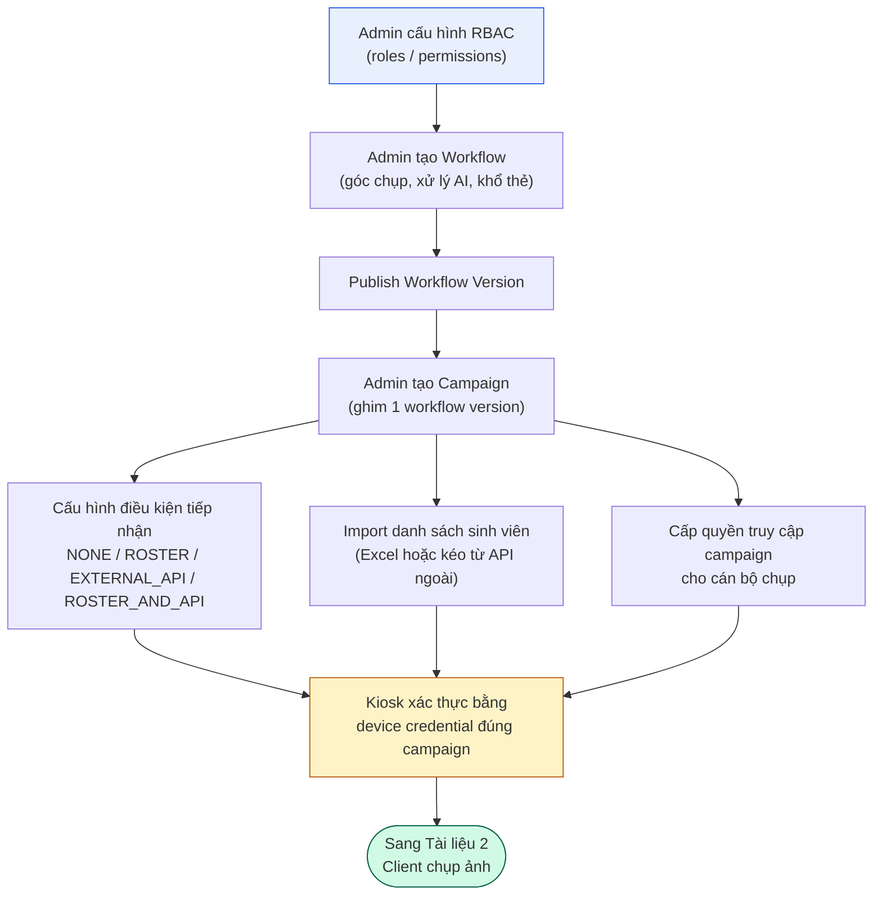
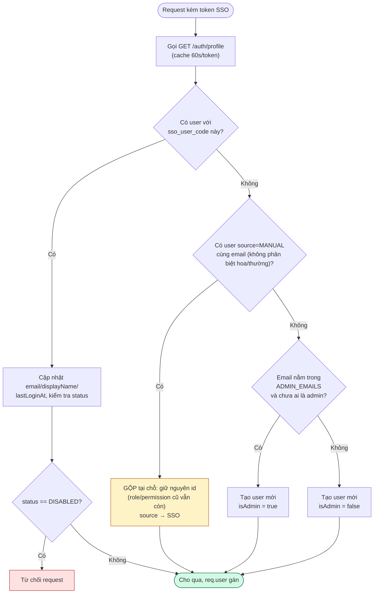
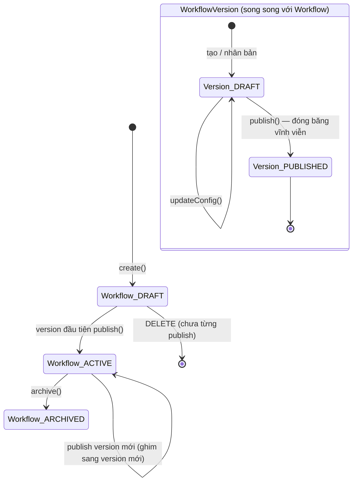
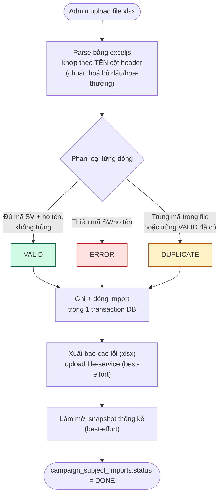
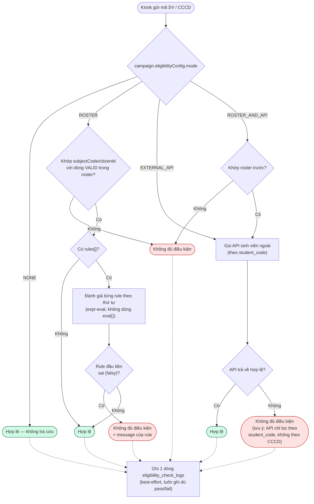
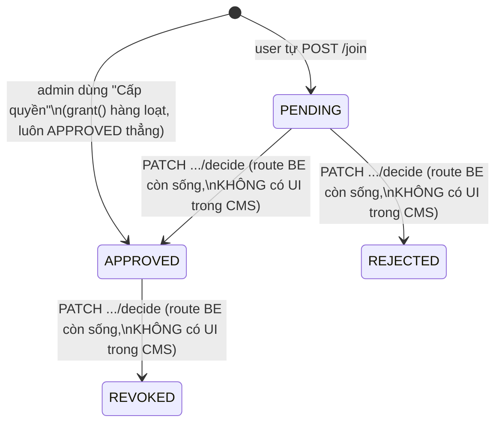

# Tài liệu 1/3 — Quản trị phân quyền (RBAC) & Cấu hình chiến dịch (Campaign)

> Phạm vi: `apps/api/src/modules/identity`, `apps/api/src/modules/workflow`,
> `apps/api/src/modules/device-management` (campaign/roster/eligibility),
> `apps/cms/src` (màn hình admin tương ứng).
> Ngày khảo sát: 2026-09-28. Toàn bộ đường dẫn tương đối so với
> `D:\Work\camera_server\Looka` trừ khi ghi rõ khác.
> Phương pháp: đọc trực tiếp source code (entity/migration/controller/service),
> không suy đoán từ tên file.

**Lưu ý quan trọng — đính chính so với ghi nhớ trước đây của dự án:** mô hình
"1 người ↔ 1 kiosk, tự động duyệt" (`campaign_kiosk_assignments`) đã bị **xoá
hẳn ngày 2026-09-18**. Màn hình duyệt từng người (PENDING approval) trong CMS
cũng đã bị **gỡ bỏ ngày 2026-09-08**. Mọi tài liệu/kế hoạch cũ mô tả mô hình
đó nay đã lỗi thời — xem mục 4.6 bên dưới để biết mô hình hiện hành.

---

## 0. Mục đích, phạm vi & đối tượng đọc

**Mục đích**: mô tả luồng nghiệp vụ và luồng dữ liệu của phần "quản trị
phân quyền" và "cấu hình chiến dịch" trong hệ thống chụp ảnh làm thẻ sinh
viên (Looka), làm cơ sở để BA/PM/QA/dev/vận hành hiểu đúng hiện trạng hệ
thống trước khi thay đổi hoặc mở rộng.

**Phạm vi**: từ cấu hình RBAC (role/permission) và đăng nhập SSO, tới tạo
"Workflow" (nghiệp vụ mẫu), tạo "Campaign" (chiến dịch chụp ảnh), cấu hình
điều kiện tiếp nhận, import danh sách sinh viên, và cấp quyền truy cập
chiến dịch. **Không bao gồm**: chụp ảnh (→ Tài liệu 2), duyệt/in ảnh
(→ Tài liệu 3).

**Đối tượng đọc**: BA, PM, QA, dev tiếp nhận module, vận hành (CTSV/admin
CMS).

**Từ viết tắt**: RBAC = phân quyền theo vai trò; SSO = đăng nhập một lần;
CCCD = Căn cước công dân; CMS = trang quản trị; SLA = thời hạn xử lý cam
kết; BA = Business Analyst.

## 1. Sơ đồ khối tổng quan luồng

---

## 2. Đăng nhập & Quản lý người dùng (Identity/RBAC)

### 2.1 Mô hình dữ liệu

`users` là **bảng cache** của danh tính SSO (không phải nguồn sự thật về
"người này là ai" — nguồn thật là hệ SSO của trường), được upsert mỗi lần
đăng nhập. Phân quyền (`is_admin`, roles/permissions) là trạng thái phân
quyền **nội bộ của Looka**, gắn thêm lên trên cache đó.

- `users` — `sso_user_code` (khoá tự nhiên, unique), `email`, `display_name`,
  `is_admin`, `roles` (jsonb, cột legacy tự do — thực tế chỉ còn giá trị
  `'REVIEWER'` được đọc), `last_login_at`, `title`/`code`/`phone`,
  `department`/`faculty` (varchar tự do, **không có bảng danh mục**),
  `avatar_fs_file_id`, `status` (`ACTIVE`|`DISABLED`), `source`
  (`SSO`|`MANUAL`|`SYNC`).
  Entity vẫn nằm ở `apps/api/src/modules/shared/entities/user.entity.ts`
  (chưa được dời hẳn vào `modules/identity` — chính comment trong file ghi
  nhận đây là việc dời module còn dang dở, tham chiếu kế hoạch backend-layering
  §6 Giai đoạn 3).
- `roles`, `permissions`, `role_permissions`, `user_roles` — tạo bởi migration
  `1809000000000-CreateRbac.ts`. Migration này seed sẵn 6 role: `ADMIN`,
  `REVIEWER` (`is_system=true`), và `CTSV`, `TRUYEN_THONG`, `HAU_CAN`,
  `IT_PRINT` (role thường). **`permissions` được nạp lúc app khởi động**,
  không qua migration (xem 2.3). **`role_permissions` bị để trống hoàn toàn**
  bởi mọi migration — xem lỗ hổng #1 ở mục 2.5.
- `UQ_users_manual_email_ci` — unique index từng phần trên `lower(email)`,
  chỉ áp dụng khi `source='MANUAL'` — lưới an toàn chống race-condition trong
  luồng gộp tài khoản theo email (2.2).

### 2.2 Luồng đăng nhập SSO & gộp tài khoản MANUAL→SSO

`SsoAuthGuard` (`apps/api/src/shared/auth/sso-auth.guard.ts`) là guard đặt
trên hầu hết mọi route CMS/kiosk/web. Với mỗi request:

1. Chuyển tiếp header `Authorization`/`x-refresh-token` tới
   `GET <SSO_BASE_URL>/auth/profile`, cache kết quả 60s/token trong bộ nhớ
   tiến trình.
2. `upsertUser()`:
   - Tìm theo `sso_user_code`. Có → cập nhật `email`/`displayName`/
     `lastLoginAt`, kiểm tra `status !== 'DISABLED'` trước tiên.
   - Không có → tìm một dòng `source='MANUAL'` cùng email (so khớp không
     phân biệt hoa/thường). Có → **gộp tại chỗ**: giữ nguyên `id` (nên mọi
     role/permission đã cấp trước đó vẫn còn), gán `ssoUserCode`, `email`,
     `displayName`, `source → 'SSO'`, `lastLoginAt`. Một dòng nguồn `SYNC`
     **không bao giờ** là đích gộp.
   - Không có gì → tạo mới. Bootstrap admin đầu tiên: nếu chưa có ai
     `isAdmin=true` và email nằm trong biến môi trường `ADMIN_EMAILS` →
     tự động cấp `isAdmin=true`.
3. Bypass dev: `ALLOW_UNAUTHENTICATED_ADMIN_DEV=true` tạo một admin giả —
   chỉ dùng local dev, fail-closed (từ chối mọi request) nếu `SSO_BASE_URL`
   chưa cấu hình và cờ này cũng chưa bật.

**Cách thứ hai để tạo user MANUAL "chờ sẵn"**: `POST
/v1/users/find-or-create-by-email` — dùng cho luồng "cấp quyền chiến dịch
theo email" trong CMS, cho phép admin gán quyền truy cập chiến dịch cho một
người **chưa từng đăng nhập lần nào**; người đó sau này gộp vào danh tính
thật của họ qua đúng luồng `upsertUser()` ở trên khi đăng nhập lần đầu.

`ApiKeyOrSsoGuard` là ngoại lệ hẹp: chỉ áp dụng cho route "student gallery"
(`StudentController`) — chấp nhận cả `x-api-key` dùng chung hoặc SSO, vì
apps/web (kiosk không có khái niệm SSO) và CMS đều cần gọi tới.

**Sơ đồ khối: quyết định `upsertUser()` mỗi lần đăng nhập SSO**

*Ghi chú*: một user `source='SYNC'` không bao giờ là đích gộp ở nhánh Q2.
Bypass dev (`ALLOW_UNAUTHENTICATED_ADMIN_DEV=true`) không nằm trong sơ đồ
này — chỉ dùng local dev.

### 2.3 Mã hoá CCCD/PII

`apps/api/src/shared/security/citizen-id.codec.ts` — thuần `node:crypto`:

- Mã hoá: AES-256-GCM, IV ngẫu nhiên 12 byte mỗi lần gọi, đóng gói
  `iv || authTag || ciphertext` thành một chuỗi base64 lưu vào
  `sessions.citizen_id_enc`.
- Tra cứu khớp chính xác: **HMAC-SHA256** khoá bằng chính
  `CITIZEN_ID_ENCRYPTION_KEY` (không phải SHA-256 trần) vào
  `sessions.citizen_id_hash` — được nâng cấp từ hash không khoá sau khi audit
  database ngày 2026-09-16 phát hiện CCCD (12 chữ số, có cấu trúc) khiến hash
  không khoá có thể bị đảo ngược bằng bảng tính sẵn nếu lộ bản dump DB.
- `sessions.citizen_id_last4` lưu 4 số cuối để hiển thị mà không cần giải mã.
- **Ghi song song (dual-write)**: `sessions.metadata->>'identityNumber'`
  (trường jsonb plaintext cũ) vẫn được ghi song song với 3 cột mới — các nơi
  đọc cũ (tìm kiếm ILIKE trong `student.service.ts`, dựng đường dẫn file
  trong photo-review) chưa bị đụng tới. Việc dọn (scrub) bản plaintext này
  được chính migration ghi nhận là **việc còn để đó, chưa làm**.
- Có một codec riêng cho thông tin xác thực tích hợp bên thứ ba:
  `secret.codec.ts` (`encryptSecret`/`decryptSecret`), cùng kiểu AES-256-GCM
  nhưng dùng **khoá môi trường khác** (`INTEGRATION_CREDENTIAL_ENCRYPTION_KEY`)
  để xoay khoá này không ảnh hưởng khoá kia. Dùng cho
  `campaigns.eligibility_config.api.credentialCiphertext`, không bao giờ
  dùng cho CCCD.

### 2.4 Cơ chế guard phân quyền

Hai thành phần phối hợp (`apps/api/src/modules/identity/presentation/guards/`):

- `@RequirePermission(code, description?)` — decorator gắn metadata quyền
  lên class controller hoặc từng handler.
- `PermissionsGuard` — **phải chạy sau** `SsoAuthGuard` trên cùng route (đọc
  `req.user`, không tự xác thực). `req.user.isAdmin===true` là **đường tắt
  cứng** — admin không bao giờ cần tra `user_roles`. Người khác: tra
  `user_roles ⋈ role_permissions ⋈ permissions`, cache 60s/user trong bộ
  nhớ tiến trình. **Route không gắn `@RequirePermission` thì đi qua không
  điều kiện** — mô hình opt-in, không phải deny-all.
- `PermissionCatalogService` — lúc khởi động, quét mọi controller qua
  `DiscoveryService` của Nest, đọc metadata `@RequirePermission` ở cả
  class và method, rồi **upsert** vào bảng `permissions` — danh mục quyền
  hoàn toàn sinh ra từ decorator trong code, không có migration tay. Đây là
  nguồn dữ liệu cho `GET /v1/permissions`.

### 2.5 Danh sách API (Identity)

| Method & Path | Quyền yêu cầu | Ghi chú |
|---|---|---|
| `POST /v1/users` | `user:write` | Tạo user thủ công |
| `POST /v1/users/find-or-create-by-email` | `user:write` | Tạo placeholder MANUAL theo email |
| `PATCH /v1/users/:id` | `user:write` | Sửa hồ sơ |
| `POST /v1/users/:id/disable` \| `/enable` | `user:write` | Khoá/mở tài khoản |
| `POST /v1/users/:id/avatar` | `user:write` | Upload avatar, luôn `visibility:'public'` (workaround ACL fs-core — xem lỗ hổng chung ở Tài liệu 2) |
| `POST /v1/users/sync` | `user:write` | Đồng bộ danh bạ — **stub**, không ai gọi định kỳ (xem 2.6) |
| `GET /v1/users`, `/:id`, `/sync/status` | `user:read` | |
| `POST /v1/roles`, `PATCH /:id`, `PUT /:id/permissions`, `DELETE /:id` | `role:write`/`role:delete` | Xoá role hệ thống (`ADMIN`/`REVIEWER`) bị chặn |
| `GET /v1/roles`, `/:id`, `/:id/users` | `role:read` | |
| `PUT /v1/users/:id/roles` | `user:write` | **Thay thế toàn bộ** tập role của user, không phải thêm/bớt |
| `GET /v1/me/permissions` | không gate | Cho CMS ẩn/hiện menu |
| `GET /v1/permissions` | `permission:read` | |

### 2.6 Lỗ hổng/thiếu sót xác nhận trong code (Identity)

1. **`role_permissions` cho role không phải ADMIN bằng 0** khi khởi tạo —
   migration `1809000000000` tự ghi rõ bảng này "tạo trống". Việc gán quyền
   thật cho `CTSV`/`TRUYEN_THONG`/`HAU_CAN`/`IT_PRINT` nằm ở **script CLI
   độc lập** `apps/api/src/scripts/seed-default-role-permissions.ts` (chuyển
   từ migration sang script ngày 2026-09-21 vì "bộ quyền theo role là cấu
   hình vận hành, không phải thay đổi schema một lần") — **phải chạy tay**
   (`pnpm --filter @face/api seed:role-permissions`) sau khi có DB mới,
   script này idempotent. Không chạy → tài khoản chỉ có role CTSV/HAU_CAN/
   IT_PRINT sẽ không có quyền nào cả (đã từng gây sự cố thật: một CTSV bị
   `403 Thiếu quyền "user:read"` khi mở màn hình chọn người). `REVIEWER` và
   `TRUYEN_THONG` **cố tình không được cấp quyền gì** — xem #2.
2. **Module photo-review chưa từng chuyển sang RBAC mới** — vẫn dùng
   `ReviewerRoleGuard` đọc trực tiếp `users.roles` (jsonb) kiểu cũ, không
   qua `user_roles`/`role_permissions`. Chưa có mã quyền `photo-review:*`
   để cấp cho REVIEWER/TRUYEN_THONG.
3. **Chưa có audit log nào trong toàn bộ hệ thống** — rà soát code không
   thấy bảng/cơ chế ghi log thao tác admin (chỉ có `eligibility_check_logs`
   dành riêng cho tra cứu điều kiện tiếp nhận ở kiosk). Việc ai đã xem/giải
   mã CCCD, ai đã đổi quyền của role... hiện **không để lại dấu vết** — đúng
   như ghi nhớ trước đây, đây vẫn là quyết định sản phẩm còn treo.
4. **`UserDirectorySyncService` là stub** — có implementation thật
   (`user-directory.client.ts`) nhưng không ai lên lịch chạy; trạng thái
   chỉ lưu trong bộ nhớ, không có bảng lưu trữ.
5. `sessions.metadata->>'identityNumber'` (CCCD dạng plaintext cũ) vẫn được
   ghi song song với các cột mã hoá — chưa dọn.

---

## 3. Màn hình quản trị người dùng/role (CMS)

- `apps/cms/src/auth/AuthContext.tsx` / `AuthGate.tsx` / `authApi.ts` /
  `authCookies.ts` — quản lý phiên SSO. `AuthGate.tsx` có 5 bước ưu tiên
  (đang kiểm tra / cần refresh / không có phiên hợp lệ / 401 / render) trước
  khi hiện app; nếu `VITE_URL_LOGIN_SSO` chưa cấu hình thì bỏ qua gate này
  (chỉ dùng cho dev, `SsoAuthGuard` phía server vẫn áp dụng).
- `/users` → `UsersPage.tsx` — danh sách lọc theo `q`/`roleCode`/`status`/
  `source`, modal "Thêm người dùng" gọi `POST /v1/users`. **Gán role không
  làm ở đây** — chỉ làm ở `/roles`, để tránh trùng logic ghi (ghi rõ trong
  comment của file).
- `/roles` → `RolesPage.tsx` — danh sách role kèm số quyền/số user;
  `RoleDetailPage` cho từng role: form đổi tên/mô tả, checklist đầy đủ danh
  mục quyền nhóm theo `permission.group` (có "chọn cả nhóm"), bảng phân
  trang "user có role này" kèm thêm/bớt. `AddUserToRoleModal` tìm user
  (debounce 300ms), gọi `PUT /v1/users/:id/roles` cho từng user được chọn —
  vì endpoint này thay thế toàn bộ tập role, helper phải đọc-sửa-ghi lại
  toàn bộ tập role hiện có của user đó.

**Không còn màn hình "duyệt gán kiosk" nào trong CMS** — xem mục 4.6.

---

## 4. Cấu hình Workflow (nghiệp vụ mẫu)

### 4.1 Khái niệm

"Workflow" là một mẫu dùng lại được, có version, mô tả: góc chụp, phương
thức định danh, các bước xử lý AI, khổ thẻ/spec đầu ra, chế độ in. Một
campaign ghim vào **một version đã publish** của một workflow; nhiều
campaign có thể dùng chung một workflow.

### 4.2 Aggregate

- `Workflow` — `code` (bất biến, khoá tự nhiên), `status`
  (`DRAFT`→`ACTIVE`→`ARCHIVED`), `currentVersionId`. `archive()` chỉ hợp lệ
  từ `ACTIVE` (workflow DRAFT chưa từng publish thì xoá hẳn bằng DELETE,
  không archive).
- `WorkflowVersion` — mỗi dòng là một cặp `(workflowId, version)`.
  `isDraft = publishedAt===null`. `updateConfig()` chỉ thành công khi còn là
  draft; `publish()` đóng băng vĩnh viễn (mọi sửa đổi sau đó đều thất bại).
  Tại một thời điểm chỉ có tối đa 1 draft/workflow (do handler đảm bảo, không
  phải do aggregate). Publish một version mới **không đụng** tới version
  đang ACTIVE hiện tại — cả hai tồn tại song song cho tới khi version mới
  publish xong và `Workflow.markVersionPublished` chuyển việc ghim sang.

**Sơ đồ khối: vòng đời Workflow & WorkflowVersion**

*Ghi chú*: Campaign ghim vào **một version cụ thể** (`workflowVersionId`),
không phải vào Workflow nói chung — nên publish version mới không ảnh
hưởng campaign đang dùng version cũ cho tới khi campaign đó được sửa để
trỏ sang version mới.

### 4.3 Schema cấu hình (zod)

5 nhóm: `capture` (mảng góc chụp — validate cấu trúc thật nằm ở
`device-management/validation/capture-angles.validator.ts`'s
`validateCaptureAngles()`, import như một hàm thuần để tránh phụ thuộc vòng
giữa 2 module; `clickMode.default`/`allowed` gồm `MANUAL_SEQUENTIAL`|
`MANUAL_ALL_AT_ONCE`|`AUTO_AI`), `identification` (`methods[]` đối chiếu một
union 7 mã **hardcode** — cố ý đồng bộ tay với bảng `identification_methods`
thật vì file schema này không có quyền truy cập DB), `aiProcessing`
(`enabled` + `steps[]`), `output` (`photoKindCode` + `cardSpec`: `size`
`3x4`|`4x6`, `dpi` `300`|`600`, `backgroundColor`, tỉ lệ đầu/mắt,
`retouch.enabled`), `printing` (`mode: 'DIRECT'|'CENTRALIZED'`).

**Điều kiện tiếp nhận (eligibility) đã được chuyển RA KHỎI cấu hình workflow
từ 2026-09-18** — theo phản hồi sản phẩm rằng điều kiện tiếp nhận gắn với
từng chiến dịch cụ thể, không phải thứ dùng lại được ở cấp mẫu. Nay nằm ở
`campaigns.eligibility_config` (xem 4.5). Một `workflow_versions.config` cũ
có thể vẫn còn khoá `eligibility` — không ai đọc nó nữa.

### 4.4 Bảng DB & di trú

- `workflows`, `workflow_versions` (`workflow_versions.config` jsonb, unique
  `(workflow_id, version)`, không có FK từ `workflows.current_version_id`
  sang `workflow_versions.id` — tham chiếu uuid trần có chủ đích, cùng quy
  ước với chỗ khác trong hệ thống).
- `ai_pipeline_steps` — danh mục mã bước AI mà `aiProcessing.steps[].code`
  tham chiếu.
- `campaigns.workflow_id` / `campaigns.workflow_version_id` — migration đi
  kèm còn **di trú dữ liệu một lần** mọi dòng `capture_configurations` cũ
  thành một cặp `workflows`+`workflow_versions` tổng hợp (status ACTIVE,
  version 1). `capture_configurations` sau đó bị xoá hẳn bởi migration
  `1830000000000-DropCaptureConfigurations.ts`.

### 4.5 Ghi đè (override-merge) khi campaign dùng workflow

`CampaignService.toCampaignResponse()`: khi `campaign.workflowVersionId` có
giá trị, hệ thống lấy config của version đó và **chỉ điền vào
`captureAngles`/`cardSpec` khi cột tương ứng của campaign đang là `null`**
— tức cột của campaign, nếu có set, luôn thắng cấu hình workflow.
`requiredCameraCount` được tính **sau** bước merge này để campaign chỉ dùng
workflow vẫn có gợi ý đúng số camera cần.

### 4.6 Danh sách API (Workflow)

| Method & Path | Quyền | Ghi chú |
|---|---|---|
| `POST /v1/workflows` | `workflow:write` | Tạo DRAFT + version-1 draft |
| `PATCH /v1/workflows/:id` | `workflow:write` | Chỉ đổi tên/mô tả, không đổi code |
| `PUT /v1/workflows/:id/config` | `workflow:write` | Sửa config của draft version hiện tại |
| `POST /v1/workflows/:id/publish` | `workflow:write` | Đóng băng draft, chuyển workflow → ACTIVE |
| `POST /v1/workflows/:id/versions` | `workflow:write` | Nhân bản một draft mới từ version hiện tại |
| `POST /v1/workflows/:id/archive` | `workflow:write` | |
| `DELETE /v1/workflows/:id` | `workflow:delete` | Chỉ khi DRAFT và chưa campaign nào dùng |
| `GET /v1/workflows`, `/validate`, `/:id`, `/:id/versions`, `/:id/usage` | `workflow:read` | `/validate` là dry-run zod |
| `POST /v1/eligibility/test-lookup` | `workflow:read` | Test cấu hình eligibility API, không lưu gì |

### 4.7 Màn hình CMS (Workflow)

- `/workflows` → `WorkflowsPage.tsx` — danh sách + modal tạo (nhúng luôn
  editor config đầy đủ vì `POST /v1/workflows` luôn cần `config`) +
  `WorkflowDetailModal` có chỉ báo bước (Nháp → Cấu hình → Publish) và
  **cảnh báo có thật trong code**: API không có cách đọc lại nội dung draft
  version sau khi đã từng publish trước đó — state trong trình duyệt là
  nguồn đáng tin duy nhất trong một phiên làm việc; rời màn hình rồi quay
  lại sẽ mất phần nháp chưa publish. "Tạo version nháp mới" nhân bản từ
  version publish gần nhất.
- `WorkflowConfigEditor.tsx` — editor thật cho góc chụp/định danh/AI/đầu
  ra/in ấn.
- `/identification-methods` → `IdentificationMethodsPage.tsx` — CRUD danh
  mục (tạo + sửa; không xoá cứng — "nghỉ hưu" bằng `active:false`, cùng quy
  ước với `PhotoKindsPage`).

---

## 5. Cấu hình Campaign (chiến dịch)

### 5.1 Entity Campaign

Trường chính: `name`, `code` (duy nhất, tự sinh `CMP-<8hex>` nếu bỏ trống),
`purpose` (`STUDENT_CARD`|`KYC_ENROLLMENT`), `startsAt`/`expiresAt` (null =
không giới hạn), `quotaPlanned` (chỉ cảnh báo mềm, không chặn cứng),
`manualStatus` (`PAUSED`|`CLOSED`, ghi đè trạng thái suy ra từ ngày — không
bao giờ lưu `OPEN`/`UPCOMING`/`EXPIRED`, các trạng thái này luôn được **suy
ra**, không lưu), `consentContent`/`consentVersion`, `recordVideoRoles`,
`cardSpec` (null = lấy từ workflow), `captureAngles` (null = lấy từ
workflow), 3 trường **kiosk-only đã @deprecated** (`captureMode`,
`autoHoldMs`; riêng `simultaneousCapture` **không** deprecated, vẫn dùng —
dễ đọc nhầm vì nằm ngay sau 2 trường kia), `recordVideo`,
`requiresEmbedding` (mặc định `true`), `workflowId`/`workflowVersionId`
(uuid trần, không FK — module device-management phụ thuộc module workflow,
không ngược lại), `processingSlaHours` (giờ SLA, nuôi
`subject_photo_sets.due_at` ở module thống kê), `location` (text tự do,
không có danh mục địa điểm), `eligibilityConfig` (jsonb, mặc định
`{"mode":"NONE"}`).

Trạng thái hiệu lực (effective status) **luôn được suy ra, không bao giờ
lưu** — có cả bản TypeScript và bản SQL `CASE` riêng để tránh lệch nhau.

### 5.2 Cấu hình điều kiện tiếp nhận (Eligibility)

`campaigns.eligibility_config` (jsonb, validate bằng zod). `mode`:
`NONE`|`ROSTER`|`EXTERNAL_API`|`ROSTER_AND_API`. Với API ngoài: `baseUrl`
(chống SSRF bằng cách re-resolve hostname mỗi lần gọi, vì hostname có thể
đổi IP sau khi lưu), `authType`, `credential` (chỉ tồn tại khi nhập, không
lưu) / `credentialCiphertext` (lưu, mã hoá AES-256-GCM) / `hasCredential`
(cờ chỉ đọc, bị lược khi GET), `retryCount`/`timeoutMs`,
`listResponsePath`/`listTimeoutMs` (bổ sung 2026-09-21, để kéo cả roster).
`rules[]`: `{key, expr, message}`.

**Chuyển ra khỏi workflow từ 2026-09-18** — nay sửa trực tiếp trên campaign
(`CampaignForm.tsx`), không còn sửa ở màn hình workflow.

### 5.3 Danh sách API (Campaign)

| Method & Path | Quyền | Ghi chú |
|---|---|---|
| `POST /v1/campaigns` | `campaign:write` | |
| `GET /v1/campaigns` | — (đọc, không gate) | Trả **mảng phẳng kiểu cũ** nếu bỏ `page`; có `{items,meta}` + `progress` (đã chụp/đã duyệt/quota/%) khi truyền `page` — quy tắc tương thích ngược có chủ đích |
| `GET /v1/campaigns/stats/summary`, `/stats/timeseries` | | Khai báo **trước** route `:id` để tránh route shadowing |
| `GET /v1/campaigns/:id` | — | |
| `PATCH /v1/campaigns/:id` | `campaign:write` | Gia hạn/tạm dừng/consent/config — ảnh hưởng mọi thiết bị ngay lập tức, không nhân bản theo từng thiết bị |
| `DELETE /v1/campaigns/:id` | `campaign:delete` | 409 `CAMPAIGN_HAS_DEPENDENCIES` nếu còn thiết bị/phiên tham chiếu. Không có endpoint xoá thiết bị → trên thực tế chỉ xoá được campaign chưa từng dùng |
| `GET /v1/campaigns/:id/stats` | — | |

### 5.4 Import danh sách sinh viên (Roster)

Bảng: `campaign_subjects` (mỗi dòng là 1 sinh viên trong roster — `status`:
`VALID`|`ERROR`|`DUPLICATE`, dòng lỗi được **giữ lại** để CMS hiển thị, không
xoá; `extra` jsonb chứa cột Excel không map được) và
`campaign_subject_imports` (mỗi dòng là 1 lần import — `source:
EXCEL|EXTERNAL_API`, trạng thái `PROCESSING→DONE/FAILED` (Excel) hoặc
`PENDING_FETCH→FETCHING→IMPORTING→DONE/FAILED` (kéo từ API)).

`importRoster()`:

1. Parse bằng `exceljs`, **khớp theo TÊN cột header** (không theo vị trí) —
   chuẩn hoá bỏ dấu/hoa-thường để một file thật của phòng ban khác thứ tự
   cột/thừa cột vẫn map đúng (sửa ngày 2026-09-18).
2. Phân loại dòng `VALID`/`ERROR` (thiếu mã SV/họ tên)/`DUPLICATE` (trùng
   mã trong file hoặc trùng với dòng VALID đã có sẵn trên campaign).
3. Ghi + đóng import chạy trong **một transaction DB** (sửa từ audit
   2026-09-16 — trước đó crash giữa chừng có thể để lại dòng đã lưu nhưng
   import kẹt mãi ở `PROCESSING`).
4. **Báo cáo lỗi**: file xlsx liệt kê mọi dòng lỗi + lý do, upload
   file-service với `visibility:'public'` (cùng workaround ACL, xem Tài
   liệu 2), best-effort (upload báo cáo lỗi thất bại không làm hỏng cả
   import) — hiển thị trong CMS bằng link "Xem lỗi".
5. Làm mới snapshot thống kê (best-effort).

Endpoint chính (`campaign:write`): `POST /v1/campaigns/:id/subjects/imports`
(upload), `GET .../imports`, `GET .../imports/:importId`, `DELETE
.../imports/:importId` (từ chối 409 nếu đã có phiên khớp với sinh viên từ
import đó, HOẶC nếu có sinh viên đã `printedAt` — tránh xoá cascade làm mất
lịch sử in), `POST .../subjects/pulls` (đưa vào hàng đợi kéo toàn bộ roster
từ API ngoài — **bất đồng bộ**, có advisory lock chống đụng với việc tự động
kéo khi campaign chuyển sang chế độ `EXTERNAL_API`/`ROSTER_AND_API`), `GET
.../subjects` (danh sách phân trang), `GET
.../subjects/distinct-values?field=` (nạp dropdown cho màn Duyệt ảnh/In),
`POST .../subjects/test-roster-lookup` (chạy thử điều kiện chưa lưu), `GET
/v1/campaigns/subjects/import-template` (tải mẫu xlsx).

Tra cứu roster **phía kiosk** dùng controller/guard riêng: `GET
/v1/campaigns/:id/subjects/lookup?key=` — chỉ cần `DeviceCredentialsGuard`
(không SSO). Kiểm tra `req.device.campaignId !== campaignId` → trả **HTTP
409** `DEVICE_CAMPAIGN_MISMATCH` (trường hợp "sai campaign").

**Sơ đồ khối: quy trình import roster từ Excel**

*Dòng ERROR/DUPLICATE vẫn được giữ lại trong `campaign_subjects` (không
xoá) để CMS hiển thị qua link "Xem lỗi".*

### 5.5 Đánh giá điều kiện tiếp nhận (`lookupSubject`)

**Sơ đồ khối: quyết định "sinh viên này có đủ điều kiện chụp không?"**

### 5.6 Xác thực kiosk theo campaign

`verifyCredentials()` — thứ tự kiểm tra: `NOT_FOUND` → `REVOKED` (kiểm tra
trước cả so khớp secret) → khớp secret hiện tại (xoá mọi overlap xoay
secret đang chờ) → khớp `previousSecretHash` (xoay secret có thời gian
overlap, giữ hiệu lực tới khi secret mới được dùng một lần hoặc admin thu
hồi — sửa cho một sự cố khoá kiosk thật ngày 2026-09-08) → nếu không thì
`INVALID_SECRET` → kiểm tra `expiresAt` của campaign → `EXPIRED`.
`DeviceCredentialsGuard` đọc header `x-device-id`/`x-device-secret`, gắn
`req.device`. Lần gọi thành công đầu tiên chuyển thiết bị từ `REGISTERED`
sang `ACTIVATED`.

### 5.7 Mô hình cấp quyền/duyệt hiện hành (thay cho `campaign_kiosk_assignments`)

Bảng `campaign_kiosk_assignments` (mô hình "1 người↔1 kiosk, tự duyệt")
**đã bị xoá ngày 2026-09-18** — xác nhận qua rà soát toàn repo (ghi rõ trong
chính migration xoá bảng): không có đoạn code phiên chụp/session nào từng
đọc bảng này; `device_id`/`operator_user_id` của một phiên luôn lấy từ
device credential của kiosk và người đang đăng nhập cục bộ, độc lập với mọi
bảng ghép cặp. Thay thế bằng:

- **`campaign_members`** (bảng thật, còn sống) — unique `(campaign_id,
  user_id)`, `status`: `PENDING`|`APPROVED`|`REJECTED`|`REVOKED`. Bất kỳ
  user đã đăng nhập nào có thể `POST /v1/campaigns/:id/join` (idempotent —
  trả về dòng hiện có nếu đã tồn tại, không reset về PENDING). Admin/CTSV
  duyệt/từ chối/thu hồi bằng `PATCH /v1/campaigns/:id/members/:userId`
  (**vẫn dùng `AdminRoleGuard` cũ = `users.is_admin`, route này chưa được
  chuyển sang `PermissionsGuard`**), hoặc `GET .../members` để xem danh
  sách. `GET /v1/me/campaigns` lọc campaign mà user thường có dòng
  `APPROVED`.
- **`CampaignMemberService.grant()`** — `POST /v1/campaigns/:id/members/grant`
  (`campaign:write`, cố ý hạ từ chỉ-admin xuống theo quyền, cùng ngày với
  việc xoá bảng cũ), **cấp thẳng N user thành `APPROVED`** hàng loạt, không
  gắn với thiết bị cụ thể. Idempotent.
- `MeController.getMyAssignments` (`GET /v1/me/assignments`) **đã bị xoá
  hoàn toàn** cùng ngày — không còn ai gọi.

**Khoảng trống UI đáng chú ý**: `CampaignDetail.tsx` (CMS) tự ghi trong
comment rằng tab "Cán bộ chụp" (màn hình duyệt PENDING từng người) **đã bị
gỡ khỏi CMS ngày 2026-09-08** ("không cần phân công") — dù các route backend
(`join`/`members`/`decide`) vẫn còn sống nguyên vẹn. Hiện tại **cách duy
nhất** trong CMS để cấp quyền truy cập campaign là modal "Cấp quyền" hàng
loạt trên `CampaignList.tsx` — luôn cấp thẳng `APPROVED`, không có bước
duyệt/từ chối. **Không còn màn hình nào trong CMS để duyệt/từ chối một yêu
cầu `PENDING` tự join, hay để `REVOKE` một quyền `APPROVED` đã cấp.** Chính
comment trong code cũng để ngỏ câu hỏi này (có nên bỏ luôn màn hình "Chờ
duyệt" phía desktop kiosk hay không).

**Sơ đồ khối: vòng đời `campaign_members` và khoảng trống UI hiện tại**

*Con đường thực tế duy nhất còn dùng được trong CMS hôm nay là mũi tên
`[*] → APPROVED` (cấp hàng loạt qua "Cấp quyền") — các mũi tên còn lại tồn
tại ở backend nhưng không có UI để kích hoạt.*

### 5.8 Danh mục phương thức định danh

7 mã seed sẵn: `QR_CCCD`, `OCR_CCCD`, `RFID`, `NFC`, `BARCODE`, `FACE_ID`,
`MANUAL_LOOKUP` (`OCR_CCCD` thêm sau vì kiosk desktop đọc mặt trước CCCD
thay vì quét QR — xem chi tiết thực tế ở Tài liệu 2, mục định danh không
hẳn là OCR ảnh mà là máy quét mã vạch/QR giả lập bàn phím). `GET
/v1/identification-methods` mở cho mọi người đã đăng nhập (dữ liệu danh
mục, không nhạy cảm); chỉ `POST`/`PATCH` cần quyền `identification-method:write`.
Không xoá cứng — "nghỉ hưu" bằng `active:false`.

---

## 6. Card template liên quan tới cấu hình campaign

`card_templates` — mỗi template là **một dòng có thể sửa** (không phải bảng
version riêng), `status: DRAFT|ACTIVE|ARCHIVED`, `version` là bộ đếm (chỉ
tăng khi ACTIVE **và** đã từng dùng để in). Về mặt khái niệm, khổ thẻ
4x6cm/300dpi từ `output.cardSpec` của workflow/`cardSpec` của campaign liên
quan tới template, nhưng **`card_templates` không có tham chiếu trực tiếp**
tới campaign hay workflow nào — việc chọn template diễn ra ở bước in, độc
lập với cấu hình campaign (chi tiết đầy đủ nằm ở Tài liệu 3).

---

## 7. Bản đồ màn hình CMS (route → file → chức năng)

| Route | File | Chức năng |
|---|---|---|
| `/users` | `apps/cms/src/components/UsersPage.tsx` | Danh sách/lọc/tạo user |
| `/roles` | `apps/cms/src/components/RolesPage.tsx` | CRUD role, lưới quyền, gán role↔user |
| `/campaigns` | `apps/cms/src/components/CampaignList.tsx` | Danh sách + modal "Cấp quyền" hàng loạt (thay `campaign_members`) |
| `/campaigns/new` | `apps/cms/src/components/CreateCampaignPage.tsx` | Bọc `CampaignForm mode="create"` |
| `/campaigns/:id` | `apps/cms/src/components/CampaignDetail.tsx` | 6 tab: Thống kê / Phiên chụp / Sinh viên / **Roster** / Thiết bị (chỉ đọc) / Cài đặt (tóm tắt + link sửa) |
| `/campaigns/:id/edit` | `apps/cms/src/components/EditCampaignPage.tsx` | Bọc `CampaignForm mode="edit"` |
| — | `apps/cms/src/components/CampaignForm.tsx` | Form dùng chung, 3 phần: Thông tin / Workflow (chọn version ACTIVE, xem trước góc chụp/khổ thẻ) / Điều kiện tiếp nhận |
| — | `apps/cms/src/components/CampaignRosterPanel.tsx` | Upload xlsx, tải mẫu, lịch sử import (link lỗi), kéo/theo dõi pull từ API, duyệt roster có lọc |
| — | `apps/cms/src/components/CampaignAssignmentsPanel.tsx` | Tab "Thiết bị" — nay **chỉ đọc**, hiển thị danh sách thiết bị (`GET /v1/campaigns/:id/devices`); trước 2026-09-18 từng là màn hình sửa ghép cặp kiosk |
| `/workflows` | `apps/cms/src/workflow/WorkflowsPage.tsx` | Danh sách, tạo/publish/tạo version nháp, nhúng `WorkflowConfigEditor.tsx` |
| `/identification-methods` | `apps/cms/src/workflow/IdentificationMethodsPage.tsx` | CRUD danh mục phương thức định danh |
| — | `apps/cms/src/components/DevicesPanel.tsx` | **File còn tồn tại nhưng mồ côi** — không route nào import từ sau khi bỏ quản lý thiết bị theo từng campaign (2026-09-08) |

---

## 8. Tổng hợp các điểm còn thiếu / hạn chế xác nhận trong code

1. `role_permissions` cho role không phải ADMIN phải seed **thủ công** qua
   `seed-default-role-permissions.ts` — không tự động, không phải migration.
2. Module photo-review chưa chuyển sang hệ RBAC mới — vẫn dùng
   `users.roles` + `ReviewerRoleGuard` kiểu cũ.
3. **Không có cơ chế audit log** nào cho hành vi quản trị (xem/giải mã PII,
   đổi quyền role...) trong toàn hệ thống, ngoại trừ `eligibility_check_logs`
   phạm vi hẹp.
4. `UserDirectorySyncService` (`POST /v1/users/sync`) là **stub** — chưa có
   ai lên lịch gọi, trạng thái chỉ lưu tạm trong bộ nhớ.
5. `sessions.metadata->>'identityNumber'` (CCCD dạng chữ cũ) vẫn ghi song
   song với các cột đã mã hoá — chưa được dọn/xoá.
6. Màn hình duyệt từng người (`campaign_members` PENDING) đã bị gỡ khỏi CMS
   (2026-09-08) dù route backend vẫn còn sống — hiện **không có UI nào** để
   TỪ CHỐI hoặc THU HỒI một quyền truy cập campaign, chỉ có cấp hàng loạt
   luôn-duyệt.
7. `campaign_kiosk_assignments` (ghép 1 người-1 kiosk, tự duyệt) **đã bị xoá
   hoàn toàn ngày 2026-09-18** — mọi tài liệu mô tả mô hình đó nay lỗi thời.
8. `WorkflowsPage.tsx` không có cách đọc lại tin cậy nội dung draft version
   sau khi rời màn hình, một khi workflow đã từng publish trước đó (API chỉ
   trả về config đã publish gần nhất) — hạn chế UX có thật, được ghi nhận
   ngay trong code.
9. `CampaignForm.tsx` chưa có cách xoá các giá trị `captureAngles`/
   `cardSpec` cũ do màn hình "Mẫu chụp" (capture-configuration, đã ngừng
   dùng) để lại trên các campaign cũ — khoảng trống nhỏ, ít ảnh hưởng.
10. `card_templates` không có FK/tham chiếu trực tiếp tới campaign hay
    workflow — mối liên hệ khổ 4x6/300dpi chỉ mang tính khái niệm (chọn lúc
    in), không được ràng buộc ở schema.

---

*Tài liệu này là 1/3 trong bộ tài liệu khảo sát toàn bộ luồng chụp ảnh thẻ.
Xem tiếp [Tài liệu 2 — Client chụp ảnh](./luong-chup-anh-kiosk-2026-09-28.md)
và Tài liệu 3 — Client in ấn & duyệt (đang biên soạn).*
