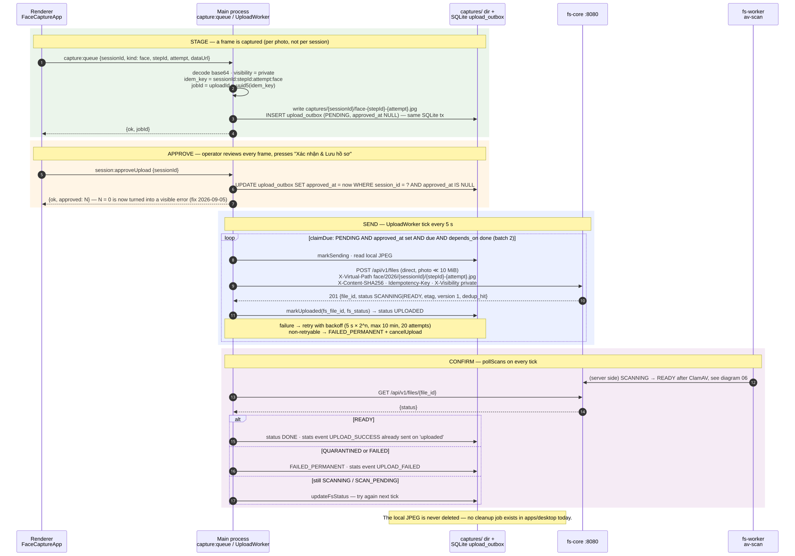
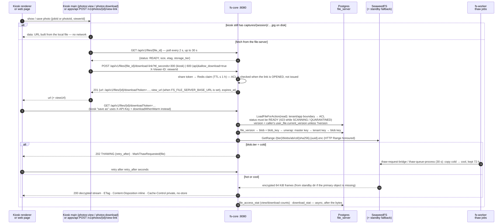

# Photo upload and storage flow — Looka kiosk/web → file-server

> Read from the **actual source and config** on 2026-09-06, not from design intent.
> Looka at commit `5ed11e3` (2026-09-05, working tree clean); file-server repos at
> `file-engine e460a00`, `file-service b86565b`, `file-worker cc48ce9`, `file-fe 9eed7cd`
> (all 2026-08-26, branch `development`). Anything about the *live* server
> (192.168.101.32) is quoted from the file-server team's own docs and marked as such.
>
> Diagrams: sources live in `docs/images/photo-upload-storage-flow/*.mmd`; the SVG/PNG
> next to them were rendered with `@mermaid-js/mermaid-cli` 11. Re-render after editing:
> `mmdc -i 0N-name.mmd -o 0N-name.svg -b white -w 1800`.

## 0. Short answers

| Question | Answer |
|---|---|
| Where does a captured photo go? | Kiosk: local JPEG under `userData/captures/<sessionId>/` + a row in the local SQLite `upload_outbox`, held until the operator approves the session; then `POST /api/v1/files` straight to fs-core (the Looka API is **not** in the kiosk path). Web: `POST /v1/sessions/:id/photos` to `apps/api`, bytes go into Postgres `upload_outbox.content`, a 3 s cron uploads to fs-core. |
| What does fs-core do with it? | Reserves quota, streams the body once (SHA-256 of plaintext + AES-256-GCM), writes to SeaweedFS `/hot/tmp/<uuid>`, dedups by SHA-256, moves to `/hot/blobs/ab/cd/<sha256>.<uuid>.enc`, commits `file`/`file_version`/`blob`/`user_file` in one transaction, answers `201` with `status: SCANNING`. |
| Is storage organised by folder / tenant on disk? | **No** on the primary store. SeaweedFS is content-addressed by hash and shared across tenants (dedup). The folder tree (`/apps/<tenant-slug>/face/2026/<session>/…`) exists **only in Postgres** (`file.virtual_path`, `user_file.virtual_path`). **Yes** on the two optional local-disk copies: standby (`<root>/<tenantId>/<path>`) and mirror (`<root>/<tenantId>/<appId>/<path>`), which are readable folder trees with a `.blobmap/` pointer index. |
| What about the "mount" folder? | That is the **mirror** (`FS_MIRROR_ROOT`): a plaintext, async copy of every upload. It was moved from `/opt/fileserver/File` to `/mnt/file_storage` (symlink) on 2026-08-20. Since 2026-08-23 the code turns it **off when the env var is empty**; deployment of that change is not confirmed in the docs. SeaweedFS itself still lives in Docker named volumes — the plan to bind-mount it under `/mnt/seaweedfs` was written but never executed. |
| How is a photo read back? | Kiosk prefers its local JPEG. Otherwise: wait until `READY`, `POST /api/v1/files/{id}/download-link` (short-lived token, ACL checked on open), then `GET …/download?token=` — fs-core decrypts frame by frame, honours HTTP Range, returns `423` while scanning/quarantined and `202 THAWING` when the blob is on the cold tier. |
| How long until the photo is usable? | 2–5 s after `201` for a small file — almost all of it is waiting for the 5 s `av-scan` poll, not the scan itself (file-server measurement, 2026-08-17). The kiosk polls every 5 s; `apps/api` every 3 s; view-links wait up to 30 s. |

## 1. System map

Two producers, one file-server:

- **Kiosk** (`apps/desktop`, Electron). The renderer never touches the network for photos. The main process stores the JPEG locally, queues it in SQLite, and a background `UploadWorker` (from `@face/fs-client`) talks to fs-core with the kiosk's own API key. Video recordings (`userData/streams/*.webm`, table `capture_streams`) stay local — uploading them is explicitly out of scope (product decision 2026-09-05).
- **Web** (`apps/web` → `apps/api`, NestJS). The browser posts a data URL to the Looka API; the API owns a durable Postgres outbox and an `UploadWorkerService` cron that pushes to fs-core with the shared tenant `looka-face-capture`.
- **file-server**: `fs-core` (Go, `:8080`, runs under pm2), `fs-worker` (four pm2 processes: pipeline, lifecycle, gc, relay), Postgres `file_services` (schemas `file_server` + `file_worker`), Redis, SeaweedFS (Docker, master/volume/filer), ClamAV, NATS, Meilisearch, and `file-fe` (Next.js admin/browse UI). Postgres and Redis run outside Docker (D-78); fs-core/fs-worker run outside Docker too (D-88).

## 2. Stage 1 — capture and staging

### 2.1 Kiosk path (Electron)

| Step | Where | What happens |
|---|---|---|
| Capture completes | `packages/ui/src/components/screens/FaceCaptureApp.tsx` `storePhoto()` → `packages/ui/src/lib/CaptureSink.ts` (`RunScopedCaptureSession` → `ElectronCaptureSink.savePhoto`) | One call **per photo**, not per session. `RunScopedCaptureSession.ensure()` memoises the in-flight `startSession` promise so simultaneous multi-camera captures share one session id (fix 2026-09-05). |
| IPC | preload `queueCapture` → `apps/desktop/src/main/index.ts` handler `capture:queue` | Decodes the base64 data URL in the main process, forces `visibility = 'private'` (every kiosk capture is biometric), sanitises ids with `safeFileToken`. |
| Persist + enqueue | `apps/desktop/src/main/uploads.ts` `queueCapture()` → `packages/database/src/repositories/UploadOutboxRepository.ts` `enqueue()` | `idem_key = <sessionId>:<stepId>:<attempt>:face`; `jobId = uploadId = uuid5(idem_key)`. Writes `userData/captures/<sessionId>/face-<stepId>-<attempt>.jpg` **inside** the SQLite transaction that inserts the outbox row, so a file without a row (or a row without a file) cannot exist. `virtual_path = face/<year>/<sessionId>/<stepId>-<attempt>.jpg` (relative; fs-core anchors it under the tenant namespace). Row starts `PENDING` with `approved_at IS NULL`. |
| Approval gate | `SessionReviewModal` "Xác nhận & Lưu hồ sơ" → `approveUpload()` → IPC `session:approveUpload` → `approveSession()` | **Since Phase 11 (2026-09-06)** only the row with the highest `attempt` per `(kind, step_id)` is stamped with `approved_at`; the other still-staged attempts are deleted from the outbox and their local files unlinked, and the main process then enqueues a `SESSION_REPORT` stats event carrying the final photos (see `docs/plans/04-device-management/phase-11-capture-sessions-and-stats/`). `claimDue()` only returns rows with `approved_at IS NOT NULL`, so nothing uploads before the operator confirms. A cancelled/abandoned session simply stays staged forever (by design: never uploaded behind the operator's back, never deleted). `approved: 0` is now surfaced as an error instead of a silent success (field bug 2026-09-05). |
| Send | `packages/fs-client/src/UploadWorker.ts` (started by `startUploads()` in `uploads.ts`) | Tick every **5 s**, batch **2**. `job.kind` is `face`, so `FsClient.upload()` is used: direct single request when `≤ 10 MiB` (a photo is 100–400 KB), else 32 MiB chunks with `X-Upload-ID` and `Content-Range` (resumable). Headers: `X-API-Key`, `X-Virtual-Path`, `X-Content-SHA256`, `Idempotency-Key`, `X-Visibility: private`, `X-Metadata` (non-identifying only). |
| Result bookkeeping | `markUploaded(fs_file_id, fs_status)` → `UPLOADED`; `pollScans()` each tick → `DONE` on `READY`, `FAILED_PERMANENT` on `QUARANTINED`/`FAILED` | Retry backoff `max(1 s, min(5 s × 2^attempts, 10 min))` ± 20 % jitter (`nextRetryDelayMs` in `UploadOutboxRepository.ts`), max **20** attempts; non-retryable `FsError` → `FAILED_PERMANENT` plus best-effort `DELETE /api/v1/files` with `X-Upload-ID` to release a chunked session. `recoverInterrupted()` at startup returns `SENDING` rows to `PENDING`. |
| Stats | `startUploads()` `onEvent` → `recordStatsEvent` → `stats_event_outbox` → `POST /v1/devices/events` | Only final outcomes are counted: `uploaded` → `UPLOAD_SUCCESS`, `quarantined` → `UPLOAD_FAILED`. |

Local SQLite schema (`packages/database/src/migrations/003-upload-outbox.ts` + `005-outbox-approval.ts`): `id, session_id, kind, local_path, virtual_path, mime_type, sha256, size_bytes, metadata, idem_key UNIQUE, upload_id, depends_on, status (PENDING|SENDING|UPLOADED|DONE|FAILED_PERMANENT), attempts, next_retry_at, last_error, fs_file_id, fs_status, fs_status_at, created_at, done_at, approved_at`.

**Credentials** (`apps/desktop/src/main/secrets.ts` `getFileServiceCredentials()`): `FS_BASE_URL`/`FS_API_KEY` from the environment are imported once into the encrypted secret store (`secrets.dat`). If a base URL exists but no key, the kiosk calls `POST /api/v1/self-service/provision` with `tenant_name = <device id>` (falls back to `FS_TENANT` or `looka-face-capture` for a kiosk without device identity). fs-core creates tenant + app + key (label `bootstrap`, default quota **10 GB**) and returns the same key on every later call. The tenant's namespace is `/apps/<slugify(tenant_name)>`. The provisioning endpoint is only reachable from the CIDR list in `FS_PROVISION_ALLOW_CIDR`. Consequence: **each activated kiosk is its own fs-core tenant**, so revoking one device only means revoking one key.

### 2.2 Web path (`apps/web` → `apps/api`)

- `HttpCaptureSink` (`packages/ui/src/lib/CaptureSink.ts`) posts `{stepId, attempt, dataUrl}` to `POST /v1/sessions/:id/photos` with `x-api-key` (Looka's own `API_KEY`, not the fs-core key).
- `PhotoService.addPhoto()` (`apps/api/src/modules/capture/services/photo.service.ts`) validates MIME/size, computes SHA-256, `idemKey = <sessionId>:<stepId>:<attempt>`, `virtualPath = sessions/<sessionId>/<stepId>-<attempt>.<jpg|png>`, and in **one transaction** inserts `photos` (`ON CONFLICT (session_id, step_id, attempt)` updates only `mime_type`, so a retry cannot erase upload progress) and `upload_outbox` (`content bytea`, `visibility = 'private'`, `ON CONFLICT (idem_key) DO NOTHING`). Schema: `apps/api/src/database/migrations/1787300000000-InitCaptureSchema.ts`, `1787400000000-AddOutboxVisibility.ts`.
- `UploadWorkerService` (`upload-worker.service.ts`): cron `*/3 * * * * *`; `claimNext()` uses `UPDATE … WHERE id = (SELECT … FOR UPDATE SKIP LOCKED)` so several API replicas can drain the same queue; on success it writes `photos.fs_file_id/fs_etag/fs_status/virtual_path` and blanks `upload_outbox.content` (no second copy of the bytes); `pollScans()` refreshes `photos.fs_status` for rows still `UPLOADING/SCANNING/SCAN_PENDING`. Terminal failures → `FAILED` (+ `cancelUpload`), transient → `PENDING` with `next_retry_at`.
- `FileStorageService` (`apps/api/src/modules/file-storage/services/file-storage.service.ts`) builds one `FsClient` at startup from `FS_BASE_URL` (`http://192.168.101.32:8080` in `.env.example`) and `FS_API_KEY`, or self-provisions with `FS_TENANT` (`looka-face-capture`) exactly like the kiosk.
- **Approval gate since Phase 11 (2026-09-06)**: `upload_outbox.approved_at` gates `claimNext()`; `POST /v1/sessions/:id/complete` approves the highest attempt per step, deletes the other `photos` rows (the FK cascade removes their outbox rows) and best-effort deletes on fs-core any superseded file that had already been uploaded. `HttpCaptureSink.approveUpload()` stays a documented no-op because `complete` is the approval moment on this path.

## 3. Stage 2 — fs-core ingest

Code path: `file-service/internal/handlers/upload/direct.go` (`UploadDirect`) → `shared.ResolveUploadTarget` (`X-Virtual-Path` → `file-engine/vfs/vfs.go` `Resolve`, anchored to the app namespace, key folder scope enforced) → `RequirePathPermission(write)` → `file-engine/ioengine/upload.go` `Upload()` → `commitUpload()`.

Key facts, each verified in code:

- **Single entry point** for bytes (D-84): `POST /api/v1/files`. The presence of `Content-Range` is the only switch between "whole file" and "chunk". `Content-Length` is mandatory for the direct path and capped by `FS_DIRECT_MAX_UPLOAD_MB` (default **2048**; the Looka client assumes 10 MiB and self-corrects from the `400` detail if the server disagrees).
- **Quota is reserved before the first byte** (D-06) and settled to the real size inside the final transaction; every error path releases it.
- **One pass over the body**: `hashingReader` computes SHA-256 of the *plaintext* while `streamEncrypted` encrypts with a fresh per-blob AES-256-GCM key (64 KiB frames) and writes the ciphertext to `/hot/tmp/<uuid>` on the write tier. Hashing plaintext is what keeps dedup alive; encrypting in-flight avoids re-reading the temp object. The chunked route does the same at assembly time (`session.go` → `streamEncrypted`); only `IngestBlob` (the `PUT /api/v1/files/{id}` new-version path) still uses the older read-back `encryptInto`.
- **Dedup is global**: `FindBlobBySHA256` ignores tenant and app. On a hit the temp object is deleted and `ShareBlobKey` wraps the existing blob key for this tenant (`blob_key` has one row per tenant). On a miss the temp object is *renamed* to `blobs/ab/cd/<sha256>.<uuid>.enc` (`EncryptedBlobPath`; the uuid suffix makes a lost race leave an orphan instead of corrupting the winner).
- **One transaction** creates `blob` (`INSERT … ON CONFLICT (sha256) DO NOTHING`), `blob_key`, `file` (`UPLOADING` → `SCANNING`), `file_version` v1, `user_file` (owner, `current_version = 1`), `ref_count + 1`, `CommitQuota`, and an `event_outbox` row. Bytes first, metadata second: a failure here leaves an orphan object that the janitor removes; metadata pointing at missing bytes can never happen.
- **Multi-owner branch** (implemented 2026-08-24/25, see §7): if the blob already belongs to a version of a *live* file, no new `file`/`file_version` is created; the caller only gets a `user_file` row pointing at the matched version (`CoOwned = true`) with its own `virtual_path`. This applies **across tenants** by design, so two kiosks uploading byte-identical images would silently co-own one `file_id`.
- **Status after `201`** is `SCANNING` (downloads return `423`) unless the blob already carries a ClamAV verdict from an earlier upload, in which case it is `READY` (or `QUARANTINED`) immediately.
- **Visibility**: Looka always sends `X-Visibility: private`. Since 2026-08-25 fs-core's default for a *new* file without the header is `public` (`postgres.CreateFile`), so keep sending the header.
- **Side effects after commit**: `MirrorAsync` (only if a mirror store is configured, see §4), an `upload_stat` row for every attempt (success or failure), an `audit_log` row, `Idempotency-Key` result stored for 24 h replay.

Authentication cost worth knowing: an `fsc_…` key is looked up in O(1) via `app_key.lookup_hash`, but `bcrypt.CompareHashAndPassword` still runs on **every** request (~88 ms, deliberately uncached — `file-engine/tenant/apikey.go`). The file-server team measured a ceiling of ~3.2 uploads/s per process because of it (`PHAN-TICH-UPLOAD-TRUC-TIEP.md §6.1`). Two kiosk uploads per 5 s tick are far below that, but a fleet of kiosks flushing at once will queue here.

## 4. Where the bytes physically live

| Location | Organised by | Encrypted | Written when | Cleaned by |
|---|---|---|---|---|
| Kiosk `userData/captures/<sessionId>/face-<step>-<n>.jpg` | session folder | no | at capture, before approval | **nothing** — no cleanup code exists (`uploads.ts`, `index.ts`) |
| Kiosk SQLite `upload_outbox` | row per photo | no (paths + ids only) | at capture | never; rows keep `fs_file_id` forever (this is the only kiosk-side link to the server file) |
| Looka API Postgres `photos` + `upload_outbox` (web path only) | row per photo | no | at capture | `upload_outbox.content` blanked after upload; rows kept |
| SeaweedFS `/hot/tmp/<uuid>` | upload uuid | yes | during the request | deleted on commit; `orphan-blob-sweep` (6 h) removes leftovers older than 24 h |
| SeaweedFS `/hot/blobs/ab/cd/<sha256>.<uuid>.enc` (and `/cool`, `/cold`) | **content hash**, 2+2 hex prefix dirs — no tenant, no folder, one object per unique content | yes (AES-256-GCM, key per blob, wrapped per tenant, master key `FS_MASTER_KEY`) | on dedup miss | `gc` when `ref_count = 0`; tier jobs move it between `/hot`, `/cool`, `/cold` keeping the same relative path |
| Postgres `file.virtual_path` / `user_file.virtual_path` | **the logical folder tree** `/apps/<tenant-slug>/face/2026/<session>/…` | n/a | in the commit transaction | soft delete → `TRASHED` → purge |
| Standby `FS_STORAGE_STANDBY_ROOT/<tenantId>/apps/<slug>/face/…` (+ `.blobmap/`) | tenant UUID, then the virtual path (Windows-unsafe chars replaced by `_`) | **no** (`VirtualLayout` over `LocalFS` stores whatever bytes the engine hands it — the ciphertext) | only when the SeaweedFS `Put` fails twice; also read from when the primary object is missing | `Delete` removes both sides; not a backup |
| Mirror `FS_MIRROR_ROOT/<tenantId>/<appId>/apps/<slug>/face/…` (+ `.blobmap/`) | tenant UUID, app UUID, then the virtual path | **no — plaintext**, decrypted on purpose so a human can open it in Explorer | after every successful upload and every new version, in a goroutine (5 min timeout, no retry) | `MirrorDeleteAsync` on explicit delete only; GC/purge never touch it, so it only grows |
| Dev driver `FS_STORAGE_DRIVER=localfs` → `./data/blobs/{hot,cool,cold}/blobs/ab/cd/…` | same hash layout on local disk | yes | dev/test only | same as SeaweedFS |

So, to the question *"is storage split by folder?"*:

- On the **primary** store the answer is no. `blob.physical_path` is derived from the SHA-256 (`blobstore.BlobPath`), shared by every tenant that uploads the same bytes. `GET /api/v1/folders` lists the folder tree from Postgres, never from SeaweedFS.
- On the **local-disk copies** the answer is yes. `blobstore.VirtualLayout` (`file-engine/blobstore/virtuallayout.go`) writes to `<tenantId>/<sanitised virtual path>` and records the real disk path in `.blobmap/<hash path>` so the tree is self-describing even when Postgres is down. The mirror additionally prefixes the app UUID because two apps of one tenant may reuse a virtual path. Files written before the per-tenant split are still found through a legacy read fallback.

Mount history (file-server docs):

- `PLAN-MOVE-MIRROR-STORAGE-TO-MNT.md` — **done live 2026-08-20**: `rsync` of `/opt/fileserver/File` to `/mnt/file_storage`, then a symlink; verified with a real upload landing under `/mnt/file_storage/<tenant>/<app>/<virtual-path>`.
- `PLAN-TAT-MIRROR-GHI-TRUNG.md` — 2026-08-23: `config.go` now reads `FS_MIRROR_ROOT` verbatim and `app.go` returns no mirror store when it is empty (both confirmed in the repo). Status in the doc: built and vetted, **not deployed**. `deploy/compose/.env.example` still says the mirror is "mặc định BẬT" — stale.
- `PLAN-MOVE-SEAWEEDFS-STORAGE-TO-MNT.md` — **not executed**: `deploy/compose/seaweedfs/docker-compose.yml` still uses named volumes `mdata`/`swdata`/`filerdata`. Photo bytes therefore sit under `/var/lib/docker/volumes/fileserver-core_swdata/_data`, on the same 48 GB root LVM as everything else (per that doc).
- Standby: `FS_STORAGE_STANDBY_ROOT` is not set in `deploy/compose/.env`; the docs say the live pm2 process uses `/opt/fileserver/standby`. Cannot be verified from the repo.
- Replication: `FS_REPLICATION_HOT/COOL/COLD = 000` (single copy; `010` breaks uploads on a one-rack cluster). Durability of a photo today = one SeaweedFS object + the kiosk's local JPEG + the mirror if it is on.

Configuration cheat-sheet (`file-service/internal/config/config.go`):

| Env | Meaning | Default |
|---|---|---|
| `FS_STORAGE_DRIVER` | `seaweedfs` or `localfs` | `localfs` (compose sets `seaweedfs`) |
| `FS_SEAWEEDFS_FILER_URL` / `FS_SEAWEEDFS_MASTER_URL` | filer for data, master only for `/readyz` | — |
| `FS_STORAGE_LOCAL_ROOT` | localfs root | `./data/blobs` |
| `FS_STORAGE_STANDBY_ROOT` | fallback dir, seaweedfs driver only | empty = off |
| `FS_MIRROR_ROOT` | async plaintext copy dir | empty = off (since 2026-08-23) |
| `FS_DIRECT_MAX_UPLOAD_MB` | single-request ceiling | 2048 |
| `FS_MASTER_KEY` | envelope-encryption root key; changing it orphans every blob | required in production |
| `FS_PROVISION_ALLOW_CIDR` | who may self-provision a tenant | unset = endpoint off |

## 5. Stage 3 — what happens after `201`

All of this runs in `fs-worker` by polling Postgres (no push):

- **av-scan** (`file-worker/cmd/pipeline/main.go`, every 5 s, leader only): reads the blob back from SeaweedFS, decrypts, streams to `clamd` (`INSTREAM`, ≤ 100 MB; larger files are marked `skipped_too_large` and go `READY` unscanned). Clean → `READY` + `file.created`; infected → `QUARANTINED` + `file.quarantined`, and every file sharing that blob is blocked. Dev worker `.env.example` has `FS_AV_MODE=disabled`, which promotes to `READY` without scanning (refused in production).
- **scan-pending-watch / scan-pending-retry** (5 min / 30 min): a file stuck `SCANNING` for 15 min becomes `SCAN_PENDING`; the retry job puts it back into the queue after an hour. (The older architecture doc still calls `SCAN_PENDING` a one-way door; the retry job in `cmd/lifecycle/main.go` closes it.)
- **relay** (2 s): `event_outbox` → NATS `files.<tenant>.<event>`; nothing in Looka consumes these today.
- **content pipeline** (5 s fast lane / 60 s background): detect → extract (Tika) → index (Meilisearch); OCR and embeddings are not wired. For a JPEG this yields searchable name/path/tags only.
- **Tiering** (`cmd/lifecycle/main.go`): `temp-score` 6 h; `tier-migrate` 24 h (copy → re-read and compare the ciphertext SHA-256 → cutover → 30 min grace → delete the old object, `file-engine/lifecycle/migrate.go`); `version-tier-sync` 5 min (D-89: superseded versions to cool, freshly updated current versions back to hot); `tier-move-request` 5 s (admin-requested moves from `file-fe`, table `tier_move_request`); thaw jobs every 30 s (cold → cool copy kept 72 h). A photo nobody opens will eventually reach `cold`, and the next read returns `202 THAWING`.
- **gc**: `ref_count = 0` → `gc_candidate` → bytes deleted on primary and standby; `refcount-reconcile` 24 h reports drift and never auto-fixes downward (D-90). The mirror copy is not part of GC.
- **janitor**: `session-sweep` 5 min (expired chunked sessions release their quota), `orphan-blob-sweep` 6 h (`tmp/` objects older than 24 h), `stuck-upload-sweep` 15 min (`UPLOADING` > 2 h → `FAILED`).

## 6. Stage 4 — retrieval

| Caller | Entry | Behaviour |
|---|---|---|
| Kiosk UI (review, thumbnails) | IPC `photos:view` → `getPhotoViewSource()` (`uploads.ts`) | Returns a `data:` URL from the local JPEG when it still exists (always, today). Otherwise `waitUntilReady` (30 s, 2 s poll) → `issueDownloadLink(fileId, viewerId, 300 s)` → `{url, expiresAt}`. |
| Kiosk "save photo" | IPC `photos:download` → `downloadPhoto()` | Copies the local file, else `downloadWhenWarm()` with the kiosk's own key (waits out `202 THAWING` using `retry_after`). |
| Kiosk photo list | IPC `photos:list` → `listSessionPhotos()` | Reads the SQLite outbox: `jobId, fsFileId, fsStatus, localAvailable`. |
| Web / CMS | `POST /v1/photos/:id/view-link {viewerId}` (`apps/api` `PhotoController`) | `findFsFileIdOrFail` (503 `FILE_STORAGE_NOT_READY` until the worker has uploaded) → `waitUntilReady` (30 s) → `issueDownloadLink(…, 600 s, allowDownload=true)` → `{url, viewUrl?, expiresAt}`. |
| Any client | `GET /api/v1/files/{id}/download?token=…` or with `X-API-Key` | `download/service.go` `ResolveDownload`: `LoadFileForAction(read)` (hard tenant/app boundary, then ACL → `404` never `403`), status must be `READY` (`423` otherwise), version = caller's `user_file.current_version` unless `?version=`, watermark plan, `ioengine.Download` unwraps the blob key (master → tenant → blob) and decrypts 64 KiB frames as a stream; HTTP Range honoured; `Cache-Control: private, no-store`; `Content-Disposition: inline` unless `?disposition=attachment`. Cold tier → `202` + `MarkThawRequested`. Reads fall back to the standby dir when the primary object is missing. |
| Human via `file-fe` | `/view/<id>?token=…`, `/browse`, `/folders`, `/search`, `/trash`, version history | `src/lib/api.ts` `issueDownloadLink` → `mediaUrlOf(link)` for `/<video>`, `viewPageUrlOf` for the viewer page; folder browsing is `GET /api/v1/folders` (Postgres tree). Auth = SSO bearer (`NEXT_PUBLIC_SSO_LOGIN_URL`) plus a scoped `X-API-Key` chosen in `ApiKeyGate`. Admin pages (`/admin/tier`, `/admin/files`, `/admin/tenants/<id>/tier`) call `fs-admin` (`/admin/tenants/{id}/files/move-tier` + `/confirm`) which enqueues `tier_move_request` rows for the worker. |

Share-link semantics (`download/link.go`): issuing a link does **not** check ACL — only the tenant/app boundary and the key's folder scope; the viewer named in `X-Viewer-ID` is authorised when the link is opened. Tokens are random strings whose claims live in Redis (default 10 min, max 1 h), so they can be revoked instantly and die if Redis loses them.

## 7. file-server storage optimisation — where it actually stands

The file-server team documents work in `file-service/docs/PLAN-*.md`. Cross-checked against code and migrations at HEAD (2026-08-26):

| Topic (doc) | Doc status | In the repo now |
|---|---|---|
| Move mirror dir to `/mnt/file_storage` (`PLAN-MOVE-MIRROR-STORAGE-TO-MNT`, 2026-08-20) | done, verified live | symlink approach, no code change needed |
| Mirror off by default (`PLAN-TAT-MIRROR-GHI-TRUNG`, 2026-08-23) | code done, awaiting approval/deploy | `config.go` + `app.go` changed; `.env.example` comment stale |
| Move SeaweedFS volumes to `/mnt/seaweedfs` (`PLAN-MOVE-SEAWEEDFS-STORAGE-TO-MNT`) | awaiting approval | compose unchanged — **not done** |
| Version-aware tiering D-89 (`PLAN-TIER-THEO-PHIEN-BAN`, 2026-08-20) | done live | `version-tier-sync` job, 5 min |
| Refcount leak D-90 (`PLAN-SUA-RO-RI-REFCOUNT`) | fixed, 14 blobs repaired, deploy pending on 2026-08-20 | `PurgeFile` counts per version row; `RepairRefCountLeaks` in gc |
| Standby split per tenant (`PLAN-SCOPE-PATH-PER-TENANT`) | recommendation | `VirtualLayout.tenantDir()` + legacy read fallback implemented; `app_key_folder` keyed per app (migration `1785284800000-AppKeyFolderPerApp`) |
| Storage optimisation plan (`PLAN-TOI-UU-LUU-TRU-FILE`, 2026-08-23) — Phase 1: `upload_stat`, `file_access_stat` | "proposed, not coded" (header never updated) | **done**: migrations `1786200000000-UploadStat`, `1786300000000-FileAccessStat`, `1786500000000-DownloadStat`; `ioengine.recordUploadStat` on every exit path; `TouchAccess(viewer)`; FE upload-log and stats pages |
| Same plan — Phase 2: multi-owner `user_file`, `visibility`, co-owner dedup, per-caller `current_version` | proposed | **done in code 2026-08-24/26**: migrations `1786400000000-UserFile`, `1786600000000-UserFileVirtualPath`; `commitUpload` co-owner branch; download resolves the caller's version; delete/restore per owner; `GET /api/v1/my-files`, `PATCH …/visibility`, `PATCH …/requested-tier`. Not done: dropping `file.tenant_id/app_id/owner_id/virtual_path` (§5.8 step 5); `requested_tier` is stored but `ListTierCandidates` ignores it (gap noted 2026-08-25). Default visibility for new files changed to `public` on 2026-08-25. |
| Admin manual tier move (`PLAN-TAI-CAU-TRUC-ADMIN §1.7`) | — | done: migrations `1786700000000-TierMoveRequest`, `1786800000000-TierMoveRequestNote`; worker job; FE `AdminTierManager` (2026-08-25/26) |
| Tier statistics (`FilesByTier`) | — | done 2026-08-26 (engine, fs-core, FE dashboard) |
| Inline virus scan during upload (`PLAN-QUET-VIRUS-TRONG-LUOT-NHAN`) | proposal; cheap alternative = poll 1 s | **not implemented**; `av-scan` still polls every 5 s |
| Client → SeaweedFS direct upload (`PHAN-TICH-UPLOAD-TRUC-TIEP`) | rejected | fs-core stays in the data path (dedup needs the hash, encryption needs the key) |
| API-key auth cache (`PHAN-TICH-UPLOAD-TRUC-TIEP §6.1`) | recommended | not implemented (`authenticateScopedKey` still uncached) |

What this means for Looka photos specifically:

- Every upload attempt now leaves an `upload_stat` row (mode, outcome, sizes, duration) — the first server-side evidence for failed kiosk uploads; visible in `file-fe` upload log.
- Byte-identical uploads become co-owned files rather than duplicates. Camera captures are unique, so the practical effect is on retries (already handled by `Idempotency-Key`) and on test images reused across kiosks.
- Each kiosk tenant is charged the full logical size of every file it owns (`CommitQuota` runs even on dedup hits) against its 10 GB default quota — roughly 25k–100k photos at 100–400 KB before `413 QUOTA_EXCEEDED`.

## 8. Looka changes pulled in today (commit `5ed11e3`, authored 2026-09-05 18:23)

No commit was made on 2026-09-06 and the working tree is clean; the files that show today's modification time are the checkout of yesterday's commit (54 files, +4435/−555, `docs/ROADMAP.md` +345 lines). Upload-related items:

1. **Simultaneous capture created two session ids** — `RunScopedCaptureSession.ensure()` now memoises the in-flight `startSession` promise; new tests in `packages/ui/src/lib/__tests__/CaptureSink.test.ts`.
2. **Approve reported success while approving nothing** — `ElectronCaptureSink.approveUpload()` throws when `approved === 0`; the main-process handler logs `sessionId`/`approved` on every call.
3. Known follow-up: a side frame's first capture is filed as `attempt: 2` (off-by-one between `recordExternalCapture` and the `capture-trigger` handler). Harmless for idempotency, wrong in file names.
4. `campaigns.record_video` flag (migration `1787800000000-AddRecordVideo`) + fix for recordings never finalised (`isRecordingSession`); video stays local.

Other items in the same commit: Camera Setup rewritten per capture angle with `devicechange` re-enumeration; CB Help extended display now shows only the capture frames (`CbHelpFrames.tsx`, IPC `cbhelp:*`); minimum frames lowered 3 → 2; FRONT-only 250 px face floor and a 0.30 smile ceiling for FRONT; capture-mode labels fixed in the CMS and campaign mode propagated to the views; live preview mirrored again while saved stills stay raw; side-frame retake now waits for a real trigger and `WorkflowEngine.retakeStep` resets the step status.

## 9. Findings and risks (ordered by impact)

1. **Kiosk never deletes local captures.** `captures/<sessionId>/*.jpg` and `streams/*.webm` accumulate indefinitely; nothing in `apps/desktop/src/main` unlinks them. Disk growth plus a permanent plaintext copy of biometric photos on every kiosk. Needs a retention rule (e.g. delete once the outbox row is `DONE` and older than N days).
2. **No central record of kiosk photos in Looka's own database.** The kiosk talks to fs-core directly; `apps/api` only receives counts via `POST /v1/devices/events`. The `session → fs_file_id` mapping lives in the kiosk's SQLite and in fs-core's `file.virtual_path` (`…/face/<year>/<sessionId>/…`). Losing a kiosk's `face.db` loses the easiest lookup. **Addressed in Phase 11 (2026-09-06)**: the kiosk now reports each approved session (`SESSION_REPORT`) and every upload outcome (`PHOTO_STATUS`) through the existing device-event channel, and `apps/api` upserts them into `sessions`/`photos` (paths and statuses only, no bytes); the CMS lists them per campaign.
3. **Mirror is a plaintext copy of private photos with no cleanup.** If `FS_MIRROR_ROOT` is set on the live server, `/mnt/file_storage/<tenant>/<app>/apps/<slug>/face/…` holds decrypted images that GC never removes. The 2026-08-23 change makes it off by default, but the deploy is unconfirmed and `.env.example` still describes the old behaviour. Recommend confirming it is off for Looka tenants.
4. **Single physical copy.** Replication `000`, one volume server, standby only during outages, SeaweedFS data in Docker named volumes on the root LVM. Backups are outside both repos.
5. **Cross-tenant co-ownership is automatic.** Identical bytes from two devices become one `file_id` with two `user_file` rows; the anonymity rule hides the other owner, but content updates by one owner are visible to the other. Acceptable for camera captures, surprising for shared test images.
6. **Default visibility flipped to `public` on the server (2026-08-25).** Looka is safe because both clients send `X-Visibility: private`; any new upload path must keep doing so.
7. **Availability latency**: `READY` arrives 2–5 s after upload (5 s scan poll) and the kiosk notices on its next 5 s tick; `waitUntilReady` in view-link paths blocks up to 30 s. A 1 s scan poll (one constant) would cut most of it, per the file-server measurement.
8. **Auth ceiling**: bcrypt on every request caps fs-core at ~3 uploads/s per process. Fine for one kiosk (2 photos / 5 s), a fleet flushing after an outage will queue.
9. **Standby + dedup pitfall** (documented by the file-server team): bytes written to the standby during an outage are later found by dedup and referenced by new files, so the standby dir must never be purged by hand.
10. **Doc drift on the file-server side**: `PLAN-TOI-UU-LUU-TRU-FILE.md` still says "not coded" while most of it is merged; `kien-truc-va-luong-du-lieu.md` still calls `SCAN_PENDING` a dead end although a retry job exists; `.env.example` mirror comment is stale.
11. **A packaged kiosk has no way to learn the fs-core address.** `getFileServiceCredentials()` only reads `FS_BASE_URL`/`FS_API_KEY` from the process environment on first launch; `activation.json` carries `deviceId`, `deviceSecret`, `campaignId`, `authApiEndpoint` and nothing about fs-core; the `secrets:setFileService` IPC exists but no renderer code calls it. Without the env var the main process logs "file-service not configured; captures will queue locally only" and nothing else happens.
12. **Permanent upload failures are invisible.** `FsError.retryable` is `status === 0 || 429 || >= 500`, so every other 4xx (`413 QUOTA_EXCEEDED`, `403`, `409`, `400`) becomes `FAILED_PERMANENT` after a single attempt. `startUploads()` forwards only `quarantined` as `UPLOAD_FAILED`; a `failed` event is a `console.warn`. The preload exposes `getUploadStatus`/`retryUpload`, but nothing in `packages/ui` or `apps/desktop/src/renderer` reads them. **Partly addressed in Phase 11 (2026-09-06)**: `failed` now also counts as `UPLOAD_FAILED`, and every outcome (uploaded / ready / failed / quarantined) is reported per photo as a `PHOTO_STATUS` event, so the CMS session list shows the failure; the kiosk screen itself still shows nothing and has no retry button.
13. **Quota is never set or watched.** Provisioning uses the server default (10 GB per device tenant); neither client passes `quota_bytes` or calls `getUsage()`. When the quota fills, item 12 applies: every new photo fails permanently and silently.
14. ~~**Approval releases every attempt.**~~ **Fixed in Phase 11 (2026-09-06)**: `approveSession()` keeps only the highest attempt per step and deletes the rest (rows + local files); the web path prunes the same way at `complete`.
15. **`uploadStatus().pending` counts staged rows** that were never approved, so an abandoned session looks like a backlog forever.
16. **fs-core `IssueLink` predates the multi-owner model**: it still requires `file.TenantID/AppID` to equal the caller's, so a co-owner from another tenant gets `404` when issuing a link even though `LoadFileForAction` lets them download. Only matters for cross-tenant dedup hits.

## 10. Reference

Endpoints used by Looka (fs-core `internal/handlers/router.go`):

| Method | Path | Used by |
|---|---|---|
| `POST` | `/api/v1/self-service/provision` | kiosk `secrets.ts`, `apps/api FileStorageService` |
| `POST` | `/api/v1/files` (headers `X-Virtual-Path`, `X-Content-SHA256`, `Idempotency-Key`, `X-Visibility`; chunked: `X-Upload-ID`, `Content-Range`, `X-Chunk-SHA256`) | `FsClient.upload/uploadChunked` |
| `DELETE` | `/api/v1/files` (`X-Upload-ID`) | cancel a chunked session on permanent failure |
| `GET` | `/api/v1/files/{id}` | `waitUntilReady`, `pollScans` |
| `POST` | `/api/v1/files/{id}/download-link?ttl_seconds&allow_download` (`X-Viewer-ID`) | kiosk view, `apps/api` view-link |
| `GET` | `/api/v1/files/{id}/download` (`?token=` or `X-API-Key`, Range) | browser, kiosk `downloadPhoto` |
| `GET` | `/healthz` | kiosk status panel `ping()` |

Source files to open first:

- Looka: `packages/fs-client/src/FsClient.ts`, `packages/fs-client/src/UploadWorker.ts`, `apps/desktop/src/main/uploads.ts`, `apps/desktop/src/main/secrets.ts`, `packages/database/src/repositories/UploadOutboxRepository.ts`, `packages/ui/src/lib/CaptureSink.ts`, `apps/api/src/modules/capture/services/photo.service.ts`, `apps/api/src/modules/capture/services/upload-worker.service.ts`.
- file-server: `file-service/internal/handlers/upload/direct.go`, `file-engine/ioengine/upload.go`, `file-engine/blobstore/{blobstore,virtuallayout,fallback,localfs}.go`, `file-engine/blobstore/seaweedfs/filer.go`, `file-service/internal/app/app.go`, `file-engine/ioengine/mirror.go`, `file-service/internal/handlers/download/{service,download,link}.go`, `file-worker/cmd/{pipeline,lifecycle}/main.go`.
- file-server docs: `file-service/docs/kien-truc-va-luong-du-lieu.md`, `SEQUENCE-UPLOAD-DOWNLOAD.md`, `PLAN-TOI-UU-LUU-TRU-FILE.md`, `PLAN-MOVE-MIRROR-STORAGE-TO-MNT.md`, `PLAN-TAT-MIRROR-GHI-TRUNG.md`, `PLAN-TIER-THEO-PHIEN-BAN.md`, `DO-THOI-GIAN-QUET-VIRUS.md`.
