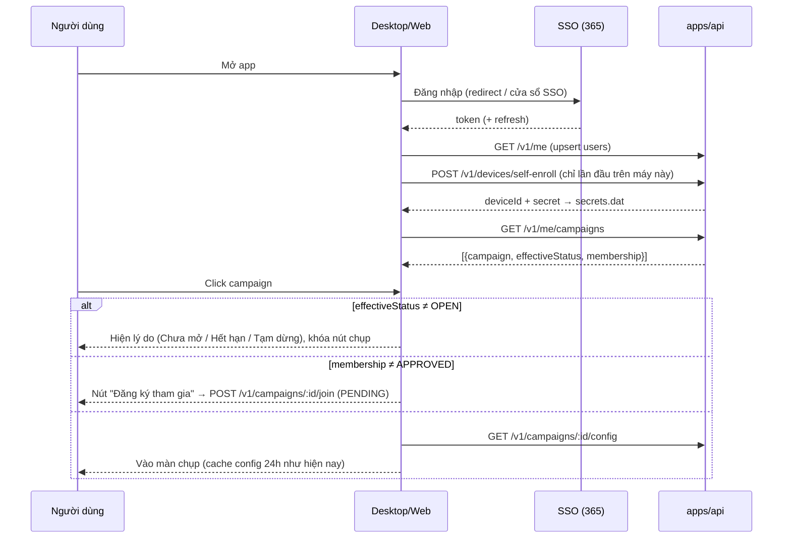

# Thảo luận thiết kế: Cấu hình campaign, đăng nhập SSO/365, ảnh thẻ 4x6 và AI local

> **Trạng thái:** BẢN THẢO để trao đổi — chưa phải implementation plan, chưa
> code. Ngày lập: 2026-09-08. Người đọc: product owner.
>
> Tài liệu này đối chiếu 9 yêu cầu mới (nêu ngày 2026-09-08) với code hiện
> tại của `Looka/` và các tài liệu cũ, đề xuất thiết kế, và liệt kê các câu
> hỏi phải chốt trước khi viết implementation plan. Cách trình bày theo mẫu
> của `multi-camera-device-management-discussion.md` (đã chốt / còn mở).
>
> Nguồn đối chiếu: `docs/ROADMAP.md` (mục 2, 3b–3h, cập nhật đến
> 2026-09-08), `docs/LOGIN.md`, code `apps/api`, `apps/cms`, `apps/desktop`,
> `apps/web`, `packages/core`, `packages/ui`; tài liệu cũ
> `D:\Work\camera_server\docs\DESIGN-photo-station.md`,
> `KE-HOACH-DU-AN.md` §21, và BRD `docs/BRD_QuyTrinh_LamAnhThe_SV_V1.docx`.

---

## 0. Tóm tắt

- **Yêu cầu 1, 3 đã có nền sẵn; yêu cầu 4 đổi chỗ.** Entity `Campaign` đã
  có `captureAngles` (2–5 khung, FRONT bắt buộc), `recordVideo`,
  `expiresAt`. Hai cờ `captureMode` (AUTO/MANUAL) và `simultaneousCapture`
  hiện đang nằm trên campaign, nhưng **product owner chốt 2026-09-08:
  campaign không xử lý phần này nữa — đẩy về app / bản tải trên desktop
  để người dùng chọn tại máy** (mục 3.9; cả hai cột sẽ rút khỏi
  campaign). Còn thiếu ở campaign: mã campaign, ngày bắt đầu, chỉ tiêu số
  lượng, trạng thái, khóa, chọn camera quay video, và **góc độ (yaw/pitch)
  không sửa được trên CMS** — CMS chỉ bật/tắt 5 góc cố định (sẽ thành
  danh mục góc động, mục 3.1.6).
- **Yêu cầu 2 và 6 là thay đổi kiến trúc lớn nhất.** Hệ thống hiện tại xây
  trên "đăng ký thiết bị theo campaign + gói kích hoạt zip" (ROADMAP §3.2,
  §3b, §3h — vừa làm xong tuần này). Yêu cầu mới đảo ngược: cài app một
  lần, người dùng đăng nhập tài khoản 365, chọn campaign, và cần được **phê
  duyệt** — khái niệm "người dùng" và "phê duyệt" **chưa tồn tại** trong
  `apps/api` (không có bảng user/role nào). **Đã chốt 2026-09-08 (2.1-A):**
  giữ `devices` nhưng để app **tự đăng ký ngầm**, bỏ hoàn toàn bước admin
  đăng ký + tải zip; mỗi máy tự thiết lập camera trong Camera Setup.
- **Đăng nhập:** CMS đã có SSO (`SsoAuthGuard` gọi `GET <SSO_BASE_URL>/auth/profile`,
  host thử nghiệm `test-login.dainam.edu.vn`). Nếu SSO đó chính là đăng
  nhập 365 của trường thì desktop/web **tái sử dụng được**, không cần tích
  hợp Azure/MSAL riêng. Cần chốt (câu hỏi Q1).
- **Yêu cầu 5, 7:** việc nhỏ. Thông tin SV đã có sau bước nhập mã (nhưng
  lookup vẫn là dữ liệu giả — API Admin system chưa có). **Cập nhật
  2026-09-08:** thông tin người được chụp ở góc **trái**, bên **phải** là
  danh sách đã chụp / đang chụp (3.8); danh sách này tái dùng bảng local
  `captured_students` và màn `RecentStudentsScreen` đang ẩn sau
  `Ctrl+Shift+S`. Ảnh thẻ 4x6: chưa có bất kỳ logic crop/in ấn nào trong
  code; tài liệu cũ đã định nghĩa `CardSpec` và bảng pixel, dùng lại được.
- **Màn hình mở rộng (CB Help):** giữ nguyên như hiện nay (lưới khung hình
  theo ROADMAP §3.5), nhưng phải **kiểm tra lại phần hiển thị ảnh khi đang
  chụp** — ROADMAP ghi rõ phần này chưa từng chạy trên màn hình thứ hai
  thật với ≥2 camera, và cơ chế chụp nhiều vòng (3.1.5) đổi cách lưới hiển
  thị. Checklist ở 3.8.3.
- **Yêu cầu 8:** khuyến nghị **BiRefNet** (tách nền, MIT) + **làm mịn
  deterministic bằng OpenCV có mask từ MediaPipe Face Mesh** (không dùng
  GFPGAN/CodeFormer vì làm biến dạng nhận dạng). Chạy trong sidecar Python
  `services/python-ai` đã có sẵn (hiện chưa ai gọi). Có thể cân nhắc
  HivisionIDPhotos làm bộ "tất cả trong một".
- **Yêu cầu 9 (thống kê chụp tự động / chụp tay):** engine đã tính được
  lý do kích hoạt (`AUTO_STABILITY_REACHED`, `MANUAL_GESTURE_*`,
  `SHUTTER_BUTTON_CLICKED`) nhưng **vứt đi trước khi phát sự kiện**; server
  không lưu. Việc nhỏ, độc lập, có thể làm sớm: thêm `triggerSource` vào
  sự kiện → cột `photos.trigger_source` + event `CAPTURE_TRIGGERED` → ô
  thống kê trên CMS.
- **Bổ sung 2026-09-08 (product owner): số ảnh là mục tiêu của campaign,
  không phụ thuộc số camera của thiết bị.** Ví dụ campaign đặt 10 ảnh,
  máy chỉ có 2 camera thì vẫn phải chụp đủ 10 ảnh (nhiều vòng). Code hiện
  tại **ngược lại**: tối đa 5 khung, và chế độ đồng thời **từ chối bắt đầu
  phiên** khi thiếu camera cho một khung (`FramesBlockedPanel`). Cần bộ
  quy đổi "N ảnh / K camera" ở kiosk — xem 3.1.5.
- **Cập nhật cuối ngày 2026-09-08 — phân vai đã chốt:** *campaign* chỉ
  quyết định **chụp cái gì** (N ảnh chọn từ **danh mục góc động** 3.1.6,
  góc độ đánh giá cho từng góc cam, camera ưu tiên, ảnh thẻ, quay video
  cam nào, chuẩn ảnh thẻ); *kiosk* quyết định **chụp bằng gì và như thế
  nào** (gán camera, **tuần tự hay đồng thời**, **tự động hay bấm nút**).
  `campaigns.capture_mode`, `auto_hold_ms`, `simultaneous_capture` — vừa
  thêm trong ROADMAP §3.8/§3.6b — **rút khỏi campaign**, chuyển về Camera
  Setup của kiosk (3.9). Q1–Q20 đã có câu trả lời; còn Q21 (xác nhận cách
  hiểu Q5/Q6) và Q22 (phạm vi danh mục góc) — **cả hai đã chốt cùng ngày
  theo đề xuất.** Tài liệu sẵn sàng chuyển thành implementation plan khi
  product owner ra lệnh.
- **Ghi hình (bổ sung cuối ngày):** product owner yêu cầu *chắc chắn ghi
  hình được khi chọn*. ROADMAP cho thấy phần này mới chỉ được kiểm bằng
  đọc code và từng hỏng ngoài thực tế (file 0 byte). Mục 3.10 đưa ra 5
  lớp bảo đảm (kiểm tra trước phiên, giám sát trong phiên, kiểm tra file
  khi kết thúc, chặn xác nhận khi thiếu video, không mở camera hai lần)
  và bộ test V1–V7 bắt buộc chạy trên kiosk thật trước khi bật ghi hình
  cho campaign thật.

---

## 1. Hiện trạng đối chiếu từng yêu cầu

| # | Yêu cầu | Đã có | Còn thiếu | Vị trí trong code |
|---|---|---|---|---|
| 1 | Bảng cấu hình campaign: số máy chụp, góc chụp, góc độ, quay video cam nào (chế độ chụp **không còn** ở campaign — về app, mục 3.9) | `captureAngles` jsonb (`CaptureStep[]`, 2–5 khung, FRONT bắt buộc, mỗi khung có `cameraRole`), `recordVideo` (bool); `simultaneousCapture`, `captureMode`/`autoHoldMs` đang có trên campaign nhưng sẽ rút | Số máy chụp chỉ suy ra ngầm; **góc độ yaw/pitch/tolerance không sửa được trên CMS** (chỉ toggle 5 góc, giá trị cứng trong `apps/cms/src/captureAngles.ts`); **tối đa 5 ảnh, không đặt được mục tiêu 10 ảnh**; chế độ đồng thời **chặn phiên khi thiếu camera** thay vì chụp nhiều vòng; quay video là bật/tắt toàn bộ, chưa chọn cam; chưa có khung nào đánh dấu "ảnh thẻ" | `apps/api/.../entities/campaign.entity.ts`, `capture-angles.validator.ts`, `apps/cms/src/components/CaptureFramesEditor.tsx`, `packages/core/src/types/workflow.ts`, `packages/ui/src/lib/multiFrame.ts` |
| 2 | Không đăng ký thiết bị; cài app 1 lần, đăng nhập rồi chọn campaign | — | **Ngược với mô hình hiện tại**: admin đăng ký device trong CMS → tải zip (`activation.json` + installer) → kiosk đọc file → xác thực bằng `x-device-id`/`x-device-secret`. Device gắn cứng 1 campaign (`devices.campaign_id` NOT NULL, cascade) | `DeviceController.registerDevice`, `activation-package.service.ts`, `apps/desktop/src/main/secrets.ts` (`device.*`), `activationFile.ts`, `DeviceCredentialsGuard` |
| 3 | Tạo campaign nhập: số lượng ảnh, số lượng cần chụp, thời gian chụp, hết hạn, trạng thái | `name`, `description`, `expiresAt`, `purpose`, `consentContent/Version` | Mã campaign, ngày bắt đầu, chỉ tiêu (`quota`), khóa (cohort), trạng thái (chưa mở/đang mở/hết hạn/đóng), số thực tế (có thể suy từ stats) | `campaign.entity.ts`, `CreateCampaignPage.tsx`, `EditCampaignPage.tsx` |
| 4 | Setting chụp: tự động hay ấn thủ công | Có ở **hai nơi**: cấp campaign (`captureMode` AUTO/MANUAL/OFF, `autoHoldMs`, ROADMAP §3.8 — campaign ghi đè kiosk) và control cục bộ trong `settingsStore.ts` (`captureMode`, `autoHoldMs`, `allowedGestures`) | **Đã chốt Q11: chỉ ở kiosk.** Rút `captureMode`/`autoHoldMs` khỏi campaign, kiosk là nguồn duy nhất; UI kiosk gọi "Tự động" / "Thủ công (bấm nút)". Lưu ý tên trong code: `MANUAL` = cử chỉ, `OFF` = bấm nút — "Thủ công" của product owner là `OFF` | ROADMAP §3.8, `DesktopCaptureView.tsx`, `settingsStore.ts`, `CaptureTriggerEvaluator.ts` |
| 5 | Thông tin người được chụp ở góc **trái** màn hình (cập nhật 2026-09-08, ban đầu ghi góc phải); bên **phải** danh sách đã chụp / đang chụp | `StudentIdEntryScreen` → `lookupStudent()` → `StudentSubjectInfo {subjectCode, subjectName, className, major, academicYear}` → `setSubject()`; hiện chỉ hiện chào 3 giây trên cửa sổ CB Help. Danh sách đã chụp: bảng local `captured_students` + `CapturedStudentRepository.listRecentStudents()` (§3f) nhưng chỉ hiện trong cửa sổ ẩn `RecentStudentsScreen` (`Ctrl+Shift+S`) | Badge cố định góc trên-trái màn hình chụp; panel phải nhúng thẳng vào màn chụp (không phải cửa sổ ẩn) kèm mục "đang chụp"; **lookup vẫn là dữ liệu giả** (`studentTestData.ts`), API `GET /v1/identify/lookup` bị chặn vì hệ Admin chưa công bố giao thức | `packages/ui/src/components/screens/FaceCaptureApp.tsx`, `studentLookup.ts`, `apps/desktop/src/renderer/RecentStudentsScreen.tsx` |
| 6 | Đăng nhập 365 trên app/desktop; liệt kê campaign; chặn khi hết hạn/chưa đến hạn; kiểm tra phê duyệt, chưa thì đăng ký | CMS đã có SSO (`apps/cms/src/auth/*`, `SsoAuthGuard`); chặn hết hạn 2 lớp cho **device** (`DeviceExpiryMiddleware`, cache 24h fail-closed) | Desktop/web **không có màn đăng nhập người dùng**; **không có bảng user, không có khái niệm phê duyệt/whitelist**; không có "ngày bắt đầu" nên chưa chặn "chưa đến hạn"; `apps/web` dùng API key chung, không đăng nhập | `sso-auth.guard.ts`, `api-key.middleware.ts`, `apps/web/src/App.tsx` |
| 7 | Một góc chụp dùng lấy ảnh 4x6 | Nhãn trên CMS đã ghi "FRONT — ảnh chính dùng để in" nhưng chỉ là chữ | Không có cờ `isCardSource`, không có `CardSpec`, không có crop/DPI/pixel, không có asset ảnh thẻ riêng | Tài liệu cũ `DESIGN-photo-station.md` §3.2(c) đã có `CardSpec {size, dpi, headHeightRatio, eyeLineRatio}` |
| 8 | AI local làm mịn + thay nền | `services/python-ai` (FastAPI, `/embed`, `/liveness`) tồn tại nhưng **không ai gọi**; embedding là mock | Toàn bộ pipeline tách nền / làm mịn | `services/python-ai` |
| 9 | Log thống kê lượng chụp tự động / chụp tay theo campaign | `CaptureTriggerEvaluator` trả `reason` (`AUTO_STABILITY_REACHED` / `MANUAL_GESTURE_<cử chỉ>` / `SHUTTER_BUTTON_CLICKED`); `device_events` + `SESSION_REPORT` + `GET /v1/campaigns/:id/stats` (đếm phiên, ảnh, retake, theo device/ngày) | `WorkflowEngine` phát `capture-trigger` chỉ với `{stepId, imagePath}` — **mất `reason`**; ảnh chụp đồng thời (`recordExternalCapture`) không có nguồn kích hoạt; `photos` không có cột trigger; stats không tách auto/tay | `packages/workflow-engine/src/WorkflowEngine.ts` L284, L528; `photo.entity.ts`; `campaign-stats.dao.ts` |

**Lưu ý về trạng thái code hiện tại (ROADMAP §3e, §3f):** upload video và
gallery "sinh viên đã chụp" mới làm xong 2026-09-08, **chưa test tay
end-to-end**. Mọi thay đổi dưới đây sẽ chồng lên phần đó, nên khuyến nghị
hoàn tất lượt test đó trước khi bắt đầu giai đoạn 1.

---

## 2. Bốn quyết định lớn cần chốt trước

### 2.1. Bỏ đăng ký thiết bị: giữ `devices` ngầm hay bỏ hẳn? (YC 2) — ĐÃ CHỐT 2026-09-08: phương án A

Toàn bộ thống kê, danh sách phiên, khóa fs-core theo kiosk, thu hồi
credential… đều đang khóa vào `device_id`:

- `sessions.device_id`, `device_events.device_id`, `photos` → per-device
  fs-core tenant key (`getFileServiceCredentials()` key theo `device.id`).
- `POST /v1/devices/events` (đẩy stats + `SESSION_REPORT`) xác thực bằng
  device secret.
- CMS: `DevicesPanel`, `SessionsPanel` lọc theo device, stats `byDevice[]`.

| Phương án | Mô tả | Ưu | Nhược |
|---|---|---|---|
| **A. Thiết bị tự đăng ký ngầm (khuyến nghị)** | Bỏ bước admin đăng ký + zip. Lần đầu người dùng đăng nhập trên máy, app gọi `POST /v1/devices/self-enroll` (bằng token người dùng) → server tạo hàng `devices` (tên = hostname, fingerprint máy, `enrolled_by_user_id`), trả `deviceId + secret` → lưu `secrets.dat` như hiện nay. `devices.campaign_id` thành **nullable** (campaign chọn lúc đăng nhập, ghi vào `sessions.campaign_id` như đã có) | Giữ nguyên toàn bộ backbone stats/phiên/fs-core/revoke (§3h); thay đổi backend nhỏ; installer thành 1 bản dùng chung | Vẫn còn bảng `devices` admin nhìn thấy (chỉ để xem/thu hồi, không đăng ký) |
| B. Bỏ hẳn `devices`, mọi thứ theo user token | Mọi API kiosk gọi bằng token SSO của người đang đăng nhập | Mô hình "sạch" | Phải viết lại stats/session attribution theo user, mất thu hồi theo máy, mất khóa fs-core theo kiosk, `SsoAuthGuard` gọi SSO mỗi request (stats đẩy 15 giây/lần sẽ dội SSO); mất khả năng chạy offline 24h |

**Khuyến nghị A.** Người dùng không còn thấy khái niệm "đăng ký thiết bị";
CMS giữ tab thiết bị ở dạng **chỉ xem + thu hồi**, bỏ nút đăng ký và tải
gói kích hoạt. Công việc §3b/§3h vừa làm (xoay secret có overlap, revoke)
vẫn dùng được nguyên.

### 2.2. "Tài khoản 365" là SSO hiện có hay Entra ID trực tiếp? (YC 6) — ĐÃ CHỐT 2026-09-08: phương án A

| Phương án | Cách làm | Việc phải làm |
|---|---|---|
| **A. Tái dùng SSO đã tích hợp cho CMS (khuyến nghị nếu SSO đó đăng nhập bằng 365)** | **Cơ chế (sửa sau rà soát code 2026-09-08):** SSO trả token dưới dạng **query string trên một `continueUrl` https** (`LOGIN.md` §3.3: `?access_token=…&refresh_token=…&email=…&user_code=…`), và `continueUrl` phải là URL tuyệt đối mà SSO chấp nhận (`apps/cms/src/auth/env.ts` ghi nhận SSO crash khi nhận path tương đối). Vì vậy **không dùng custom protocol `looka://` hay loopback**. Desktop mở một `BrowserWindow` tới `VITE_URL_LOGIN_SSO?continueUrl=https://<origin CMS>/desktop-callback`, bắt sự kiện `will-redirect`/`did-navigate` của cửa sổ đó, đọc token khỏi query string rồi đóng cửa sổ — trang `/desktop-callback` trên CMS chỉ cần là trang trắng "Đang quay lại ứng dụng…". Sau đó gọi API với `Authorization` như CMS. `SsoAuthGuard` đã validate được | Desktop: màn login + cửa sổ SSO + bắt redirect + lưu token vào `secrets.dat` (đã dùng Electron `safeStorage`/DPAPI, đủ an toàn) + refresh (`POST /auth/refresh-token` có sẵn). Web: y hệt CMS (redirect). Backend: `SsoAuthGuard` hiện **chỉ trả true/false, không gắn `req.user`, không cache, không role** → phải sửa để gắn profile vào request và cache 60 giây; thêm `AdminRoleGuard` (xem §3.2.3). **Cần xác nhận với đơn vị quản trị SSO** rằng origin CMS được phép làm `continueUrl` cho desktop (rủi ro số 1 của toàn kế hoạch) |
| B. Entra ID (Azure AD) trực tiếp bằng MSAL | `@azure/msal-node` trong Electron (PKCE + loopback), backend verify JWT bằng JWKS của tenant | Cần **app registration** trong tenant 365 của trường (client id, tenant id, redirect URI) — phụ thuộc IT trường; thêm một hệ auth thứ hai song song với SSO của CMS |

**Khuyến nghị A**, với điều kiện xác nhận SSO `dainam.edu.vn` đăng nhập
bằng tài khoản 365 (Q1). Nếu SSO này không phải 365 thì đi B, và khi đó
nên chuyển CMS sang B luôn để không có hai hệ đăng nhập.

### 2.3. Phê duyệt tài khoản: theo từng campaign hay toàn cục? (YC 6) — ĐÃ CHỐT 2026-09-08: theo campaign, CTSV duyệt tay

Yêu cầu nói "click vào campaign → check tài khoản đã được phê duyệt chưa,
chưa thì đăng ký", tức phê duyệt **gắn với campaign**. Đề xuất:

- Bảng `users` (upsert từ profile SSO khi đăng nhập: `sso_user_code`,
  `email`, `display_name`, `last_login_at`).
- Bảng `campaign_members` (`campaign_id`, `user_id`, `status`
  `PENDING | APPROVED | REJECTED | REVOKED`, `requested_at`, `decided_at`,
  `decided_by`, `note`; unique `(campaign_id, user_id)`).
- CMS: panel "Cán bộ chụp" trong trang campaign, hàng chờ duyệt.
- Tùy chọn giảm tải: **tự động duyệt** theo domain email hoặc theo
  `staff_info.staff_assignments[].role_code` mà SSO trả về (CMS đã đọc
  trường này). Cần chốt Q2/Q3.

### 2.4. AI chạy ở đâu và phần cứng nào? (YC 8) — ĐÃ CHỐT 2026-09-08: server on-prem, sau upload

| Nơi chạy | Ưu | Nhược |
|---|---|---|
| **Trên server on-prem (worker sau khi upload, khuyến nghị giai đoạn đầu)** | Một máy có GPU phục vụ mọi kiosk; kiosk yếu vẫn chạy; kết quả ảnh thẻ không cần ngay lúc chụp; dễ chạy lại hàng loạt khi đổi tham số/thuật toán | Không xem trước ảnh thẻ tại kiosk; cần thêm 1 job/worker trong `apps/api` hoặc `apps/worker` mới |
| Trên từng kiosk (sidecar Python đóng gói cùng Electron) | Xem trước ngay; offline | Phải đóng gói Python + model (~1 GB) vào installer; CPU-only mất 3–8 giây/ảnh; mỗi máy một phiên bản model |

Khuyến nghị: **server-side trước**, thêm preview nhẹ ở kiosk (MODNet hoặc
MediaPipe segmenter, chỉ để xem, không phải ảnh cuối) ở bước sau nếu cần.
Cần biết máy chủ có GPU không (Q8).

---

## 3. Thiết kế đề xuất theo từng yêu cầu

### 3.1. Bảng cấu hình campaign (YC 1 + 3 + 4 + 7)

#### 3.1.1. Trường mới trên `campaigns`

| Trường | Kiểu | Có sẵn? | Ghi chú |
|---|---|---|---|
| `code` | varchar(10) unique | ❌ | Mã campaign, ví dụ `2026DOT01` (theo BRD §III.2.4.2) |
| `name`, `description` | | ✅ | |
| `cohort` | varchar | ❌ | Khóa (K20…) — BRD có, không bắt buộc |
| `starts_at` | timestamptz | ❌ | "Thời gian chụp" — bắt đầu cửa sổ chụp |
| `expires_at` | timestamptz | ✅ | "Thời gian hết hạn chụp" |
| `quota_planned` | int nullable | ❌ | "Số lượng cần chụp" = số SV dự kiến. NULL = không giới hạn |
| `manual_status` | enum nullable `PAUSED \| CLOSED` | ❌ | Ghi đè thủ công; trạng thái hiệu lực **suy ra** (xem 3.1.2) |
| `capture_angles` | jsonb `CaptureStep[]` | ✅ | Mở rộng: mỗi bước có `pose.yaw/pitch.target/tolerance` sửa được + cờ `isCardSource` (3.1.3) |
| ~~`capture_mode`, `auto_hold_ms`~~ | | ✅ → **rút** | **Q11 đã chốt: chuyển về kiosk** (3.9). Migration đặt NULL + bỏ khỏi DTO/CMS/`GET .../config`; cột giữ tạm 1 phiên bản rồi drop |
| ~~`simultaneous_capture`~~ | bool | ✅ → **rút** | **Đã chốt: tuần tự / đồng thời chọn tại Camera Setup của kiosk** (3.9), không ở campaign. Validator "mỗi dòng một camera phân biệt" bỏ theo |
| `record_video` | bool | ✅ | Giữ làm công tắc tổng |
| `record_video_roles` | jsonb `CameraRole[]` nullable | ❌ | NULL = tất cả cam; hoặc danh sách `CENTER/LEFT/RIGHT/UP/DOWN` |
| `card_spec` | jsonb | ❌ | `{ size: '4x6', dpi: 300, backgroundColor: '#FFFFFF', headHeightRatio: [0.70,0.80], eyeLineRatio: [0.40,0.45], retouch: { enabled: true, strength: 'LIGHT' } }` |
| `purpose`, `consent_*` | | ✅ | Giữ nguyên |

"**Số máy chụp**" không lưu riêng và không còn là thuộc tính campaign:
CMS chỉ hiển thị dạng chỉ đọc "**cần tối đa K camera**" = số `cameraRole`
phân biệt trong `capture_angles` (số camera để chụp hết trong ít vòng
nhất). Máy thực tế có bao nhiêu camera và chụp tuần tự hay đồng thời là
cài đặt của kiosk (3.9); thiếu camera thì kiosk tự chia thêm vòng (3.1.5).

"**Số lượng ảnh**" (mỗi SV) — **đã chốt 2026-09-08**: là **mục tiêu của
campaign**, = số dòng trong `capture_angles` (ví dụ 10), **không phụ thuộc
số camera của thiết bị**. Thiết bị có 2 camera vẫn phải chụp đủ 10 ảnh
bằng nhiều vòng (3.1.5). Giới hạn 2–5 hiện tại (`MIN_STEPS`/`MAX` trong
`capture-angles.validator.ts`, `MIN_FRAMES` trong `CaptureFramesEditor`)
nâng lên 2–20. Ảnh thẻ 4x6 là ảnh dẫn xuất từ dòng `isCardSource`, không
tính vào con số này.

"**Số lượng thực tế**": không lưu, tính từ `sessions` đã approve
(đã có trong `GET /v1/campaigns/:id/stats`).

#### 3.1.2. Trạng thái campaign (suy ra, không nhập tay)

```
effectiveStatus =
  manual_status nếu có (PAUSED / CLOSED)
  else nếu now < starts_at            → UPCOMING  ("Chưa mở")
  else nếu starts_at ≤ now < expires_at → OPEN    ("Đang mở")
  else                                → EXPIRED   ("Hết hạn")
quotaReached = quota_planned != null && approvedSessions ≥ quota_planned
```

Chỉ `OPEN` (và không `quotaReached`, nếu chọn chặn — Q6) mới cho phép hành
động chụp. `expires_at = NULL` (vĩnh viễn) giữ nguyên nghĩa hiện tại.

#### 3.1.3. Bảng cấu hình góc chụp trên CMS (thay `CaptureFramesEditor`)

Hiện CMS chỉ toggle 5 góc, giá trị pose copy cứng từ `defaultWorkflow`
(FRONT yaw 0±12, LEFT yaw −22.5±7.5, RIGHT +22.5±7.5, UP pitch +25±10, DOWN
−25±10). Đề xuất một bảng **tự do, N dòng** (thêm/xóa/sắp xếp), mỗi dòng
một ảnh mục tiêu — đây là lựa chọn "free-form" của câu hỏi #13 trong
`multi-camera-device-management-discussion.md`, giờ bắt buộc vì mục tiêu
10 ảnh không diễn đạt được bằng 5 nút bật/tắt:

| Cột | Ý nghĩa | Ràng buộc |
|---|---|---|
| Thứ tự | vị trí trong chuỗi chụp | kéo thả |
| Góc chụp | chọn từ **danh mục góc động** (3.1.6): Thẳng, Trái, Phải, Trên, Dưới và góc tự tạo | được lặp một góc với độ khác nhau (ví dụ Trái 15°, Trái 30°); đúng 1 dòng làm ảnh thẻ |
| Camera ưu tiên | `cameraRole` CENTER/LEFT/RIGHT/UP/DOWN | **chỉ là ưu tiên** — thiết bị không có camera đó thì tự quy đổi (3.1.5), không chặn phiên |
| Góc ngang (yaw) | target ± tolerance, độ | ví dụ 0±12; khi có cam bên thì đặt 0 để SV không phải quay đầu (ROADMAP mục "Known gap" đã nêu) |
| Góc dọc (pitch) | target ± tolerance | |
| Hướng dẫn | text hiện cho SV | |
| **Ảnh thẻ** | radio `isCardSource` | **đúng 1** khung; mặc định FRONT; khung này bắt buộc `capture.enabled` |
| Quay video | checkbox theo camera | sinh `record_video_roles` |

Validator `capture-angles.validator.ts` thêm: đúng một `isCardSource`,
yaw/pitch trong khoảng hợp lệ (−90..90), tolerance > 0; **bỏ** ràng buộc
"mỗi dòng một camera phân biệt khi đồng thời" (chuyển thành cảnh báo
"cần K camera để chụp trong 1 vòng", vì thiết bị quy đổi được).

#### 3.1.4. API ảnh hưởng

- `POST/PATCH /v1/campaigns` DTO thêm các trường trên; `CampaignDao` trả
  thêm `effectiveStatus`, `quotaReached`, `requiredCameraCount`.
- Cấu hình cho kiosk: hiện `GET /v1/devices/config` (device secret) trả
  `CampaignDao` của campaign gắn với device. Vì device không còn gắn
  campaign → thêm `GET /v1/campaigns/:id/config` (token người dùng, yêu cầu
  membership APPROVED và status OPEN) trả **cùng DAO** (đã bỏ
  `captureMode`/`autoHoldMs`/`simultaneousCapture`). **Q12 đã chốt: không
  có giai đoạn chuyển tiếp** — `GET /v1/devices/config` gỡ cùng lúc, kiosk
  cũ cài lại bản mới.

#### 3.1.5. Quy tắc phủ N ảnh bằng K camera của thiết bị (bổ sung 2026-09-08)

**Nguyên tắc:** campaign quyết định *chụp cái gì* (N dòng ảnh mục tiêu);
thiết bị quyết định *chụp bằng gì* (Camera Setup gán camera vật lý cho
CENTER/LEFT/RIGHT/UP/DOWN, đã có). Phiên **chỉ bị chặn khi không có camera
nào**; mọi trường hợp khác kiosk tự lập "kế hoạch chụp" gồm nhiều vòng.

**Bộ quy đổi** (`packages/ui/src/lib/multiFrame.ts`, thay
`checkFramesReadiness` từ "chặn" thành "lập kế hoạch"):

1. Với mỗi dòng ảnh, nếu camera ưu tiên có gán → chụp bằng camera đó; nếu
   không → **fallback về CENTER** (hoặc camera duy nhất nếu chỉ có 1) và SV
   phải quay đầu theo góc của dòng đó.
2. **Góc gate** (góc mà pipeline CV kiểm tra trên camera CENTER — camera
   được phân tích): `gateYaw = step.yaw − cameraYaw`, trong đó `cameraYaw`
   là góc đặt vật lý của camera chụp (CENTER 0°, LEFT/RIGHT mặc định ∓30°,
   UP/DOWN theo pitch; cho sửa trong Camera Setup). Ví dụ dòng "LEFT 30°":
   có camera LEFT → SV nhìn thẳng (gate 0°); không có → SV quay 30°. Đây
   cũng là cách khép "known gap" trong ROADMAP (LEFT/RIGHT ±22.5° còn
   tinh cho quay đầu dù đã có camera bên).
3. **Chia vòng theo chế độ kiosk chọn (3.9):** *Đồng thời* — gom các dòng
   thành vòng sao cho trong một vòng mỗi camera chỉ chụp 1 ảnh và mọi dòng
   trong vòng có cùng góc gate (SV giữ một tư thế, K camera chụp cùng lúc).
   *Tuần tự* — mỗi dòng một bước, lần lượt, camera nào được gán cho dòng
   đó thì dùng, không thì CENTER + quay đầu; K camera vẫn được dùng nhưng
   không bấm cùng lúc. Chế độ này là **cài đặt của kiosk**, không phải cờ
   campaign (`simultaneous_capture` rút bỏ).
4. Chạy tuần tự các vòng: mỗi vòng dùng cơ chế hiện có (CENTER chụp theo
   gate → `recordExternalCapture` cho các camera còn lại — ROADMAP §3.6b).
   `WorkflowEngine` không đổi logic; chỉ nhận danh sách bước đã sắp theo
   vòng kèm `cameraRole` hiệu lực và gate đã quy đổi.
5. Hoàn tất phiên khi **đủ N ảnh** (engine đã theo dõi từng bước COMPLETED,
   `advanceToNextStep` bỏ qua bước đã xong). Tiến độ "N/M đã chụp" đã có.

**Ví dụ 10 ảnh, 2 camera (CENTER + LEFT):**

| Vòng | Tư thế SV (gate trên CENTER) | CENTER chụp | LEFT chụp |
|---|---|---|---|
| 1 | nhìn thẳng | FRONT (ảnh thẻ) | LEFT 30° |
| 2 | quay phải 30° | RIGHT 30° | — (dòng LEFT 60° không có, bỏ qua) |
| 3 | quay trái 15° | LEFT 15° | LEFT 45° |
| 4 | ngẩng 25° | UP | UP-LEFT (CUSTOM) |
| 5 | cúi 25° | DOWN | DOWN-LEFT (CUSTOM) |
| 6 | quay phải 15° | RIGHT 15° | — |

Cùng campaign trên máy 5 camera: 2–3 vòng; máy 1 camera: 10 bước tuần tự
quay đầu — **cùng 10 ảnh**, chỉ khác số vòng. Kế hoạch vòng được ghi vào
`SESSION_REPORT` (`rounds`, `cameraCount`) để CMS so sánh thiết bị.

**Điểm phải chốt:** bộ góc 10 ảnh chuẩn của trường là gì (Q17); khi
fallback về CENTER có chấp nhận ảnh nghiêng do quay đầu cho mục đích
FaceID không, hay ảnh góc chỉ có giá trị khi chụp bằng camera bên (Q18).

#### 3.1.6. Danh mục góc chụp động (bổ sung cuối ngày 2026-09-08)

Product owner: các góc trên/dưới/trái/phải phải **quản lý động**, tạo
thêm được góc mới để chọn; khi tạo config thì chọn góc và **chọn góc độ
để máy đánh giá** cho từng góc cam. Hiện 5 góc là hằng số cứng
(`CAPTURE_STEP_DEFS` trong `apps/cms/src/captureAngles.ts`, `StepType`
trong `packages/core`).

- **Bảng mới `capture_angle_presets`** (toàn hệ thống, CMS quản lý):
  `code` (unique: `FRONT`, `LEFT_15`, `LEFT_30`, `RIGHT_30`, `UP`, `DOWN`,
  `SMILE`, …), `label_vi`, `instruction_vi`, `pose_default`
  (`yaw/pitch/roll {target, tolerance}`), `preferred_camera_role`
  (CENTER/LEFT/RIGHT/UP/DOWN), `is_system` (5 góc gốc: sửa được, không
  xóa), `active`, `sort_order`. Seed từ giá trị hiện tại của
  `CAPTURE_STEP_DEFS` + mẫu 10 ảnh (Q17).
- **Dòng trong campaign** (`capture_angles[]`): `angleCode` + **snapshot**
  pose/cameraRole/instruction tại lúc lưu — sửa danh mục sau không làm
  đổi campaign đang chạy (nhất quán với "config áp dụng ở phiên kế tiếp").
  Khi thêm dòng: chọn góc từ danh mục → form điền sẵn pose mặc định →
  **bắt buộc xác nhận hoặc sửa góc độ đánh giá** (target ± tolerance) cho
  camera ưu tiên của dòng đó; đổi camera thì gate quy đổi theo 3.1.5.
- **Core:** `CaptureStep` thêm `angleCode`; `StepType` giữ 5 loại gốc +
  `CUSTOM` cho góc mới (engine không phân biệt — chỉ dùng `pose`);
  `cameraRoleForStep()` bỏ suy luận từ `type`, đọc `cameraRole` trực tiếp.
  Nhãn hiển thị (kiosk, CB Help, CMS) lấy từ `label_vi` của preset thay
  vì `STEP_LABELS` cứng.
- **CMS:** trang mới "Góc chụp" (danh sách, thêm/sửa/vô hiệu, xem trước
  hướng dẫn + góc); trong form campaign nút "Thêm góc" mở picker từ danh
  mục; mẫu "5 ảnh"/"10 ảnh" là tập hợp preset được đặt tên.
- **Ràng buộc:** không xóa/vô hiệu preset đang nằm trong campaign OPEN
  (chỉ cảnh báo); `code` không đổi sau khi tạo; vị trí camera vật lý
  (5 vai trò) vẫn cố định — chỉ góc chụp là động (Q22).

### 3.2. Đăng nhập, danh sách campaign, chặn theo hạn và phê duyệt (YC 6)

#### 3.2.1. Luồng trên desktop / web



#### 3.2.2. Endpoint mới (token người dùng, qua `SsoAuthGuard`)

| Endpoint | Mục đích |
|---|---|
| `GET /v1/me` | Profile + upsert `users` |
| `GET /v1/me/campaigns` | Mọi campaign chưa `CLOSED` kèm `effectiveStatus` và `membership.status` (NONE/PENDING/APPROVED/REJECTED/REVOKED) |
| `POST /v1/campaigns/:id/join` | Tạo `campaign_members` PENDING (idempotent) |
| `GET /v1/campaigns/:id/config` | Cấu hình chụp; 403 nếu chưa APPROVED, 409 nếu không OPEN |
| `POST /v1/devices/self-enroll` | Tạo device cho máy này (3.3) |

Endpoint admin (CMS): `GET /v1/campaigns/:id/members`,
`PATCH /v1/campaigns/:id/members/:userId` (`approve | reject | revoke`).

#### 3.2.3. Phân quyền admin vs người vận hành

Hiện `SsoAuthGuard` cho **bất kỳ** user SSO nào vào toàn bộ route admin
(`LOGIN.md` §10.2 đã bỏ chặn theo `staff_info`). Khi người vận hành kiosk
cũng đăng nhập bằng SSO, phải tách:

- `SsoAuthGuard` (đã có) → chỉ xác thực danh tính. **Phải sửa:** hiện gọi
  `GET /auth/profile` mỗi request và chỉ trả true/false (`sso-auth.guard.ts`
  L43–92), không gắn gì vào `req`. Sửa để gắn `req.user = { userCode,
  email, staffInfo }`, cache theo token 60 giây, và upsert `users`.
- `AdminRoleGuard` (mới) → route CMS/admin; nguồn role: `staff_info.
  staff_assignments[].role_code` từ SSO **hoặc** cột `users.is_admin`.
  **Bootstrap admin đầu tiên:** biến môi trường `ADMIN_EMAILS` (danh sách
  email được coi là admin khi bảng `users` chưa có ai `is_admin`) — nếu
  không có cơ chế này thì không ai vào được CMS để gán admin cho người
  khác.
- `CampaignMemberGuard` (mới) → route config/phiên theo campaign.
- **Ghi nhận cán bộ chụp trên phiên:** hiện `sessions` không có cột người
  vận hành và `SessionReportPayload` (`apps/desktop/src/main/uploads.ts`
  L327–348) cũng không mang. Thêm `sessions.operator_user_id` (migration),
  trường `operatorUserCode` trong payload báo cáo kiosk và trong DTO
  `POST /v1/sessions` của web, ghi ở `CaptureReportService.
  applySessionReport()`. Không có cột này thì thống kê "ai chụp bao nhiêu"
  và audit đều không làm được.
- **`apps/web`:** hiện không có bất kỳ mã SSO nào; toàn bộ đường chụp
  (`POST /v1/sessions`, `/photos`, `/complete`) chỉ qua `ApiKeyMiddleware`.
  Cùng luồng SSO (Q14) nghĩa là: thêm lớp auth client như CMS, gửi
  `Authorization` thay `x-api-key` trong `HttpCaptureSink`, và đặt
  `ApiKeyOrSsoGuard` + `CampaignMemberGuard` lên các route ghi của
  `SessionController`. Đây là bề mặt auth mới, không phải đổi cấu hình.

#### 3.2.4. Chặn hết hạn / chưa đến hạn — ba lớp (client, server, offline)

- **Client:** nút chụp, cử chỉ, AUTO đều vô hiệu khi `effectiveStatus ≠ OPEN`
  hoặc membership ≠ APPROVED; màn hình hiện rõ lý do (tái dùng pattern
  `FramesBlockedPanel`/full-screen block đã có trong `FaceCaptureApp.tsx`).
- **Server:** `POST /v1/sessions` (web) và `SESSION_REPORT` qua
  `POST /v1/devices/events` (kiosk) kiểm tra `starts_at`/`expires_at`/
  `manual_status` của `sessions.campaign_id`; mở rộng
  `DeviceExpiryMiddleware` thành kiểm tra cửa sổ campaign (thêm `starts_at`).
- **Offline:** giữ cơ chế cache 24h fail-closed (`device.lastVerified`) —
  cache thêm `membership` và `effectiveStatus` tại thời điểm xác nhận, hết
  hạn cache thì chặn.
- **Giờ máy chủ, không tin giờ kiosk:** cửa sổ 24h hiện tính bằng
  `Date.now()` của kiosk (`deviceApi.ts` L206/253) và API không trả giờ
  máy chủ ở đâu cả. Với `starts_at`/`expires_at` mới, một kiosk lệch giờ
  sẽ mở/khóa sai. Mọi response `GET /v1/me/campaigns` và
  `GET /v1/campaigns/:id/config` trả thêm `serverTime`; kiosk lưu
  `offset = serverTime − Date.now()` và dùng offset đó cho cả cửa sổ 24h
  lẫn hiển thị "mở ngày…". Trạng thái hiệu lực vẫn do server tính.

#### 3.2.5. `apps/web`

Hiện không đăng nhập, dùng `window.LOOKA_API_KEY` chung (ROADMAP §3f ghi
đây là quyết định chấp nhận). Nếu YC 6 áp dụng cho web (Q14) thì web đi
đúng luồng CMS: redirect SSO, token trong `localStorage`, bỏ API key khỏi
bundle; `ApiKeyMiddleware` chỉ còn cho các client máy-với-máy.

### 3.3. Thiết bị tự đăng ký ngầm (YC 2)

- **Installer:** một bản build chung (`Looka-<ver>-win-x64.exe`), không
  còn `activation.json`. Bỏ hẳn `findAndImportActivationFileIfPresent`,
  `activationFile.ts`, `ActivationPackageService`, endpoint
  `POST /v1/campaigns/:id/devices`, `POST /v1/devices/:id/reissue`,
  biến môi trường `DESKTOP_INSTALLER_PATH_*`. **Q12 đã chốt 2026-09-08:
  không giữ song song** — kiosk tải bản mới về cài, không đăng ký như hiện
  tại; các máy đã cài bằng zip cũ cài đè bản mới và đăng nhập lại.
- **Giữ:** `devices` entity, `DeviceCredentialsGuard`, `/v1/devices/events`,
  revoke (§3h), xoay secret có overlap. **Gỡ** `/v1/devices/config` cùng
  lúc (Q12: không có giai đoạn chuyển tiếp) — cấu hình chụp đi qua
  `GET /v1/campaigns/:id/config` bằng token người dùng.
- **`secrets.dat`:** giữ `device.id/secret/apiBaseUrl/lastVerified`; **bỏ**
  `device.campaignId` (campaign chọn mỗi lần đăng nhập, lưu
  `session.activeCampaignId` trong state app, có thể nhớ lựa chọn gần nhất);
  thêm `auth.accessToken/refreshToken/userCode`.
- **`devices` schema:** `campaign_id` nullable; thêm `hostname`,
  `fingerprint` (hash của machine id + OS), `enrolled_by_user_id`,
  `last_user_id`. `apiBaseUrl` lấy từ cấu hình build (env lúc đóng gói)
  thay vì từ `activation.json` — đây cũng là câu trả lời cho lỗ hổng "để
  trống API endpoint → khóa sau 24h" còn mở trong ROADMAP.
- **CMS `DevicesPanel`:** bỏ form đăng ký, bỏ "Tải gói kích hoạt"/"Tạo lại
  gói"; giữ danh sách (tên máy, người đăng nhập gần nhất, `lastAuthAt`,
  trạng thái), "Xem ảnh đã chụp", "Thu hồi".

### 3.4. Hiển thị thông tin người được chụp (YC 5) — cập nhật 2026-09-08: góc TRÁI

- Thêm `SubjectInfoBadge` cố định góc **trên-trái** màn hình chụp
  (`DesktopCaptureView.tsx`), hiện: mã SV, họ tên, lớp, ngành, khóa, và
  trạng thái phiên (đang chụp N/M ảnh, vòng k/K). Nguồn dữ liệu đã có:
  `StudentSubjectInfo` sau `handleStudentSubmit()`. Ẩn khi chưa nhập mã.
- Bên **phải** màn hình: panel "Đã chụp / Đang chụp" — chi tiết bố cục ở
  3.8.2.
- Cùng thông tin đẩy sang cửa sổ CB Help (đã có `publishCbHelpState`,
  chỉ thêm trường `subject`).
- **Giới hạn:** dữ liệu vẫn từ `studentTestData.ts` cho đến khi có API tra
  cứu thật (ROADMAP §2.3, bị chặn bởi hệ Admin). Badge sẽ chạy đúng ngay
  khi API thật được nối vào `lookupStudent()`, không phải sửa UI.

### 3.5. Góc chụp dùng lấy ảnh thẻ 4x6 (YC 7)

- **Cấu hình:** cờ `isCardSource` trên đúng một `CaptureStep` (3.1.3), mặc
  định FRONT/CENTER; `card_spec` trên campaign.
- **Chuẩn pixel** (từ `KE-HOACH-DU-AN.md` §21, đơn vị cm):

| Cỡ | 300 dpi | 600 dpi |
|---|---|---|
| 3×4 cm | 354 × 472 px | 709 × 945 px |
| 4×6 cm | 472 × 709 px | 945 × 1417 px |

- **Quy tắc crop** (từ `DESIGN-photo-station.md`): dùng landmark khuôn mặt
  (đã có MediaPipe trong `packages/cv-mediapipe`) → xoay thẳng theo đường
  mắt → cắt sao cho chiều cao đầu chiếm 70–80% ảnh, đường mắt ở 40–45% từ
  trên xuống → resize về pixel theo `dpi` → JPEG q95.
- **Đầu ra:** mỗi phiên approve sinh thêm một asset `CARD_PHOTO` (đề xuất
  `photos.variant = ORIGINAL | CARD` + `derived_from_photo_id`, hoặc bảng
  `session_assets`), upload lên fs-core cùng tenant, kèm `algorithm_version`
  trong metadata/tên file. **Ảnh gốc không bao giờ bị sửa** — là ảnh tham
  chiếu cho nhận dạng (nguyên tắc đã chốt trong tài liệu cũ).
- **CMS:** `SessionDetailDrawer` hiện thêm ảnh thẻ cạnh ảnh gốc, nút "Xử lý
  lại" (gọi lại pipeline với tham số mới).
- Chỉ tiêu ảnh: BRD §IV.3 ghi "chưa chốt", nay **đã chốt qua Q7
  (2026-09-08): 4×6 cm, 300 dpi, nền trắng `#FFFFFF`**; tỉ lệ đầu/đường
  mắt giữ mặc định của `DESIGN-photo-station.md` cho tới khi trường có
  quy định khác. Các kiểm tra chất lượng ảnh thẻ (kích thước mặt, mắt mở,
  biểu cảm trung tính, độ nét, tư thế, vai) đã có ở
  `docs/card-photo-quality-checks.md` và phần lớn **đã cài** trong
  `packages/face-quality` — pipeline ảnh thẻ dùng lại, chỉ thiếu phát
  hiện che mặt/lóa kính (§8 của tài liệu đó).

### 3.6. AI local làm mịn và thay nền (YC 8)

#### 3.6.1. Kết luận khảo sát (tháng 9/2026)

| Nhu cầu | Khuyến nghị 1 | Khuyến nghị 2 | Không dùng |
|---|---|---|---|
| Tách nền / thay nền | **BiRefNet** — MIT, chất lượng tóc tốt nhất trong nhóm mở; gọi qua `rembg` (model `birefnet-general`) hoặc ONNX | **BEN2** — MIT, nhẹ hơn, tốt ở viền tóc | **RMBG-2.0** (BRIA): đẹp nhưng **không cho thương mại** nếu chưa mua; **MediaPipe Selfie Segmentation**: nhanh nhưng viền tóc xấu (chỉ để preview); **RVM**: GPL |
| Làm mịn da | **Deterministic OpenCV**: mask da từ MediaPipe Face Mesh (loại mắt, lông mày, môi, mũi) → guided/bilateral filter + tách tần số (frequency separation), cường độ cấu hình | Như trên nhưng mask từ model phân đoạn da | **GFPGAN / CodeFormer**: sinh chi tiết không có thật, làm trôi nhận dạng — nguy hiểm cho ảnh thẻ + FaceID; CodeFormer còn cấm thương mại; **Stable Diffusion inpainting**: không xác định, đổi nhận dạng |
| Tất cả trong một | **HivisionIDPhotos** (GitHub `Zeyi-Lin/HivisionIDPhotos`): tách nền + nền màu + cắt cỡ chuẩn + "beauty" nhẹ không GAN + **HTTP API sẵn** | — | Mặc định nó dùng RMBG-1.4 (BRIA, non-commercial) → phải đổi backend sang BiRefNet/MODNet; kiểm tra LICENSE của wrapper trước khi dùng |

Nguyên tắc (trùng với `KE-HOACH-DU-AN.md` §21): **tuyệt đối không biến đổi
hình học** (gọt mặt, to mắt), chỉ làm mịn kết cấu trong mask da; có công
tắc bật/tắt và ghi phiên bản thuật toán vào tên file/metadata.

Phần cứng ước lượng cho ảnh 12 MP (downscale 1024 px khi tách nền, phóng
mask lại):

| Máy | BiRefNet | BEN2 / MODNet | Làm mịn OpenCV |
|---|---|---|---|
| CPU i5 (không GPU) | 3–8 s | 1–3 s | < 0.5 s |
| GPU RTX 3050 / GTX 1650 | < 1 s | < 0.5 s | < 0.5 s |

#### 3.6.2. Hình dạng tích hợp

- Chạy trong **`services/python-ai`** (FastAPI đã có, đang không được gọi).
  Lý do: mọi thư viện đều Python-native; tránh cài ONNX Runtime + CUDA hai
  nơi; Electron/`apps/api` chỉ gọi HTTP nội bộ.
- Endpoint mới: `POST /card-photo` (ảnh gốc + `card_spec` → ảnh thẻ hoàn
  chỉnh: căn/crop → tách nền → ghép nền màu → làm mịn → resize → JPEG),
  và tách lẻ `POST /background`, `POST /retouch` để CMS chạy lại từng bước.
  Trả kèm `{ algorithmVersion, matteConfidence, warnings[] }`.
- Gọi từ worker trong `apps/api` sau khi ảnh gốc `ready` trên fs-core
  (đã có job pipeline sau upload — `photo-upload-storage-flow.md` §06).
- Phải sửa nhãn mock embedding `"ArcFace-Python"` trong sidecar trước khi
  mở rộng nó (ROADMAP Group 4) để không lẫn dữ liệu giả với thật.

### 3.7. Thống kê lượng chụp tự động / chụp tay theo campaign (YC 9)

#### 3.7.1. Phân loại nguồn kích hoạt

Đề xuất một enum dùng chung từ engine đến CMS, `CaptureTriggerSource`:

| Giá trị | Khi nào | Nguồn hiện có |
|---|---|---|
| `AUTO` | giữ tư thế đủ `autoHoldMs` (chế độ AUTO) | `AUTO_STABILITY_REACHED` |
| `GESTURE` | cử chỉ tay (chế độ MANUAL), kèm `gesture` (VICTORY/OK_SIGN…) | `MANUAL_GESTURE_<X>` |
| `SHUTTER` | bấm nút chụp trên màn hình (chế độ OFF, hoặc nút thủ công ở mọi chế độ) | `SHUTTER_BUTTON_CLICKED` |
| `EXTERNAL` | khung bên được chụp đồng thời khi khung CENTER chụp (`recordExternalCapture`) — thừa hưởng nguồn của khung CENTER, đánh dấu `derivedFromStepId` | chưa có |

Lưu ý tên gọi trong code hiện tại: chế độ `MANUAL` = **cử chỉ**, chế độ
`OFF` = **bấm nút**. Nếu "chụp tay" theo ý product owner gồm cả hai thì
báo cáo gộp `GESTURE + SHUTTER` thành "Thủ công" (Q15).

#### 3.7.2. Đường đi dữ liệu

1. **Engine:** `WorkflowEngine` đưa `reason` của `CaptureTriggerEvaluator`
   vào payload `capture-trigger` (`{ stepId, imagePath, triggerSource,
   gesture?, captureMode, attempt }`); `recordExternalCapture` nhận thêm
   `triggerSource: 'EXTERNAL'`. Không đổi logic kích hoạt — chỉ nối thêm
   dữ liệu, phù hợp với nguyên tắc "không đụng pipeline chụp" đã ghi trong
   ROADMAP.
2. **Kiosk:** lưu `trigger_source`/`capture_mode` vào `upload_outbox`
   (migration `packages/database` tiếp theo) → đưa vào `SESSION_REPORT`
   (mảng `photos[]`) và phát thêm event `CAPTURE_TRIGGERED` ngay lúc bấm
   (payload `{ sessionId, stepId, attempt, triggerSource, captureMode }`)
   qua `stats_event_outbox` sẵn có. Event đếm được cả lần chụp lại bị
   thay thế (ảnh bị xóa theo quyết định "chỉ giữ lần cuối" §3.4b), cột
   trên `photos` giữ nguồn gốc của ảnh cuối.
3. **Web (`apps/web`):** `POST /v1/sessions/:id/photos` DTO thêm
   `triggerSource`, `captureMode`.
4. **Server:** cột `photos.trigger_source`, `photos.capture_mode`;
   `DeviceEventType.CAPTURE_TRIGGERED` **và `SESSION_STARTED`** (dùng cho
   "đang chụp" ở 3.8.2/CMS; thêm enum theo mẫu `ALTER TYPE … ADD VALUE`
   đã có trong `1788000000000-SessionVideos.ts`); `CaptureReportService` ghi cột;
   `campaign-stats.dao.ts` thêm `byTrigger { AUTO, GESTURE, SHUTTER,
   EXTERNAL }` cho tổng campaign, `byDevice[]`, `byDay[]`; `stats/summary`
   liên campaign cộng dồn tương tự.
5. **CMS:** `StatsPanel` thêm ô "Tự động / Thủ công (cử chỉ, nút) / Đồng
   thời" + tỉ lệ %, cột nhỏ trong bảng theo thiết bị, chồng màu trong dải
   30 ngày; `SessionsPanel`/`SessionDetailDrawer` hiện nguồn kích hoạt của
   từng ảnh; `StatsOverview` có cột tỉ lệ tự động theo campaign.

Việc này không phụ thuộc các giai đoạn khác, khoảng 2 ngày, và có thể làm
ngay sau lượt test tay §3e/§3f.

### 3.8. Luồng màn hình và bố cục app (bổ sung 2026-09-08)

#### 3.8.1. Chuỗi màn hình

```
[1] Đăng nhập SSO
      │ token
      ▼
[2] Chọn campaign  ── mỗi dòng: tên, mã, trạng thái (Chưa mở/Đang mở/Hết hạn/Tạm dừng),
      │              tình trạng duyệt (Chưa đăng ký → nút "Đăng ký" / Chờ duyệt / Đã duyệt / Từ chối)
      ▼
[3] Trang campaign ── thông tin campaign, số đã chụp / chỉ tiêu, cấu hình ảnh (N ảnh, chế độ),
      │              trạng thái camera của máy này (K camera, số vòng dự kiến),
      │              nút **"Thực hiện chụp ảnh"** — chỉ bật khi Đang mở + Đã duyệt + ≥1 camera
      ▼
[4] Nhập mã SV (StudentIdEntryScreen, đã có)
      ▼
[5] Màn chụp (bố cục 3.8.2) ─ xong ─► quay lại [4] cho SV kế tiếp (vòng lặp đã có)
```

Nút "Thực hiện chụp ảnh" bị khóa kèm lý do hiển thị ngay dưới nút:
"Campaign chưa mở (mở ngày …)", "Campaign đã hết hạn", "Tài khoản chưa
được phê duyệt — đã gửi yêu cầu lúc …", "Chưa gán camera — mở Cài đặt
camera". Không có đường tắt nào vào [5] mà bỏ qua [3] (kể cả phím tắt).
Ở màn [2]/[3] vẫn có "Cài đặt camera" (`Ctrl+Shift+K`, đã có) và
"Màn hình mở rộng" (`Ctrl+Shift+H`, đã có).

#### 3.8.2. Bố cục màn chụp [5]

```
┌─────────────────────────────────────────────────────────────────────┐
│ ┌ Người được chụp ┐                            ┌ Đã chụp / Đang chụp ┐│
│ │ 2210xxxx        │      [ khung camera        │ ● Đang chụp          ││
│ │ Nguyễn Văn A    │        + lưới khung hình   │   2210xxxx  N.V.A    ││
│ │ CNTT-K20        │        của vòng hiện tại ] │   vòng 2/6 · 3/10 ảnh││
│ │ Vòng 2/6 · 3/10 │                            │ ──────────────────── ││
│ └─────────────────┘                            │ ✔ 2210yyyy  T.T.B   ││
│                                                │   10/10 · 09:41      ││
│   [hướng dẫn tư thế / đếm ngược / nút chụp]    │ ✔ 2210zzzz  L.V.C   ││
│                                                │   10/10 · 09:38      ││
│                                                │   … (cuộn)           ││
│                                                │ Hôm nay: 12 · Tổng 57││
│ [Cài đặt camera] [Màn hình mở rộng]            └──────────────────────┘│
└─────────────────────────────────────────────────────────────────────┘
```

- **Trái — `SubjectInfoBadge`** (3.4): mã, tên, lớp/ngành/khóa, tiến độ
  vòng và ảnh.
- **Phải — `CapturedListPanel`**: mục "Đang chụp" (phiên hiện tại, cập
  nhật theo từng ảnh) + danh sách "Đã chụp" mới nhất lên đầu. Nguồn dữ
  liệu **đã có**: bảng local `captured_students` (migration 010) và
  `CapturedStudentRepository.listRecentStudents()`/`search()`; hiện chỉ
  dùng trong cửa sổ ẩn `RecentStudentsScreen` (`Ctrl+Shift+S`). Đề xuất
  chuyển thành panel nhúng, cửa sổ ẩn giữ làm bản đầy đủ (xem lại ảnh).
  Click một dòng → mở ảnh của phiên đó (tái dùng
  `faceAPI.listSessionPhotos`/`viewPhoto`). **Q19 đã chốt: hiển thị trên
  mọi kiosk và trên CMS** — khi online panel lấy danh sách **toàn campaign**
  từ `GET /v1/students?campaignId=` (mọi máy, mới nhất lên đầu, đánh dấu
  dòng chụp trên máy này — **lưu ý:** DAO danh sách hiện chỉ gộp theo SV,
  không có máy/giờ chụp theo phiên (chỉ `GET /v1/students/:code` có) →
  thêm `lastSession { deviceName, capturedAt, photoCount }` vào
  `StudentListItemDao`), mất mạng thì rơi về `captured_students` local;
  CMS đã có trang "Sinh viên" (§3f), chỉ cần thêm cột "đang chụp" từ
  event `SESSION_STARTED` mới (kiosk phát khi bắt đầu phiên). **Q20 đã
  chốt: chỉ xem + mở ảnh**, chụp lại đi qua nhập mã SV như bình thường.
- Khu giữa giữ nguyên `DesktopCaptureView`; lưới khung hình chỉ hiện các
  khung của **vòng hiện tại** (3.1.5), kèm dải thumbnail các ảnh đã xong
  của phiên phía dưới.
- Các control debug (AI Sensitivity, overlay) hiện đang chiếm góc phải
  trên — chuyển vào menu "Cài đặt" thu gọn để nhường chỗ cho panel phải.

#### 3.8.3. Màn hình mở rộng (CB Help) — giữ nguyên, kiểm tra lại

Giữ đúng hành vi ROADMAP §3.5: chỉ hiện khung hình, `phase`
`idle | live | review | done`, mở/đóng bằng `Ctrl+Shift+H` hoặc nút,
ảnh giữ lại sau khi chụp cho đến khi phiên mới bắt đầu. Thay đổi duy nhất:
với chụp nhiều vòng, snapshot `frames[]` gửi qua `cbhelp:publish` mang
thêm `round`/`roundCount`, và `CbHelpFrames` hiện lưới của vòng hiện tại +
dải ảnh đã xong của các vòng trước (cùng quy tắc như màn chính).

**Checklist kiểm tra lại phần hiển thị ảnh khi đang chụp** (ROADMAP ghi
rõ chưa từng chạy trên màn hình thứ hai thật với ≥2 camera; các mục sau
phải tick bằng máy thật, không tick bằng static review):

| # | Kịch bản | Kỳ vọng |
|---|---|---|
| 1 | Mở màn mở rộng **trước** khi bắt đầu phiên, máy 2 camera | Hai tile live, đúng camera theo vai trò, không tile đen (lỗi "double-open" cùng camera ghi ở ROADMAP §3.1 phải được xác nhận có/không xảy ra) |
| 2 | Mở màn mở rộng **giữa** phiên | `cbhelp:getState` trả snapshot hiện tại, tile đã xong hiện ảnh, tile đang chờ hiện live |
| 3 | Chụp một vòng (CENTER + camera bên) | Cả hai tile đổi từ live sang ảnh **cùng lúc**; ảnh không bị mirror (quyết định "never mirror") |
| 4 | Sang vòng kế | Lưới đổi sang khung của vòng mới; ảnh vòng trước xuống dải thumbnail, không biến mất |
| 5 | Chụp lại một khung bên | Chỉ tile đó về live, các tile khác giữ ảnh (lỗi `retakeStep` đã sửa — xác nhận lại) |
| 6 | Hoàn tất + "Xác nhận & Lưu" | `phase: review` → `done`, toàn bộ N ảnh hiện; giữ nguyên cho đến khi nhập mã SV mới |
| 7 | Hủy / "Chụp lại toàn bộ" | Về `idle`, tile trống |
| 8 | Rút camera giữa phiên (`devicechange`) | Tile báo mất camera, không treo cửa sổ; kế hoạch vòng tính lại hoặc chặn có thông báo |
| 9 | Đóng cửa sổ chính | Màn mở rộng đóng theo (hành vi hiện có) |
| 10 | Máy chỉ có 1 camera, campaign 10 ảnh | Một tile live, 10 bước tuần tự, dải thumbnail dài dần |
| 11 | **SV đứng cách màn 1,5 m** (U-Q3 của UI plan: SV là người nhìn màn này) | Đọc được câu hướng dẫn tư thế (≥ 48 px), thấy thanh giữ / đếm ngược, thấy nhãn REC; **không** thấy danh sách hay mã SV khác |

### 3.9. Cài đặt tại kiosk — Camera Setup mở rộng (bổ sung cuối ngày 2026-09-08)

Product owner chốt: **chế độ chụp nằm ở kiosk, không ở campaign.** Màn
Camera Setup hiện có (`CameraSetupScreen.tsx`, `Ctrl+Shift+K`, lưu
`secrets.dat` `camera.roleMapping`) mở rộng thành "Cài đặt thiết bị":

| Mục | Lựa chọn | Lưu ở | Ghi chú |
|---|---|---|---|
| Gán camera cho vai trò | CENTER/LEFT/RIGHT/UP/DOWN ↔ camera vật lý | `camera.roleMapping` (đã có) | Hàng theo camera ưu tiên mà campaign đang chọn cần (đã có, ROADMAP "Gán camera cho các góc") |
| Góc đặt camera | yaw/pitch vật lý của từng camera bên (mặc định LEFT −30°, RIGHT +30°, UP/DOWN ±25°) | `camera.physicalAngles` (mới) | Dùng cho quy đổi góc gate (3.1.5 bước 2) |
| **Cách chụp** | **Tuần tự** / **Đồng thời** | `capture.sequencing` (mới) | Thay `campaigns.simultaneous_capture`. "Đồng thời" bị mờ kèm lý do nếu máy chỉ có 1 camera |
| **Kích hoạt chụp** | **Tự động** (đủ tiêu chí tư thế/chất lượng, giữ `autoHoldMs`) / **Thủ công** (bấm nút) | `captureMode` trong `settingsStore.ts` (đã có) | Thay `campaigns.capture_mode`. Map code: Tự động = `AUTO`, Thủ công = `OFF`; cử chỉ tay (`MANUAL` trong code) thành tùy chọn phụ "Cho phép cử chỉ tay" trong Thủ công — không hiện như chế độ thứ ba |
| Thời gian giữ tư thế (chỉ khi Tự động) | 0.5–3 s | `autoHoldMs` (đã có) | |

- Các giá trị này gửi kèm mỗi `SESSION_REPORT` (`captureMode`,
  `sequencing`, `cameraCount`, `rounds`) để thống kê 3.7 tách được theo
  cách chụp thật của từng máy — không cần cấu hình campaign để biết.
- `resolveActiveWorkflow()` (`FaceCaptureApp.tsx`) bỏ nhánh
  `campaignMode ?? settings.captureMode`; chỉ đọc kiosk. Campaign config
  chỉ còn cung cấp danh sách N ảnh.
- Trang campaign [3] (3.8.1) hiển thị tóm tắt cài đặt hiện tại của máy
  ("2 camera · Đồng thời · Tự động · dự kiến 6 vòng") kèm nút "Cài đặt
  thiết bị" để cán bộ kiểm tra trước khi bấm "Thực hiện chụp ảnh".

### 3.10. Ghi hình phải chắc chắn hoạt động khi được chọn (bổ sung cuối ngày 2026-09-08)

Product owner: *"phần ghi hình tôi cần chắc chắn phải ghi hình được khi
mà chọn."* Hiện trạng theo ROADMAP — thẳng thắn là **chưa chắc chắn**:

- Hai nhánh ghi hình trong `FaceCaptureApp.tsx` (một camera / nhiều
  camera) đều **chỉ được kiểm bằng static review**, chưa từng chạy trên
  Electron thật với ≥2 camera (ROADMAP §3.1, nhắc lại nhiều lần).
- Đã có sự cố thực tế: mọi dòng `capture_streams` trên kiosk Windows
  `size_bytes=0`, `ended_at=null` (recorder không bao giờ dừng). Sửa
  2026-09-05 bằng `isRecordingSession`, nhưng **vẫn chưa xác nhận lại trên
  máy thật**.
- Rủi ro chưa xử lý: mở cùng một camera hai lần (recorder + pipeline CV)
  gây tranh chấp USB/driver.
- Upload video (§3e, `session_videos`) làm xong 2026-09-08, **chưa test
  tay**.

Vì vậy "chắc chắn" phải đến từ **thiết kế fail-loud + kiểm chứng trên
phần cứng**, không phải từ đọc code:

| Lớp | Cơ chế | Hiển thị |
|---|---|---|
| **1. Kiểm tra trước phiên** (S3/S7) | Khi campaign bật ghi hình: với mỗi camera trong `record_video_roles` đã gán, chạy thử `MediaRecorder` 1 giây trên stream thật, kiểm tra `ondataavailable` trả blob > 0 byte và `MediaRecorder.isTypeSupported(mimeType)`; kiểm tra dung lượng đĩa còn > 2 GB | S3 khối "Thiết bị này": "Ghi hình: ✔ sẵn sàng (CENTER, LEFT)" hoặc "✖ CENTER không ghi được — <lý do>" **và khóa nút "Thực hiện chụp ảnh"** (ghi hình là điều kiện thứ 4) |
| **2. Trong phiên** | Recorder dùng `timeslice` 1 s (**hiện `MediaRecorder.start()` không có timeslice — toàn bộ video nằm trong RAM tới khi stop**, nên không có tín hiệu nào cho biết đang ghi hay không; đây là một thay đổi thật, không phải tinh chỉnh); bộ giám sát đếm byte nhận được; **3 s không có dữ liệu** → tự khởi động lại recorder một lần, vẫn không có → cảnh báo đỏ và đánh dấu phiên "thiếu video" | Nhãn **● REC 00:42 · 3,1 MB** trên từng khung đang ghi (S5, S8); đổi đỏ nhấp nháy khi mất dữ liệu |
| **3. Kết thúc phiên** | Trước khi mở màn xem lại: chờ `endVideoStream` xong, kiểm tra `size_bytes > 0`, `duration_ms` ≈ thời lượng phiên (±20 %), file mở được (đọc header WebM). Thiếu bất kỳ điều kiện nào → phiên **không cho xác nhận** (Q23), nút "Chụp lại" | S6 hiện dòng "Video: ✔ 42 s · 3,1 MB (CENTER), ✔ 42 s (LEFT)" hoặc "✖ Video CENTER thiếu — phải chụp lại" |
| **4. Sau phiên** | Giữ §3e: upload, `VIDEO_STATUS`; thêm kiểm tra server: `session_videos.size_bytes > 0`, và CMS đánh dấu phiên "thiếu video" nếu campaign bật ghi hình mà không có video | CMS drawer phiên: "Video: Có (2) / Đang upload / **Thiếu**"; bộ lọc "phiên thiếu video"; stats `videos{expected, ok, missing}` |
| **5. Tránh mở camera hai lần** | Rà soát code: nhánh 1 camera **đã** dùng thẳng `stream` của pipeline (`FaceCaptureApp.tsx` L2391), nhánh đồng thời **đã** dùng lại `frameStreamsRef`; chỗ còn mở hai lần là **Tuần tự + có camera bên được gán** (L2454–2459, tự ghi chú là chưa xử lý). Sửa đúng chỗ đó: dùng lại stream đang giữ (hoặc `MediaStream.clone()`), không `getUserMedia` lần hai cho cùng device | — |

**Kiểm chứng bắt buộc trên phần cứng thật** (ghi kết quả vào ROADMAP,
không tick bằng static review):

| # | Cấu hình | Kiểm tra |
|---|---|---|
| V1 | 1 camera, Tuần tự, Tự động, 5 ảnh | file .webm > 0 byte, mở được, thời lượng ≈ phiên, `ended_at` có |
| V2 | 2 camera, Đồng thời, Thủ công, 10 ảnh | 2 file, cả hai điều kiện trên; không tile đen, không lỗi driver |
| V3 | 2 camera, Tuần tự (recorder + pipeline dùng cùng CENTER) | không mở camera hai lần; video CENTER liên tục qua các bước |
| V4 | Rút camera bên giữa phiên | recorder camera đó dừng sạch, phiên báo thiếu video đúng camera |
| V5 | Đóng app giữa phiên (kill) | lần mở sau: dòng `capture_streams` dở được đánh dấu lỗi, không treo |
| V6 | Upload | video xuất hiện trong CMS drawer, view-link phát được |
| V7 | Đĩa gần đầy (< 2 GB) | kiểm tra trước phiên chặn với lý do |

Cho tới khi V1–V6 pass trên kiosk thật, **không được bật ghi hình cho
campaign thật**; CMS hiện cảnh báo "Ghi hình chưa được kiểm chứng trên
thiết bị" cạnh ô "Quay video" (bỏ khi ROADMAP ghi pass).

---

## 4. Lộ trình đề xuất

| Giai đoạn | Nội dung | Phụ thuộc | Ước lượng | Kiểm chứng |
|---|---|---|---|---|
| 0 | Chốt câu hỏi mục 5; hoàn tất test tay §3e/§3f đang dở | — | — | — |
| 1 — Backend nền | Migration: `campaigns` (code, cohort, starts_at, quota, manual_status, record_video_roles, card_spec; `capture_angles` free-form với `angleCode` + snapshot; **rút** `capture_mode`/`auto_hold_ms`/`simultaneous_capture`), bảng `capture_angle_presets` + seed 5 góc gốc + mẫu 10 ảnh, `users`, `campaign_members`, `devices.campaign_id` nullable + cột mới; DTO/validator; endpoint mục 3.2.2 + self-enroll + CRUD preset; guards admin/member; mở rộng expiry middleware; gỡ activation zip endpoints | 0 | 5–6 ngày | Test trên Postgres thật như `device-management-persistence.spec.ts`; e2e API kiểu `phase-11/e2e` |
| 2 — CMS | Form campaign thành bảng cấu hình N dòng (3.1.3) với picker từ danh mục góc + mẫu 5/10 ảnh; trang "Góc chụp" (3.1.6); panel duyệt thành viên; `DevicesPanel` chỉ xem/thu hồi; badge trạng thái campaign ở list/detail; cột "đang chụp" ở trang Sinh viên | 1 | 4 ngày | `pnpm --filter @face/cms build` + click-through trên trình duyệt |
| 3 — Desktop & web | Chuỗi màn hình 3.8.1: đăng nhập SSO + callback; chọn campaign (trạng thái, nút đăng ký); trang campaign với nút "Thực hiện chụp ảnh" có khóa + lý do; self-enroll ngầm; `SubjectInfoBadge` góc trái + `CapturedListPanel` bên phải (3.8.2); bỏ đọc `activation.json`; installer chung | 1 | 6–7 ngày | Cần host SSO thật + 1 kiosk thật; test offline 24h; test máy đã cài bản cũ (Q12); checklist màn mở rộng 3.8.3 chạy trên màn hình thứ hai thật |
| 3b — Bộ quy đổi N ảnh / K camera + cài đặt kiosk (3.1.5, 3.9) | `multiFrame.ts`: lập kế hoạch vòng thay vì chặn; quy đổi góc gate; Camera Setup mở rộng thành "Cài đặt thiết bị" (góc đặt camera, **Tuần tự/Đồng thời**, **Tự động/Thủ công**); `resolveActiveWorkflow()` bỏ đọc chế độ từ campaign; nới `MAX` bước lên 20; `captureMode`/`sequencing`/`rounds`/`cameraCount` trong `SESSION_REPORT` | 1 (capture_angles free-form), Camera Setup hiện có | 5–6 ngày | Test đơn vị bộ chia vòng (1/2/3/5 camera × 5/10 ảnh × tuần tự/đồng thời); test tay trên máy 2 camera thật với campaign 10 ảnh — **đây là kịch bản product owner nêu, phải chạy thật** |
| 3c — Ghi hình chắc chắn (3.10) | Kiểm tra trước phiên (`MediaRecorder` thử 1 s + đĩa); giám sát byte trong phiên + tự khởi động lại; kiểm tra file khi kết thúc; chặn xác nhận khi thiếu video; `MediaStream.clone()` thay `getUserMedia` lần hai; CMS "thiếu video" + stats `videos{}` | §3.1/§3e hiện có, 3b | 3–4 ngày + 1 ngày test V1–V7 | **V1–V7 trên kiosk thật**, ghi kết quả vào ROADMAP; chưa pass thì campaign thật không bật ghi hình |
| 4 — Ảnh thẻ + AI | Sidecar: `/card-photo`, `/background`, `/retouch`; đánh giá BiRefNet vs BEN2 trên ~50 ảnh mẫu thật của trường; worker sinh `CARD_PHOTO`; CMS xem/xử lý lại | 1 (card_spec), fs-core | 5–7 ngày + 1–2 ngày đánh giá model | Bộ ảnh mẫu, so sánh viền tóc/nền; xác nhận ảnh gốc không đổi (hash) |
| 5 — Thống kê tự động / thủ công (YC 9) | `triggerSource` trong `capture-trigger`; cột `photos.trigger_source`/`capture_mode`; event `CAPTURE_TRIGGERED`; `byTrigger` trong stats; ô thống kê CMS (3.7) | Không (có thể làm trước giai đoạn 1) | 2 ngày | Test engine (`packages/workflow-engine`), test DAO trên Postgres thật, kiểm tra số liệu CMS sau 1 phiên AUTO + 1 phiên bấm nút + 1 phiên cử chỉ |

Giai đoạn 2 và 3 có thể chạy song song sau khi 1 xong. Giai đoạn 4 độc lập
với 2–3 ngoài trường `card_spec`. Giai đoạn 5 độc lập hoàn toàn và nhỏ —
nên làm ngay sau lượt test tay §3e/§3f để có số liệu sớm. Theo quy tắc dự
án: **không commit cho đến khi lượt test end-to-end của từng giai đoạn
được xác nhận.**

---

## 5. Câu hỏi cần chốt (kèm đề xuất mặc định)

| # | Câu hỏi | Đề xuất nếu không có ý kiến khác |
|---|---|---|
| Q1 | "Tài khoản 365" có phải chính là SSO `login.dainam.edu.vn` mà CMS đang dùng không? Nếu không, IT trường có cấp app registration Entra ID được không? | **ĐÃ CHỐT 2026-09-08: đúng, cùng SSO đó → đi phương án 2.2-A**, không tích hợp Entra ID/MSAL riêng |
| Q2 | Phê duyệt theo **từng campaign** (như mô tả) hay một lần cho toàn hệ thống? | **ĐÃ CHỐT 2026-09-08: theo từng campaign** (`campaign_members`) |
| Q3 | Ai duyệt (CTSV trên CMS)? Có tự động duyệt theo domain email / role từ SSO không? Admin CMS được xác định bằng gì (role SSO hay cột `users.is_admin`)? | **ĐÃ CHỐT 2026-09-08: CTSV duyệt tay trên CMS**, không tự động duyệt. Còn mở phần nhỏ: admin CMS xác định bằng role SSO hay cột `is_admin` (mặc định: role SSO, fallback `is_admin`) |
| Q4 | "Số lượng ảnh" nghĩa là số khung mỗi SV (= số góc, đã có) hay giới hạn số lần chụp lại? "Số lượng cần chụp" = chỉ tiêu số SV? | **ĐÃ CHỐT 2026-09-08 (một nửa): số ảnh = mục tiêu N của campaign (ví dụ 10), thiết bị phải chụp đủ dù ít camera** (3.1.5). Còn mở: "số lượng cần chụp" = chỉ tiêu số SV (`quota_planned`)? |
| Q5 | Trạng thái campaign tự suy từ ngày, có cần ghi đè thủ công "Tạm dừng"/"Đóng"? | **ĐÃ CHỐT 2026-09-08 — trả lời "có cảnh báo"**: hiểu là có `manual_status` và app/CMS **cảnh báo** khi campaign sắp hết hạn hoặc đã đủ chỉ tiêu. Cách hiểu này cần xác nhận (Q21) |
| Q6 | Đủ chỉ tiêu thì **chặn** chụp hay chỉ **cảnh báo**? | **ĐÃ CHỐT 2026-09-08: cảnh báo, không chặn.** Câu trả lời của product owner ở Q6 mô tả hành vi kích hoạt chụp ("tự động → đủ tiêu chí thì chụp; thủ công → bấm nút") — đã ghi vào 3.9 và Q11 |
| Q7 | Chuẩn ảnh thẻ: 4×6 **cm** đúng không? 300 hay 600 dpi? Màu nền (trắng / xanh)? Có cần thêm cỡ 3×4 không? | **ĐÃ CHỐT 2026-09-08: 4×6 cm, 300 dpi (472×709 px), nền trắng `#FFFFFF`**. Cỡ 3×4 chưa yêu cầu — `card_spec` vẫn cho phép thêm sau |
| Q8 | AI chạy trên server hay trên kiosk? Máy chủ có GPU không? Kiosk là máy gì? | **ĐÃ CHỐT 2026-09-08: chạy trên server on-prem, xử lý sau khi upload** (2.4). Còn mở: máy chủ có GPU không — quyết định BiRefNet (cần GPU cho tốc độ) hay BEN2/MODNet (CPU chấp nhận được) |
| Q9 | Làm mịn: chỉ deterministic (an toàn) hay chấp nhận AI phục hồi khi CTSV yêu cầu? Bật/tắt theo campaign? | **ĐÃ CHỐT 2026-09-08: "cần làm mịn ảnh và thay nền là được"** → deterministic là đủ, không AI phục hồi; `card_spec.retouch.enabled` mặc định bật |
| Q10 | Quay video: chọn theo camera (`record_video_roles`)? Video upload lên fs-core (§3e đã làm) hay chỉ local? | **ĐÃ CHỐT 2026-09-08: upload lên file server** (giữ §3e). Chọn camera quay qua `record_video_roles`, mặc định tất cả |
| Q11 | Kiosk có được đổi AUTO/MANUAL cục bộ khác với campaign không? | **ĐÃ CHỐT 2026-09-08: chế độ tự động/thủ công nằm ở kiosk, không còn ở campaign** (3.9); rút `capture_mode`/`auto_hold_ms` khỏi campaign |
| Q12 | Các kiosk đã cài bằng gói kích hoạt cũ: giữ chạy song song một thời gian (feature flag) hay cài lại toàn bộ? | **ĐÃ CHỐT 2026-09-08: kiosk tải app về cài, không đăng ký như hiện tại; không giai đoạn chuyển tiếp** — máy cũ cài đè bản mới |
| Q13 | Người chưa được duyệt được thấy gì: chỉ danh sách campaign + nút đăng ký? Có cho chụp thử (không lưu) không? | **ĐÃ CHỐT 2026-09-08:** chỉ danh sách + đăng ký; không chụp thử |
| Q14 | `apps/web` (trình duyệt) có bắt buộc cùng luồng đăng nhập không, hay giữ API key chung như quyết định §3f? | **ĐÃ CHỐT 2026-09-08:** cùng luồng SSO |
| Q15 | "Chụp tay" tính cả **cử chỉ** lẫn **bấm nút**, hay chỉ bấm nút? Báo cáo tách 3 cột (tự động / cử chỉ / nút) hay gộp 2 cột? | **ĐÃ CHỐT 2026-09-08:** lưu tách 3 giá trị, CMS hiện 2 ô "Tự động" và "Thủ công" kèm chi tiết cử chỉ/nút khi rê chuột |
| Q16 | Thống kê đếm **mọi lần bấm chụp** (kể cả lần bị chụp lại rồi xóa) hay chỉ **ảnh cuối** được duyệt? | **ĐÃ CHỐT 2026-09-08:** cả hai — event `CAPTURE_TRIGGERED` đếm mọi lần, cột `photos.trigger_source` cho ảnh cuối; CMS hiện số ảnh cuối, số lần bấm ở tooltip |
| Q17 | Bộ góc chuẩn cho 10 ảnh là gì (ví dụ: thẳng, trái 15/30/45, phải 15/30/45, ngẩng, cúi, cười)? Trường có quy định sẵn hay CTSV tự đặt trong CMS mỗi campaign? | **ĐÃ CHỐT 2026-09-08:** CMS có "mẫu" 5 ảnh và 10 ảnh để chọn nhanh, CTSV sửa được từng dòng; **góc quản lý động**, tạo thêm được góc mới (3.1.6) |
| Q18 | Khi thiết bị thiếu camera bên và phải quay đầu trước camera CENTER: ảnh đó **chấp nhận** như ảnh góc, hay đánh dấu "chụp thay thế" để FaceID/AI Vision biết? | **ĐÃ CHỐT 2026-09-08:** chấp nhận, ghi `capturedByRole` + `fallback: true` vào metadata ảnh |
| Q19 | Danh sách "Đã chụp" bên phải chỉ hiện SV chụp **trên máy này** (local, chạy offline) hay **toàn campaign** (mọi máy, cần mạng)? | **ĐÃ CHỐT 2026-09-08: hiển thị trên các kiosk và CMS** — toàn campaign khi online, local khi mất mạng (3.8.2) |
| Q20 | Danh sách bên phải có cho **thao tác** không (chụp lại SV đã chụp, xóa phiên), hay chỉ xem? | **ĐÃ CHỐT 2026-09-08:** chỉ xem + mở ảnh; chụp lại đi qua nhập mã SV như bình thường (tạo phiên mới, phiên cũ vẫn giữ) |
| Q21 | **Xác nhận cách hiểu Q5/Q6:** "có cảnh báo" = giữ `manual_status` (Tạm dừng/Đóng) **và** cảnh báo khi sắp hết hạn / đủ chỉ tiêu, không chặn — đúng không? | **ĐÃ CHỐT 2026-09-08: đúng như vậy** |
| Q22 | Danh mục góc chụp (3.1.6) dùng chung toàn hệ thống hay riêng từng campaign? Vị trí camera vật lý (CENTER/LEFT/RIGHT/UP/DOWN) có cần động không, hay 5 vị trí cố định là đủ? | **ĐÃ CHỐT 2026-09-08:** danh mục toàn hệ thống, campaign snapshot lúc lưu; 5 vị trí camera cố định |
| Q23 | **Ghi hình bật mà không ghi được** (camera không hỗ trợ `MediaRecorder`, file 0 byte, lỗi ghi đĩa…): **chặn xác nhận phiên** cho tới khi chụp lại có video, hay cho xác nhận kèm cờ "thiếu video"? | Chặn xác nhận (product owner: "phải chắc chắn ghi hình được khi chọn") — cán bộ thấy lỗi ngay ở kiểm tra trước phiên (3.10), nên hiếm khi tới bước này |

---

## 6. Rủi ro và tác động lên code hiện có

- **Bỏ luồng gói kích hoạt** làm một phần công việc ngày 2026-09-07/08
  (§3b: reissue zip, mặc định OS, `DESKTOP_INSTALLER_PATH_*`) trở thành
  thừa; phần xoay secret có overlap và revoke (§3h) vẫn dùng.
- **`SsoAuthGuard` gọi SSO mỗi request**: chấp nhận được cho route người
  dùng (ít gọi), không dùng cho stats/`SESSION_REPORT` (giữ device secret).
  Cần cache profile ngắn (ví dụ 60 giây) nếu SSO chậm.
- **Offline**: token SSO hết hạn khi kiosk mất mạng — dựa vào cache 24h đã
  có; cần chốt hành vi sau 24h (hiện fail-closed).
- **Tra cứu SV vẫn là dữ liệu giả** — badge góc trái và danh sách "đã
  chụp / đang chụp" chỉ có ý nghĩa thật khi hệ Admin cung cấp API.
- **Chồng lên code chưa test tay** (§3e video upload, §3f gallery) — nên
  chốt lượt test đó trước để tách lỗi cũ/mới.
- **Giấy phép model**: RMBG-2.0 / RMBG-1.4 / CodeFormer / weights MODNet có
  điều khoản phi thương mại — chỉ dùng BiRefNet, BEN2, rembg, MediaPipe,
  OpenCV (MIT/Apache) trong bản triển khai.
- **Chưa kiểm chứng phần cứng**: mọi con số thời gian xử lý ở 3.6 là ước
  lượng từ tài liệu công bố; cần đo trên máy thật của trường với bộ ảnh
  mẫu trước khi chốt server hay kiosk.
- **Bộ quy đổi N ảnh / K camera (3.1.5) đảo ngược một quyết định đã ghi
  trong ROADMAP §3.6b** ("phiên từ chối bắt đầu khi thiếu camera cho một
  khung", xác nhận E2E ngày 2026-09-04) và nới giới hạn 5 bước mà
  `WorkflowEngine`/`CbHelpFrames`/màn hình mở rộng chưa từng chạy quá.
  Lưới khung hình trên kiosk và màn hình CB Help (`MultiFrameGrid`) phải
  hiển thị theo **vòng**, không phải toàn bộ N khung cùng lúc. Cần cập
  nhật `multi-camera-device-management-discussion.md` §3.6 và câu hỏi #13
  khi bắt tay làm.
- **Rút `capture_mode`/`auto_hold_ms`/`simultaneous_capture` khỏi campaign
  (3.9) đảo ngược ROADMAP §3.8 và §3.6b** (cả hai vừa ghi "✅ Done", có
  test và có CMS form). Cần: migration đặt NULL rồi drop, gỡ khỏi
  `CampaignDao`/DTO/`GET .../config`, bỏ nhánh `campaignMode ??` trong
  `resolveActiveWorkflow()`, gỡ `simultaneousCapture` khỏi validator và
  `CaptureFramesEditor`, cập nhật test `capture-angles.validator.spec.ts`.
  Khi làm phải ghi rõ vào ROADMAP là quyết định product owner 2026-09-08,
  để lần đọc sau không tưởng là hồi quy.
- **Danh mục góc động (3.1.6)** làm `StepType`/`STEP_LABELS`/
  `CAPTURE_STEP_DEFS` không còn là nguồn sự thật; mọi chỗ đang `switch`
  theo `type` (nhãn, `cameraRoleForStep`, `postureCheck` mặc định cho
  LEFT/RIGHT) phải đọc từ preset/snapshot — grep kỹ `packages/ui`,
  `apps/desktop/src/renderer/CbHelpFrames.tsx`, `apps/cms` trước khi làm.

---

## 7. Rà soát cuối ngày 2026-09-08 — đã cập nhật gì, còn nên cải thiện gì

Product owner yêu cầu đánh giá lại các mục thay đổi. Đã chạy hai lượt rà
soát độc lập (một lượt đối chiếu code thật, một lượt soát mâu thuẫn giữa
hai tài liệu) và sửa trực tiếp vào tài liệu. Tóm tắt:

### 7.1. Đã sửa trong tài liệu sau rà soát code

| # | Phát hiện | Đã sửa ở |
|---|---|---|
| 1 | **Đăng nhập desktop không thể dùng `looka://`**: SSO trả token qua query string trên `continueUrl` https tuyệt đối (`LOGIN.md` §3.3) → phải dùng `BrowserWindow` bắt redirect về `https://<CMS>/desktop-callback` | 2.2-A, UI plan S1 |
| 2 | `SsoAuthGuard` chỉ trả true/false, không gắn `req.user`, không cache, không role → phải sửa; thêm `AdminRoleGuard` và **bootstrap admin đầu tiên** (`ADMIN_EMAILS`) | 3.2.3 |
| 3 | `sessions` **không có cột cán bộ chụp**, `SessionReportPayload` cũng không → thêm `operator_user_id` xuyên suốt kiosk → API | 3.2.3 |
| 4 | `apps/web` **không có mã SSO nào**, đường chụp chỉ qua API key → là bề mặt auth mới | 3.2.3 |
| 5 | Cửa sổ offline 24h tính bằng **giờ kiosk**, API không trả giờ máy chủ → thêm `serverTime` + offset | 3.2.4 |
| 6 | `MediaRecorder.start()` **không có timeslice** (video nằm trong RAM tới khi dừng) → timeslice 1 s là thay đổi thật; chỗ mở camera hai lần chỉ còn ở "Tuần tự + có camera bên" | 3.10 |
| 7 | Thiếu `SESSION_STARTED` trong enum event; mẫu migration `ALTER TYPE … ADD VALUE` đã có | 3.7.2 |
| 8 | `GET /v1/students` (danh sách) **không trả máy/giờ chụp theo phiên** — chỉ có ở `GET /v1/students/:code` → panel "đã chụp" cần bổ sung trường vào DAO danh sách | 3.8.2 (ghi ở đây) |
| 9 | `docs/card-photo-quality-checks.md` phần lớn **đã cài** trong `packages/face-quality` → pipeline ảnh thẻ dùng lại, chỉ thiếu che mặt/lóa kính | 3.5 |
| 10 | `capture_angles` là jsonb → thêm `angleCode` chỉ cần **data migration**, không DDL | 3.1.6 (ngầm) |

### 7.2. Đã sửa mâu thuẫn giữa các mục

`/v1/devices/config` "giữ cho máy cũ" (3.3) ↔ "gỡ ngay" (3.1.4/Q12) →
gỡ; `simultaneous_capture` còn dùng trong công thức "số máy chụp" sau khi
đã rút → viết lại theo cài đặt kiosk; UI plan ghi Q21/Q22 còn mở → đã
chốt; 3.2.4 "hai lớp" nhưng có ba → "ba lớp"; S3 "3 điều kiện" ↔ "điều
kiện thứ 4" (ghi hình) → "3, hoặc 4 khi bật quay video"; "badge góc phải"
sót ở §6 → góc trái; 3.5 "chuẩn ảnh chưa chốt" → đã chốt Q7; tab CMS
"Người vận hành" → "Cán bộ chụp" theo bảng từ vựng; thêm mục 11 (SV đọc
được) vào checklist màn hình mở rộng.

### 7.3. Còn nên cải thiện (chưa đưa vào thiết kế, cần product owner quyết)

| # | Đề xuất | Vì sao | Ảnh hưởng nếu bỏ qua |
|---|---|---|---|
| A | **Xác nhận với đơn vị quản trị SSO** rằng origin CMS được phép làm `continueUrl` cho desktop, trước khi code bất kỳ gì ở giai đoạn 3 | Là điểm phụ thuộc bên ngoài duy nhất có thể làm sập cả luồng đăng nhập | Giai đoạn 3 đứng |
| B | **Hiển thị đồng ý thu thập dữ liệu** (`consent_content` đã có trong campaign, chưa nơi nào hiện) trên màn hình mở rộng, cán bộ xác nhận, ghi `consent_version` vào phiên (UI plan U-Q8) | Ảnh + video là dữ liệu sinh trắc; tài liệu cũ đã "chốt" bước consent nhưng code chưa có | Rủi ro pháp lý; phải làm lại phiên |
| C | **Nhật ký audit** chung (`audit_log`: ai duyệt/thu hồi/đổi trạng thái campaign/đổi cài đặt kiosk) thay vì chỉ `decided_by` rải rác | ROADMAP ghi "audit trail: not built"; giờ có nhiều hành động có người chịu trách nhiệm | Không truy được ai làm gì |
| D | **Ước lượng dung lượng video** và dọn file local: 1.200 SV × 2 camera × ~1 phút × ~8 MB ≈ **19 GB/campaign** trên file-server; kiosk hiện **không có mã dọn** `userData/captures` → thêm job xóa local sau khi fs-core `READY` + N ngày | Đĩa kiosk đầy giữa đợt; quota tenant fs-core mặc định 10 GB | Kiosk ngừng ghi/chụp |
| E | **Kiểm tra chất lượng cho ảnh camera bên** (khung bên hiện chỉ chụp snapshot, không kiểm tra nét/sáng/mắt) — tối thiểu độ nét + độ sáng sau chụp, gắn cờ đề nghị chụp lại | Ảnh góc dùng cho FaceID về sau | Ảnh mờ lọt vào kho |
| F | **Hiệu chỉnh góc đặt camera**: hiện nhập tay −30°/+30°; thêm bước đo nhanh (SV nhìn thẳng, đọc yaw thấy trên camera bên) để tự điền | Góc gate quy đổi sai → SV bị bắt quay đầu thừa/thiếu | Trải nghiệm chụp kém |
| G | **Test giao diện tự động** (Playwright) cho S1→S3 với SSO giả và cho C2.2/C3 | Toàn bộ luồng mới chỉ có tiêu chí nghiệm thu tay | Hồi quy khi sửa |
| H | **Chỉ tiêu tính theo SV duy nhất** (`COUNT(DISTINCT subject_code)` trên phiên đã duyệt), không theo số phiên | Một SV chụp lại 2 lần không được tính 2 | Chỉ tiêu sai |
| I | **Giới hạn self-enroll**: một tài khoản chỉ tự đăng ký ≤ 5 thiết bị; vượt thì admin gỡ bớt | Tránh phình bảng `devices` khi cán bộ đăng nhập trên máy lạ | Nhiễu danh sách thiết bị |
| J | **Riêng tư panel phải**: danh sách SV khác chỉ trên kiosk (cán bộ), không bao giờ đẩy sang màn hình mở rộng (SV nhìn) | U-Q3 đã chốt SV nhìn màn mở rộng | Lộ mã/tên SV khác |
| K | Ghi rõ vào **ROADMAP** ngay khi bắt tay làm rằng §3.8/§3.6b (cờ campaign) và §3.6b "chặn khi thiếu camera" bị đảo ngược theo quyết định product owner 2026-09-08 | Tránh người đọc sau tưởng là hồi quy | Nhầm lẫn khi bảo trì |

### 7.4. Đánh giá chung

- Tài liệu **đủ để viết implementation plan** cho giai đoạn 1, 2, 5 và
  phần kiosk không phụ thuộc SSO (3b, 3c). Giai đoạn 3 (đăng nhập) nên
  bắt đầu bằng một **spike 1 ngày**: dựng `BrowserWindow` + bắt redirect
  với SSO thử nghiệm để xác nhận mục A trước khi làm màn hình.
- Điểm yếu nhất về độ tin cậy vẫn là **ghi hình** (3.10) và **chụp đồng
  thời ≥2 camera** — cả hai chưa từng chạy trên phần cứng thật; kế hoạch
  test V1–V7 và checklist 3.8.3 phải được coi là điều kiện nghiệm thu,
  không phải việc phụ.
- Ba tài liệu (thảo luận, UI, duyệt ảnh) dùng chung bảng từ vựng ở UI
  plan §4.1; mọi tài liệu mới nên dẫn tới bảng đó thay vì tự đặt từ.
