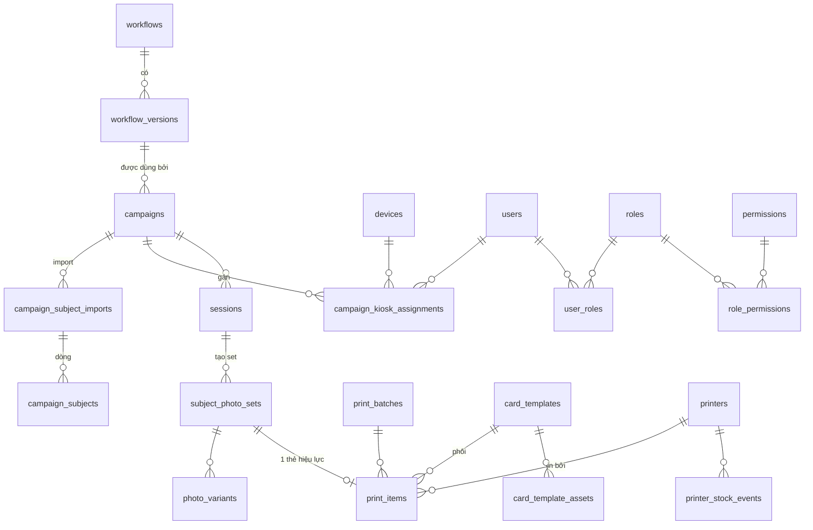

# Kế hoạch API cho 8 màn CMS — đối chiếu với API hiện có

> Ngày: 2026-09-11 · Trạng thái: **bản thảo để trao đổi, chưa code** · D-Q1–4, 6, 8, 10, 12, 14, 15, 16, 17, 18 đã chốt cùng ngày (§6, §9.3) · §9 rà soát tác động lên tính năng hiện có · bổ sung §1.1 (dễ mở rộng) và §2.9 (bảng thống kê riêng, action + cron)
> Phạm vi: `Looka/apps/api` (NestJS + Postgres) và sidecar `services/python-ai`.
> Nguồn đối chiếu: 15 controller / 63 route / 17 bảng hiện có; các quyết định đã chốt ngày 2026-09-08 trong
> `campaign-config-sso-card-photo-discussion.md`, `cms-photo-review-plan.md`, `ui-redesign-plan.md`;
> BRD `BRD_QuyTrinh_LamAnhThe_SV_V1.docx`; tài liệu gốc `docs/KE-HOACH-DU-AN.md`, `docs/nguyen-ly-loi-va-da-nghiep-vu.html`.

---

## 0. Tóm tắt điều hành

| # | Màn | Đã có | Có một phần | Chưa có | Mức độ việc |
|---|---|---|---|---|---|
| 1 | Dashboard | 3 route thống kê (`stats/summary`, `stats/timeseries`, `campaigns/:id/stats`) | theo cá nhân, theo kiosk | chờ duyệt, đã in, quá hạn, thời gian chụp, kiosk + người gán, địa điểm | Trung bình |
| 2 | Cấu hình nghiệp vụ | `capture-configurations` (5 route), `capture-angle-presets` (3), `photo-kinds` (3) | góc chụp, card spec | thực thể nghiệp vụ có mã/version/trạng thái, phương thức định danh, điều kiện tiếp nhận, import Excel, catalog bước AI, chế độ in | **Lớn** |
| 3 | Quản lý đợt chụp | CRUD campaign (8), duyệt thành viên (3), stats | danh sách chưa phân trang, chưa gate admin | liên kết nghiệp vụ, SLA giờ, import tài khoản, gán người ↔ kiosk, thống kê tự động/tay | Trung bình |
| 4 | Duyệt ảnh AI | 13 route review đầy đủ (list, detail, reprocess, ai-edit, upload, accept, approve/reject, export) | tìm kiếm (thiếu lớp/ngành/CCCD), làm mịn chưa nối | thống kê duyệt/không duyệt/dùng AI | Nhỏ |
| 5 | Quản lý đợt in thẻ | `GET /v1/review/export` (zip + csv) | — | toàn bộ: đợt in, item in, trạng thái in, gom nhóm lớp/khoa, gán phôi hàng loạt | **Lớn** |
| 6 | Quản lý phôi in | — | — | toàn bộ: phôi, layout mặt trước/sau, biến dữ liệu, logo, preview, đếm lượt dùng | **Lớn** |
| 7 | Quản lý máy in | — | — | toàn bộ: máy in, chế độ in, gắn kiosk, tồn phôi, heartbeat agent | Trung bình |
| 8 | Người dùng & phân quyền | bảng `users`, `GET /v1/me`, 2 guard (`AdminRoleGuard`, `ReviewerRoleGuard`) | `users.roles` là mảng chuỗi, không có API quản lý | CRUD user, roles, permissions, gán nhiều-nhiều, catalog quyền theo endpoint, đồng bộ từ service hệ thống | **Lớn** |

**Ba điểm đảo ngược quyết định ngày 2026-09-08 — đã chốt lại ngày 2026-09-11** (chi tiết ở §6 D-Q2/D-Q3/D-Q4):

1. **Chế độ bấm chụp** (bấm liên tục / chụp 1 lần / tự động AI) nay được yêu cầu nằm trong *nghiệp vụ*, trong khi Q11 đã chốt đây là *cài đặt kiosk*. → **Chốt:** nghiệp vụ đặt mặc định + danh sách cho phép, kiosk chọn trong đó.
2. **Import danh sách tài khoản vào đợt** — bảng `campaign_student_roster` đã bị **xóa** ngày 2026-09-08 (migration `1804000000000`) để chuyển roster về phía desktop (`apps/desktop/src/main/cccdRoster.ts`). Màn 2/3 cần roster ở server. → **Chốt:** tạo lại roster ở server (`campaign_subjects`), kiosk tra cứu qua API có cache offline.
3. **Gán 1 người ↔ 1 kiosk** — tab "Cán bộ chụp" đã bị **gỡ** ngày 2026-09-08 với lý do "không cần phân công". Màn 1/3 yêu cầu lại. → **Chốt:** cần gán; gán đồng thời tự duyệt thành viên (APPROVED).

**Hai nguyên tắc bổ sung (user nêu 2026-09-11)**: (1) mọi chức năng phải thiết kế để **dễ mở rộng về sau** — §1.1 liệt kê các điểm mở rộng; (2) **thống kê có bảng riêng**, cập nhật **theo action** (tăng dần khi có sự kiện) và **cron** (đối soát/tính lại) — §2.9. Dashboard và mọi endpoint stats đọc từ các bảng này, không tính trực tiếp trên `sessions`/`photos`.

Ước lượng backend tổng: **30–38 ngày công** (§5), chưa gồm CMS UI, kiosk và print agent. Các cải thiện ngoài 8 màn ở §8 (I-Q1 và I-Q5 đã chốt, I-Q13 bỏ qua, I-Q2 đang trao đổi).

---

## 1. Quy ước dùng trong tài liệu

- Mọi route đều có prefix `/v1` (URI versioning, không có global prefix — `apps/api/src/main.ts`). Response bọc `{ statusCode, message, data }`; danh sách phân trang là `data: { items, meta }`.
- Ký hiệu: ✅ có sẵn, dùng được ngay · 🟡 có một phần, cần sửa/mở rộng · ❌ chưa có, phải xây mới · ⚠️ vấn đề cần lưu ý.
- Guard hiện có: `SsoAuthGuard` (SSO trường, gắn `req.user`), `AdminRoleGuard` (`users.is_admin`), `ReviewerRoleGuard` (`is_admin` hoặc `roles` chứa `REVIEWER`), `CampaignMemberGuard`, `DeviceCredentialsGuard` (kiosk), `ApiKeyMiddleware` (kiosk web).
- Tên bảng/cột mới viết snake_case theo `SnakeNamingStrategy` hiện dùng.

### 1.1 Nguyên tắc thiết kế để dễ mở rộng

Yêu cầu của user: "các chức năng cần thiết kế sau dễ extend". Áp dụng xuyên suốt bằng 8 quy tắc, mỗi quy tắc chỉ rõ chỗ dùng:

| # | Quy tắc | Áp dụng ở đâu |
|---|---|---|
| E1 | **Catalog trong DB thay vì enum cứng trong code.** Thêm giá trị = thêm dòng, không cần migration/deploy. | Góc chụp (`capture_angle_presets`, đã có) · loại ảnh (`photo_kinds`, đã có) · **bước AI** (`ai_pipeline_steps`, mới) · **phương thức định danh** (`identification_methods`, mới — thay cho CHECK enum) · **biến dữ liệu phôi** (`card_template_fields`, mới, seed từ code) |
| E2 | **Adapter/registry cho mọi tích hợp ngoài.** Một interface, nhiều implementation đăng ký theo `code`; config chỉ lưu `code` + params. | `EligibilityApiClient` (đầu tiên: `DAINAM_STUDENT_INFO`) · `UserDirectoryClient` (D-Q10: viết sẵn hàm gọi, URL qua env, spec cung cấp sau) · `PrintChannel` (`CENTRALIZED_PACKAGE` trước, `AGENT_QUEUE` sau — D-Q8) · `AiSidecarStep` theo `ai_pipeline_steps.sidecar_endpoint` · `StatsCollector` (§2.9) |
| E3 | **Config nghiệp vụ là JSON có `schemaVersion`, validate bằng JSON Schema.** Thêm nhóm tham số mới = tăng `schemaVersion`, version cũ vẫn đọc được (default cho field thiếu). | `workflow_versions.config` |
| E4 | **Quyền theo permission, không theo role cứng.** Thêm bước nghiệp vụ mới = thêm 1 decorator, catalog tự sinh, gán vào role trong CMS. | Vòng duyệt 2 sau này (D-Q14) chỉ là permission `review:approve-round2` + 1 status · mọi route mới |
| E5 | **Trạng thái là `varchar` + CHECK constraint** (convention hiện có), không dùng Postgres enum type. Thêm giá trị = migration đổi CHECK, không lock bảng lâu. | `workflows.status`, `print_items.status`, `printers.status`, … |
| E6 | **Cột `extra jsonb`** cho trường phát sinh chưa biết trước, kèm `metadata` đã có ở `sessions`. | `campaign_subjects.extra`, `print_items.extra`, `users.extra`, `printers.connection` |
| E7 | **Mọi hành động nghiệp vụ ghi bảng sự kiện append-only** (`device_events`, `photo_review_events` đã có; `print_item_events`, `printer_stock_events`, `eligibility_check_logs` mới). Thống kê hoặc hook mới thêm sau vẫn tính lại được từ lịch sử. | §2.9 cron recompute đọc từ các bảng này |
| E8 | **Version bất biến cho cấu hình được tham chiếu lâu dài.** Sửa = tạo version mới; bản ghi cũ giữ nguyên tham chiếu. | `workflow_versions` (D-Q1), `card_templates.version` |

---

## 2. Đối chiếu từng màn

### 2.1 Màn 1 — Dashboard

**Yêu cầu**
- (a) Số ảnh chụp theo ngày *theo cá nhân*, số ảnh chờ CTSV duyệt, số ảnh đã in, ảnh quá hạn xử lý.
- (b) Danh sách đợt đang hoạt động: tên, địa điểm, tổng, chụp được, đã xử lý, đã chụp, chờ duyệt, lỗi chụp, chưa chụp.
- (c) Chi tiết đợt: kiosk đang setup cho đợt, danh sách chụp từng kiosk, người được gán.
- (d) Thời gian chụp từng kiosk, tính từ quét thẻ → chụp xong + gửi lời chào.

**Hiện có** (`apps/api/src/modules/device-management/controllers/campaign.controller.ts`, tính toán trong `services/device-event.service.ts`)

| Endpoint | Trả về | Trạng thái |
|---|---|---|
| `GET /v1/campaigns/stats/summary` | tổng toàn hệ thống + từng campaign: `sessions`, `photos{total,ready,pending,failed}`, `byDevice[]`, `byOperator[]` (**luôn rỗng** ở bản summary) | 🟡 |
| `GET /v1/campaigns/stats/timeseries?days=` | theo ngày: `sessionsCompleted, uploadsSuccess, uploadsFailed, retakes` (từ `device_events`) | 🟡 không lọc theo người |
| `GET /v1/campaigns/:id/stats` | `byDevice[]`, `byOperator[]` (theo `sessions.operator_user_id`), `byDay[]` 30 ngày | ✅ cho (c) một phần |
| `GET /v1/sessions?campaignId&deviceId&from&to&state` | danh sách phiên theo kiosk | ✅ cho "danh sách chụp từng kiosk" |

**Thiếu**

| Nhu cầu | Vì sao chưa làm được | Đề xuất |
|---|---|---|
| Số ảnh chụp theo ngày theo cá nhân | `sessions.operator_user_id` đã có (migration `1796000000000`) nhưng không có endpoint tổng hợp xuyên campaign, không có lọc `operatorUserId`/`from`/`to` | ❌ `GET /v1/dashboard/kpis?from&to&operatorUserId&campaignId` → `{ captured: { total, byDay[] }, pendingReview, printed, overdue }`. Mặc định `operatorUserId` = người đang đăng nhập nếu không truyền. |
| Ảnh chờ CTSV duyệt | `subject_photo_sets.status` có `READY`/`IN_REVIEW` nhưng không có endpoint đếm | ❌ `GET /v1/review/stats?campaignId&from&to` (xem §2.4) và gộp vào `dashboard/kpis` |
| Ảnh đã in | Chưa có khái niệm in (§2.5) | ❌ phụ thuộc `print_items.status = PRINTED` |
| Ảnh quá hạn xử lý | Không có SLA, không có deadline (`campaign-stats.dao.ts` ghi rõ chưa có mốc thời gian) | ❌ thêm `campaigns.processing_sla_hours` (§2.3) và `subject_photo_sets.due_at` = `sessions.completed_at + sla_hours`, ghi lúc tạo set để index được; `overdue = now > due_at AND status NOT IN (APPROVED, REJECTED)` |
| Địa điểm đợt | `campaigns` không có cột địa điểm | ❌ thêm `campaigns.location` (varchar) — hoặc bảng `sites` nếu muốn thống kê theo cơ sở (BA #19). Xem câu hỏi D-Q7. |
| Bộ đếm đợt: tổng / chụp được / đã xử lý / đã chụp / chờ duyệt / lỗi chụp / chưa chụp | Có `quota_planned`, `sessions COMPLETED`, `photos.failed`; **không có** "chưa chụp" vì không có danh sách sinh viên kỳ vọng ở server | 🟡 `GET /v1/dashboard/campaigns/active` → mỗi đợt: `quota` (= `quota_planned` hoặc số dòng roster hợp lệ), `captured` (COUNT DISTINCT `subject_code` phiên COMPLETED), `processed` (set APPROVED), `sessions` (phiên COMPLETED), `pendingReview` (set READY/IN_REVIEW), `captureErrors` (phiên có ảnh `failed` hoặc set `AUTO_FAILED`), `notCaptured` (= roster − captured; NULL nếu không có roster) |
| Kiosk của đợt + người được gán | `devices.campaign_id` có (nullable sau self-enroll); **không có** bảng gán người ↔ kiosk (bị gỡ 2026-09-08) | ❌ `campaign_kiosk_assignments` (§2.3) + `GET /v1/campaigns/:id/kiosks` → kiosk, trạng thái, người gán, số phiên, thời gian trung bình |
| Thời gian chụp từng kiosk (quét thẻ → gửi lời chào) | Chỉ có `sessions.captured_at` (bắt đầu) và `completed_at`; **không có** mốc quét thẻ và mốc kết thúc lời chào; `SESSION_STARTED`/`SESSION_COMPLETED` trong `device_events` có `occurred_at` nhưng chưa ai tính hiệu | ❌ thêm `sessions.identified_at`, `sessions.finished_at`; kiosk gửi kèm trong `SESSION_REPORT`; `GET /v1/campaigns/:id/stats/timing?groupBy=device` → `avg/p50/p95` giây, số phiên đo được |

**Nguồn dữ liệu**: toàn bộ số liệu màn 1 đọc từ **bảng thống kê riêng** (§2.9: `stats_daily_captures`, `stats_campaign_snapshot`, `stats_daily_review`, `stats_daily_print`), được cập nhật theo action và đối soát bằng cron. Endpoint dashboard vì thế là truy vấn nhẹ, không join `photos`.

**API đề xuất cho màn 1**

```
GET  /v1/dashboard/kpis?from&to&operatorUserId&campaignId        ❌ mới
GET  /v1/dashboard/campaigns/active                               ❌ mới (đợt effectiveStatus = OPEN)
GET  /v1/campaigns/:id/kiosks                                     ❌ mới
GET  /v1/campaigns/:id/stats/timing?groupBy=device|operator|day   ❌ mới
GET  /v1/campaigns/:id/stats                                      ✅ giữ, bổ sung byTrigger (§2.3)
GET  /v1/sessions?campaignId&deviceId                             ✅ giữ
GET  /v1/campaigns/stats/summary                                  🟡 điền byOperator, thêm from/to
```

**DB**: `campaigns.location`, `campaigns.processing_sla_hours`, `sessions.identified_at`, `sessions.finished_at`, `subject_photo_sets.due_at` (+ index `(status, due_at)`); các bảng `stats_*` ở §2.9.

**Kiosk**: `SESSION_REPORT` thêm `identifiedAt`, `finishedAt`, `identificationMethod` (§2.2), `operatorUserId` đã có.

---

### 2.2 Màn 2 — Cấu hình nghiệp vụ

**Yêu cầu**
- Danh sách nghiệp vụ: xem/sửa/xóa; trạng thái Nháp / Lưu trữ / Hoạt động.
- Tạo nghiệp vụ gồm: thông tin chung (tên, mã, version, mô tả) · cấu hình camera (chọn góc đã cấu hình, sửa được; chế độ bấm chụp: bấm liên tục theo số cam hoặc số ảnh/cam, chụp 1 lần toàn bộ, tự động AI) · phương thức định danh (QR CCCD, RFID, NFC, Barcode, FaceID, tra cứu tay — multi, có thống kê) · điều kiện tiếp nhận (trang riêng: cấu hình điều kiện, upload Excel hoặc dựa API nào/field nào; danh sách import xem được lỗi) · xử lý AI đầu ra (có/không, mục nào; có trang quản lý các bước AI) · in trực tiếp hay tập trung.

**Hiện có**

| Thành phần | Ở đâu | Trạng thái |
|---|---|---|
| Mẫu chụp dùng lại: `name, description, capture_angles jsonb, card_spec jsonb` | `capture_configurations` — `GET/POST/PATCH/DELETE /v1/capture-configurations` (admin) | 🟡 không có `code`, `version`, `status`; là bản copy-một-lần, campaign **không** tham chiếu tới nó lúc runtime (`capture-configuration.entity.ts` dòng 8–27) |
| Catalog góc chụp | `capture_angle_presets` — `GET/POST/PATCH /v1/capture-angle-presets` | ✅ (xóa = `active:false`) |
| Loại ảnh + card spec + prompt hints | `photo_kinds` — `GET/POST/PATCH /v1/photo-kinds` | ✅ |
| Chế độ bấm chụp | `campaigns.capture_mode/auto_hold_ms/simultaneous_capture` **đã deprecated**, chuyển sang kiosk (Q11) | 🟡 D-Q2 đã chốt: nghiệp vụ đặt `default` + `allowed[]`, kiosk chọn trong đó |
| Phương thức định danh | Không có cột/enum nào; CCCD chỉ là `sessions.metadata.identityNumber` | ❌ |
| Điều kiện tiếp nhận / Excel / API | Không có; `campaign_student_roster` đã xóa; `DainamStudentInfoClient` (`modules/shared/services/dainam-student-info.client.ts`) tồn tại nhưng **chưa nối vào đâu** | ❌ |
| Bước xử lý AI | Sidecar có `/card-photo`, `/background`, `/retouch`, `/edit` (501), `/identity-similarity`; API mới gọi 3/9 route; không có catalog bước | 🟡 |
| Chế độ in | Không có | ❌ |

**Quyết định kiến trúc đề xuất: tách thực thể `workflows` (nghiệp vụ) có version bất biến, campaign tham chiếu đến version.**

Lý do: (1) yêu cầu có `code/version/status` và "sửa" một nghiệp vụ đang dùng không được làm đổi đợt đang chạy — đúng tinh thần snapshot đã chốt cho góc chụp (Q22); (2) `docs/KE-HOACH-DU-AN.md` §11.5 đã có tiền lệ `Workflow` + `WorkflowVersion` bất biến; (3) `docs/nguyen-ly-loi-va-da-nghiep-vu.html` §06 định nghĩa đúng 6 nhóm tham số cần có. `capture_configurations` sẽ được **thay thế** (migrate dữ liệu sang version 1 của workflow tương ứng rồi bỏ bảng), tránh tồn tại 2 khái niệm "mẫu".

```
workflows
  id, code (unique, vd STUDENT_CARD), name, description,
  status DRAFT | ACTIVE | ARCHIVED, current_version_id, created_by_user_id
workflow_versions
  id, workflow_id, version int, config jsonb, published_at, published_by_user_id, note
  unique (workflow_id, version) — KHÔNG BAO GIỜ UPDATE sau khi publish
```

Vòng đời: tạo → `DRAFT` (sửa tự do trên version nháp) → `publish` → `ACTIVE` (version đóng băng) → sửa tiếp = tạo version nháp mới, publish sẽ tăng `version` và trỏ `current_version_id` → `archive` → `ARCHIVED` (campaign mới không chọn được, campaign cũ vẫn chạy). Xóa cứng chỉ khi `DRAFT` và chưa campaign nào trỏ tới.

**Cấu trúc `config` jsonb** (6 nhóm, khớp yêu cầu màn 2):

```jsonc
{
  "capture": {
    "angles": [ /* CaptureStep[] snapshot từ capture_angle_presets, giống campaigns.capture_angles hiện nay */ ],
    "clickMode": {                      // D-Q2 (chốt 2026-09-11): nghiệp vụ đặt mặc định + danh sách cho phép, kiosk chọn trong "allowed"
      "default": "MANUAL_SEQUENTIAL",
      "allowed": ["MANUAL_SEQUENTIAL", "MANUAL_ALL_AT_ONCE", "AUTO_AI"]
    },
    "shotsPerCamera": 1,                // dùng khi MANUAL_SEQUENTIAL
    "cardSourceAngleCode": "FRONT"
  },
  "identification": {
    "methods": ["QR_CCCD", "RFID", "NFC", "BARCODE", "FACE_ID", "MANUAL_LOOKUP"],   // multi
    "lookupKeyField": "citizenId" | "studentCode"
  },
  "eligibility": {
    "mode": "NONE" | "ROSTER" | "EXTERNAL_API" | "ROSTER_AND_API",
    "api": { "clientCode": "DAINAM_STUDENT_INFO", "keyField": "student_code", "requiredFields": ["status"] },
    "rules": [ { "key": "da_dong_phi", "expr": "fee_paid == true", "message": "Sinh viên chưa đóng phí ảnh thẻ" } ],
    "rosterTemplate": "STUDENT_V1"     // cột Excel bắt buộc, xem bên dưới
  },
  "aiProcessing": {
    "enabled": true,
    "steps": [ { "code": "CARD_CROP", "params": {} }, { "code": "BACKGROUND_REPLACE", "params": { "color": "#FFFFFF" } }, { "code": "SKIN_SMOOTH", "params": { "strength": "LIGHT" } } ]
  },
  "output": { "photoKindCode": "STUDENT_CARD", "cardSpec": { /* như hiện nay */ } },
  "printing": { "mode": "DIRECT" | "CENTRALIZED" }
}
```

Rule engine cho `eligibility.rules`: dùng `json-logic-js` hoặc `expr-eval` (không `eval`), đúng khuyến nghị `KE-HOACH-DU-AN.md` §20; mỗi lần đánh giá ghi một dòng `eligibility_check_logs` (session_id, rule_key, passed, message, evaluated_at) để dashboard đếm "lỗi tiếp nhận".

**Catalog bước AI** ("thêm 1 mục quản lý các mục quy trình của AI"):

```
ai_pipeline_steps
  id, code (unique), name_vi, description, sidecar_endpoint (/card-photo | /background | /retouch | /edit),
  params_schema jsonb, default_params jsonb, active, sort_order, is_system
```
Seed 4 bước từ sidecar hiện có. Workflow chỉ chọn `code` + `params`, nên đổi/thêm model không đụng nghiệp vụ.

**Import Excel và điều kiện tiếp nhận** — roster nằm ở **cấp đợt** (màn 3 "số tài khoản được import"), nhưng *khuôn* (cột bắt buộc, cách map) nằm ở nghiệp vụ. Vì vậy:

```
campaign_subject_imports
  id, campaign_id, file_name, fs_file_id, uploaded_by_user_id, status PROCESSING|DONE|FAILED,
  total_rows, valid_rows, error_rows, error_report_fs_file_id, created_at
campaign_subjects
  id, campaign_id, import_id, row_no, subject_code, full_name, citizen_id, class_name, faculty, major,
  date_of_birth, card_valid_until, status VALID|ERROR|DUPLICATE, error_message, extra jsonb
  unique (campaign_id, subject_code) where status = 'VALID'
```
⚠️ Đây chính là bảng `campaign_student_roster` đã bị xóa ngày 2026-09-08 (cột cũ: `student_code, student_name, citizen_id, class_name, major, academic_year`), thêm `faculty`, `date_of_birth`, `card_valid_until` vì phôi in cần (BRD dòng 25). D-Q3 **đã chốt 2026-09-11**: tạo lại ở server; kiosk chuyển sang tra cứu qua API và cache offline, bỏ `response.json`.

**API đề xuất cho màn 2**

```
# Nghiệp vụ
GET    /v1/workflows?status&q&page&limit                 ❌ mới, phân trang
POST   /v1/workflows                                      ❌ mới (tạo DRAFT + version 1 nháp)
GET    /v1/workflows/:id                                  ❌ mới (kèm current version config)
PATCH  /v1/workflows/:id                                  ❌ mới (tên/mô tả; config chỉ khi version đang DRAFT)
POST   /v1/workflows/:id/publish                          ❌ mới (DRAFT→ACTIVE, đóng băng version)
POST   /v1/workflows/:id/versions                         ❌ mới (tạo version nháp mới từ current)
GET    /v1/workflows/:id/versions                         ❌ mới
POST   /v1/workflows/:id/archive                          ❌ mới
DELETE /v1/workflows/:id                                  ❌ mới (chỉ DRAFT, chưa dùng)
GET    /v1/workflows/:id/usage                            ❌ mới (campaign nào đang dùng, version nào)
POST   /v1/workflows/validate                             ❌ mới (validate config theo JSON schema, dry-run rule)

# Catalog dùng chung
GET/POST/PATCH /v1/capture-angle-presets                  ✅ giữ nguyên
GET/POST/PATCH /v1/photo-kinds                            ✅ giữ nguyên
GET/POST/PATCH /v1/ai-pipeline-steps                      ❌ mới
GET    /v1/eligibility/api-clients                        ❌ mới (liệt kê client ngoài + field trả về, để CMS chọn "dựa vào field nào")
POST   /v1/eligibility/test-lookup {clientCode, key}      ❌ mới (thử tra cứu 1 mã để xem field)

# Thống kê phương thức định danh
GET    /v1/campaigns/:id/stats/identification             ❌ mới → { byMethod: { QR_CCCD: n, ... } }
GET    /v1/stats/identification?from&to                   ❌ mới (toàn hệ thống)

# Bỏ đi sau khi migrate
GET/POST/PATCH/DELETE /v1/capture-configurations          🟡 giữ tạm, xóa sau khi CMS chuyển sang workflows
```

**DB**: `workflows`, `workflow_versions`, `ai_pipeline_steps`, `eligibility_check_logs`, `campaign_subject_imports`, `campaign_subjects`; catalog `identification_methods` (`code, name_vi, description, requires_hardware, active, sort_order`, seed 6 dòng — E1) + `sessions.identification_method` (varchar 30, tham chiếu `code`); kiosk gửi `identificationMethod` trong `SESSION_REPORT`.

---

### 2.3 Màn 3 — Quản lý đợt chụp

**Yêu cầu**
- Danh sách: tên, mã, quy trình, thời gian diễn ra – kết thúc, số lượng thực hiện, tiến độ, trạng thái; thao tác xem/sửa/đổi trạng thái.
- Tạo/sửa: tên, quy trình nghiệp vụ, thời gian, số tài khoản import để xử lý ở kiosk, thời gian cam kết xử lý ảnh (giờ).
- Gán người cho từng đợt {1 người ↔ 1 kiosk}; thống kê chụp tự động / chụp tay.

**Hiện có** (`campaign.controller.ts`, `campaign-member.controller.ts`)

| Endpoint | Trạng thái | Ghi chú |
|---|---|---|
| `GET /v1/campaigns` | 🟡 | trả **mảng thường**, không phân trang, không lọc |
| `POST /v1/campaigns`, `PATCH /v1/campaigns/:id`, `DELETE /v1/campaigns/:id` | 🟡 | ⚠️ chỉ `SsoAuthGuard` — **bất kỳ ai đăng nhập cũng xóa được campaign**; phải gate theo quyền (§2.8) |
| `GET /v1/campaigns/:id` | ✅ | có `effectiveStatus` (UPCOMING/OPEN/EXPIRED/PAUSED/CLOSED), `quotaReached`, `requiredCameraCount` |
| Đổi trạng thái | ✅ | `PATCH { manualStatus: PAUSED | CLOSED | null }` |
| `code, cohort, starts_at, expires_at, quota_planned, card_spec, capture_angles, record_video*` | ✅ | migration `1793000000000` |
| Duyệt thành viên `POST .../join`, `GET/PATCH .../members` | ✅ | approval theo đợt, không phải gán kiosk |
| `sessions.operator_user_id`, `photos.trigger_source`, `photos.capture_mode` | ✅ cột | ❌ **chưa có endpoint nào tổng hợp** `trigger_source` |

**Thiếu**

| Nhu cầu | Đề xuất |
|---|---|
| Liên kết nghiệp vụ | `campaigns.workflow_id`, `campaigns.workflow_version_id` (bắt buộc với campaign mới). Kiosk `GET /v1/devices/config` và `GET /v1/campaigns/:id/config` trả `campaign + workflowVersion.config` gộp; `campaigns.capture_angles/card_spec` giữ làm **override tùy chọn** rồi deprecate. |
| Thời gian cam kết xử lý ảnh | `campaigns.processing_sla_hours` int nullable |
| Số tài khoản import | `campaign_subject_imports` / `campaign_subjects` (§2.2) — 4 route import bên dưới; `quota_planned` mặc định = số dòng VALID nếu người dùng không nhập |
| Danh sách có phân trang, lọc, tiến độ | `GET /v1/campaigns?page&limit&status&workflowId&from&to&q` → thêm `workflowName`, `progress { captured, approved, quota, percent }` vào DAO |
| Gán 1 người ↔ 1 kiosk | `campaign_kiosk_assignments (campaign_id, device_id, user_id, assigned_by_user_id, assigned_at, note)`; unique `(campaign_id, device_id)` **và** unique `(campaign_id, user_id)` để đảm bảo 1–1. Khi gán: tự tạo/duyệt `campaign_members` (APPROVED) để kiosk qua `CampaignMemberGuard` mà không phải duyệt tay 2 lần. D-Q4 **đã chốt 2026-09-11** (đảo ngược "không cần phân công" của 2026-09-08). |
| Thống kê tự động / tay | Bổ sung `byTrigger { AUTO, GESTURE, SHUTTER, EXTERNAL }` và `byCaptureMode` vào `GET /v1/campaigns/:id/stats` và `stats/summary` (kế hoạch phase 5 cũ, cột đã có, DAO chưa làm). CMS hiển thị 2 ô "Tự động / Thủ công" theo Q15. |

**API đề xuất cho màn 3**

```
GET    /v1/campaigns?page&limit&status&workflowId&from&to&q     🟡 sửa: phân trang + lọc + progress
POST   /v1/campaigns                                            🟡 sửa: thêm workflowId, processingSlaHours, location
PATCH  /v1/campaigns/:id                                        🟡 sửa: như trên; khóa đổi workflow khi đã có phiên
GET    /v1/campaigns/:id                                        ✅
DELETE /v1/campaigns/:id                                        🟡 gate quyền campaign:delete
POST   /v1/campaigns/:id/status {manualStatus}                  🟡 tùy chọn tách riêng cho rõ; hiện dùng PATCH

# Import tài khoản
POST   /v1/campaigns/:id/subjects/imports (multipart xlsx)      ❌ mới, xử lý nền, trả import id
GET    /v1/campaigns/:id/subjects/imports                       ❌ mới
GET    /v1/campaigns/:id/subjects/imports/:importId             ❌ mới (tổng/hợp lệ/lỗi + link file lỗi)
GET    /v1/campaigns/:id/subjects?status&q&page                 ❌ mới (xem từng dòng, lọc ERROR để biết lỗi ở đâu)
GET    /v1/campaigns/subjects/import-template?workflowId        ❌ mới (tải file Excel mẫu theo rosterTemplate)
DELETE /v1/campaigns/:id/subjects/imports/:importId             ❌ mới (chỉ khi chưa phiên nào khớp)

# Gán người ↔ kiosk
GET    /v1/campaigns/:id/assignments                            ❌ mới
PUT    /v1/campaigns/:id/assignments/:deviceId {userId}         ❌ mới (idempotent, thay người)
DELETE /v1/campaigns/:id/assignments/:deviceId                  ❌ mới
GET    /v1/me/assignments?campaignId                            ❌ mới (D-Q17: kiosk đợt đã gán cho tài khoản đang đăng nhập)
GET    /v1/me/campaigns                                         🟡 thêm assignedDevices[] cho từng đợt
GET    /v1/devices?campaignId&status&q&page                     ❌ mới (hiện chỉ có list theo campaign, không phân trang)

# Thống kê
GET    /v1/campaigns/:id/stats                                  🟡 thêm byTrigger, byCaptureMode, timing
```

**Kiosk**: tra cứu sinh viên tại kiosk chuyển sang `GET /v1/campaigns/:id/subjects/lookup?key=` (đọc `campaign_subjects` + tùy chọn gọi API ngoài theo `eligibility`), thay cho roster local `response.json`. Kiosk vẫn cache offline như hiện nay.

---

### 2.4 Màn 4 — Duyệt ảnh AI

**Yêu cầu**
- Danh sách ảnh đã chụp và được AI làm mịn; tìm theo tên, lớp, chuyên ngành, CCCD, mã SV; thống kê duyệt / không duyệt / dùng AI.
- Sửa ảnh: xem ảnh gốc và ảnh AI, chọn ảnh, viết prompt gửi AI; upload ảnh từ máy thay thế; xem trước các ảnh AI sửa rồi chọn để thay.

**Hiện có** — đây là màn đầy đủ nhất (`photo-review/controllers/review.controller.ts`, guard `ReviewerRoleGuard`)

| Nhu cầu | Endpoint | Trạng thái |
|---|---|---|
| Danh sách + lọc | `GET /v1/review/sets?campaignId&kindId&status&hasAi&hasUpload&missingCard&q&page&limit` | ✅ |
| Xem gốc + các phiên bản | `GET /v1/review/sets/:id` (originals, video, variants, events) | ✅ |
| Tạo lại ảnh 4x6 tự động | `POST /v1/review/sets/:id/reprocess` | ✅ |
| Prompt gửi AI | `POST /v1/review/sets/:id/ai-edit {prompt, region, fromVariantId}` + `GET /v1/review/jobs/:id` | ✅ API · ⚠️ sidecar `/edit` trả **501**, chưa có model (R-Q4 GPU) |
| Xem trước rồi chọn | `POST /v1/review/variants/:id/accept`, `/discard`, `POST /v1/review/sets/:id/current` | ✅ |
| Upload thay thế | `POST /v1/review/sets/:id/upload` (multipart, kiểm tra identity ≥ 0.70/0.85) | ✅ |
| Duyệt / không duyệt | `POST /v1/review/sets/:id/approve`, `/reject` | ✅ |
| Nhật ký | `GET /v1/review/sets/:id/events` | ✅ |
| Xuất gói in | `GET /v1/review/export?campaignId&status` (zip + manifest.csv, admin) | ✅ |

**Thiếu / cần sửa**

| Nhu cầu | Vấn đề | Đề xuất |
|---|---|---|
| Tìm theo lớp / chuyên ngành / CCCD | `subject_photo_sets` chỉ có `subject_code`, `subject_name`; lớp/ngành/CCCD nằm trong `sessions.metadata` jsonb | 🟡 denormalize khi tạo set: thêm `class_name`, `major`, `faculty`, `citizen_id` vào `subject_photo_sets` (lấy từ `sessions.metadata` hoặc `campaign_subjects`); thêm query `className`, `major`, `citizenId`, `subjectCode` tách bạch thay vì chỉ `q` |
| "AI làm mịn" mặc định | Variant `CARD_AUTO` hiện gọi `/card-photo` (crop + nền); sidecar `/retouch` **không được API gọi** | 🟡 chạy pipeline theo `workflow.aiProcessing.steps` (§2.2) thay vì hard-code; nối `/retouch` |
| Nhiều ứng viên AI để chọn | Mỗi `ai-edit` sinh 1 variant | 🟡 thêm `candidates: 1..4` (seed khác nhau) → N variant PROCESSING, chọn 1 accept, còn lại discard |
| Thống kê duyệt / không duyệt / dùng AI | Không có endpoint đếm | ❌ `GET /v1/review/stats?campaignId&from&to&reviewerUserId` → `{ byStatus{...}, approved, rejected, aiEdited (set có variant CARD_AI được accept), uploaded, autoOnly, byReviewer[], avgReviewHours }` |
| Quá hạn | xem §2.1 `due_at` | ❌ thêm lọc `overdue=true` vào `GET /v1/review/sets` |

**API đề xuất cho màn 4**

```
GET  /v1/review/sets?...&className&major&citizenId&subjectCode&overdue   🟡 mở rộng lọc
GET  /v1/review/stats?campaignId&from&to&reviewerUserId                  ❌ mới
POST /v1/review/sets/:id/ai-edit {prompt, region, fromVariantId, candidates}  🟡 thêm candidates
(các route còn lại)                                                       ✅ giữ nguyên
```

---

### 2.5 Màn 5 — Quản lý đợt in thẻ

**Yêu cầu**: danh sách ảnh đã chụp với ảnh thẻ (gen hoặc sửa), thông tin người, trạng thái in, lớp/khoa (gom nhóm); thao tác xem/sửa/đổi trạng thái; thiết kế phôi cho 1 người rồi áp cho nhiều người.

**Hiện có**: ❌ không có gì ngoài `GET /v1/review/export` (zip ảnh APPROVED + csv để bàn giao IT). Không có bảng, cột hay route nào về in. Tài liệu gốc cũng chưa thiết kế (BA `print_packages` chỉ là gói theo từng ảnh, `template_id` là varchar rời).

**Thiết kế đề xuất**

```
print_batches
  id, code, name, campaign_id (nullable), default_template_id, printer_id (nullable),
  mode DIRECT|CENTRALIZED, status DRAFT|READY|PRINTING|DONE|CANCELLED,
  created_by_user_id, item_count, printed_count, failed_count, sent_at, done_at
print_items
  id, batch_id (nullable — item có thể tồn tại trước khi vào đợt), set_id → subject_photo_sets,
  variant_id → photo_variants (ảnh thẻ dùng để in, chốt tại thời điểm render),
  subject_code, full_name, class_name, faculty, extra jsonb (dob, card_valid_until, barcode...),
  template_id (override từng người), rendered_front_fs_file_id, rendered_back_fs_file_id, rendered_at,
  status PENDING|RENDERED|QUEUED|PRINTING|PRINTED|FAILED|REPRINT_REQUESTED|CANCELLED,
  printer_id, printed_at, error_message, reprint_of_item_id
  unique (set_id) where status not in (CANCELLED, FAILED)   — 1 người 1 thẻ đang hiệu lực
print_item_events
  id, item_id, from_status, to_status, source SYSTEM|PRINT_AGENT|MANUAL, actor_user_id, message, at
```

Nguồn dữ liệu người: `subject_photo_sets` (đã denormalize §2.4) ưu tiên; thiếu thì tra `campaign_subjects`; thiếu nữa thì để trống và đánh dấu `missingFields[]` để CMS sửa tay (`PATCH /v1/print/items/:id`).

Trạng thái `PRINTED` chỉ được đặt bởi **print agent** (callback) hoặc thao tác thủ công có ghi `source = MANUAL` — đúng quyết định BA #14 ("đã in" = xác nhận in vật lý).

**API đề xuất cho màn 5**

```
# Item (danh sách chính của màn)
GET    /v1/print/items?campaignId&batchId&status&className&faculty&q&page&limit    ❌ mới
GET    /v1/print/items/groups?campaignId&groupBy=className|faculty                ❌ mới (đếm theo nhóm để "gom nhóm")
GET    /v1/print/items/:id                                                        ❌ mới (kèm ảnh thẻ, preview render)
PATCH  /v1/print/items/:id {templateId?, extra?, status?}                         ❌ mới
POST   /v1/print/items/:id/render                                                 ❌ mới (render lại mặt trước/sau)
GET    /v1/print/items/:id/preview?side=front|back                                ❌ mới (PNG, link ký)
POST   /v1/print/items/:id/reprint                                                ❌ mới
POST   /v1/print/items/bulk {setIds | filter}                                     ❌ mới (tạo item từ set APPROVED)
POST   /v1/print/items/bulk-template {itemIds | filter, templateId}               ❌ mới ("thiết kế 1 người rồi áp nhiều người")

# Đợt in
GET    /v1/print/batches?status&campaignId&page                                   ❌ mới
POST   /v1/print/batches {name, campaignId, defaultTemplateId, printerId, mode}   ❌ mới
GET    /v1/print/batches/:id                                                      ❌ mới
PATCH  /v1/print/batches/:id                                                      ❌ mới
POST   /v1/print/batches/:id/items {itemIds}                                      ❌ mới
DELETE /v1/print/batches/:id/items/:itemId                                        ❌ mới
POST   /v1/print/batches/:id/render                                               ❌ mới (render toàn bộ, job nền)
POST   /v1/print/batches/:id/send                                                 ❌ mới (DIRECT → xếp hàng cho agent; CENTRALIZED → gói zip/PDF)
GET    /v1/print/batches/:id/package                                              ❌ mới (tải gói in tập trung; thay dần review/export)
POST   /v1/print/batches/:id/cancel                                               ❌ mới

# Print agent (kiosk/PC có máy in) — auth bằng device credentials hoặc printer token
GET    /v1/print/queue?printerId                                                  ❌ mới (agent poll)
POST   /v1/print/items/:id/status {status, message}                               ❌ mới (callback PRINTING/PRINTED/FAILED)
```

⚠️ **In trực tiếp (DIRECT) cần một print agent chạy trên máy có máy in** (Electron kiosk hoặc PC IT): poll hàng đợi, đẩy ảnh render vào spooler Windows, báo trạng thái. Đây là scope mới ngoài API (D-Q8).

---

### 2.6 Màn 6 — Quản lý phôi in

**Yêu cầu**: danh sách phôi (trạng thái, tên, số lượt dùng); trang tạo phôi: màu sắc, biến dữ liệu, tọa độ/kích cỡ, mặt trước/sau, logo; thêm/di chuyển mục thông tin.

**Hiện có**: ❌ không có. Chỉ có `card_spec` (kích thước ảnh thẻ 4x6, dpi, nền) — là *ảnh*, không phải *phôi*. Gợi ý duy nhất trong BRD: các trường trên thẻ = Họ tên, Khoa, Ngày sinh, Mã SV, Barcode, Thời hạn thẻ; **tên dài ≥ 13 ký tự thì giảm font 12 → 10**.

**Thiết kế đề xuất**

```
card_templates
  id, code (unique), name, description, status DRAFT|ACTIVE|ARCHIVED, version int,
  card_size { widthMm: 85.6, heightMm: 54 }  (CR80 mặc định), dpi 300|600,
  front jsonb, back jsonb (cùng schema layout), created_by_user_id, published_at, archived_at
card_template_assets
  id, template_id, kind LOGO|BACKGROUND|FONT, fs_file_id, file_name, width, height
usage_count = COUNT(print_items.template_id) — tính, không lưu
```

Schema `layout` (front/back):

```jsonc
{
  "background": { "color": "#FFFFFF", "assetId": null },
  "elements": [
    { "id": "photo", "type": "PHOTO", "field": "cardPhoto", "x": 6, "y": 12, "w": 24, "h": 32, "unit": "mm", "z": 1 },
    { "id": "name", "type": "TEXT", "field": "fullName", "x": 34, "y": 14, "w": 46, "h": 8,
      "font": { "family": "Roboto", "size": 12, "weight": 700, "color": "#1A1A1A" },
      "autoShrink": { "minSize": 10, "maxChars": 12 }, "align": "left", "uppercase": true },
    { "id": "code", "type": "TEXT", "field": "studentCode", ... },
    { "id": "barcode", "type": "BARCODE", "field": "studentCode", "symbology": "CODE128", ... },
    { "id": "logo", "type": "IMAGE", "assetId": "…", ... },
    { "id": "label1", "type": "STATIC_TEXT", "text": "THẺ SINH VIÊN", ... }
  ]
}
```

Danh sách biến dữ liệu (`field`) là catalog cố định trong code, trả qua API để CMS dựng bảng chọn: `fullName, studentCode, citizenId, className, faculty, major, dateOfBirth, cardValidUntil, cohort, campaignCode, cardPhoto, qrPayload`. Thêm biến = thêm vào catalog + nguồn dữ liệu, không đổi schema.

Render: **server-side** bằng `sharp` + SVG (hoặc `@napi-rs/canvas`), xuất PNG đúng dpi, để kết quả in ở kiosk và in tập trung giống hệt nhau (D-Q13).

**API đề xuất cho màn 6**

```
GET    /v1/card-templates?status&q&page          ❌ mới (kèm usageCount)
POST   /v1/card-templates                         ❌ mới
GET    /v1/card-templates/:id                     ❌ mới
PATCH  /v1/card-templates/:id                     ❌ mới (ACTIVE đã dùng → tự tăng version, không sửa đè)
POST   /v1/card-templates/:id/duplicate           ❌ mới
POST   /v1/card-templates/:id/publish             ❌ mới
POST   /v1/card-templates/:id/archive             ❌ mới
DELETE /v1/card-templates/:id                     ❌ mới (chỉ DRAFT, usageCount = 0)
POST   /v1/card-templates/:id/assets (multipart)  ❌ mới (logo/nền → file-service)
DELETE /v1/card-templates/:id/assets/:assetId     ❌ mới
POST   /v1/card-templates/:id/preview {setId | sampleData, side}   ❌ mới (PNG xem thử)
GET    /v1/card-templates/fields                  ❌ mới (catalog biến)
```

---

### 2.7 Màn 7 — Quản lý máy in

**Yêu cầu**: danh sách máy in (tên, chế độ in, gắn ở đâu, thiết bị kết nối, số phôi còn); thao tác xem/sửa/cập nhật phôi; trang tạo/quản lý.

**Hiện có**: ❌ không có.

**Thiết kế đề xuất**

```
printers
  id, name, model, print_mode SINGLE_SIDE|DUPLEX, usage_mode DIRECT|CENTRALIZED,
  location (varchar) hoặc site_id, device_id → devices (kiosk gắn máy, nullable),
  connection jsonb { type: USB|NETWORK|AGENT, address, spoolerName },
  status ONLINE|OFFLINE|ERROR|DISABLED, last_seen_at, last_error,
  blank_stock int, blank_stock_updated_at, low_stock_threshold int, default_template_id, agent_token_hash
printer_stock_events
  id, printer_id, delta int, reason REFILL|PRINT|ADJUST|WASTE, resulting_stock, actor_user_id, note, at
```

`blank_stock` giảm 1 mỗi `print_items → PRINTED` (ghi `reason = PRINT`); nạp phôi ghi `REFILL`. Dashboard cảnh báo khi `blank_stock <= low_stock_threshold`.

**API đề xuất cho màn 7**

```
GET    /v1/printers?status&campaignId&q&page        ❌ mới
POST   /v1/printers                                  ❌ mới
GET    /v1/printers/:id                              ❌ mới (kèm stock, hàng đợi, 20 sự kiện gần nhất)
PATCH  /v1/printers/:id                              ❌ mới
POST   /v1/printers/:id/stock {delta, reason, note}  ❌ mới ("update phôi")
GET    /v1/printers/:id/stock-events?page            ❌ mới
POST   /v1/printers/:id/disable | /enable            ❌ mới
POST   /v1/printers/:id/test-print                   ❌ mới (đẩy 1 job test vào hàng đợi)
POST   /v1/printers/:id/token                        ❌ mới (cấp/rotate token cho agent)
POST   /v1/printers/:id/heartbeat {status, error}    ❌ mới (agent gọi, auth bằng token)
```

---

### 2.8 Màn 8 — Người dùng và phân quyền

**Yêu cầu**: danh sách quản trị viên lấy từ service hệ thống; gán người ↔ quyền nhiều-nhiều; thêm người (tên, chức danh, email, mã, SĐT, ảnh thẻ), phân quyền ngay hoặc sau; danh sách quyền truy cập từng đầu API.

**Hiện có**

| Thành phần | Trạng thái | Ghi chú |
|---|---|---|
| `users` (`sso_user_code` unique, `email`, `display_name`, `is_admin`, `roles jsonb`, `last_login_at`) | 🟡 | tự tạo khi đăng nhập SSO lần đầu (`sso-auth.guard.ts` `upsertUser`); admin đầu tiên bootstrap từ `ADMIN_EMAILS`; **không có API nào** để thăng admin hay gán `REVIEWER` — phải sửa DB tay |
| `GET /v1/me` | ✅ | trả `{ id, ssoUserCode, email, displayName, isAdmin, roles, staffInfo }` |
| `AdminRoleGuard`, `ReviewerRoleGuard`, check inline `req.user.isAdmin` | 🟡 | 2 vai trò cứng; không có `@Roles()`/`@Permission()`; `SharedModule.controllers = []` |
| Quyền theo endpoint | ❌ | không có bảng permission, không có catalog |
| Đồng bộ từ "service hệ thống" | ❌ | LOGIN.md chỉ mô tả `/auth/profile`, `/auth/logout`, `/auth/refresh-token`; **chưa biết SSO có API danh bạ cán bộ hay không** (D-Q10) |

**Thiết kế đề xuất: RBAC chuẩn, quyền gắn với endpoint bằng decorator, catalog sinh tự động.**

```
users  (+ cột mới) title, code, phone, avatar_fs_file_id, status ACTIVE|DISABLED, source SSO|MANUAL|SYNC
roles            id, code (unique), name, description, is_system
permissions      id, code (unique, vd campaign:write), group, description, http_method, path   — sinh từ decorator lúc boot
role_permissions role_id, permission_id
user_roles       user_id, role_id, granted_by_user_id, granted_at
```

- Mỗi handler khai báo `@RequirePermission('campaign:write')`; `PermissionsGuard` (sau `SsoAuthGuard`) kiểm tra `is_admin` **hoặc** user có role chứa permission. Lúc boot, quét metadata để upsert bảng `permissions` → "danh sách các quyền được truy cập vào các đầu API" luôn khớp code.
- Thay thế dần `AdminRoleGuard`/`ReviewerRoleGuard`/check inline; migrate `users.roles` jsonb (`REVIEWER`) sang `user_roles`. Giữ `is_admin` làm super-admin.
- Role seed đề xuất (theo swimlane BRD): `ADMIN`, `CTSV` (đợt chụp, duyệt thành viên, duyệt ảnh), `TRUYEN_THONG` (duyệt ảnh, AI edit, upload), `HAU_CAN` (vận hành kiosk, bổ sung SV), `IT_PRINT` (đợt in, phôi, máy in), `VIEWER` (dashboard).
- Người thêm tay (`source = MANUAL`) khớp với tài khoản SSO khi đăng nhập lần đầu theo `email` → gộp thành 1 dòng, giữ role đã gán.

**API đề xuất cho màn 8**

```
# Users
GET    /v1/users?q&roleCode&status&source&page                ❌ mới
POST   /v1/users {displayName, title, email, code, phone, roleIds?}   ❌ mới (thêm tay)
GET    /v1/users/:id                                          ❌ mới
PATCH  /v1/users/:id                                          ❌ mới
POST   /v1/users/:id/avatar (multipart)                       ❌ mới
POST   /v1/users/:id/disable | /enable                        ❌ mới
PUT    /v1/users/:id/roles {roleIds}                          ❌ mới (thay toàn bộ)
POST   /v1/users/sync                                         ❌ mới (gọi `UserDirectoryClient` — E2; URL qua env `USER_DIRECTORY_URL`, hàm fetch + map viết sẵn, spec API sẽ được cung cấp sau — D-Q10)
GET    /v1/users/sync/status                                  ❌ mới

# Roles
GET    /v1/roles                                              ❌ mới (kèm số user, số permission)
POST   /v1/roles                                              ❌ mới
GET    /v1/roles/:id                                          ❌ mới
PATCH  /v1/roles/:id                                          ❌ mới (is_system: chỉ đổi mô tả)
DELETE /v1/roles/:id                                          ❌ mới (không system, không còn user)
PUT    /v1/roles/:id/permissions {permissionCodes}            ❌ mới
GET    /v1/roles/:id/users?page                               ❌ mới

# Permissions
GET    /v1/permissions?group                                  ❌ mới (catalog: code, method, path, mô tả)
GET    /v1/me/permissions                                     ❌ mới (CMS ẩn/hiện menu)
GET    /v1/me                                                 ✅
```

⚠️ Phải làm **trước** các màn khác vì mọi route mới đều cần `@RequirePermission`; đồng thời vá lỗ hổng campaign CUD hiện chỉ có `SsoAuthGuard`.

---

### 2.9 Mô-đun thống kê — bảng riêng, cập nhật theo action và cron

Yêu cầu của user: "các mục statistic cần có bảng riêng để thống kê, chạy cron để thống kê hoặc là theo action". Hiện nay mọi số liệu được tính lúc đọc bằng `COUNT`/`GROUP BY` trên `sessions`, `photos`, `device_events` (`device-event.service.ts`), sẽ chậm dần theo dữ liệu và không lưu được các chỉ số cần mốc thời gian (p50/p95, quá hạn). Thay bằng một module `stats` độc lập.

**Bảng thống kê** (tất cả có `computed_at`, khóa duy nhất theo chiều gộp; mọi cột đếm mặc định 0)

| Bảng | Khóa | Cột đếm | Phục vụ |
|---|---|---|---|
| `stats_daily_captures` | `(date, campaign_id, device_id, operator_user_id)` | `sessions_started, sessions_completed, subjects_captured, photos_total, photos_ready, photos_failed, retakes, cb_help, by_trigger jsonb {AUTO,GESTURE,SHUTTER,EXTERNAL}, by_capture_mode jsonb, timing_count, timing_sum_ms, timing_min_ms, timing_max_ms, timing_p50_ms, timing_p95_ms` | Màn 1 (a)(c)(d), màn 3 tự động/tay |
| `stats_daily_identification` | `(date, campaign_id, device_id, method)` | `count, failed_count` | Màn 2 thống kê phương thức |
| `stats_daily_review` | `(date, campaign_id, reviewer_user_id)` | `sets_created, approved, rejected, ai_requested, ai_accepted, uploaded, auto_failed, review_sum_hours` | Màn 4 thống kê, màn 1 "chờ duyệt" theo ngày |
| `stats_daily_print` | `(date, campaign_id, printer_id)` | `rendered, printed, failed, reprints, blank_used` | Màn 5/7, màn 1 "đã in" |
| `stats_campaign_snapshot` | `(campaign_id)` — 1 dòng/đợt | `quota, roster_valid, sessions, subjects_captured, processed, pending_review, capture_errors, not_captured, printed, overdue, in_progress_now, last_capture_at` | Màn 1 (b) danh sách đợt, màn 3 tiến độ |
| `stats_jobs` | `id` | `kind (DAILY_RECOMPUTE, SNAPSHOT_REFRESH, REBUILD), range_from, range_to, scope jsonb, status, started_at, finished_at, rows_written, error, triggered_by_user_id` | Vận hành, `GET /v1/stats/jobs` |

Cột `date` tính theo `Asia/Ho_Chi_Minh` (giữ convention của `byDay` hiện tại). `device_id`/`operator_user_id`/`reviewer_user_id`/`printer_id` cho phép NULL (gộp "không rõ"); tổng toàn hệ thống = `SUM` qua các dòng.

**Hai đường cập nhật, dùng song song**

1. **Theo action (tăng dần, gần thời gian thực).** `StatsCollectorService.apply(event)` được gọi ngay sau khi hành động nghiệp vụ ghi xong, **trong cùng transaction** với bảng sự kiện nguồn để thừa hưởng tính idempotent của nguồn (kiosk gửi lại batch không đếm đôi). Câu lệnh là `INSERT … ON CONFLICT (khóa) DO UPDATE SET cột = cột + n`. Điểm móc:
   - `DeviceEventService.recordBatch` — `SESSION_STARTED`, `CAPTURE_TRIGGERED`, `SESSION_COMPLETED`, `SESSION_REPORT` (ảnh, trigger, timing, phương thức định danh), `RETAKE`, `CB_HELP_INTERVENTION`, `UPLOAD_*`.
   - `SessionService.completeSession` (kiosk web).
   - `PhotoReviewService` — tạo set, `approve`, `reject`, `ai-edit`, `accept`, `upload`, `AUTO_FAILED`.
   - `PrintService` — `status` callback từ agent hoặc thao tác tay (`PRINTED`, `FAILED`, reprint), kèm trừ tồn phôi.
   - `CampaignSubjectImportService` — sau import xong cập nhật `roster_valid`, `not_captured` của snapshot.
2. **Cron (đối soát và các chỉ số không cộng dồn được).** Dùng `@nestjs/schedule` đã có trong `app.module.ts` (các worker outbox đang dùng `@Cron`):
   - `*/5 * * * *` — `SNAPSHOT_REFRESH`: tính lại `stats_campaign_snapshot` cho mọi đợt `effectiveStatus = OPEN` (và đợt vừa đóng trong 24h) từ bảng nguồn; đây là nơi tính `overdue` (cần `now`), `in_progress_now` (SESSION_STARTED chưa COMPLETED trong 15 phút), `not_captured`.
   - `0 1 * * *` — `DAILY_RECOMPUTE`: tính lại toàn bộ 4 bảng `stats_daily_*` cho **D-1 và D-2** từ `sessions`, `photos`, `device_events`, `photo_review_events`, `print_item_events`, `eligibility_check_logs`; ghi đè dòng cũ. Đây là bước sửa lệch nếu đường action bỏ sót, và là nơi tính `timing_p50_ms`/`timing_p95_ms` (`percentile_cont`).
   - Khóa chống chạy trùng bằng `pg_try_advisory_lock` (nhiều replica API).
3. **Tính lại thủ công**: `POST /v1/stats/rebuild { from, to, campaignId? }` tạo job `REBUILD` chạy nền, dùng khi sửa logic đếm hoặc nhập dữ liệu cũ.

**Mở rộng (E2)**: mỗi họ chỉ số là một `StatsCollector` đăng ký trong `StatsModule` với 2 hàm `onEvent(event)` và `recompute(date, scope)`. Thêm chỉ số mới = thêm 1 collector + bảng/cột của nó; dashboard controller và cron không đổi.

**Endpoint đổi nguồn dữ liệu** (giữ nguyên response shape, thêm trường):

```
GET  /v1/campaigns/:id/stats            🟡 đọc từ stats_daily_captures + snapshot; thêm byTrigger, byCaptureMode, timing, byIdentification
GET  /v1/campaigns/stats/summary        🟡 đọc từ snapshot; byOperator có dữ liệu; thêm from/to
GET  /v1/campaigns/stats/timeseries     🟡 đọc từ stats_daily_captures
GET  /v1/dashboard/*                    ❌ mới, đọc hoàn toàn từ stats_*
GET  /v1/review/stats                   ❌ mới, đọc từ stats_daily_review
GET  /v1/campaigns/:id/stats/identification, /v1/stats/identification   ❌ mới, đọc từ stats_daily_identification

# Vận hành
POST /v1/stats/rebuild {from, to, campaignId?}   ❌ mới (permission stats:rebuild)
GET  /v1/stats/jobs?kind&status&page             ❌ mới
GET  /v1/stats/health                            ❌ mới (lần chạy cuối, độ trễ, job lỗi)
```

**Lưu ý**: danh sách chi tiết (vd. "các set quá hạn") vẫn truy vấn bảng nguồn bằng index (`subject_photo_sets(status, due_at)`); bảng `stats_*` chỉ giữ **số đếm**, không thay thế bảng nguồn.

---

## 3. Tổng hợp endpoint mới / sửa

| Module | Mới | Sửa | Giữ nguyên | Ghi chú |
|---|---|---|---|---|
| dashboard | 4 | 1 | 1 | `kpis`, `campaigns/active`, `campaigns/:id/kiosks`, `stats/timing` |
| workflows + catalog | 16 | 0 | 6 | thay `capture-configurations` (5 route bỏ sau migrate) |
| campaigns | 11 | 4 | 4 | import (6), assignments (3), devices list (1), stats identification (1) |
| review | 1 | 2 | 12 | `review/stats`; mở rộng lọc + `candidates` |
| print | 22 | 0 | 0 | items 10, batches 10, agent 2 |
| card-templates | 12 | 0 | 0 | |
| printers | 10 | 0 | 0 | |
| users / roles / permissions | 19 | 0 | 1 | |
| stats (vận hành) | 3 | 1 | 0 | `rebuild`, `jobs`, `health`; `stats/timeseries` đổi nguồn |
| **Tổng** | **98** | **8** | **24** | |

---

## 4. Tổng hợp thay đổi DB

**Bảng mới (24)**: `workflows`, `workflow_versions`, `ai_pipeline_steps`, `identification_methods`, `eligibility_check_logs`, `campaign_subject_imports`, `campaign_subjects`, `campaign_kiosk_assignments`, `print_batches`, `print_items`, `print_item_events`, `card_templates`, `card_template_assets`, `card_template_fields`, `printers`, `printer_stock_events`, `roles`, `permissions` (+ 2 bảng nối `role_permissions`, `user_roles`), và 6 bảng thống kê `stats_daily_captures`, `stats_daily_identification`, `stats_daily_review`, `stats_daily_print`, `stats_campaign_snapshot`, `stats_jobs` (§2.9).

**Cột mới**:
- `campaigns`: `workflow_id`, `workflow_version_id`, `processing_sla_hours`, `location`
- `sessions`: `identified_at`, `finished_at`, `identification_method`
- `subject_photo_sets`: `class_name`, `major`, `faculty`, `citizen_id`, `due_at`
- `users`: `title`, `code`, `phone`, `avatar_fs_file_id`, `status`, `source`

**Bỏ / deprecate**: `capture_configurations` (sau migrate sang `workflow_versions`); `campaigns.capture_angles`, `campaigns.card_spec` chuyển thành override tùy chọn; `users.roles` jsonb sau khi migrate sang `user_roles`; 3 cột `capture_mode/auto_hold_ms/simultaneous_capture` đã deprecated từ trước.

Sơ đồ quan hệ các thực thể mới (rút gọn):



---

## 5. Phân kỳ đề xuất

| Kỳ | Nội dung | Phụ thuộc | Ước lượng |
|---|---|---|---|
| **P0** | D-Q1..D-Q4 **đã chốt 2026-09-11**; D-Q5..D-Q15 chốt dần trước kỳ liên quan (D-Q10 trước P1 sync, D-Q8/D-Q13 trước P5/P6). | — | — |
| **P1 — RBAC nền + bảo vệ PII** ✅ **ĐÃ CODE 2026-09-11 → 2026-09-14, chưa commit** | `roles/permissions/user_roles`, `@RequirePermission` + `PermissionsGuard`, catalog sinh tự động, CRUD users/roles, migrate `users.roles`, gate lại toàn bộ route hiện có (vá campaign CUD); `UserDirectoryClient` stub (D-Q10); **mã hóa CCCD + `citizen_id_hash`/`last4` + permission `subject:view-pii`** (I-Q1). Audit log (I-Q2) chỉ khi được chốt. **Đã làm đủ theo phạm vi trên** (`Looka/apps/api/src/modules/identity`, 85 file, 7 controller), verify thật: build+lint sạch, 78/78 test, 2 migration chạy thật trên DB dev, boot cả 4 SERVICE_TYPE, smoke test HTTP thật (tạo role/user, gán quyền, mã hóa CCCD → tìm → giải mã đúng), dữ liệu test đã dọn. **Hai điểm thu hẹp có ghi chú rõ**: (1) ~~gộp tài khoản MANUAL vào SSO khi đăng nhập lần đầu cùng email~~ **✅ ĐÃ CODE 2026-09-14** — `SsoAuthGuard.upsertUser()` nay tìm dòng `source=MANUAL` trùng email (`ILike`, không phân biệt hoa/thường) trước khi tạo dòng mới; khớp thì gộp tại chỗ (giữ nguyên `id`, chỉ cập nhật `ssoUserCode/email/displayName/source→SSO/lastLoginAt`), nên toàn bộ role/quyền đã gán không mất; dòng `SYNC` không bao giờ là mục tiêu gộp. Verify thật: cả 15 test case cũ của `sso-auth.guard.spec.ts` vẫn pass nguyên (0 regression), thêm 4 test case mới cho hành vi gộp, và test end-to-end thật qua HTTP: tạo người dùng tay có role REVIEWER → đăng nhập SSO lần đầu cùng email → xác nhận cùng `id`, `source` đổi thành SSO, `roleCodes` vẫn còn REVIEWER nguyên vẹn. (2) ghi audit mỗi lần xem đầy đủ CCCD — chờ I-Q2 được chốt. Chi tiết ở memory `backend-layering-spec-2026-09-11.md`. | P0 | 5–6 ngày |
| **P2 — Nghiệp vụ** ✅ **ĐÃ CODE 2026-09-14, chưa commit** | `workflows` + `workflow_versions` + validate schema, `ai_pipeline_steps`, migrate `capture_configurations`, `campaigns.workflow_*`, gộp config cho `devices/config` và `campaigns/:id/config`. **Đã làm đủ theo phạm vi trên** (`Looka/apps/api/src/modules/workflow`, ~55 file mới + sửa `device-management`/`capture`), verify thật: build+lint sạch, 98/98 test (thêm 20 test aggregate `Workflow`/`WorkflowVersion` theo đúng quy ước Giai đoạn 0 — pure domain, không DB), 3 migration chạy thật trên DB dev (2 `capture_configurations` cũ tự migrate đúng sang `workflows`/`workflow_versions` v1 published), boot cả 4 `SERVICE_TYPE`, smoke test HTTP thật (tạo workflow → publish v1 → tạo campaign gắn `workflowVersionId` → `GET /v1/campaigns/:id` trả đúng `workflow{id,code,versionId,version}` và `captureAngles`/`cardSpec` merge đúng từ version khi cột riêng của campaign là null), dữ liệu test đã dọn (xóa campaign, archive workflow — không hard-delete được vì đã publish, đúng thiết kế immutable). `capture-configurations` cũ **không xóa**, chỉ đánh dấu `Deprecation: true` cho một kỳ theo §9.1 rule 5. Phạm vi cố ý bỏ qua theo đúng bảng phân kỳ (thuộc P3): roster, `identification_methods` catalog thật, thực thi eligibility rule thật against dữ liệu SV — chỉ có `POST /v1/eligibility/test-lookup` để xem field mẫu. | P1 | 5–6 ngày |
| **P3 — Đợt chụp mở rộng** ✅ **ĐÃ CODE 2026-09-14, chưa commit** | Phân trang/lọc campaigns, `processing_sla_hours`, `location`, roster import (xlsx, file lỗi), lookup tại kiosk, `campaign_kiosk_assignments`, `sessions.identification_method/identified_at/finished_at`, `byTrigger`. **Đã làm đủ theo phạm vi trên** (toàn bộ trong `Looka/apps/api/src/modules/device-management`, ~20 file mới + sửa `campaign.service/controller`, `device.service/controller`, `device-event.service`, `capture-report.service`, `session.entity`), verify thật: build+lint sạch, 98/98 test (không regressions — module này không dùng aggregate/Result nên không có unit test pure-domain mới, giống quy ước hiện có của module), 1 migration chạy thật trên DB dev, boot cả 4 `SERVICE_TYPE`, smoke test HTTP thật: `GET /v1/campaigns?page=` trả `{items,meta}` + `progress{captured,approved,quota,percent}` đúng trong khi không truyền `page` vẫn trả mảng như cũ (§9.1 rule 6); tạo campaign có `processingSlaHours`/`location`; đăng ký kiosk → gán người (`PUT .../assignments/:deviceId`) → xác nhận tự duyệt `campaign_members` (`note=ASSIGNED`) → xác nhận `GET /v1/me/assignments` và `assignedDevices[]` trên `GET /v1/me/campaigns` đều đúng; upload roster Excel thật (exceljs) → đúng số dòng VALID/DUPLICATE/ERROR → `GET .../subjects?status=ERROR` đúng; xóa import cascade đúng; kiosk (`x-device-id/x-device-secret`) tra `GET .../subjects/lookup?key=` đúng cho tìm thấy/không thấy, và bị chặn 409 khi tra nhầm campaign; `byTrigger`/`byCaptureMode` nhóm đúng theo `photos.trigger_source/capture_mode` (dữ liệu cũ nhóm vào `key: null`); dữ liệu test đã dọn (xóa import, bỏ gán, revoke device — campaign giữ lại vì không có route xóa device nên không hard-delete được campaign còn thiết bị, hạn chế có sẵn từ trước P3). **Một điểm biết rõ, chưa khắc phục**: `errorReportUrl` của import lỗi trả `null` dù file đã upload thành công (`issueViewLink` 404 ngay cả sau khi đợi `waitUntilReady`) — nghi do độ trễ nhất quán của file-service dev/mock tại thời điểm test, không phải lỗi logic (cùng pattern `uploadRaw` đã dùng thành công ở P1 avatar); cách xem lỗi chính (`GET .../subjects?status=ERROR`) hoạt động đúng, không bị ảnh hưởng. **Cố ý bỏ qua, theo đúng ranh giới P3/sau P3**: `job nền` thật cho import (làm đồng bộ trong request, lý do ghi trong doc comment `CampaignSubjectImport`) — **xem xét lại 2026-09-14, vẫn giữ nguyên đồng bộ**: chuyển sang job nền sẽ đổi hành vi CMS hiện tại (nút upload roster đang trả kết quả ngay, không phải poll) mà không xác nhận được CMS đã sẵn sàng đổi theo — rủi ro UX không tương xứng với lợi ích (chưa có bằng chứng file roster đủ lớn để cần); ~~thực thi eligibility rule thật (EXTERNAL_API/ROSTER_AND_API, eligibility_check_logs) trong subjects/lookup — chỉ có nhánh ROSTER~~ **✅ ĐÃ CODE 2026-09-14**: xác nhận `DainamStudentInfoClient` gọi thật, dữ liệu thật (API sinh viên Đại Nam đang sống) — nối cả 4 mode (`NONE`/`ROSTER`/`EXTERNAL_API`/`ROSTER_AND_API`) theo `workflow.eligibility.mode`; rule `expr` (chuỗi) đánh giá bằng `expr-eval` (thư viện an toàn, không `eval()`, đúng yêu cầu plan); bảng mới `eligibility_check_logs` ghi lại mọi lần tra (mode/source/eligible/reason/context) — mỗi request 1 dòng, không sửa/xóa. Verify thật qua HTTP thật, gồm cả gọi thật API sinh viên Đại Nam sống (dữ liệu thật của SV thật — đã dọn sạch dữ liệu test có PII ngay sau khi verify xong): rule đúng (course_year khớp → eligible, sai → có `reason`), mã không tồn tại trên hệ ngoài → not eligible đúng lý do, `ROSTER_AND_API` chặn đúng khi chưa có dòng roster, và campaign không gắn workflow vẫn giữ nguyên hành vi ROSTER-only như trước (0 regression). CRUD cho `identification_methods` — **✅ ĐÃ THÊM 2026-09-14**: `POST`/`PATCH` (permission `identification-method:write`), retire bằng `PATCH {active:false}` thay vì `DELETE` cứng (cột `active` có sẵn từ đầu, đúng ý thiết kế), `GET` cũ giữ nguyên (chỉ trả `active=true`) + thêm `?includeInactive=true` cho màn quản lý. | P2 | 5–6 ngày |
| **P4 — Mô-đun thống kê + dashboard + review** ✅ **ĐÃ CODE 2026-09-14, chưa commit** | `StatsModule`: 6 bảng `stats_*`, móc action vào 5 service (`DeviceEventService`, `CampaignSubjectService`, `SessionService`, `PhotoReviewService` x5 điểm), 2 cron (`SnapshotRefreshWorker` mỗi 5 phút, `DailyRecomputeWorker` 01:00 hàng ngày) dùng `AdvisoryLockService` trực tiếp (không qua `LeaderCronWorker`+CQRS, theo quy ước `UploadWorkerService` sẵn có), `POST /v1/stats/rebuild` (job nền, permission mới `stats:rebuild`) + `GET /v1/stats/jobs` + `GET /v1/stats/health`; `dashboard/kpis`, `dashboard/campaigns/active`, `review/stats`, `campaigns/:id/stats/timing`, `campaigns/:id/stats/identification`, `stats/identification`; `due_at` + overdue tính từ `completed_at + processing_sla_hours` (P3), denormalize `subject_photo_sets.className/major/faculty/citizenId` từ `campaign_subjects` (LEFT JOIN, không khớp thì để null); thêm route sửa lỗi `GET /v1/campaigns/:id/kiosks` phát hiện trong lúc audit. **Đã làm đủ theo phạm vi trên** (`Looka/apps/api/src/modules/stats`, ~30 file mới + sửa `device-management`/`capture`/`photo-review`), verify thật: build+lint sạch, 98/98 test (không regression), 1 migration chạy thật trên DB dev (6 bảng + ALTER `subject_photo_sets`), boot cả 4 `SERVICE_TYPE` (121–122 route, permission catalog 14 mã), smoke test HTTP thật: `POST /v1/stats/rebuild` chạy xong `status:DONE, rowsWritten:132`; `GET /v1/dashboard/campaigns/active` trả đúng cấu trúc KPI cho toàn bộ campaign; `campaigns/:id/kiosks`, `campaigns/:id/stats/timing`, `campaigns/:id/stats/identification`, `stats/identification`, `review/stats`, `stats/health` đều 200 và đúng shape; `review/sets` với filter mới (`className/major/citizenId/subjectCode/overdue`) không lỗi. **Một lỗi nghiêm trọng tìm thấy và đã sửa trong lúc test**: `INSERT...ON CONFLICT...DO UPDATE...RETURNING` bị hiểu nhầm shape kết quả trả về của `manager.query()` (tưởng giống UPDATE thường `[rows, count]`, thực ra giống INSERT thường — mảng phẳng) → `rowsWritten` thành `NaN` → Postgres từ chối lưu; sửa bằng cách bỏ `RETURNING` và đếm trực tiếp trong vòng lặp JS ở cả 2 chỗ dùng pattern này (`CaptureStatsService.recomputeTimingAndBreakdowns`, `CampaignSnapshotService.refresh`), có ghi chú rõ trong code cho người đọc sau. **Cố ý bỏ qua, theo đúng ranh giới P4**: chuyển 3 endpoint stats cũ (`campaigns/:id/stats`, `stats/summary`, `stats/timeseries`) sang đọc bảng `stats_*` mới — vẫn đọc trực tiếp như cũ, rủi ro regression không tương xứng lợi ích vì đang chạy đúng; nối `/retouch` theo pipeline động (`workflow.aiProcessing.steps`) và `candidates` — thuộc nhóm rủi ro cao hơn, tách riêng khỏi kiến trúc stats; hook `PrintService` — module chưa tồn tại (P5/P6). **Gap xác nhận với người dùng**: không có `class_id`/bảng danh mục lớp nào trong schema — `className` (denormalize từ `campaign_subjects.class_name`) là text tự do, không có id ổn định; cần bảng `classes` + cơ chế map text→id nếu làm tính năng báo giáo viên chủ nhiệm sau này. | P3 | 4–5 ngày |
| **P5 — Phôi in** ✅ **ĐÃ CODE 2026-09-14, chưa commit** | `card_templates` + `card_template_assets`, CRUD + lifecycle (DRAFT→ACTIVE→ARCHIVED, `duplicate`/`publish`/`archive`), asset upload (LOGO/BACKGROUND/FONT → file-service), render engine server-side (`sharp` + SVG, D-Q13), `POST .../preview {setId \| sampleData, side}` → PNG, `GET .../fields` (catalog biến). **Đã làm đủ theo phạm vi trên** (`Looka/apps/api/src/modules/card-template`, ~20 file mới, style phẳng giống `stats`/`device-management` — không dùng DDD-lite vì không có aggregate nào phức tạp hơn 1 câu `if`), verify thật: build+lint sạch, 98/98 test (không regression — module không có domain aggregate nên không có unit test mới), 1 migration chạy thật trên DB dev, boot cả 4 `SERVICE_TYPE` (permission catalog 14→17, thêm `card-template:read/write/delete`), smoke test HTTP thật: tạo phôi với layout đầy đủ (PHOTO/TEXT/BARCODE/STATIC_TEXT, autoShrink, uppercase) → publish → duplicate (copy cả asset, viết lại `assetId` trong layout) → upload logo thật (multipart, `sharp` đọc đúng width/height) → xóa asset/template DRAFT thành công, xóa ACTIVE bị chặn 409, sửa ARCHIVED bị chặn 409; **render PNG xem thử chạy thật 2 đường dữ liệu**: `sampleData` (dữ liệu mẫu, autoShrink/uppercase/barcode CODE128 đúng) và `setId` thật (đọc `subject_photo_sets`+`campaign_subjects`+`campaigns` bằng raw SQL, tên tiếng Việt có dấu render đúng, ảnh thẻ fallback về khung xám khi chưa có variant). **Một lỗi kích thước tìm thấy và đã sửa trong lúc test**: khai `width="{mm}mm"` trên SVG rồi truyền `density` cho `sharp` bị nhân đôi tỉ lệ (librsvg quy đổi mm theo 96dpi trước, `density` nhân thêm lần nữa) — PNG ra gấp ~4.17 lần kích thước đúng (khiếm PNG cho CR80 300dpi ra 4213×2657 thay vì ~1011×638); sửa bằng cách tự tính `width`/`height` ra pixel (`mm × dpi / 25.4`) rồi gán thẳng vào `<svg>` (không đơn vị), bỏ tùy chọn `density`, `viewBox` vẫn giữ đơn vị mm để tọa độ phần tử không phải tính lại. **Cố ý bỏ qua, theo đúng ranh giới P5/P6**: `usageCount` (`COUNT(print_items...)`) cố định 0 — bảng `print_items` là phạm vi P6, chưa tồn tại; do đó nhánh "ACTIVE đã dùng → tự tăng version" trong `patch()` hiện không kích hoạt được (đã ghi chú rõ, không phải lỗi — **đã hết đúng như dự đoán khi P6 code xong `print_items`, xem dòng P6**); ~~nhúng font tùy chỉnh (asset FONT) vào bản render — chỉ lưu file, chưa nhúng `@font-face`~~ **✅ ĐÃ CODE 2026-09-14**: xác nhận khả thi bằng script độc lập trước (font lạ, không có sẵn trên máy chủ, embed qua `@font-face` + base64 trong `<style>`, `sharp`/`librsvg` render đúng font nhúng, không fallback) rồi mới nối vào `CardTemplateRenderService` — asset FONT của template tự động nhúng vào SVG, khớp theo tên file (bỏ đuôi) với `font.family` của phần tử TEXT/STATIC_TEXT, không cần đổi schema; verify thật qua HTTP: tạo phôi có 1 dòng chữ font mặc định + 1 dòng chữ trỏ đúng tên font đã upload, ảnh xem trước cho thấy rõ 2 font khác nhau. QR/barcode dùng `bwip-js` cho cả CODE128 và QRCODE (không thêm thư viện QR riêng); `qrPayload` mặc định = mã sinh viên vì không có đặc tả nội dung QR nào trong BRD. | P1 | 5–6 ngày |
| **P6 — Đợt in + máy in** ✅ **ĐÃ CODE 2026-09-14, chưa commit** | `print_batches/print_items/print_item_events` (§2.5) + `printers/printer_stock_events` (§2.7), CRUD + lifecycle đầy đủ, `bulk`/`bulk-template` ("thiết kế 1 người, áp nhiều người"), `groups` (gom nhóm lớp/khoa), render tái dùng engine của P5 (`CardTemplateRenderService`), gói in tập trung (`.../package`, zip PNG trước/sau + manifest.csv, thay dần `review/export`), hàng đợi/callback/heartbeat cho print agent thiết kế sẵn qua `PrinterAgentGuard` (token riêng, không qua SSO) nhưng **AGENT_QUEUE thật và print agent Electron để kỳ sau đúng D-Q8** — `send()` ở mode DIRECT chỉ đánh dấu `QUEUED`, không có gì rút hàng đợi. **Đã làm đủ theo phạm vi trên** (`Looka/apps/api/src/modules/print`, 43 file mới; sửa `card-template` để `usageCount` thành COUNT thật từ `print_items` — nhánh "ACTIVE đã dùng → tự tăng version" của P5 giờ mới thật sự kích hoạt được; thêm `PrintStatsService` vào `modules/stats` nối `stats_daily_print`, bảng P4 đã tạo sẵn nhưng chưa có ai ghi), verify thật: build+lint sạch, 98/98 test (không regression), 1 migration chạy thật trên DB dev (5 bảng, phải sửa lại 1 lần vì index unique ban đầu thiếu trạng thái `REPRINT_REQUESTED`), boot cả 4 `SERVICE_TYPE` (permission catalog 17→23), smoke test HTTP thật đầy đủ vòng đời: tạo item từ set đã APPROVED → gán phôi → render (PNG thật, đúng dữ liệu tiếng Việt có dấu) → gói vào đợt CENTRALIZED → gửi → tải gói zip thật (giải nén xác nhận đúng PNG trước/sau + manifest.csv đúng dữ liệu) → đợt DIRECT gán máy in → gửi → agent poll hàng đợi → callback PRINTING/PRINTED (trừ tồn phôi đúng, `stats_daily_print` ghi đúng) → in lại (reprint). **Một lỗi nghiêm trọng phát hiện khi tôi tự kiểm tra lại code của agent** (không phải agent tự báo): `bulk-template` dùng `UPDATE ... RETURNING` nhưng đọc kết quả như mảng phẳng thay vì tuple `[rows, count]` (đúng lỗi đã gặp ở P4 nhưng lần này ở chỗ khác) — hậu quả kép: số `updated` trả về sai (luôn ra độ dài tuple, không phải số dòng thật) VÀ item đã RENDERED đổi phôi xong **không** bị reset về PENDING/xóa file render cũ, nghĩa là in nhầm ảnh của phôi cũ; xác nhận lỗi thật bằng test trực tiếp (gọi API, đọc DB) trước khi sửa, sửa xong test lại đúng. **Cố ý bỏ qua đúng D-Q8**: print agent Electron thật, `AGENT_QUEUE` tiêu thụ hàng đợi — chỉ có API hàng đợi/callback/heartbeat thiết kế sẵn để dùng sau. | P4, P5 | 5–7 ngày |
| **Ngoài API** | Kiosk: gửi thêm 3 trường trong `SESSION_REPORT`, đọc `clickMode` từ workflow, lookup roster server; **print agent** trong Electron; CMS 8 màn. | song song | chưa ước lượng |

Tổng backend **30–38 ngày công** (chưa gồm purge job I-Q5 ~1 ngày ở P4 và audit log I-Q2 ~1 ngày nếu chốt). P5 chạy song song với P2–P4 được. Giữ nguyên quy tắc dự án: **không commit cho đến khi test end-to-end từng kỳ**.

---

## 6. Câu hỏi cần trao đổi (D-Q)

Các câu 1–4 quyết định kiến trúc và 6, 8, 10, 12, 14, 15 — **đã chốt ngày 2026-09-11**. Còn mở: D-Q5, D-Q7, D-Q9, D-Q11, D-Q13 (đều có mặc định kỹ thuật, làm theo mặc định nếu không có ý kiến khác).

| # | Câu hỏi | Đề xuất mặc định |
|---|---|---|
| **D-Q1** | Nghiệp vụ: tách `workflows` + `workflow_versions` bất biến (campaign ghim version) và **thay thế** `capture_configurations`, hay chỉ thêm cột `code/version/status` vào `capture_configurations`? | **ĐÃ CHỐT 2026-09-11.** Tách, vì "sửa nghiệp vụ đang dùng" phải không ảnh hưởng đợt đang chạy, và `capture_configurations` không có liên kết runtime nào để tận dụng. |
| **D-Q2** | Chế độ bấm chụp (liên tục / 1 lần / tự động AI) nằm trong nghiệp vụ — **đảo ngược Q11** (2026-09-08: là cài đặt kiosk). Chọn: (a) nghiệp vụ quyết định hoàn toàn, bỏ cài đặt kiosk; (b) nghiệp vụ đặt *mặc định + danh sách cho phép*, kiosk chọn trong đó; (c) giữ Q11, bỏ mục này khỏi nghiệp vụ. | **ĐÃ CHỐT 2026-09-11: (b).** Giữ được cả hai yêu cầu, thống kê tự động/tay vẫn đúng. |
| **D-Q3** | Tạo lại roster ở server (`campaign_subjects`) — **đảo ngược** việc xóa `campaign_student_roster` ngày 2026-09-08. Kiosk sẽ tra cứu qua API (cache offline) thay cho `response.json`. Cột Excel bắt buộc là gì? (đề xuất: mã SV, họ tên, CCCD, lớp, khoa, ngành, ngày sinh, thời hạn thẻ) | **ĐÃ CHỐT 2026-09-11: Có.** Server là nguồn sự thật, dashboard mới đếm được "chưa chụp" và phôi mới có Khoa/ngày sinh. Cột Excel bắt buộc lấy theo đề xuất. |
| **D-Q4** | Gán 1 người ↔ 1 kiosk — **đảo ngược** "không cần phân công" (2026-09-08). Xác nhận cần; và việc gán có tự động **duyệt thành viên** (APPROVED) không? | **ĐÃ CHỐT 2026-09-11: Có; gán = tự duyệt** để không phải làm 2 bước. |
| D-Q5 | Phương thức định danh nào thực sự có phần cứng: QR CCCD (đã có `apps/cccd-scanner`), RFID/NFC (cần đầu đọc), FaceID (embedding sidecar hiện là **mock**), Barcode, tra cứu tay? Thống kê chỉ cần enum, nhưng kiosk phải báo đúng phương thức đã dùng. | Làm enum đủ 6, kiosk triển khai dần; FaceID để sau. |
| D-Q6 | "Ảnh quá hạn xử lý": mốc = `sessions.completed_at + processing_sla_hours`; quá hạn khi set chưa APPROVED. Hay tính đến lúc **đã in**? | **ĐÃ CHỐT 2026-09-11.** Tính đến APPROVED (khâu CTSV); in có KPI riêng (`stats_daily_print`). |
| D-Q7 | "Địa điểm" đợt chụp: text tự do hay bảng `sites` (cơ sở/điểm chụp) để lọc thống kê theo cơ sở (BA #19)? | Text tự do trước, `sites` khi cần. |
| D-Q8 | In trực tiếp tại kiosk cần **print agent** trong Electron (spooler Windows, model máy in thẻ nào, CR80, in 2 mặt?). Đây là scope mới ngoài API — ai làm, khi nào? | **ĐÃ CHỐT 2026-09-11.** In tập trung (gói PDF/PNG) trước; API hàng đợi/callback thiết kế sẵn; print agent Electron làm kỳ sau. |
| D-Q9 | Dữ liệu trên phôi (Khoa, ngày sinh, thời hạn thẻ, barcode) lấy từ đâu: roster import (D-Q3) hay API sinh viên ngoài (`DainamStudentInfoClient` chưa nối)? | Roster import trước; API ngoài bổ sung khi có spec. |
| D-Q10 | "Danh sách quản trị viên lấy từ service hệ thống" — service nào, endpoint nào? SSO hiện chỉ có `/auth/profile`. Cần spec danh bạ cán bộ. | **ĐÃ CHỐT 2026-09-11.** Trước mắt thêm tay + tự tạo khi đăng nhập; P1 **viết sẵn `UserDirectoryClient`** (hàm gọi API + map về `users`, URL/token qua env) và `POST /v1/users/sync` gọi client đó; user sẽ cung cấp đường dẫn API sau, khi đó chỉ điền config và map field. |
| D-Q11 | AI sửa theo prompt: sidecar `/edit` đang 501, chưa có GPU (R-Q4). Chấp nhận màn 4 chạy đủ luồng nhưng nút "AI sửa" báo lỗi rõ ràng cho đến khi có model? | Chấp nhận; ưu tiên nối `/retouch` (đã có, chạy CPU) cho "làm mịn". |
| D-Q12 | Dashboard "theo cá nhân" = cán bộ chụp (`operator_user_id`) hay người đang đăng nhập xem số của mình? | **ĐÃ CHỐT 2026-09-11.** Cá nhân = cán bộ chụp (`operator_user_id`); lọc `operatorUserId`, mặc định = người đăng nhập; admin (permission `stats:read-all`) chọn người khác. Chiều gộp `stats_daily_captures` giữ `operator_user_id`. |
| D-Q13 | Render phôi ở server (sharp/SVG, PNG đúng dpi) hay ở CMS (canvas)? | Server — in ở kiosk và in tập trung ra cùng một ảnh. |
| D-Q14 | Duyệt ảnh: giữ **1 vai trò REVIEWER** (R-Q2) hay 2 vòng CTSV + Truyền thông như BA? | **ĐÃ CHỐT 2026-09-11.** Giữ 1 vòng; RBAC mới cho phép thêm vòng 2 sau bằng permission riêng (E4). |
| D-Q15 | Đơn vị "ảnh" trong dashboard: 1 sinh viên = 1 phiên (đề xuất) hay đếm từng file ảnh? | **ĐÃ CHỐT 2026-09-11.** Đếm phiên/sinh viên (`subjects_captured`) là chỉ số chính; số file (`photos_total`) là chỉ số phụ trong cùng bảng. |

---

## 7. Điểm rủi ro đã thấy trong code hiện tại (nên vá trong P1)

1. `POST/PATCH/DELETE /v1/campaigns` chỉ có `SsoAuthGuard` — người dùng thường xóa được campaign.
2. `GET /v1/campaigns/stats/summary` trả `byOperator = []` — dashboard toàn hệ thống không có số theo cán bộ.
3. `GET /v1/campaigns`, `GET /v1/campaigns/:id/devices` trả mảng không phân trang — CMS list sẽ không có `{items, meta}`.
4. Sidecar `/embed` và `/liveness` là **mock** nhưng tự nhận `model_family: "ArcFace-Python"` — không dùng cho FaceID định danh cho đến khi thay model thật.
5. `DainamStudentInfoClient` đã viết nhưng chưa nối — cần xác nhận spec API sinh viên trước khi dựa vào nó cho điều kiện tiếp nhận.

---

## 8. Câu hỏi cải thiện dự án ngoài phạm vi 8 màn (I-Q)

User hỏi ngày 2026-09-11: "còn câu hỏi nào để giúp tôi cải thiện project không?". Dưới đây là các điểm phát hiện trong lúc rà soát code và tài liệu, mỗi điểm kèm bằng chứng, đề xuất và kỳ nên làm. Nhóm A quan trọng nhất vì liên quan pháp lý và không thể bổ sung hồi tố.

### A. An ninh và dữ liệu cá nhân

| # | Vấn đề (bằng chứng) | Đề xuất | Kỳ |
|---|---|---|---|
| I-Q1 | **Số CCCD lưu plaintext** trong `sessions.metadata.identityNumber`, tìm kiếm được qua `GET /v1/students?q=`; roster mới (D-Q3) sẽ thêm `citizen_id`, ngày sinh. Thiết kế gốc (`DESIGN-photo-station.md` §1.5) chỉ lưu hash sha256+pepper và 4 số cuối. Đây là dữ liệu cá nhân theo Nghị định 13/2023. | **ĐÃ CHỐT 2026-09-11, làm ở P1.** Mã hóa tại chỗ (pgcrypto hoặc app-level AES) cho `citizen_id`, lưu thêm `citizen_id_hash` để tra cứu và `citizen_id_last4` để hiển thị; permission riêng `subject:view-pii` mới xem đầy đủ; mọi lần xem đầy đủ ghi audit. | P1 (trước khi import roster thật) |
| I-Q2 | **Không có audit log** cho thao tác quản trị: đổi nghiệp vụ, publish version, gán quyền, xóa campaign, gửi in, xem ảnh gốc. `grep audit_log` trong `apps/api/src` = 0. BA §14.3 nhấn mạnh: "ghi thiếu ngay từ đầu sẽ không thể bổ sung lại về sau". | *Đang trao đổi, chưa chốt — user 2026-09-11: "trao đổi chưa code".* Đề xuất: bảng `audit_logs` INSERT-only (`actor_user_id, actor_type, action, entity_type, entity_id, before jsonb, after jsonb, ip, at`), interceptor ghi tự động cho mọi route có `@Audited()`; không bao giờ UPDATE/DELETE. | P1 |
| I-Q3 | CMS lưu `access_token`/`refresh_token` trong **cookie không HttpOnly** (`apps/cms/src/auth/authCookies.ts`, chính comment trong file thừa nhận rủi ro XSS). | Ngắn hạn: CSP nghiêm + không render HTML từ dữ liệu người dùng. Dài hạn: API làm BFF, đặt cookie HttpOnly + SameSite, CMS không chạm token. | Sau P1 |
| I-Q4 | Đường kiosk web vẫn dùng **1 `API_KEY` tĩnh dùng chung** (`ApiKeyMiddleware`), không quy được hành động về máy/người nào. Desktop kiosk đã có device credentials + user token. | Bỏ api-key: kiosk web cũng self-enroll lấy device credentials, gửi kèm user token → mọi phiên có `device_id` + `operator_user_id`. | P3 |
| I-Q5 | **Không có chính sách lưu trữ/xóa.** Bytes ảnh, video, variant nằm vĩnh viễn trong Postgres (`upload_outbox.content`, `video_upload_outbox.content`, `variant_upload_outbox.content` — không có job xóa `content` sau `DONE`); video ước ~19 GB/đợt (§7.3 D); kiosk không dọn local; BRD IV.3 để TBD "chính sách lưu trữ/xóa". | **ĐÃ CHỐT 2026-09-11** (N/M/X để dạng config `retention.*`, số cụ thể chốt sau). Thời hạn theo loại: ảnh thẻ chính thức (vĩnh viễn theo QĐ-F), ảnh gốc (N năm), video (M tháng), bản `content` trong Postgres (xóa sau khi `fs_status = READY` + X ngày). Job cron purge + luồng "yêu cầu xóa dữ liệu" của sinh viên (BA `erasure`). **✅ Một phần đã có sẵn, xác nhận 2026-09-14 khi rà lại code:** cả 3 worker (`upload-worker.service.ts`, `video-upload-worker.service.ts`, `variant-upload-worker.service.ts`) đã tự xóa `content` NGAY khi `fs_status` báo `READY` (còn sớm hơn đề xuất "sau X ngày") — dòng nhận định "không có job xóa content sau DONE" trong bảng này đã lỗi thời, phần đó của I-Q5 coi như xong. **Còn thiếu, chưa làm vì cần số/quyết định thật, không tự đoán**: hạn N năm cho ảnh gốc, hạn M tháng cho video (xóa file thật trên file-service — hành động không thể hoàn tác, cần chốt số trước), và luồng "yêu cầu xóa dữ liệu" tự phục vụ của sinh viên (BA `erasure`) — bounded, an toàn hơn (xóa theo yêu cầu từng người, không phải cron xóa hàng loạt) nhưng vẫn là tính năng xóa dữ liệu thật, nên để dành một lượt review riêng thay vì làm vội trong đợt dọn việc này. | P4 |
| I-Q6 | `campaigns.consent_content/consent_version` có nhưng **chưa hiển thị đồng ý tại kiosk** và chưa ghi `consent_version` vào phiên (U-Q8, §7.3 B còn mở). | Màn S8 hiện consent, cán bộ bấm "SV đã đồng ý", `sessions.consent_version` + `consented_at`; báo cáo đếm phiên thiếu consent. | P3 (kiosk) |

### B. Toàn vẹn dữ liệu và vận hành

| # | Vấn đề | Đề xuất | Kỳ |
|---|---|---|---|
| I-Q7 | Photo-review và `device_events` **không có FK** tới `campaigns`/`sessions`/`photos`/`users` (chính sách "module boundary", `1800000000000-CreatePhotoReview.ts`). Rủi ro dòng mồ côi khi xóa campaign/phiên, không cascade, không RESTRICT. | Giữ tách module ở code nhưng **thêm FK ở DB** với `ON DELETE RESTRICT` cho các tham chiếu campaign/session/user; hoặc tối thiểu job kiểm tra toàn vẹn hằng đêm ghi vào `stats_jobs`. Các bảng mới trong plan này đều có FK. | P2 |
| I-Q8 | **Ba worker outbox gần như copy-paste** (`upload-worker`, `video-upload-worker`, `variant-upload-worker`), 3 bảng cùng schema. Đã dùng `FOR UPDATE SKIP LOCKED` nên an toàn nhiều replica; nhưng mỗi sửa lỗi phải làm 3 lần. | Gộp thành 1 `outbox` generic (`kind` = PHOTO/VIDEO/VARIANT, `ref_id`) + 1 worker; migrate dữ liệu; giữ API bên ngoài không đổi. | Sau P6 (refactor) |
| I-Q9 | `GET /v1/health` chỉ `SELECT 1`; sidecar `/api/v1/health` **hardcode `models_loaded: true`**; không kiểm tra file-service, SSO. Không có metrics/alert. | Health tổng hợp `{db, fileService, sidecar, sso, statsLag, outboxBacklog}` + trạng thái `DEGRADED` có lý do; sidecar báo model thật đã load; xuất Prometheus metrics (outbox depth, cron lag, sidecar latency). **✅ Phần apps/api ĐÃ CODE 2026-09-14**: `GET /v1/health` giờ kiểm tra thật cả `database`/`fileService`/`sso` (ping thật, có timeout) + `sidecar` (gọi thật `PhotoReviewSidecarService.health()` → sidecar's `/api/v1/health`) + `statsLag` (dùng lại `StatsJobService.health()` có sẵn từ P4) + `outboxBacklog` (COUNT thật trên cả 3 bảng outbox); trả `status: DEGRADED` kèm mảng `reasons[]` nêu rõ cái nào hỏng — verify thật bằng cách chạy server dev (sidecar không chạy) và xác nhận response đúng `DEGRADED` + `"sidecar unreachable"` trong `reasons`. Cũng nhân tiện gắn route này vào cả 4 `SERVICE_TYPE` (trước đây chỉ có ở `SERVICE_TYPE=all`, `command`/`query`/`worker` không probe được — lỗ hổng riêng, không thuộc I-Q9, tiện tay vá luôn). **Còn thiếu, không tự làm**: sidecar tự báo `models_loaded` thật (code Python, ngoài phạm vi `apps/api`); xuất Prometheus metrics — chưa có nhu cầu/hạ tầng metrics nào khác trong repo để soi theo, cần quyết định công cụ trước. | P4 |
| I-Q10 | Sidecar `/embed` và `/liveness` là **mock** nhưng tự nhận `model_family: "ArcFace-Python"`; `/background` là `grabCut` placeholder (docstring ghi TODO BiRefNet/rembg). Nếu bật FaceID (D-Q5) hoặc dùng nền tự động cho ảnh chính thức sẽ ra dữ liệu sai. | Feature flag `AI_REAL_MODELS_REQUIRED=true` ở production: sidecar từ chối phục vụ route mock; đổi `model_family` thành `MOCK`; đánh giá BiRefNet trên ~50 ảnh thật trước khi dùng cho ảnh chính thức. | P2 (flag), P4 (BiRefNet) |
| I-Q11 | `apps/cccd-scanner` là app Electron riêng, OCR **mặt trước** CCCD rồi **ghi file `response.json`** cho kiosk `cccdWatcher.ts` đọc. Với roster ở server (D-Q3), hợp đồng file-drop này không còn khớp; OCR mặt trước kém tin cậy hơn QR mặt sau (tài liệu `he-thong-chup-anh-the-sinh-vien.html` §04 khuyên lấy 12 số từ trường đầu của QR). | Scanner gửi kết quả qua IPC/localhost HTTP thay vì file; kiosk gọi `GET /v1/campaigns/:id/subjects/lookup`; chuẩn hóa QR mặt sau là phương thức chính, OCR là fallback; ghi `identification_method` tương ứng. **✅ ĐÃ XÓA 2026-09-14**: xóa hẳn `apps/cccd-scanner` (app Electron OCR-mặt-trước-qua-camera-bridge-điện-thoại + `cccdWatcher.ts`/`response.json`-dạng-`{soCCCD,hoTen}`) — xác nhận trước khi xóa: app này đã mồ côi từ 2026-09-09/10, vì `cccdWatcher.ts` nó nhắm tới đã bị thay bằng `cccdRoster.ts`/`cccdRosterWatcher.ts` (đọc `response.json` như một **roster mảng** hoàn toàn khác field/shape), và `CccdScanWaitingScreen.tsx` tự ghi rõ đã "replaced the original bridged-phone-camera + Tesseract OCR corner outright" ngày 2026-09-10. Xóa kèm: script `dev:cccd-scanner` ở root `package.json`, entry `looka-cccd-scanner` ở `.claude/launch.json`, và filter camera "Camo" (chỉ tồn tại để né camera của app này) ở `CameraSetupScreen.tsx`. **KHÔNG đụng** `cccdRoster.ts`/`cccdRosterWatcher.ts`/`CccdScanWaitingScreen.tsx`/IPC `cccd:lookupByIdentityNumber` — đây là cơ chế quét mã QR mặt trước bằng đầu đọc phần cứng (HID keyboard wedge) + tra cứu roster file tại chỗ, đang **sống** và là cách định danh duy nhất kiosk có hiện nay; phần còn lại của đề xuất I-Q11 (chuyển sang `GET /v1/campaigns/:id/subjects/lookup`, QR mặt sau) **chưa làm** — vẫn đúng như `docs/ROADMAP.md` đã ghi ("desktop `cccdRoster.ts`/`response.json` lookup is replaced by an API lookup" là việc tương lai). | P3 |
| I-Q12 | Script migrate DB **hỏng trên Windows** (nhúng cú pháp env Unix, ghi trong memory 2026-09-08); migration có khoảng trống số (1794–1799, 1802 đã xóa). | Sửa script dùng `cross-env`; thêm bước CI "migrate DB trống + chạy test"; ghi README quy ước đánh số. **✅ ĐÃ SỬA 2026-09-14**: xác nhận lỗi thật (chạy `npm run typeorm` trực tiếp qua PowerShell — shell chính của máy dev — báo `'TS_NODE_PROJECT' is not recognized...`; mọi lần chạy thành công trước đó trong phiên làm việc này đều vô tình đi qua Bash/git-bash nên che mất lỗi). Thêm `cross-env` làm devDependency, sửa script `typeorm`; cũng sửa `typeorm:generate-migration` (dùng `$npm_config_name` — cú pháp Unix tương tự, cũng hỏng trên Windows — nay nhận đường dẫn migration qua tham số dòng lệnh thay vì biến môi trường). Verify thật: chạy `npm run typeorm -- --version` và `npm run typeorm:run-migrations` trực tiếp qua PowerShell, cả hai chạy đúng. CI bước migrate-DB-trống vẫn chưa làm (I-Q13 nói chung đã bị bỏ qua). | P1 |

### C. Chất lượng mã và quy trình

| # | Vấn đề | Đề xuất | Kỳ |
|---|---|---|---|
| I-Q13 | **Không có CI** (không có `.github/workflows`, `.gitlab-ci.yml`, `Jenkinsfile` trong `Looka/`). Commit gần nhất `dc1a00a 2026-09-10 "chore: update"` gói cả ngày làm việc 158 file. | **BỎ QUA theo quyết định user 2026-09-11.** Giữ lại để tham khảo: CI tối thiểu `turbo run build` (17 package), test 4 nhóm (api, workflow-engine, ui, desktop) + `pytest` sidecar, migrate DB trống, lint; commit theo kỳ P1…P6 với message mô tả. | — |
| I-Q14 | `apps/cms/src/api.ts` viết tay >1000 dòng; plan thêm ~100 route → nguy cơ lệch DTO giữa API và CMS. | Sinh client TypeScript từ Swagger (`/docs-json`) bằng `openapi-typescript` hoặc `orval` trong build CMS; DTO dùng chung đặt ở `packages/core`. | P1 |
| I-Q15 | Chưa có test end-to-end CMS (Playwright, §7.3 G) và chưa chạy ma trận phần cứng video V1–V7 (§3.10). | Playwright cho 8 màn theo kỳ; lịch test phần cứng trước pilot. | Song song |
| I-Q16 | Mã chết/lỗi thời: `apps/cms/src/components/DevicesPanel.tsx` không ai import; `apps/web` là demo, dễ nhầm với CMS; 3 cột deprecated trên `campaigns`; `capture_configurations` sau migrate. | Dọn theo từng kỳ; đổi mô tả `apps/web/package.json` cho rõ là demo kiosk. | P2 |
| I-Q17 | Hiệu năng: `GET /v1/campaigns` và `GET /v1/campaigns/:id/devices` trả mảng không phân trang; `GET /v1/students/:code` mint view-link cho **mọi** ảnh của mọi phiên. | Phân trang (đã trong plan); view-link mint lười theo yêu cầu (`POST /photos/:id/view-link` đã có) thay vì mint hàng loạt. **✅ Xác nhận/sửa 2026-09-14**: `GET /v1/campaigns` đã phân trang từ P3. `GET /v1/campaigns/:id/devices` (tên route thật: `GET /v1/campaigns/:campaignId/devices`) **cố ý giữ nguyên mảng phẳng** — quyết định có ghi chú rõ từ P3: đã có route riêng `GET /v1/devices?campaignId=&page=` phân trang cho đúng nhu cầu màn gán kiosk, route cũ không ai yêu cầu đổi nên giữ nguyên theo §9.1 rule 6 — coi như đã giải quyết bằng route song song, không phải bỏ sót. `GET /v1/students/:code` **đã sửa**: thêm `?includeLinks=false` (mặc định `true`, giữ nguyên hành vi cũ) để bỏ qua việc mint view-link hàng loạt khi CMS không cần hiển thị ngay — response shape không đổi, chỉ thêm 1 query param tùy chọn (§9.1 rule 1). | P3 |

### D. Sản phẩm

| # | Vấn đề | Đề xuất | Kỳ |
|---|---|---|---|
| I-Q18 | BRD dòng 4: thông báo lịch chụp cho SV qua **App Mydainam trước 7–10 ngày** — chưa có trong hệ thống nào. | Adapter `NotificationChannel` (E2) với `MYDAINAM_PUSH` khi có API; trước mắt xuất danh sách + mẫu thông báo (BRD IV.2). | Sau P3 |
| I-Q19 | Chưa quyết ai được **xem ảnh gốc** của SV và có watermark/ghi log không (`KE-HOACH-DU-AN.md` §40.2: watermark tên người xem, log trước khi trả URL). | Permission `photo:view-original`, view-link mang `viewerId` (đã có) + ghi `audit_logs`, watermark tùy chọn. | P1 (permission), P4 (watermark) |
| I-Q20 | Nhiều replica API? Cache SSO profile là `Map` trong process (60 s), cron dùng advisory lock, outbox đã `SKIP LOCKED`. Nếu chạy 1 instance thì đủ; nếu ≥2 cần Redis cho cache và rate-limit. | Xác nhận topology triển khai (1 hay N instance, có reverse proxy không) để chốt có Redis hay không. | P0 |

---

## 9. Tác động của cấu trúc backend mới lên tính năng hiện có

Rà soát ngày 2026-09-11 theo yêu cầu "check lại xem với cấu trúc backend mới có ảnh hưởng đến các tính năng không". Đối chiếu trực tiếp với code: `apps/desktop/src/main/deviceApi.ts`, `cccdRoster.ts`, `cccdRosterWatcher.ts`, `renderer/CameraSetupScreen.tsx`, `renderer/CampaignGate.tsx`; `packages/ui/src/lib/campaignPortalApi.ts`, `studentLookup.ts`, `settingsStore.ts`; `apps/api/src/modules/capture/services/photo.service.ts`, `session-video.service.ts`, `student.service.ts`, `capture-report.service.ts`; `apps/cms/src/api.ts` và các trang.

Mức tác động: 🟢 không đổi · 🟡 sửa nhỏ, tương thích ngược · 🟠 sửa lớn, làm cùng kỳ · 🔴 phá vỡ nếu không xử lý.

### 9.1 Nguyên tắc tương thích ngược (áp dụng cho mọi kỳ)

1. **Chỉ thêm trường vào response, không đổi tên/xóa trong cùng một kỳ.** `CampaignDao` (trả bởi `GET /v1/devices/config` và `GET /v1/campaigns/:id/config`) giữ nguyên `captureAngles`, `cardSpec`, `recordVideo`, `recordVideoRoles`, `consent*` — được **điền từ workflow version** — và thêm khối `workflow { id, code, version, config }`. Kiosk build cũ đọc các trường cũ vẫn chạy.
2. **`SESSION_REPORT`: mọi trường mới là tùy chọn** (`identifiedAt`, `finishedAt`, `identificationMethod`, `clickMode`). Báo cáo từ kiosk cũ vẫn được nhận; thống kê ghi vào ô "không rõ".
3. **Guard cũ giữ dạng alias trong một kỳ.** `AdminRoleGuard` ≡ permission `admin:*`, `ReviewerRoleGuard` ≡ `review:*`; `SsoAuthGuard` và `DeviceCredentialsGuard` không đổi. Xóa alias ở kỳ sau.
4. **Dữ liệu cũ được migrate, không bỏ.** Mỗi campaign đang có phiên được tạo một workflow `LEGACY_<code>` version 1 từ `capture_angles`/`card_spec` hiện có; mỗi `capture_configurations` thành một workflow ACTIVE tương ứng; `users.roles` (`REVIEWER`) → `user_roles`.
5. **Endpoint bị thay thế sống thêm một kỳ** với header `Deprecation: true` và log cảnh báo, rồi mới xóa.
6. **Danh sách đang trả mảng** (`GET /v1/campaigns`, `GET /v1/campaigns/:id/devices`) chỉ trả `{items, meta}` khi client truyền `page`; không truyền thì trả mảng như cũ trong một kỳ.

### 9.2 Bảng tác động

**Kiosk desktop (`apps/desktop`, `packages/ui`)**

| Thành phần hiện có | Thay đổi gây ra bởi | Mức | Việc phải làm |
|---|---|---|---|
| Đọc cấu hình đợt qua `GET /v1/devices/config` (`deviceApi.ts`) và `GET /v1/campaigns/:id/config` (`campaignPortalApi.ts`) | Workflow (D-Q1) | 🟡 | Đọc thêm `workflow.config` cho `clickMode.allowed`, `identification.methods`, `aiProcessing`; trường cũ vẫn có. |
| Cài đặt "Kích hoạt chụp" (Tự động/Thủ công) và "Cách chụp" (Tuần tự/Đồng thời) — `CameraSetupScreen.tsx`, `settingsStore.ts` (`captureMode`, `autoHoldMs`, `capture.sequencing`) | D-Q2 | 🟠 | Chỉ cho chọn giá trị trong `clickMode.allowed`; nếu giá trị đã lưu không còn hợp lệ thì áp `default` và báo. Gửi `clickMode` thực dùng trong `SESSION_REPORT`. Test `settingsStore.test.ts`, `planCaptureRounds.test.ts` cập nhật. |
| Tra cứu CCCD bằng roster local: `cccdRoster.ts` + `cccdRosterWatcher.ts` poll `D:\Work\camera_server\response.json` mỗi 1,5 s, IPC `cccd:lookupByIdentityNumber` | D-Q3 | 🔴 | Thay bằng `GET /v1/campaigns/:id/subjects/lookup?key=` (online) + cache offline: tải roster đợt về SQLite `packages/database` theo delta `GET /v1/campaigns/:id/subjects?since=`. Xóa 2 file và `cccdRoster.test.ts`. Xem D-Q18. |
| Nhập mã SV thủ công: `studentLookup.ts` mock `STUDENT_TEST_DATA`, `StudentIdEntryScreen.tsx` | D-Q3 | 🟡 | Cùng endpoint lookup; xóa mock (file đã ghi sẵn "Phase 2: replace this body"). Không đổi call site `FaceCaptureApp.tsx`. |
| OCR góc màn hình `CccdScanWaitingScreen.tsx` (đọc **mặt trước** CCCD) | Catalog định danh (§2.2) | 🟡 | Ghi `identification_method`. Kiosk hiện OCR chứ không quét QR → thêm mã `OCR_CCCD` vào `identification_methods` (E1), giữ `QR_CCCD` cho khi có đầu đọc QR. |
| `CampaignGate.tsx`: đăng nhập → chọn đợt → `join` → chờ APPROVED | D-Q4 | 🟡 | Giữ nguyên luồng; khi user đã được gán cho kiosk này thì membership đã APPROVED sẵn, bỏ qua bước chờ. **D-Q17 đã chốt**: `CampaignPickerScreen`/`CampaignHomeScreen` đọc `assignedDevices[]` từ `GET /v1/me/campaigns`, hiện kiosk được gán; `deviceId` hiện tại không nằm trong danh sách → cảnh báo + liệt kê kiosk đúng, không chặn. |
| Gửi `SESSION_REPORT` (`capture-report.service.ts` phía API đọc `startedAt`, `photos[]`, `captureMode`, `operator`) | §2.1 timing, §2.2 định danh | 🟡 | Kiosk thêm `identifiedAt`, `finishedAt`, `identificationMethod`, `clickMode`; API đọc tùy chọn; `capture-report-persistence.spec.ts` thêm case. |
| Đường dẫn ảnh/video trên file-service: `students/<CCCD>/<step>-<attempt>.jpg` (`photo.service.ts:221`, `session-video.service.ts:184`, variant `card/…` cũng dùng `safeIdentity`) — quyết định 2026-09-09 "lấy căn cước để lưu ảnh, dễ truy xuất" | I-Q1 | 🟠 | Mã hóa cột DB **không** che được CCCD nằm trong đường dẫn file. **D-Q16 đã chốt**: phiên mới dùng `students/<studentCode>/…`; `safeIdentity` trong `photo.service.ts`, `session-video.service.ts`, photo-review lấy từ `subjectCode` thay vì `identityNumber`; ảnh cũ giữ nguyên chỗ. |
| Consent tại kiosk (U-Q8) | — | 🟢 | Không bị plan này ảnh hưởng; vẫn là việc mở. |

**Kiosk web (`apps/web`)**

| Thành phần | Thay đổi | Mức | Việc phải làm |
|---|---|---|---|
| `POST /v1/sessions`, `POST /v1/sessions/:id/photos` qua `x-api-key` | §2.2 | 🟡 | Thêm `identificationMethod`, `identifiedAt` tùy chọn vào `CreateSessionDto`. |
| `StudentsScreen` gọi `GET /v1/students` (`ApiKeyOrSsoGuard`) | I-Q4 (chưa chốt) | 🟢 | Không đổi cho đến khi chốt bỏ api-key. |

**CMS (`apps/cms`)**

| Thành phần | Thay đổi | Mức | Việc phải làm |
|---|---|---|---|
| `CampaignForm.tsx` 3 phần (thông tin · góc chụp · card spec) + "Chọn từ cấu hình có sẵn" | D-Q1 | 🟠 | Góc chụp và card spec chuyển sang trang Nghiệp vụ. Form đợt còn: thông tin, **chọn nghiệp vụ ACTIVE**, thời gian, SLA giờ, địa điểm, import tài khoản, gán kiosk. Override góc theo đợt giữ dưới mục "Nâng cao" (ẩn mặc định). |
| `CaptureConfigurationsPage.tsx` + 5 hàm `*CaptureConfiguration` trong `api.ts` | D-Q1 | 🔴 | Thay bằng `WorkflowsPage` (danh sách, tạo, sửa DRAFT, publish, version, archive). Route `/capture-configurations` redirect sang `/workflows` một kỳ. |
| `AnglePresetsPage.tsx`, `PhotoKindsPage.tsx` | — | 🟢 | Không đổi. |
| `StatsOverview.tsx`, `StatsPanel.tsx`, `CampaignList.tsx` (`getAllCampaignsStats`, `getCampaignStats`, `getCampaignsTimeseries`) | §2.9 | 🟡 | Shape giữ nguyên, thêm trường; dữ liệu từ bảng stats có độ trễ ≤ 5 phút cho snapshot → hiển thị "cập nhật lúc hh:mm". |
| `PendingApprovalsCard` trong `StatsPanel.tsx` | D-Q4 | 🟡 | Thêm cột "kiosk được gán"; dòng auto-approve hiện nguồn "Gán kiosk". |
| `ReviewListPage.tsx` bộ lọc | §2.4 | 🟡 | Thêm lọc lớp / ngành / CCCD (4 số cuối) / quá hạn. |
| `AiEditModal.tsx` | §2.4 | 🟡 | Tùy chọn số ứng viên `candidates`. |
| `Layout.tsx` menu | §2.8 | 🟠 | Ẩn/hiện theo `GET /v1/me/permissions`; thêm 5 mục: Nghiệp vụ, Đợt in, Phôi in, Máy in, Người dùng. |
| `api.ts` (viết tay, >1000 dòng) | +~100 route | 🟠 | Sinh client từ Swagger (I-Q14) hoặc viết tay tiếp; DTO dùng chung qua `packages/core`. |
| `AuthGate`, `AuthContext`, `DesktopCallbackPage` | — | 🟢 | Không đổi. |

**API hiện có (`apps/api`)**

| Endpoint / thành phần | Thay đổi | Mức | Việc phải làm |
|---|---|---|---|
| `POST/PATCH/DELETE /v1/campaigns` | §2.8 | 🟡 | Thêm `@RequirePermission`. **Hệ quả người dùng**: tài khoản không có quyền sẽ bị 403 ở chỗ trước đây làm được — báo trước cho các tài khoản đang dùng CMS. |
| `GET /v1/campaigns`, `GET /v1/campaigns/:id/devices` | §2.3 | 🟡 | Phân trang khi có `page` (nguyên tắc 6). |
| `GET /v1/campaigns/:id/stats`, `stats/summary`, `stats/timeseries` | §2.9 | 🟡 | Đọc từ bảng stats; phần tính toán trong `device-event.service.ts` chuyển sang `StatsModule`; spec DAO stats viết lại. |
| `GET /v1/students?q=` (ILIKE trên `metadata->>'identityNumber'`) | I-Q1 | 🟠 | CCCD chỉ khớp **chính xác** qua `citizen_id_hash`; không còn tìm một phần số CCCD. Tên / lớp / mã SV vẫn ILIKE. Thêm lọc `citizenId=` riêng. |
| `GET /v1/review/export` | §2.5 | 🟡 | Giữ; đánh dấu deprecated khi có `GET /v1/print/batches/:id/package`. |
| `POST /v1/campaigns/:id/join`, `GET/PATCH …/members` | D-Q4 | 🟢 | Không đổi; thêm nguồn auto-approve từ assignment (`note = 'ASSIGNED'`). |
| 5 route `capture-configurations` | D-Q1 | 🔴 | Read-only một kỳ, rồi xóa. |
| `GET/POST/PATCH /v1/photo-kinds` (check `isAdmin` inline) | §2.8 | 🟡 | Đổi sang permission. |
| `photos/videos/review/variants/:id/local-content` (đọc bytes từ Postgres) | I-Q5 | 🟡 | Sau khi purge `content`, trả 410; view-link chỉ còn nhánh file-service. |
| `PhotoReviewService.ensureSetForApprovedSession` (được gọi từ `DeviceEventService.recordBatch` và `SessionService.completeSession`) | §2.1, §2.4, §2.9 | 🟡 | Điền `due_at`, `class_name/major/faculty/citizen_id` (ưu tiên `campaign_subjects`, fallback `sessions.metadata`), gọi `StatsCollector`. |
| `DeviceEventService.recordBatch` | §2.9 | 🟡 | Thêm hook stats trong cùng transaction; parse trường mới của `SESSION_REPORT`. |
| Cột deprecated `campaigns.capture_mode/auto_hold_ms/simultaneous_capture` | D-Q2 | 🟢 | Kiosk không còn đọc → drop ở P2. |
| `SsoAuthGuard`, `DeviceCredentialsGuard`, `ApiKeyMiddleware`, HMAC local-content | — | 🟢 | Không đổi. |

**DB và migration**

| Thành phần | Thay đổi | Mức | Việc phải làm |
|---|---|---|---|
| `campaigns.capture_angles`, `card_spec` | D-Q1 | 🟡 | Campaign mới để NULL (đọc từ workflow); campaign cũ giữ; `CampaignDao` hợp nhất: override đợt > workflow. |
| `users.roles` jsonb | §2.8 | 🟡 | Migrate sang `user_roles`; giữ cột một kỳ. |
| `sessions.metadata->>'identityNumber'` plaintext | I-Q1 | 🟠 | Migration một lần: tách sang `sessions.citizen_id_enc`, `citizen_id_hash`, `citizen_id_last4`; xóa khỏi `metadata`. |
| FK cho photo-review / device_events | I-Q7 (chưa chốt) | 🟢 | Chỉ khi chốt. |

**Sidecar `services/python-ai`**: 🟢 không đổi API; `ai_pipeline_steps` chỉ là catalog trỏ vào route sẵn có; `/retouch` được API gọi thêm (🟡).

**`apps/cccd-scanner`**: 🟡 mô tả trong `package.json` ("writes response.json for cccdWatcher.ts") đã lỗi thời so với `cccdRoster.ts` (chỉ đọc, roster do hệ thống ngoài ghi). Với D-Q3, file `response.json` không còn là nguồn tra cứu; nếu app này còn dùng thì gửi kết quả quét cho kiosk qua IPC/localhost (I-Q11).

**Test hiện có** (154 api / 60 workflow-engine / 84 ui / 55 desktop / 25 python-ai): dự kiến sửa hoặc thay: `admin-role`/`reviewer-role` guard spec (→ permissions), spec stats DAO/service, spec `capture-configuration` (xóa), spec `campaign-member` (auto-approve), `capture-report-persistence.spec.ts` (trường mới), desktop `cccdRoster.test.ts` (xóa), ui `settingsStore.test.ts` + `planCaptureRounds.test.ts` (allowed list), `CaptureSink.test.ts` (định danh). `sso-auth.guard.spec.ts`, workflow-engine và python-ai không đổi.

**Tài liệu đã được thêm ghi chú trỏ về plan này (2026-09-11)**: `campaign-config-sso-card-photo-discussion.md` (Q11, roster, phân công), `ui-redesign-plan.md` (C2.2, S7, S4, C4), `cms-photo-review-plan.md` (lọc, thống kê, export, `due_at`), `multi-camera-device-management-discussion.md` (§2.3 lookup), `ROADMAP.md` (§3i).

### 9.3 Câu hỏi mới phát sinh từ rà soát tác động

| # | Câu hỏi | Đề xuất mặc định |
|---|---|---|
| **D-Q16** | Ảnh/video trên file-service đang nằm ở `students/<CCCD>/…` (quyết định 2026-09-09). I-Q1 mã hóa CCCD trong DB nhưng đường dẫn file vẫn lộ số CCCD cho bất kỳ ai duyệt file-service. Chọn: (a) đổi khóa thư mục sang **mã sinh viên** `students/<studentCode>/`; (b) `students/<8 ký tự hash CCCD>/` + bảng tra; (c) giữ CCCD trong đường dẫn, chấp nhận. | **ĐÃ CHỐT 2026-09-11: (a)** `students/<studentCode>/…`. Mã SV ít nhạy cảm, vẫn duyệt theo người; roster (D-Q3) luôn có mã SV. Dữ liệu cũ giữ nguyên chỗ, chỉ áp cho phiên mới. Phiên không có mã SV (nhập tay không tra được) → fallback `sessions/<sessionId>/` như hiện nay. |
| **D-Q17** | Người được gán kiosk A nhưng đăng nhập trên kiosk B (hoặc kiosk chưa gán ai): **cảnh báo** rồi cho chụp, hay **chặn**? | **ĐÃ CHỐT 2026-09-11** — trả lời của user: *"get danh sách kiosk đợt chụp theo từng tài khoản được gán"*. Hiểu là: sau đăng nhập, app **lấy danh sách kiosk của đợt đã gán cho tài khoản này** và hiển thị/định hướng theo đó, thay vì chỉ cảnh báo hay chặn. Thiết kế: `GET /v1/me/campaigns` thêm `assignedDevices[] {deviceId, name, hostname}` cho từng đợt; thêm `GET /v1/me/assignments?campaignId`; kiosk so `deviceId` hiện tại với danh sách — khớp thì vào thẳng, không khớp thì hiện danh sách kiosk được gán kèm cảnh báo (mặc định **không chặn**, theo Q21; đổi thành chặn chỉ cần một permission/flag). Ghi `assignment_mismatch` vào phiên để thống kê. |
| **D-Q18** | Roster đợt ở server: kiosk **tải về SQLite** (delta theo `updated_at`, tra cứu offline) hay **chỉ tra cứu online**? | **ĐÃ CHỐT 2026-09-11: tải về.** Kiosk offline-first, roster một đợt chỉ vài nghìn dòng. Kiosk gọi `GET /v1/campaigns/:id/subjects?since=<updated_at>` khi mở đợt và định kỳ; lưu SQLite `packages/database`; tra cứu local; `lookup` online chỉ dùng để xác nhận lại khi có mạng. |
