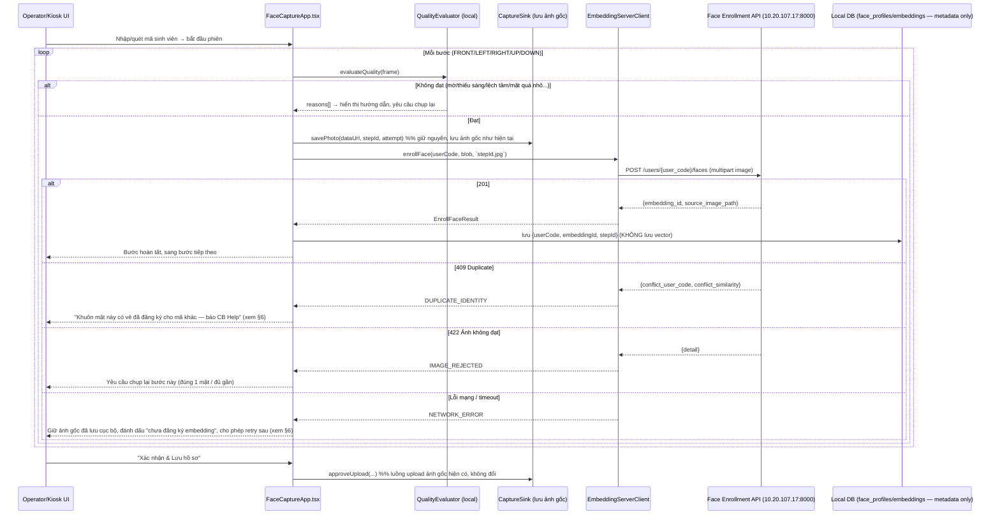
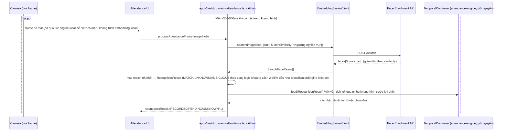

# Plan: Tích hợp server "Attendance — Face Enrollment API" vào luồng chụp ảnh

**Ngày:** 2026-09-10
**Server ngoài:** `http://10.20.107.17:8000` (đọc từ `/redoc` + `/openapi.json`, spec 3.1.0, `title: "Attendance — Face Enrollment API"`)
**Phạm vi đã chốt với user:** luồng chụp ảnh + embedding ảnh chụp đó — tức là luồng **đăng ký khuôn mặt (enrollment)** và **nhận diện (điểm danh)**, KHÔNG phải luồng ảnh thẻ 4x6/tách nền của `campaign-config-sso-card-photo-discussion.md` (luồng đó dùng AI để làm mịn/thay nền, không định danh).

---

## 1. Tóm tắt server ngoài

| Method | Đường dẫn | Chức năng |
|---|---|---|
| `POST` | `/users/{user_code}/faces` | Đăng ký 1 ảnh khuôn mặt cho `user_code` |
| `GET` | `/users/{user_code}/faces` | Liệt kê ảnh đã đăng ký |
| `DELETE` | `/users/{user_code}/faces` | Xoá toàn bộ ảnh của 1 người |
| `DELETE` | `/users/{user_code}/faces/{embedding_id}` | Xoá 1 ảnh |
| `POST` | `/search` | Tra cứu người theo ảnh (trả danh sách match, không trả vector) |
| `GET` | `/health` | `models_loaded: false` = server đang khởi động |

Đặc điểm quan trọng cho việc tích hợp:

- **Server tự làm hết**: nhận ảnh (multipart `image`), tự trích embedding, tự lưu, tự so khớp. Client **không bao giờ thấy vector** — khác hẳn kiến trúc local hiện tại (xem §2).
- **Đồng bộ**: `201` nghĩa là ảnh đã lưu xong (~0.3-0.5s/lần đăng ký). Khi đăng ký hàng loạt phải gọi **tuần tự**, không song song.
- **Ràng buộc ảnh khi đăng ký**: đúng 1 khuôn mặt, cạnh ngắn ≥112px, không phải ảnh chụp lại từ màn hình/ảnh in, ≤15MB, JPEG/PNG.
- **`user_code`**: `^[A-Za-z0-9._-]+$`, 1-64 ký tự. Server **không xác thực** mã này tồn tại hay không — ghi nhận nguyên trạng.
- **1 khuôn mặt chỉ thuộc 1 mã**: đăng ký ảnh trùng khuôn mặt đã có dưới mã khác → `409` kèm `conflict_user_code` + `conflict_similarity`. Đăng ký thêm ảnh cho **cùng** mã vẫn bình thường.
- **Khuyến nghị của chính API**: đăng ký 5-8 ảnh/người, nhiều góc/điều kiện khác nhau — **khớp gần như chính xác** với `defaultWorkflow` 5 bước hiện có trong [FaceCaptureApp.tsx](../../packages/ui/src/components/screens/FaceCaptureApp.tsx) (FRONT/LEFT/RIGHT/UP/DOWN).
- **`/search`**: nhận 1 ảnh (có thể nhiều mặt), trả `faces[]` (mặt lớn nhất trước), mỗi mặt có `matches[]` sắp giảm dần theo `similarity` (-1..1). Có `limit` (mặc định 10) và `min_similarity` (mặc định -1, không cắt) — **client tự chọn ngưỡng chấp nhận**, server không quyết định "đúng người".
- **`is_live`**: `false` = nghi chụp lại từ ảnh in/màn hình — chỉ là cảnh báo, không loại kết quả.
- Mã lỗi: `400` (file rỗng/hỏng), `404` (xoá `embedding_id` không tồn tại), `409` (trùng danh tính khi đăng ký), `413` (>15MB), `422` (chất lượng ảnh không đạt / tham số sai định dạng).

---

## 2. Hiện trạng pipeline embedding trong repo (đều là placeholder/chết)

| Thành phần | File | Trạng thái |
|---|---|---|
| Trích embedding | [MockEmbeddingExtractor.ts](../../packages/biometric/src/MockEmbeddingExtractor.ts) | Vector giả lập từ hash chuỗi seed, **không đọc ảnh** ("Two photos of the same person produce unrelated vectors") |
| Dựng hồ sơ | [ProfileBuilder.ts](../../packages/biometric/src/ProfileBuilder.ts) | Đánh dấu `DRAFT` khi dùng model MOCK — không bao giờ vào index nhận diện |
| Lưu vector | [FaceProfileRepository.ts](../../packages/database/src/repositories/FaceProfileRepository.ts) | Lưu `Float32Array` dạng blob trong SQLite local |
| So khớp | [IdentificationEngine.ts](../../packages/recognition-engine/src/IdentificationEngine.ts) | Cosine similarity **trong tiến trình**, so với gallery local |
| Wiring demo | [attendance.ts](../../apps/desktop/src/main/attendance.ts) | Tự nhận là "DEMO MODE" — gallery luôn rỗng vì mọi profile đều `DRAFT` |
| Sidecar Python | [services/python-ai](../../services/python-ai/src/api/routes/embedding.py) | Có `/embed`, nhãn model `"ArcFace-Python"` nhưng công thức thật là `sin(sum(ord(c)))` — **không ai gọi endpoint này** ([aiService.ts](../../apps/desktop/src/main/aiService.ts) chỉ ping `/health`) |
| Kế hoạch cũ | [FIX-PLAN.md](../FIX-PLAN.md) bước 18-19 | Định cắm model thật (InsightFace ArcFace R100 ONNX) **vào trong** `services/python-ai`, kèm lo ngại "3 nơi sinh embedding lệch tiền xử lý" |

Kết luận: chưa có bất kỳ pipeline embedding thật nào đang chạy. Server ngoài (10.20.107.17:8000) chính là "model thật" mà FIX-PLAN bước 18 đang chờ — nhưng nó chạy dưới dạng **dịch vụ hosted làm luôn cả việc lưu trữ + so khớp**, không phải chỉ trả vector về để client tự lưu/so khớp như FIX-PLAN bước 18 hình dung ban đầu.

### Vị trí sẵn có ăn khớp tốt

- [`CaptureSink.ts`](../../packages/ui/src/lib/CaptureSink.ts): mỗi ảnh chụp đã đi qua `savePhoto()` theo từng step, và `StudentSubjectInfo` đã có sẵn field **`userCode`** — đúng khái niệm `user_code` của server ngoài, không cần thêm field mới.
- `QualityEvaluator` ([QualityEvaluator.ts](../../packages/face-quality/src/QualityEvaluator.ts)) đã gate sharpness/brightness/kích thước mặt/center-offset/mắt/cười **trước khi lưu** — bổ sung tốt cho gate của server (server chỉ kiểm 1-mặt/≥112px/không chụp màn hình), giảm số lần bị `422` do ảnh kém.
- Quy ước đặt IPC handler `ipcMain.handle('domain:action', ...)` + `faceAPI.xxx` trong [preload/index.ts](../../apps/desktop/src/preload/index.ts)/[main/index.ts](../../apps/desktop/src/main/index.ts) (ví dụ `attendance:enroll`, `camera:getRoleMapping`) — dùng lại đúng convention này cho các handler mới.

---

## 3. Quyết định kiến trúc đề xuất

**Server ngoài trở thành nguồn sự thật duy nhất cho embedding + so khớp.** Cụ thể:

- **Bỏ** khỏi luồng chính (không xoá code ngay, nhưng ngừng gọi): `MockEmbeddingExtractor`, `IdentificationEngine` (so khớp local), phần lưu `vector_blob` trong `FaceProfileRepository`.
- **Giữ nguyên, không đụng**: `services/python-ai` (đây là dự án riêng cho pipeline ảnh thẻ — tách nền/làm mịn — theo `campaign-config-sso-card-photo-discussion.md` §3.5, không liên quan `/embed`).
- **Local DB** (`face_profiles`/`face_embeddings`) đổi vai trò: từ "kho vector để so khớp" thành **bảng tham chiếu** — lưu `user_code`, `embedding_id` (số nguyên server trả về), `source_image_path`, `created_at` để: (a) biết ảnh nào đã đăng ký mà không cần gọi `GET` mỗi lần, (b) xoá đúng `embedding_id` khi cần, (c) audit. **Không lưu vector nữa** vì server không bao giờ trả vector về.
- Điều này thực ra **đơn giản hoá** đúng mối lo trong FIX-PLAN bước 19 ("3 nơi có thể sinh embedding lệch tiền xử lý"): giờ chỉ còn **một nơi** sinh và so khớp — server ngoài — nên khỏi cần `PreprocessingSpec`/golden test vector nữa cho luồng này.
- `AttendanceService`/`TemporalConfirmer` ([attendance-engine](../../packages/attendance-engine)) **vẫn giữ** vai trò xác nhận qua nhiều khung hình liên tiếp — chỉ thay nguồn input: thay vì "probe vector so với gallery local", giờ là "kết quả `/search` mỗi vài trăm ms, tích luỹ qua thời gian". Cần đổi kiểu `AttendanceService.processRecognition` để nhận thẳng `RecognitionResult` đã build từ response `/search`, thay vì `probeVector + gallery`.

> **Việc CHƯA quyết** (nêu ở §9) — cần chốt trước khi code: `user_code` lấy từ trường nào (`subjectCode` hiện có trong `StudentSubjectInfo`, hay một mã riêng), và có giữ `IdentificationEngine`/gallery local làm **fallback khi mất mạng tới server ngoài** hay chấp nhận luồng phụ thuộc mạng hoàn toàn.

---

## 4. Client wrapper đề xuất

Một class mới, ví dụ `EmbeddingServerClient` trong `packages/biometric/src/EmbeddingServerClient.ts` (cạnh `MockEmbeddingExtractor` mà nó thay thế) hoặc gói mới `packages/embedding-client` nếu muốn tách khỏi `biometric` (gói `biometric` hiện tại thiên về xử lý vector local — có thể giữ tên nhưng đổi nội dung).

```ts
export interface EmbeddingServerConfig {
  baseUrl: string;       // từ EMBEDDING_SERVER_BASE_URL, theo đúng pattern AI_SERVICE_BASE_URL trong aiService.ts
  timeoutMs?: number;    // đề xuất 8000 — enroll ~0.3-0.5s, search phụ thuộc số mặt
}

export interface EnrollFaceResult {
  userCode: string;
  embeddingId: number | null;
  sourceImagePath: string;
}

export type EnrollFaceError =
  | { kind: 'EMPTY_OR_UNREADABLE' }              // 400
  | { kind: 'DUPLICATE_IDENTITY'; conflictUserCode: string; conflictSimilarity: number } // 409
  | { kind: 'FILE_TOO_LARGE' }                   // 413
  | { kind: 'IMAGE_REJECTED'; detail: string }    // 422 (không thấy mặt / nhiều mặt / <112px / chụp màn hình)
  | { kind: 'NETWORK_ERROR'; cause: unknown };

export interface SearchMatch {
  userCode: string;
  similarity: number;
  embeddingId: number;
  sourceImagePath: string;
}
export interface SearchFaceResult {
  bbox: [number, number, number, number];
  faceSizePx: number;
  isLive: boolean;
  matches: SearchMatch[];
}

export class EmbeddingServerClient {
  constructor(private config: EmbeddingServerConfig) {}
  async health(): Promise<{ ok: boolean; modelsLoaded: boolean }>;
  async enrollFace(userCode: string, imageBlob: Blob, fileName: string): Promise<EnrollFaceResult>; // may throw typed error above
  async listFaces(userCode: string): Promise<{ id: number; sourceImagePath: string; createdAt: string }[]>;
  async deleteFace(userCode: string, embeddingId: number): Promise<{ deleted: number }>;
  async deleteAllFaces(userCode: string): Promise<{ deleted: number }>;
  async search(imageBlob: Blob, opts?: { limit?: number; minSimilarity?: number }): Promise<SearchFaceResult[]>;
}
```

Điểm cần lưu ý khi cài:

- **Gọi tuần tự khi đăng ký nhiều ảnh** trong một phiên 5 bước — API nói rõ đồng bộ, không nên `Promise.all`.
- **`multipart/form-data`** với field tên đúng `image` — ảnh chụp trong app hiện là `dataUrl` (base64) ở tầng `CaptureSink`/`FaceCaptureApp`; cần convert `dataUrl → Blob` trước khi gửi (browser: `fetch(dataUrl).then(r => r.blob())`, hoặc decode base64 thủ công nếu chạy trong main process Node — main process không có `fetch`-từ-dataURL, dùng `Buffer.from(base64, 'base64')` rồi bọc trong `FormData`/`Blob` của `undici`).
- **Timeout + AbortSignal** giống `pingAiService` trong `aiService.ts` — không để một cuộc gọi treo cả phiên chụp.
- **Không log ảnh gốc / vector** ra console hay file log thường (chỉ log `embedding_id`, `similarity`, mã lỗi) — ảnh khuôn mặt là dữ liệu sinh trắc học nhạy cảm.

---

## 5. Luồng xử lý

### 5.1. Luồng đăng ký (enrollment) — trong lúc chụp 5 góc



Ghi chú thiết kế:

- Mỗi **bước** (không phải mỗi khung hình) gọi 1 lần `enrollFace` — khớp đúng "đúng 1 khuôn mặt/ảnh" của server và giới hạn 5 lần gọi/phiên thay vì gọi theo từng frame video.
- Việc lưu ảnh gốc (`CaptureSink.savePhoto` → hàng đợi upload lên file-service) và việc gọi `enrollFace` là **hai luồng song song, độc lập** — một cái phục vụ lưu trữ/in ấn/audit như hiện tại, một cái phục vụ nhận diện. Enroll thất bại không được chặn việc lưu ảnh gốc, và ngược lại.
- Trường hợp `NETWORK_ERROR` cần một cơ chế **hàng đợi retry** tương tự `uploads:retry`/outbox đã có cho ảnh gốc (`apps/desktop/src/main`), vì kiosk vốn đã "offline-first" theo mô tả trong `CaptureSink.ts`. Đề xuất: thêm cột `embedding_status: 'PENDING' | 'DONE' | 'FAILED'` vào local DB, và một worker định kỳ (giống upload worker) thử lại các bước `PENDING`/`FAILED` khi server có mạng trở lại (`GET /health`).

### 5.2. Luồng nhận diện (điểm danh)



Ghi chú:

- **Không cần local CV engine trích embedding nữa** — chỉ cần biết "có mặt trong khung hình" để quyết định *khi nào* gọi `/search` (gọi liên tục mọi frame sẽ tốn cả băng thông lẫn tải server; nên gate bằng face-detector local nhẹ, giống cách `FaceState` hiện đang dùng để hiện hướng dẫn).
- **Ngưỡng chấp nhận** (`min_similarity`, và khoảng cách với kết quả thứ 2 để tránh AMBIGUOUS) — server không quyết định giúp, client tự đặt. Đề xuất tái dùng nguyên `ThresholdPolicy`/`SecurityLevel` đã có trong `packages/recognition-engine` (BALANCED/STRICT...) nhưng áp lên `similarity` trả về từ `/search` thay vì cosine tự tính.
- `IdentificationEngine.identify()` (so khớp local) **không cần gọi nữa** trong luồng chính — logic MATCH/UNKNOWN/AMBIGUOUS của nó (so khoảng cách top-1/top-2) vẫn còn giá trị, nên **tái dùng phần logic quyết định**, chỉ đổi nguồn `candidates` từ "tính cosine với gallery local" sang "đọc thẳng từ `matches[]` của server".

---

## 6. Xử lý lỗi & thông báo cho operator

| Tình huống | Mã | Hành vi đề xuất trên UI |
|---|---|---|
| Ảnh rỗng/hỏng | `400` | Hiếm khi xảy ra (ảnh luôn có dữ liệu từ camera) — log lỗi, coi như lỗi hệ thống, cho chụp lại |
| Trùng khuôn mặt với mã khác | `409` | **Không tự động chặn phiên** — hiển thị cảnh báo rõ ràng kèm `conflict_user_code`/`conflict_similarity` cho CB Help xử lý thủ công (có thể là 1 người đăng ký 2 lần dưới 2 mã, hoặc gian lận). Vẫn cho lưu ảnh gốc bình thường; chỉ bước embedding của step đó đánh dấu `FAILED (conflict)` |
| File quá 15MB | `413` | Không nên xảy ra (ảnh capture ở 720p/1080p JPEG thường <2MB) — nếu xảy ra, nén lại trước khi gửi, không chặn phiên |
| Không thấy mặt / nhiều hơn 1 mặt / mặt <112px / nghi chụp màn hình | `422` (đăng ký) | Yêu cầu chụp lại đúng bước đó — tái dùng UI "chụp lại" đã có sẵn trong `SessionReviewModal`/`GuidedCaptureScreen` |
| Không thấy mặt nào / `limit`/`min_similarity` sai | `422` (`/search`) | Bỏ qua frame đó, thử frame kế tiếp (điểm danh vốn đã lặp nhiều khung hình) |
| Mất mạng tới server / timeout | — | Enrollment: xếp hàng retry (xem §5.1). Điểm danh: hiện trạng thái "không kết nối được máy chủ nhận diện" thay vì báo UNKNOWN sai lệch (tránh để operator tưởng "không nhận ra ai" trong khi thực ra là mất mạng) |
| `models_loaded: false` (server vừa khởi động) | — | `GET /health` trước khi cho bắt đầu phiên chụp mới ở kiosk, giống cách `pingAiService` hiện đang ping sidecar Python |

---

## 7. Cấu hình & vận hành

- **Env var**: `EMBEDDING_SERVER_BASE_URL`, mặc định có thể để trống → tính năng tắt (fallback: không gọi enroll/search, giữ nguyên hành vi demo hiện tại) — theo đúng pattern optional-override của `AI_SERVICE_BASE_URL` trong `aiService.ts`.
- **IPC mới** (theo đúng convention `domain:action` đã thấy trong `main/index.ts`):
  - `embedding:enrollFace` — nhận `{ userCode, stepId, dataUrl }`
  - `embedding:search` — nhận `{ dataUrl, limit?, minSimilarity? }`
  - `embedding:health` — dùng cho preflight trước phiên chụp
  - `embedding:listFaces`, `embedding:deleteFace`, `embedding:deleteAllFaces` — phục vụ màn hình quản trị (xoá hồ sơ khi 1 sinh viên bị xoá khỏi hệ thống, hoặc CB Help sửa sai)
- **Mạng**: kiosk phải reach được `10.20.107.17:8000` — cần xác nhận đây là IP nội bộ ổn định lâu dài hay chỉ tạm thời cho môi trường test/demo trước khi hard-code vào cấu hình production.
- **Bảo mật**: API hiện không thấy cơ chế xác thực (API key/token) trong spec đọc được — cần hỏi bên vận hành server có kế hoạch thêm xác thực không, vì hiện tại bất kỳ ai reach được IP đều đăng ký/xoá/tra cứu được khuôn mặt của bất kỳ `user_code` nào.
- **Retention**: cần chính sách xoá — khi 1 sinh viên/campaign bị xoá ở hệ thống chính, có cần gọi `DELETE /users/{user_code}/faces` tương ứng không (server không tự biết `user_code` nào đã "hết hạn").

---

## 8. Việc cần làm (ước lượng sơ bộ)

| # | Việc | File chính | Ghi chú |
|---|---|---|---|
| 1 | `EmbeddingServerClient` + kiểu lỗi/response | `packages/biometric/src/EmbeddingServerClient.ts` (mới) | Unit test với server thật hoặc mock HTTP |
| 2 | Thêm cột trạng thái embedding vào local DB | `packages/database/src/migrations/0XX-*.ts`, `FaceProfileRepository.ts` (hoặc bảng mới `face_embedding_refs`) | Không lưu vector nữa — đổi schema |
| 3 | Wiring enrollment vào `FaceCaptureApp.tsx` | Sau mỗi step `COMPLETED` + qua `QualityEvaluator` | Song song với `CaptureSink.savePhoto`, không chặn nhau |
| 4 | Viết lại `attendance.ts` dùng `/search` thay `MockEmbeddingExtractor`/gallery local | `apps/desktop/src/main/attendance.ts` | Giữ `AttendanceService`/`TemporalConfirmer`, đổi input |
| 5 | IPC handlers + preload bridge | `apps/desktop/src/main/index.ts`, `apps/desktop/src/preload/index.ts` | Theo convention `domain:action` |
| 6 | Cơ chế retry cho enroll thất bại vì mạng | Worker mới hoặc mở rộng upload outbox hiện có | Tái dùng pattern `uploads:retry` |
| 7 | UI báo lỗi 409/422 cho operator | `SessionReviewModal.tsx` / màn hình chụp | Copy tiếng Việt theo §6 |
| 8 | Xoá `MOCK` embeddings cũ, ngừng đánh dấu `DRAFT` cho luồng mới | `ProfileBuilder.ts` hoặc bỏ hẳn khỏi luồng chính | Theo đúng cảnh báo trong FIX-PLAN bước 6-7 |

---

## 9. Câu hỏi mở — cần chốt trước khi code

1. **`user_code` lấy từ đâu?** Dùng `StudentSubjectInfo.subjectCode` (mã sinh viên đã có sẵn), hay cần một mã riêng? Mã phải khớp `^[A-Za-z0-9._-]+$`, 1-64 ký tự — cần xác nhận mã sinh viên hiện tại luôn khớp định dạng này (không dấu, không khoảng trắng).
2. **Có giữ local matching làm fallback offline không**, hay chấp nhận điểm danh phụ thuộc hoàn toàn vào server ngoài còn sống?
3. **Xử lý `409` (trùng danh tính) ở UX nào** — chặn hẳn phiên, hay chỉ cảnh báo và để CB Help xử lý thủ công sau?
4. **`10.20.107.17:8000` có phải địa chỉ production ổn định** hay chỉ để test — có kế hoạch xác thực (API key) và HTTPS không?
5. **Chính sách xoá dữ liệu** khi 1 người bị xoá khỏi hệ thống chính — ai gọi `DELETE`, gọi khi nào?
6. **Ngưỡng `min_similarity`/khoảng cách top-1–top-2** dùng cho quyết định MATCH/AMBIGUOUS khi điểm danh — giữ nguyên các mức `ThresholdPolicy` hiện có (BALANCED/STRICT...) hay cần hiệu chỉnh lại theo đặc tính model của server ngoài (chưa rõ model gì, benchmark thế nào)?
