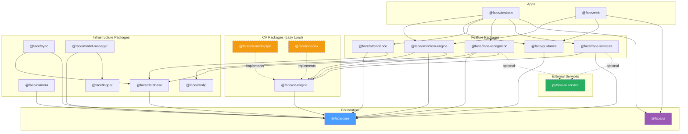
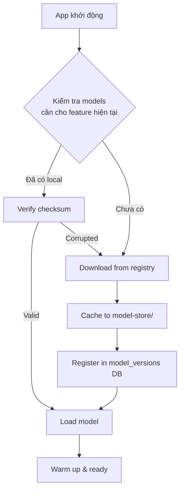
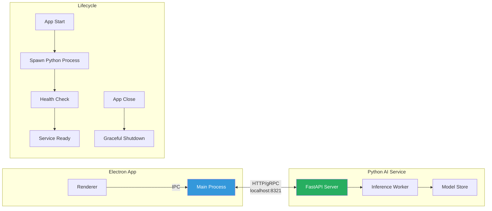
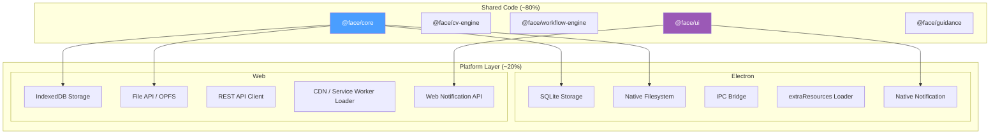
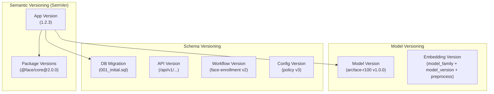

# Face Platform — Phân Tích Kiến Trúc & Kỹ Thuật Chuyên Sâu

> Bổ sung cho [face_platform_analysis.md](file:///Users/skyline/.gemini/antigravity-ide/brain/1c4010a9-579b-41e9-9e4b-0f282babad0a/face_platform_analysis.md)

---

# 1. KIẾN TRÚC TỔNG THỂ

## 1.1. Nguyên Tắc Kiến Trúc

| # | Nguyên tắc | Mô tả |
|---|-----------|-------|
| 1 | **Package Independence** | Mỗi module là một package NPM độc lập, có thể publish/install riêng |
| 2 | **Platform Agnostic Core** | Domain logic không phụ thuộc Electron hay Browser — chạy được trên cả hai |
| 3 | **Plugin-Based Models** | AI models không đóng gói cùng app — tải về on-demand, quản lý version riêng |
| 4 | **Service Isolation** | Python/heavy AI chạy như service riêng (sidecar/microservice), giao tiếp qua API |
| 5 | **Lazy Loading** | Chỉ load module khi cần — camera module không load recognition code |
| 6 | **Contract-First** | Interface/types định nghĩa trước, implementation sau. Cho phép mock & swap |
| 7 | **Shared UI Library** | UI components dùng chung giữa Electron app và Web app |
| 8 | **Documentation as Code** | Tài liệu nằm cùng repo, version cùng code, structured theo feature |

## 1.2. Monorepo Architecture

```
face-platform/
├── apps/                          # Ứng dụng chạy được
│   ├── desktop/                   # Electron app
│   │   ├── src/
│   │   │   ├── main/              # Electron main process
│   │   │   ├── preload/           # Context bridge
│   │   │   └── renderer/          # Entry point, imports từ packages
│   │   ├── electron-builder.yml
│   │   └── package.json
│   │
│   └── web/                       # Web app (standalone)
│       ├── src/
│       │   ├── app/               # Next.js/Vite app
│       │   └── platform/          # Web-specific platform adapters
│       ├── vite.config.ts
│       └── package.json
│
├── packages/                      # Thư viện độc lập
│   ├── core/                      # Domain types, interfaces, contracts
│   ├── camera/                    # Camera abstraction
│   ├── cv-engine/                 # CV Engine interface + base
│   ├── cv-mediapipe/              # MediaPipe adapter (optional install)
│   ├── cv-onnx/                   # ONNX adapter (optional install)
│   ├── face-detection/            # Face detection logic
│   ├── face-landmarks/            # Landmarks processing
│   ├── face-quality/              # Quality assessment
│   ├── face-embedding/            # Embedding generation
│   ├── face-recognition/          # 1:N search, threshold, temporal
│   ├── face-liveness/             # Liveness detection
│   ├── hand-gesture/              # Hand gesture recognition (MediaPipe Hand Landmarker)
│   ├── workflow-engine/           # Guided capture workflow
│   ├── guidance/                  # Guidance logic & messages
│   ├── attendance/                # Attendance business rules
│   ├── database/                  # SQLite abstraction
│   ├── sync/                      # Server sync queue
│   ├── model-manager/             # AI model download/version/cache
│   ├── config/                    # Configuration system
│   ├── logger/                    # Structured logging
│   └── ui/                        # Shared UI component library
│       ├── src/
│       │   ├── components/        # shadcn-based components
│       │   ├── hooks/             # Shared React hooks
│       │   ├── lib/               # cn(), clsx utilities
│       │   └── styles/            # TailwindCSS config & tokens
│       └── package.json
│
├── services/                      # Standalone services
│   └── python-ai/                 # Python AI service (sidecar)
│       ├── src/
│       │   ├── api/               # FastAPI endpoints
│       │   ├── models/            # Model inference wrappers
│       │   └── workers/           # Background workers
│       ├── requirements.txt
│       ├── Dockerfile
│       └── pyproject.toml
│
├── docs/                          # Tài liệu (xem Section 7)
├── tools/                         # Build tools, scripts
├── turbo.json                     # Turborepo config
├── pnpm-workspace.yaml            # Workspace definition
└── package.json                   # Root package.json
```

## 1.3. Package Dependency Graph



> [!IMPORTANT]
> **Đường nét đứt** = optional/lazy-loaded. Các package CV adapter và Python service KHÔNG phải dependency cứng — chúng được tải khi cần.

## 1.4. Tối Đa Hóa Tái Sử Dụng

### Nguyên tắc tái sử dụng theo 3 tầng:

```
Tầng 1: CORE (dùng mọi nơi)
├── Types, Interfaces, Enums
├── Error codes, Result types
├── Configuration schemas
├── Validation utilities
└── Constants & shared logic

Tầng 2: FEATURE PACKAGES (dùng trong nhiều app)
├── workflow-engine → dùng trong cả desktop & web
├── face-quality → dùng trong capture & recognition
├── guidance → dùng trong registration & attendance
└── camera → dùng trong mọi feature cần camera

Tầng 3: APP-SPECIFIC (chỉ dùng trong 1 app)
├── Electron IPC handlers
├── Electron main process code
├── Web-specific routing
└── Platform-specific storage adapters
```

### Platform Adapter Pattern

Mỗi package cần platform-specific code phải expose adapter interface:

```typescript
// @face/core — Platform adapter interface
interface PlatformAdapter {
  storage: StorageAdapter;      // FS (Electron) vs IndexedDB (Web)
  modelLoader: ModelLoader;     // extraResources (Electron) vs CDN (Web)
  camera: CameraAdapter;       // Same API, different permission flow
  notification: NotifyAdapter;  // Native notification vs Web notification
}

// @face/database — Storage adapter
interface StorageAdapter {
  type: 'sqlite' | 'indexeddb' | 'memory';
  initialize(): Promise<void>;
  // ... CRUD operations
}
```

```
Desktop:  PlatformAdapter → ElectronAdapter → SQLite + FS + Native
Web:      PlatformAdapter → WebAdapter → IndexedDB + CDN + Web APIs
```

---

# 2. DYNAMIC LIBRARY & MODEL LOADING

## 2.1. Vấn Đề Với Bundling Tất Cả

| Vấn đề | Ảnh hưởng |
|--------|----------|
| Bundle size quá lớn | MediaPipe ~30MB, ONNX Runtime ~40MB, models ~100MB+ |
| Tải chậm lần đầu | User phải đợi tải tất cả trước khi dùng bất kỳ feature nào |
| Không linh hoạt | Không thể thay model mà không rebuild app |
| Lãng phí tài nguyên | Feature Recognition tải model Liveness dù user không dùng |

## 2.2. Model Manager — Quản Lý Gói Tải Xuống



### Model Registry Structure

```
model-store/                              # Ngoài app bundle
├── registry.json                         # Manifest tất cả models available
├── face-detection/
│   ├── mediapipe-face-detector/
│   │   ├── v1.0.0/
│   │   │   ├── model.tflite              # Model file
│   │   │   ├── manifest.json             # Metadata + checksum
│   │   │   └── WASM/                     # WASM runtime files
│   │   └── v1.1.0/
│   │       └── ...
│   └── onnx-face-detector/
│       └── v1.0.0/
│           ├── model.onnx
│           └── manifest.json
├── face-embedding/
│   ├── arcface-r100/
│   │   └── v1.0.0/
│   │       ├── model.onnx
│   │       └── manifest.json
│   └── facenet-512/
│       └── v1.0.0/
│           └── ...
├── face-liveness/
│   └── silent-face-anti-spoof/
│       └── v1.0.0/
│           └── ...
└── downloads/                            # Temp download area
    └── ...
```

### Model Manifest (`manifest.json`)

```json
{
  "name": "mediapipe-face-landmarker",
  "family": "mediapipe",
  "version": "1.0.0",
  "type": "face-detection",
  "runtime": "tflite-wasm",
  "files": [
    {
      "name": "face_landmarker.task",
      "size": 12582912,
      "sha256": "abc123...",
      "url": "https://storage.googleapis.com/mediapipe-models/..."
    }
  ],
  "metadata": {
    "inputSize": [192, 192],
    "embeddingDimension": null,
    "similarityMetric": null,
    "preprocessingVersion": "1.0"
  },
  "compatibility": {
    "minAppVersion": "0.1.0",
    "platforms": ["electron", "web"],
    "requiredPackage": "@face/cv-mediapipe"
  },
  "license": "Apache-2.0"
}
```

### `@face/model-manager` API

```typescript
interface ModelManager {
  // Query
  listAvailable(type: ModelType): Promise<ModelInfo[]>;
  listInstalled(type: ModelType): Promise<InstalledModel[]>;
  getStatus(modelId: string): ModelStatus; // NOT_INSTALLED | DOWNLOADING | READY | ERROR
  
  // Lifecycle
  download(modelId: string, version: string, onProgress?: ProgressCallback): Promise<void>;
  verify(modelId: string): Promise<VerifyResult>;
  load(modelId: string): Promise<LoadedModel>;
  unload(modelId: string): Promise<void>;
  delete(modelId: string, version: string): Promise<void>;
  
  // Version
  getActiveVersion(modelType: ModelType): string;
  setActiveVersion(modelType: ModelType, modelId: string, version: string): Promise<void>;
  
  // Events
  on(event: 'download-progress' | 'model-ready' | 'model-error', handler: Function): void;
}
```

## 2.3. Lazy Loading Strategy — Packages

```typescript
// Không import trực tiếp — lazy load khi cần
// ❌ Sai
import { MediaPipeCVEngine } from '@face/cv-mediapipe';

// ✅ Đúng — Dynamic import
async function loadCVEngine(type: 'mediapipe' | 'onnx'): Promise<CVEngine> {
  switch (type) {
    case 'mediapipe': {
      const { MediaPipeCVEngine } = await import('@face/cv-mediapipe');
      return new MediaPipeCVEngine();
    }
    case 'onnx': {
      const { ONNXCVEngine } = await import('@face/cv-onnx');
      return new ONNXCVEngine();
    }
  }
}

// Feature-level lazy loading
const loadRecognitionModule = () => import('@face/face-recognition');
const loadLivenessModule = () => import('@face/face-liveness');
const loadAttendanceModule = () => import('@face/attendance');
```

### Route-Based Code Splitting (cho cả Electron & Web)

```typescript
// React lazy loading theo feature/route
const RegistrationPage = lazy(() => import('./features/registration/RegistrationPage'));
const RecognitionPage = lazy(() => import('./features/recognition/RecognitionPage'));
const AttendancePage = lazy(() => import('./features/attendance/AttendancePage'));
const AdminPage = lazy(() => import('./features/admin/AdminPage'));

function App() {
  return (
    <Suspense fallback={<LoadingScreen />}>
      <Routes>
        <Route path="/register" element={<RegistrationPage />} />
        <Route path="/recognize" element={<RecognitionPage />} />
        <Route path="/attendance" element={<AttendancePage />} />
        <Route path="/admin" element={<AdminPage />} />
      </Routes>
    </Suspense>
  );
}
```

---

# 3. PYTHON AI SERVICE — KIẾN TRÚC TÁCH BIỆT

## 3.1. Khi Nào Cần Python?

| Tính năng | JS/WASM đủ? | Cần Python? | Lý do |
|-----------|------------|-------------|-------|
| Face Detection (MediaPipe) | ✅ | ❌ | WASM port đủ tốt |
| Face Landmarks | ✅ | ❌ | MediaPipe WASM |
| Face Quality (basic) | ✅ | ❌ | Laplacian, histogram — thuần toán |
| Face Embedding (ArcFace, FaceNet) | ⚠️ | ✅ | ONNX.js hạn chế GPU, Python + ONNX/PyTorch tốt hơn |
| Advanced Liveness (deep model) | ⚠️ | ✅ | Model phức tạp, cần GPU |
| Batch Re-encoding | ❌ | ✅ | Xử lý hàng loạt, cần throughput |
| Model Training/Fine-tuning | ❌ | ✅ | Chỉ Python ecosystem |

## 3.2. Kiến Trúc Sidecar Service



### Python Service Structure

```
services/python-ai/
├── src/
│   ├── api/
│   │   ├── __init__.py
│   │   ├── app.py                  # FastAPI app
│   │   ├── routes/
│   │   │   ├── embedding.py        # POST /api/v1/embed
│   │   │   ├── liveness.py         # POST /api/v1/liveness
│   │   │   ├── quality.py          # POST /api/v1/quality-advanced
│   │   │   ├── batch.py            # POST /api/v1/batch/re-encode
│   │   │   └── health.py           # GET /api/v1/health
│   │   └── middleware/
│   │       ├── auth.py             # Local-only auth
│   │       └── rate_limit.py
│   ├── models/
│   │   ├── base.py                 # Abstract model interface
│   │   ├── arcface.py              # ArcFace embedding
│   │   ├── facenet.py              # FaceNet embedding
│   │   └── anti_spoof.py           # Anti-spoofing model
│   ├── workers/
│   │   ├── inference.py            # GPU/CPU inference worker
│   │   └── batch.py                # Batch processing worker
│   └── config.py
├── tests/
├── Dockerfile
├── pyproject.toml
├── requirements.txt
└── README.md
```

### API Contract (Python ↔ Electron)

```yaml
# OpenAPI spec cho Python service
paths:
  /api/v1/health:
    get:
      summary: Health check
      responses:
        200:
          content:
            application/json:
              schema:
                type: object
                properties:
                  status: { type: string, enum: [healthy, degraded, unhealthy] }
                  models_loaded: { type: array, items: { type: string } }
                  gpu_available: { type: boolean }
                  uptime_seconds: { type: number }

  /api/v1/embed:
    post:
      summary: Generate face embedding
      requestBody:
        content:
          multipart/form-data:
            schema:
              type: object
              properties:
                image: { type: string, format: binary }
                model: { type: string, default: "arcface-r100" }
      responses:
        200:
          content:
            application/json:
              schema:
                type: object
                properties:
                  vector: { type: array, items: { type: number } }
                  dimension: { type: integer }
                  model_family: { type: string }
                  model_version: { type: string }
                  processing_ms: { type: number }

  /api/v1/liveness:
    post:
      summary: Liveness detection
      requestBody:
        content:
          multipart/form-data:
            schema:
              type: object
              properties:
                image: { type: string, format: binary }
                model: { type: string, default: "silent-face" }
      responses:
        200:
          content:
            application/json:
              schema:
                type: object
                properties:
                  is_live: { type: boolean }
                  score: { type: number }
                  model_version: { type: string }
```

### Python Service Lifecycle Management (từ Electron)

```typescript
// @face/desktop — PythonServiceManager
class PythonServiceManager {
  private process: ChildProcess | null = null;
  private port = 8321;

  async start(): Promise<void> {
    // 1. Kiểm tra Python environment
    // 2. Spawn process
    // 3. Health check loop
    // 4. Emit 'ready' event
  }

  async stop(): Promise<void> {
    // Graceful shutdown via API → SIGTERM → SIGKILL timeout
  }

  async healthCheck(): Promise<ServiceHealth> {
    // GET /api/v1/health
  }

  isAvailable(): boolean {
    // Service running & healthy?
  }
}
```

> [!TIP]
> **Web app** có thể kết nối đến cùng Python service nếu deploy trên cùng server — chỉ thay đổi endpoint URL.

---

# 4. DUAL-TARGET: ELECTRON + WEB

## 4.1. Platform Abstraction Layer



### Tính năng theo platform

| Tính năng | Electron | Web | Ghi chú |
|-----------|----------|-----|---------|
| Camera preview | ✅ getUserMedia | ✅ getUserMedia | Giống nhau |
| Face detection | ✅ WASM/Worker | ✅ WASM/Worker | Giống nhau |
| Guided capture | ✅ | ✅ | Shared workflow engine |
| Image storage | ✅ Local FS | ✅ OPFS / Upload | Platform adapter |
| SQLite | ✅ better-sqlite3 | ⚠️ sql.js / IndexedDB | Adapter |
| Offline mode | ✅ Full | ⚠️ Service Worker cache | Limited trên web |
| Model loading | ✅ extraResources | ✅ CDN + cache | Adapter |
| Python service | ✅ Sidecar | ✅ Remote API | Endpoint config |
| Kiosk mode | ✅ Fullscreen | ⚠️ Browser fullscreen | Limited |
| Auto-start | ✅ | ❌ | Electron only |

## 4.2. Shared Config Pattern

```typescript
// @face/config
interface AppConfig {
  platform: 'electron' | 'web';
  
  storage: {
    type: 'sqlite' | 'indexeddb';
    path?: string;  // Electron only
  };
  
  models: {
    source: 'local' | 'cdn' | 'python-service';
    localPath?: string;
    cdnUrl?: string;
    serviceUrl?: string;
  };
  
  features: {
    recognition: boolean;    // Có bật recognition?
    liveness: boolean;       // Có bật liveness?
    attendance: boolean;     // Có bật attendance?
    sync: boolean;           // Có bật server sync?
  };
}
```

---

# 5. UI/UX — TECH STACK & COMPONENT LIBRARY

## 5.1. Styling Architecture

| Tool | Vai trò | Lý do chọn |
|------|---------|------------|
| **TailwindCSS v4** | Utility-first CSS framework | Rapid prototyping, consistent design tokens, tree-shaking |
| **shadcn/ui** | Component library (copy-paste, customizable) | Không phải dependency — components thuộc về project |
| **clsx** | Conditional className builder | Lightweight, type-safe |
| **tailwind-merge** | Merge & deduplicate Tailwind classes | Tránh conflict khi compose classes |
| **cn() utility** | Combined clsx + tailwind-merge | Chuẩn shadcn pattern |
| **CSS Variables** | Design tokens (colors, spacing, typography) | Theme-able, dynamic theme switching |
| **Lucide React** | Icon library | Consistent, tree-shakable, shadcn default |

### cn() Utility Setup

```typescript
// packages/ui/src/lib/utils.ts
import { type ClassValue, clsx } from 'clsx';
import { twMerge } from 'tailwind-merge';

export function cn(...inputs: ClassValue[]) {
  return twMerge(clsx(inputs));
}
```

### Tailwind Config (Shared)

```typescript
// packages/ui/tailwind.config.ts
import type { Config } from 'tailwindcss';

export default {
  darkMode: 'class',
  content: [
    './src/**/*.{ts,tsx}',
    '../../packages/ui/src/**/*.{ts,tsx}', // Shared UI
  ],
  theme: {
    extend: {
      colors: {
        // Design tokens — semantic colors
        'face-primary': 'hsl(var(--face-primary))',
        'face-success': 'hsl(var(--face-success))',
        'face-warning': 'hsl(var(--face-warning))',
        'face-error': 'hsl(var(--face-error))',
        'face-guide': 'hsl(var(--face-guide))',
        'face-overlay': 'hsl(var(--face-overlay) / <alpha-value>)',
      },
      animation: {
        'face-pulse': 'face-pulse 2s ease-in-out infinite',
        'face-scan': 'face-scan 1.5s ease-in-out infinite',
        'countdown-tick': 'countdown-tick 1s ease-out',
        'capture-flash': 'capture-flash 0.3s ease-out',
        'slide-up': 'slide-up 0.3s ease-out',
      },
      keyframes: {
        'face-pulse': {
          '0%, 100%': { borderColor: 'hsl(var(--face-guide))' },
          '50%': { borderColor: 'hsl(var(--face-guide) / 0.5)' },
        },
        'capture-flash': {
          '0%': { opacity: '1', background: 'white' },
          '100%': { opacity: '0' },
        },
      },
    },
  },
} satisfies Config;
```

## 5.2. Shared UI Component Library (`@face/ui`)

```
packages/ui/
├── src/
│   ├── components/
│   │   ├── base/                      # shadcn base components
│   │   │   ├── button.tsx
│   │   │   ├── card.tsx
│   │   │   ├── dialog.tsx
│   │   │   ├── progress.tsx
│   │   │   ├── select.tsx
│   │   │   ├── badge.tsx
│   │   │   ├── toast.tsx
│   │   │   ├── tooltip.tsx
│   │   │   └── skeleton.tsx
│   │   │
│   │   ├── camera/                    # Camera-specific UI
│   │   │   ├── CameraPreview.tsx      # Mirrored video preview
│   │   │   ├── CameraSelector.tsx     # Device dropdown
│   │   │   ├── CameraPermission.tsx   # Permission request UI
│   │   │   └── CameraError.tsx        # Error states
│   │   │
│   │   ├── face/                      # Face capture UI
│   │   │   ├── FaceGuideOverlay.tsx   # Oval guide frame
│   │   │   ├── FaceBoundingBox.tsx    # Detection box overlay
│   │   │   ├── PoseIndicator.tsx      # Yaw/Pitch/Roll visual
│   │   │   ├── QualityBadge.tsx       # Quality status badges
│   │   │   └── LandmarkOverlay.tsx    # Debug landmarks
│   │   │
│   │   ├── workflow/                  # Workflow UI
│   │   │   ├── StepProgress.tsx       # ● ━ ● ━ ○ ━ ○ step bar
│   │   │   ├── GuidanceMessage.tsx    # Dynamic instruction text
│   │   │   ├── CountdownTimer.tsx     # 3-2-1 countdown
│   │   │   ├── StabilityProgress.tsx  # Stability bar
│   │   │   └── CaptureFlash.tsx       # Camera flash effect
│   │   │
│   │   ├── recognition/              # Recognition UI
│   │   │   ├── IdentityCard.tsx       # Matched person display
│   │   │   ├── SearchingIndicator.tsx # Searching animation
│   │   │   └── AttendanceResult.tsx   # Check-in result
│   │   │
│   │   ├── admin/                     # Admin UI
│   │   │   ├── DiagnosticsPanel.tsx
│   │   │   ├── ModelManager.tsx
│   │   │   └── PersonList.tsx
│   │   │
│   │   └── debug/                     # Debug tools
│   │       ├── DebugPanel.tsx         # FPS, pose, quality metrics
│   │       ├── SimulationSliders.tsx  # Pose simulation
│   │       └── PerformanceMonitor.tsx
│   │
│   ├── hooks/
│   │   ├── useCamera.ts
│   │   ├── useFaceState.ts
│   │   ├── useWorkflow.ts
│   │   ├── useGuidance.ts
│   │   ├── useStability.ts
│   │   ├── useMediaQuery.ts
│   │   └── useTheme.ts
│   │
│   ├── lib/
│   │   ├── utils.ts                   # cn() utility
│   │   └── constants.ts
│   │
│   ├── styles/
│   │   ├── globals.css                # CSS variables, base styles
│   │   └── tailwind.config.ts         # Shared config
│   │
│   └── index.ts                       # Public API exports
│
├── package.json
└── tsconfig.json
```

## 5.3. UX Design Principles

| Nguyên tắc | Implementation |
|-----------|---------------|
| **1 dominant instruction** | Chỉ hiện 1 guidance message tại 1 thời điểm, theo priority |
| **Status qua icon + text + shape** | Không chỉ dùng màu (accessibility), dùng kết hợp `<Badge>` + icon |
| **Smooth transitions** | TailwindCSS animation utilities + `framer-motion` cho complex transitions |
| **Responsive layout** | Container queries + responsive breakpoints, hoạt động trên cả kiosk & desktop |
| **Dark mode ready** | shadcn dark mode via CSS variables, `class` strategy |
| **Touch-friendly** | Min touch target 44×44px, large buttons cho kiosk |
| **Loading states** | Skeleton (shadcn), progress bars, spinner cho mọi async operation |
| **Error recovery** | Mọi error có button retry/action, không dead-end UI states |

---

# 6. VERSION MANAGEMENT

## 6.1. Versioning Strategy



### Version Matrix

| Thành phần | Versioning scheme | Ví dụ | Lưu trữ |
|-----------|------------------|-------|---------|
| **App** | SemVer | `1.0.0` | `package.json` |
| **Packages** | SemVer (independent) | `@face/core@2.1.0` | `package.json` |
| **AI Models** | SemVer | `arcface-r100@1.0.0` | `manifest.json` |
| **Embeddings** | Composite key | `arcface/1.0.0/preprocess-1` | DB column |
| **DB Schema** | Sequential migrations | `001`, `002`, `003` | `migrations/` folder |
| **Workflow** | Integer version | `face-enrollment v2` | DB/JSON |
| **Config/Policy** | Integer version | `threshold-policy v3` | DB |
| **Python API** | URL-based | `/api/v1/`, `/api/v2/` | Route prefix |

## 6.2. Changesets & Release

```
tools/
├── changeset/                    # @changesets/cli
│   └── config.json
├── scripts/
│   ├── version-bump.sh           # Bump versions across packages
│   ├── release-notes.sh          # Generate CHANGELOG
│   └── check-compatibility.ts    # Verify model ↔ embedding compatibility
```

### Quy tắc version

1. **Breaking embedding change** = Major version bump cho `@face/face-embedding` + yêu cầu re-registration
2. **New feature, backward compatible** = Minor version bump
3. **Bug fix** = Patch version bump
4. **Model change** = Independent model version, tracked in DB
5. **DB schema change** = New migration file, never alter existing

---

# 7. TESTING STRATEGY

## 7.1. Test Pyramid

```
              ╱╲
             ╱  ╲           E2E Tests (Playwright/Electron)
            ╱    ╲          - Full app workflow tests
           ╱──────╲         - Camera simulation tests
          ╱        ╲
         ╱ Integration╲     Integration Tests (Vitest)
        ╱              ╲    - CV + Workflow pipeline
       ╱────────────────╲   - DB transactions
      ╱                  ╲  - IPC round-trips
     ╱    Unit Tests      ╲  Unit Tests (Vitest)
    ╱                      ╲ - Pose evaluator, quality, threshold
   ╱────────────────────────╲- State machine transitions
  ╱                          ╲- Guidance priority logic
 ╱  Visual Regression Tests   ╲ Storybook + Chromatic
╱──────────────────────────────╲
```

## 7.2. Test Tools & Config

| Layer | Tool | Package |
|-------|------|---------|
| Unit | Vitest | Mỗi package có test riêng |
| Integration | Vitest + test fixtures | `packages/*/tests/integration/` |
| E2E | Playwright + Electron plugin | `apps/desktop/e2e/` |
| Visual | Storybook + Chromatic | `packages/ui/.storybook/` |
| Performance | Custom benchmark runner | `tools/benchmarks/` |
| AI Accuracy | Custom evaluation harness | `tools/evaluation/` |

## 7.3. Test per Package

```
packages/workflow-engine/
├── src/
│   ├── WorkflowEngine.ts
│   └── StepEvaluator.ts
├── tests/
│   ├── unit/
│   │   ├── WorkflowEngine.test.ts      # State transitions
│   │   ├── StepEvaluator.test.ts       # Pose tolerance matching
│   │   ├── StabilityTracker.test.ts    # Time-based stability
│   │   └── GuidancePriority.test.ts    # Priority logic
│   ├── integration/
│   │   └── workflow-pipeline.test.ts   # CV mock → Workflow → Capture
│   └── fixtures/
│       ├── workflow-configs.json        # Test workflow definitions
│       └── face-states.json            # Mock FaceState sequences
├── vitest.config.ts
└── package.json
```

### Ví dụ Unit Test

```typescript
// packages/workflow-engine/tests/unit/StepEvaluator.test.ts
import { describe, it, expect } from 'vitest';
import { StepEvaluator } from '../../src/StepEvaluator';

describe('StepEvaluator', () => {
  describe('pose validation', () => {
    it('should accept pose within tolerance', () => {
      const evaluator = new StepEvaluator({
        pose: { yaw: { target: -30, tolerance: 5 } }
      });
      
      expect(evaluator.evaluate({ pose: { yaw: -28 } })).toMatchObject({
        poseValid: true,
      });
    });

    it('should reject pose outside tolerance', () => {
      const evaluator = new StepEvaluator({
        pose: { yaw: { target: -30, tolerance: 5 } }
      });
      
      expect(evaluator.evaluate({ pose: { yaw: -10 } })).toMatchObject({
        poseValid: false,
        guidance: expect.stringContaining('trái'),
      });
    });

    it('should handle hysteresis — not flicker near boundary', () => {
      // ...
    });
  });
});
```

## 7.4. Golden Dataset Testing (AI Accuracy)

```
tools/evaluation/
├── datasets/
│   ├── pose-accuracy/
│   │   ├── front/              # Expected yaw ≈ 0°
│   │   ├── left-30/            # Expected yaw ≈ -30°
│   │   └── manifest.json       # Ground truth labels
│   ├── recognition/
│   │   ├── genuine-pairs/      # Same person, different angle
│   │   ├── impostor-pairs/     # Different people
│   │   └── manifest.json
│   └── liveness/
│       ├── live/               # Real faces
│       ├── spoof-photo/        # Printed photos
│       └── spoof-screen/       # Screen replay
├── runners/
│   ├── pose-benchmark.ts
│   ├── recognition-benchmark.ts
│   └── liveness-benchmark.ts
├── reports/                    # Generated benchmark reports
└── README.md
```

---

# 8. DOCUMENTATION STRUCTURE

## 8.1. Folder Structure

```
docs/
├── README.md                           # Mục lục tổng, navigation guide
│
├── 01-overview/                        # Tổng quan sản phẩm
│   ├── product-charter.md              # Mục đích, scope, non-goals
│   ├── glossary.md                     # Thuật ngữ thống nhất
│   ├── architecture-overview.md        # Kiến trúc tổng thể
│   └── tech-stack.md                   # Công nghệ sử dụng & lý do
│
├── 02-architecture/                    # Kiến trúc chi tiết
│   ├── monorepo-structure.md           # Package layout & dependencies
│   ├── platform-adapters.md            # Electron vs Web abstraction
│   ├── data-flow.md                    # Camera → CV → Workflow → Capture
│   ├── ipc-channels.md                 # Electron IPC API reference
│   ├── security-model.md              # Security architecture & threats
│   ├── offline-architecture.md        # Offline-first design
│   └── python-service.md              # Python sidecar architecture
│
├── 03-features/                        # Tài liệu theo chức năng
│   ├── camera/
│   │   ├── README.md                   # Feature overview
│   │   ├── camera-lifecycle.md         # Start/stop/pause/resume/recovery
│   │   ├── camera-selection.md         # Multi-device handling
│   │   ├── frame-pipeline.md           # Frame processing & optimization
│   │   └── api-reference.md           # CameraService API
│   │
│   ├── face-detection/
│   │   ├── README.md
│   │   ├── detection-pipeline.md
│   │   ├── multiple-face-handling.md
│   │   └── api-reference.md
│   │
│   ├── face-capture/                   # Pillar A
│   │   ├── README.md
│   │   ├── guided-workflow.md          # Data-driven workflow engine
│   │   ├── pose-estimation.md          # Yaw/Pitch/Roll, smoothing
│   │   ├── quality-assessment.md       # Brightness, blur, size, position
│   │   ├── stability-detection.md      # Time-based stability logic
│   │   ├── auto-capture.md             # Auto capture flow
│   │   ├── guidance-engine.md          # Dynamic instructions, priority
│   │   ├── state-machine.md            # Registration state machine
│   │   └── api-reference.md
│   │
│   ├── face-recognition/              # Pillar B
│   │   ├── README.md
│   │   ├── embedding-pipeline.md       # Alignment, embedding, versioning
│   │   ├── similarity-search.md        # Brute-force, Top-K, index
│   │   ├── threshold-policy.md         # Calibration, FAR/FRR
│   │   ├── temporal-confirmation.md    # N-consecutive, M-of-N
│   │   ├── ambiguity-handling.md
│   │   └── api-reference.md
│   │
│   ├── liveness/
│   │   ├── README.md
│   │   ├── passive-liveness.md
│   │   ├── active-liveness.md
│   │   └── api-reference.md
│   │
│   ├── attendance/
│   │   ├── README.md
│   │   ├── business-rules.md
│   │   ├── duplicate-prevention.md
│   │   ├── transaction-model.md
│   │   └── api-reference.md
│   │
│   ├── model-management/
│   │   ├── README.md
│   │   ├── model-registry.md           # Registry format, manifest
│   │   ├── download-lifecycle.md       # Download, verify, cache, update
│   │   ├── model-migration.md          # Version compat, re-encoding
│   │   └── api-reference.md
│   │
│   └── sync/
│       ├── README.md
│       ├── sync-queue.md
│       ├── idempotency.md
│       └── api-reference.md
│
├── 04-ui-ux/                           # UI/UX documentation
│   ├── design-system.md                # Colors, typography, spacing, shadows
│   ├── component-library.md            # shadcn components catalog
│   ├── tailwind-conventions.md         # Class naming, cn() usage, patterns
│   ├── layout-patterns.md             # Camera screen, admin panel, kiosk
│   ├── guidance-messages.md           # All guidance strings (i18n-ready)
│   ├── error-messages.md             # All error states & recovery actions
│   ├── accessibility.md              # a11y guidelines & checklist
│   ├── animation-catalog.md          # All micro-animations documented
│   └── responsive-strategy.md        # Breakpoints, container queries
│
├── 05-database/                        # Database documentation
│   ├── schema.md                       # ERD + table definitions
│   ├── migrations.md                   # Migration strategy & history
│   ├── queries.md                      # Common query patterns
│   └── backup-restore.md
│
├── 06-deployment/                      # Deployment & packaging
│   ├── electron-packaging.md           # electron-builder config
│   ├── web-deployment.md               # Web app deployment
│   ├── python-service-deployment.md    # Docker, systemd
│   ├── model-packaging.md             # extraResources, CDN setup
│   └── environment-configs.md         # dev/staging/production
│
├── 07-testing/                         # Testing documentation
│   ├── test-strategy.md                # Test pyramid, tools, CI/CD
│   ├── unit-test-guide.md              # How to write unit tests
│   ├── integration-test-guide.md
│   ├── e2e-test-guide.md
│   ├── ai-evaluation-guide.md          # Golden dataset, benchmarking
│   ├── performance-benchmarks.md       # Target metrics, how to measure
│   └── security-testing.md            # Spoof, IPC abuse, leakage tests
│
├── 08-ai-agents/                       # Tài liệu dành cho AI Agent
│   ├── README.md                       # AI Agent orientation guide
│   ├── implementation-rules.md         # 25 rules from master spec
│   ├── implementation-order.md         # Sprint/phase order
│   ├── code-conventions.md            # Naming, patterns, anti-patterns
│   ├── package-contribution-guide.md  # How to add/modify a package
│   ├── type-contracts.md              # All TypeScript interfaces
│   ├── state-machine-specs.md         # Registration + Attendance FSM
│   ├── error-code-catalog.md          # All error codes & meanings
│   ├── checklist-per-feature.md       # DoD checklist per subsystem
│   └── anti-patterns.md              # What NOT to do (with examples)
│
├── 09-decisions/                       # Architecture Decision Records
│   ├── ADR-001-electron-architecture.md
│   ├── ADR-002-camera-frame-pipeline.md
│   ├── ADR-003-face-model-selection.md
│   ├── ADR-004-embedding-storage.md
│   ├── ADR-005-recognition-threshold.md
│   ├── ADR-006-liveness-policy.md
│   ├── ADR-007-offline-attendance.md
│   ├── ADR-008-sync-strategy.md
│   ├── ADR-009-biometric-retention.md
│   ├── ADR-010-model-migration.md
│   ├── ADR-011-electron-security.md
│   ├── ADR-012-monorepo-structure.md
│   ├── ADR-013-python-sidecar.md
│   ├── ADR-014-dual-platform.md
│   ├── ADR-015-styling-tailwind-shadcn.md
│   └── TEMPLATE.md                     # ADR template
│
├── 10-roadmap/                         # Roadmap & planning
│   ├── roadmap-overview.md             # High-level timeline
│   ├── phase-00-architecture.md        # Detailed checklist
│   ├── phase-01-camera.md
│   ├── phase-02-cv-core.md
│   ├── phase-03-workflow.md
│   ├── phase-04-ux-storage.md
│   ├── phase-05-optimization.md
│   ├── phase-06-embedding.md
│   ├── phase-07-recognition.md
│   ├── phase-08-liveness-attendance.md
│   ├── phase-09-sync-ops.md
│   ├── phase-10-hardening.md
│   ├── release-checklist.md            # Pre-release verification
│   └── milestone-tracker.md           # Current progress
│
├── 11-operations/                      # Operational runbooks
│   ├── startup-checklist.md
│   ├── troubleshooting.md
│   ├── data-retention.md
│   ├── backup-restore.md
│   └── support-diagnostics.md
│
└── 12-references/                      # External references
    ├── mediapipe-notes.md
    ├── onnx-runtime-notes.md
    ├── electron-security-checklist.md
    └── biometric-regulations.md
```

## 8.2. Tài Liệu Cho AI Agent (`docs/08-ai-agents/`)

### `README.md` — AI Agent Orientation

```markdown
# AI Agent Implementation Guide

## Đọc trước khi code

1. Đọc `implementation-rules.md` — 25 quy tắc bắt buộc
2. Đọc `implementation-order.md` — Thứ tự triển khai
3. Đọc `type-contracts.md` — Tất cả interfaces
4. Đọc `state-machine-specs.md` — FSM definitions
5. Đọc `code-conventions.md` — Naming & patterns

## Khi implement một feature

1. Đọc feature doc trong `docs/03-features/{feature}/`
2. Đọc checklist trong `checklist-per-feature.md`
3. Đọc `anti-patterns.md` để biết KHÔNG làm gì
4. Implement theo interface trong `type-contracts.md`
5. Viết unit tests
6. Update docs nếu thay đổi API

## Package contribution

Đọc `package-contribution-guide.md` trước khi tạo hoặc sửa package.
```

### `checklist-per-feature.md` — DoD Checklist

```markdown
## Camera Feature Checklist

### Implementation
- [ ] CameraService interface implemented
- [ ] Device enumeration working
- [ ] Permission request flow working
- [ ] Start/stop/pause/resume lifecycle
- [ ] Disconnect detection & recovery
- [ ] Frame extraction (ImageBitmap)
- [ ] Resolution negotiation

### Error Handling
- [ ] Permission denied → recovery UI
- [ ] No camera → actionable message
- [ ] Disconnect → auto-recovery attempt
- [ ] Invalid stream → retry with fallback constraints

### Testing
- [ ] Unit tests for CameraService logic
- [ ] Integration test: open → preview → close
- [ ] Edge case: disconnect during capture
- [ ] Edge case: permission revoked mid-session

### UI States
- [ ] Loading/initializing state
- [ ] Preview active state
- [ ] Error state with retry
- [ ] Device selection UI

### Performance
- [ ] Preview at native FPS (not blocked by CV)
- [ ] No memory leak on repeated start/stop
- [ ] Proper MediaStream track cleanup

### Documentation
- [ ] API reference updated
- [ ] Feature doc reviewed
- [ ] Debug panel shows camera info
```

## 8.3. Mỗi Phase Có Detailed Checklist

Ví dụ: `docs/10-roadmap/phase-02-cv-core.md`

```markdown
# Phase 2 — CV Core

## Mục tiêu
Face detection, landmarks, head pose, quality assessment chạy local real-time.

## Deliverables Checklist

### CVEngine Interface
- [ ] `CVEngine` interface defined in `@face/cv-engine`
- [ ] `initialize()`, `processFrame()`, `dispose()` methods
- [ ] `FaceState` output contract
- [ ] Error types defined
- [ ] Unit tests for contract validation

### MediaPipe Adapter
- [ ] `@face/cv-mediapipe` package created
- [ ] MediaPipe Face Landmarker loaded (WASM)
- [ ] Model loaded from `model-manager` (not hardcoded path)
- [ ] Model warm-up before first inference
- [ ] Proper resource cleanup on dispose
- [ ] Unit tests with mock model

### Face Detection
- [ ] Bounding box extraction
- [ ] Confidence score
- [ ] Face count (0, 1, >1)
- [ ] Minimum face size check
- [ ] NO_FACE / SINGLE_FACE / MULTIPLE_FACES states
- [ ] Unit tests: each face count scenario

### Landmarks
- [ ] 468 landmarks extracted
- [ ] Coordinate normalization
- [ ] Landmark confidence
- [ ] Missing landmarks → typed failure
- [ ] Unit tests

### Head Pose
- [ ] Yaw/Pitch/Roll calculation from landmarks
- [ ] Sign convention documented
- [ ] Smoothing (EMA) applied
- [ ] Verified against mirrored preview
- [ ] Unit tests: known landmark positions → expected pose

### Quality Assessment
- [ ] Brightness (mean luminance)
- [ ] Sharpness (Laplacian variance)
- [ ] Face size ratio
- [ ] Face position (center offset)
- [ ] Basic occlusion (eye visibility)
- [ ] Overall quality score + structured reasons
- [ ] Unit tests for each quality dimension

### Debug Panel
- [ ] FPS counter
- [ ] CV FPS counter
- [ ] Yaw/Pitch/Roll display
- [ ] Confidence display
- [ ] Quality scores display
- [ ] Face bounding box overlay
- [ ] Optional landmark overlay

### Performance
- [ ] CV runs at 10-15 FPS minimum
- [ ] UI preview not blocked
- [ ] No memory leak after 30 min continuous run
- [ ] Frame pipeline: latest-frame-wins

### Acceptance Criteria
- [ ] Face detected with visible bounding box
- [ ] Head pose values update in real-time
- [ ] Quality scores compute per frame
- [ ] Multiple face → MULTIPLE_FACES
- [ ] No face → NO_FACE
- [ ] Debug panel shows all metrics
```

---

# 9. ROADMAP TỔNG HỢP VỚI CHECKLIST

## Master Milestone Tracker

| Phase | Tên | Status | Checklist Doc | Key Deliverable |
|-------|-----|--------|--------------|-----------------|
| **0** | Architecture Foundation | ⬜ Not Started | [phase-00](docs/10-roadmap/phase-00-architecture.md) | Monorepo, types, interfaces, mock CV |
| **1** | Camera Layer | ⬜ Not Started | [phase-01](docs/10-roadmap/phase-01-camera.md) | Camera lifecycle, preview, permissions |
| **2** | CV Core | ⬜ Not Started | [phase-02](docs/10-roadmap/phase-02-cv-core.md) | Face detection, pose, quality |
| **3** | Workflow & Capture | ⬜ Not Started | [phase-03](docs/10-roadmap/phase-03-workflow.md) | State machine, guided capture, auto capture |
| **4** | UX & Storage | ⬜ Not Started | [phase-04](docs/10-roadmap/phase-04-ux-storage.md) | Production UI, SQLite, session tracking |
| **5** | Optimization & Debug | ⬜ Not Started | [phase-05](docs/10-roadmap/phase-05-optimization.md) | Web Worker, simulation mode |
| **5.1** | Web App Port | ⬜ Not Started | — | Pillar A chạy trên Web |
| **6** | Embedding & Profile | ⬜ Not Started | [phase-06](docs/10-roadmap/phase-06-embedding.md) | Face embedding, profile build |
| **7** | Recognition Engine | ⬜ Not Started | [phase-07](docs/10-roadmap/phase-07-recognition.md) | 1:N search, threshold, temporal |
| **8** | Liveness & Attendance | ⬜ Not Started | [phase-08](docs/10-roadmap/phase-08-liveness-attendance.md) | Anti-spoof, attendance rules |
| **9** | Sync & Operations | ⬜ Not Started | [phase-09](docs/10-roadmap/phase-09-sync-ops.md) | Sync queue, admin panel |
| **9.1** | Python AI Service | ⬜ Not Started | — | Sidecar service, advanced models |
| **10** | Hardening & Deployment | ⬜ Not Started | [phase-10](docs/10-roadmap/phase-10-hardening.md) | Security, benchmarks, packaging |

## Release Milestones

```
v0.1.0 — "Camera Works"        → Phase 0 + 1 complete
v0.2.0 — "Face Detected"       → Phase 2 complete
v0.3.0 — "Guided Capture MVP"  → Phase 3 complete
v0.5.0 — "Capture Product"     → Phase 4 + 5 complete (Pillar A done)
v0.5.1 — "Web Support"         → Phase 5.1 complete
v0.6.0 — "Face Profiles"       → Phase 6 complete
v0.7.0 — "Recognition Works"   → Phase 7 complete
v0.8.0 — "Attendance MVP"      → Phase 8 complete
v0.9.0 — "Connected"           → Phase 9 + 9.1 complete
v1.0.0 — "Production Ready"    → Phase 10 complete
```

---

# 10. TÓM TẮT CÁC QUYẾT ĐỊNH KIẾN TRÚC QUAN TRỌNG

| # | Quyết định | Lý do | Ảnh hưởng |
|---|-----------|-------|----------|
| 1 | **Monorepo + independent packages** | Tái sử dụng tối đa, deploy linh hoạt | Cần Turborepo/pnpm workspace setup |
| 2 | **Dual-target (Electron + Web)** | Mở rộng use case, shared UI/logic ~80% | Cần platform adapter layer |
| 3 | **Dynamic model loading** | Giảm bundle size, thay model không rebuild | Cần Model Manager infrastructure |
| 4 | **Python as sidecar service** | Tách biệt, dễ upgrade, GPU support | Cần process lifecycle management |
| 5 | **TailwindCSS + shadcn/ui + cn()** | Design system nhất quán, productive | Team phải follow conventions |
| 6 | **Contract-first development** | Interface trước, implementation sau | Chậm hơn ban đầu, nhanh hơn lâu dài |
| 7 | **Documentation as code** | Version cùng code, structured per feature | Cần discipline duy trì docs |
| 8 | **Feature-based lazy loading** | Chỉ load code khi cần | Cần dynamic import patterns |
| 9 | **Comprehensive testing** | Unit + Integration + E2E + AI eval | Tốn effort nhưng giảm regression |
| 10 | **AI-specific documentation** | AI agent có thể contribute hiệu quả | Cần maintain riêng bộ docs này |


> [!WARNING]
> Kiến trúc này có **upfront complexity cao**. Phase 0 (Architecture Foundation) sẽ mất nhiều thời gian hơn so với approach "code trước, tách sau". Tuy nhiên, đổi lại là **scalability và maintainability lâu dài** khi project grow.

---

# 11. HAND GESTURE RECOGNITION — KIẾN TRÚC & KỸ THUẬT

## 11.1. Tổng Quan Tính Năng

Tính năng **Capture Trigger Mode** cho phép người dùng kiểm soát **khi nào hệ thống chụp ảnh** trong quy trình đăng ký khuôn mặt. Hệ thống hỗ trợ 3 chế độ:

| Chế độ | Mô tả | Use Case |
|--------|-------|---------|
| **AUTO** | Tự động chụp sau khi mặt đúng vị trí trong N giây | Kiosk không có người vận hành |
| **MANUAL** | Nhận ký hiệu tay từ người dùng để kích hoạt chụp | Operator-guided, multi-language friendly |
| **OFF** | Hiện nút bấm thủ công để chụp | Accessibility, debug, demo |

## 11.2. Package `@face/hand-gesture`

### Cấu trúc

```
packages/hand-gesture/
├── src/
│   ├── types/
│   │   ├── GestureType.ts       # Enum: VICTORY, THUMBS_UP, OPEN_PALM, CLOSED_FIST, OK_SIGN, NONE
│   │   ├── GestureState.ts      # Interface: gesture, confidence, handedness, timestamp
│   │   └── index.ts
│   ├── interfaces/
│   │   └── GestureEngine.ts     # Interface: initialize, processFrame, dispose
│   ├── engines/
│   │   ├── MediaPipeGestureEngine.ts   # Adapter: MediaPipe Hand Landmarker
│   │   └── MockGestureEngine.ts        # Mock: for testing và simulation
│   ├── classifiers/
│   │   └── RuleBasedClassifier.ts      # Phân loại gesture từ 21 landmarks
│   ├── smoothing/
│   │   └── GestureSmoothing.ts  # EMA smoothing tránh flicker
│   └── index.ts
├── __tests__/
│   ├── RuleBasedClassifier.test.ts
│   ├── GestureSmoothing.test.ts
│   └── MockGestureEngine.test.ts
└── package.json
```

### Core Interface

```typescript
// @face/hand-gesture — GestureEngine interface
export type GestureType =
  | 'VICTORY'       // Chữ V (ngón trỏ + giữa mở)
  | 'THUMBS_UP'     // Ngón cái giơ lên
  | 'OPEN_PALM'     // Xòe cả bàn tay
  | 'CLOSED_FIST'   // Nắm tay
  | 'OK_SIGN'       // Ngón cái + ngón trỏ tạo vòng O
  | 'NONE';         // Không nhận ra / không có tay

export interface GestureState {
  timestamp: number;
  gesture: GestureType;
  confidence: number;       // 0..1
  handedness?: 'Left' | 'Right';
  landmarks?: HandLandmark[];   // 21 điểm keypoint
}

export interface GestureEngine {
  readonly name: string;
  readonly isInitialized: boolean;
  initialize(): Promise<void>;
  processFrame(frame: FrameInput): Promise<GestureState>;
  dispose(): Promise<void>;
}
```

### Rule-Based Landmark Classifier

Gesture được phân loại từ 21 hand landmarks (normalized 0..1) theo công thức hình học:

```typescript
// Chỉ số landmarks theo MediaPipe Hand Landmarker
// 0: Wrist
// 4: Thumb tip, 3: Thumb IP
// 8: Index tip, 6: Index MCP
// 12: Middle tip, 10: Middle MCP
// 16: Ring tip, 14: Ring MCP
// 20: Pinky tip, 18: Pinky MCP

function isFingerExtended(tip: LM, pip: LM, mcp: LM): boolean {
  // Finger extended nếu tip ở xa wrist hơn pip
  return distance(tip, wrist) > distance(pip, wrist);
}

// VICTORY: Index + Middle extended, Ring + Pinky closed, Thumb flexible
// OPEN_PALM: Tất cả 5 ngón extended
// CLOSED_FIST: Tất cả 5 ngón closed (tip gần wrist)
// THUMBS_UP: Chỉ Thumb extended thẳng lên (tip.y < wrist.y), các ngón khác closed
// OK_SIGN: Thumb tip gần Index tip (khoảng cách < threshold), các ngón khác extended
```

## 11.3. Tích Hợp Vào Frame Pipeline

### Parallel Pipeline Architecture

Gesture recognition chạy **song song** với face pipeline, không chặn nhau:

```
Camera Frame
    │
    ├──────────────────────┐
    │                      │
    ▼                      ▼
FacePipeline         GesturePipeline
(30 FPS)             (12–15 FPS, throttled)
    │                      │
    ▼                      ▼
FaceState            GestureState
    │                      │
    └──────────┬───────────┘
               ▼
        CaptureController
        (evaluates trigger condition)
```

### CaptureController Logic

```typescript
// packages/workflow-engine/src/CaptureController.ts
export type CaptureTriggerMode = 'AUTO' | 'MANUAL' | 'OFF';

export class CaptureController {
  constructor(
    private mode: CaptureTriggerMode,
    private autoStabilityMs: number,      // ms cần giữ cho AUTO mode
    private triggerGestures: GestureType[],  // gestures hợp lệ cho MANUAL mode
    private gestureConfirmMs: number,     // ms phải giữ gesture cho MANUAL
  ) {}

  // Trả về true nếu nên chụp ảnh ngay bây giờ
  shouldCapture(
    faceReady: boolean,        // pose + quality + stability pass
    faceStabilityProgress: number,  // 0..1
    gestureState: GestureState | null,
    manualButtonPressed: boolean,
  ): CaptureDecision {
    switch (this.mode) {
      case 'AUTO':
        return { capture: faceReady && faceStabilityProgress >= 1.0 };
      case 'MANUAL':
        const gestureReady = gestureState &&
          this.triggerGestures.includes(gestureState.gesture) &&
          gestureState.confidence >= GESTURE_CONFIDENCE_THRESHOLD;
        return { capture: faceReady && gestureReady && this.gestureHeld >= this.gestureConfirmMs };
      case 'OFF':
        return { capture: faceReady && manualButtonPressed };
    }
  }
}
```

## 11.4. UI Components

### CaptureModePanel (Overlay Config extension)

```
┌─────────────────────────────────┐
│ ⚙ Overlay Config                │
├─────────────────────────────────┤
│ Chụp ảnh:  [AUTO] [MANUAL] [OFF]│
│ Thời gian:  ━━━━━●━━━  2.0s    │  ← chỉ hiện khi AUTO
├─────────────────────────────────┤
│ 👁 Khung Overlay       [Bật]    │
│ Đục: ━━━━━━●━  80%              │
├─────────────────────────────────┤
│ ◉ Điểm mốc (Dots)      [Tắt]   │
│ Size: ━●━━━━━━━  1.5p           │
└─────────────────────────────────┘
```

### GestureOverlay (khi MANUAL mode)

Hiển thị trên camera preview:

```
┌─────────────────────────────────────────┐
│  ✌ VICTORY — Sẵn sàng chụp!            │  ← gesture badge (top center)
│                                         │
│  [Face bounding box với glow xanh lá]  │
│                                         │
│         ⣿⣿ [hand silhouette]            │  ← hand overlay (nếu bật)
│                                         │
│  ████████████░░░░ Chụp sau 0.3s...     │  ← gesture confirmation bar
└─────────────────────────────────────────┘
```

### Shutter Button (khi OFF mode)

- Nút tròn lớn, cố định bottom-center của camera preview
- Màu xanh (enabled) khi face sẵn sàng, xám (disabled) khi chưa đủ điều kiện
- Hiệu ứng ripple khi bấm

## 11.5. Cấu Hình

```typescript
// packages/core/src/types/capture-config.ts
export interface CaptureTriggerConfig {
  mode: 'AUTO' | 'MANUAL' | 'OFF';
  auto: {
    stabilityDurationMs: number;    // default: 2000
    countdownBeforeCapture: boolean; // default: true
    countdownDurationMs: number;    // default: 3000
  };
  manual: {
    triggerGestures: GestureType[];   // default: ['VICTORY', 'THUMBS_UP', 'OPEN_PALM']
    gestureConfidenceThreshold: number; // default: 0.85
    gestureConfirmDurationMs: number;   // default: 500
    showHandOverlay: boolean;           // default: true
  };
  off: {
    shutterButtonPosition: 'bottom-center' | 'bottom-right'; // default: 'bottom-center'
  };
}
```

## 11.6. Performance Constraints

| Metric | Target |
|--------|--------|
| Gesture FPS | 12–15 FPS (throttled) |
| Face pipeline FPS | Không đổi (vẫn 30 FPS) |
| Gesture latency | < 100ms từ frame đến GestureState |
| CPU overhead (MANUAL mode) | < 20% CPU tăng thêm |
| Memory (Hand model) | < 50 MB thêm |
| Gesture model init time | < 2s lần đầu |

## 11.7. Testing Strategy

```
Unit Tests:
├── RuleBasedClassifier — test mỗi gesture với mock landmark arrays
├── GestureSmoothing — test EMA stability, flicker suppression
├── CaptureController — test mỗi mode với mock inputs
└── MockGestureEngine — test deterministic output cho simulation

Integration Tests:
├── GesturePipeline + FacePipeline — parallel, không block nhau
├── CaptureController nhận đúng trigger từ mỗi mode
└── WorkflowEngine advance step khi trigger đúng

E2E / Manual Tests:
├── Thử VICTORY, THUMBS_UP, OPEN_PALM trước camera thực
├── Giả lập gesture trong Simulation Mode với MockGestureEngine
└── Xác nhận gesture confirmation bar hiển thị đúng
```

## 11.8. Roadmap

| Phase | Deliverable |
|-------|------------|
| **3.1** | CaptureController + AUTO mode với configurable stability duration |
| **3.2** | OFF mode với shutter button UI |
| **3.3** | `@face/hand-gesture` package — MediaPipe Hand Landmarker adapter |
| **3.4** | RuleBasedClassifier cho VICTORY, THUMBS_UP, OPEN_PALM, CLOSED_FIST, OK_SIGN |
| **3.5** | MANUAL mode tích hợp GestureEngine vào workflow |
| **3.6** | GestureOverlay UI — badge, confirmation bar, hand silhouette |
| **3.7** | OverlayConfigPanel extension — mode selector + auto duration slider |
| **3.8** | Simulation Mode support — MockGestureEngine với devtool panel |

